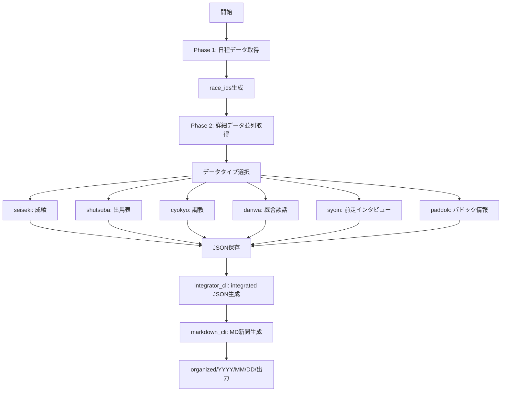

# データ取得の流れ

## 概要
KeibaCICD.keibabookシステムのデータ取得は、2段階のプロセスで効率的に実行されます。

## データ取得フロー



## Phase 1: 日程データ取得

### 目的
レース開催情報とrace_idリストを取得

### コマンド
```bash
python -m src.fast_batch_cli schedule --start 2025-08-30 --end 2025-08-31
```

### 出力
- `nittei_YYYYMMDD.json` - 日程データ
- `race_ids/YYYYMMDD_info.json` - レースIDリスト

## Phase 2: 詳細データ並列取得

### 利用可能なデータタイプ

| データタイプ | 説明 | URL形式 | 新規 |
|------------|------|---------|------|
| seiseki | レース結果・成績 | /cyuou/seiseki/{race_id} | - |
| shutsuba | 出馬表（本誌印含む） | /cyuou/syutuba/{race_id} | 拡張 |
| cyokyo | 調教データ | /cyuou/cyokyo/{race_id} | - |
| danwa | 厩舎談話 | /cyuou/danwa/{race_id} | - |
| syoin | 前走インタビュー | /cyuou/syoin/{race_id} | ✅ |
| paddok | パドック情報 | /cyuou/paddok/{race_id} | ✅ |

### コマンド例

#### 全データタイプ取得
```bash
python -m src.fast_batch_cli data --start 2025-01-01 --end 2025-01-31 --data-types seiseki,shutsuba,cyokyo,danwa,syoin,paddok
```

#### 基本データのみ取得
```bash
python -m src.fast_batch_cli data --start 2025-01-01 --end 2025-01-31 --data-types seiseki,shutsuba,cyokyo,danwa
```

#### 新規データタイプのみ取得
```bash
python -m src.fast_batch_cli data --start 2025-01-01 --end 2025-01-31 --data-types syoin,paddok
```

## 統合 → MD新聞生成

### 統合（integrator_cli）
```bash
# 単日
python -m src.integrator_cli batch --date 2025/08/31

# 期間
python -m src.integrator_cli batch --start-date 2025/08/16 --end-date 2025/08/17
```
- 役割: 各データタイプをマージし、`integrated_*.json`を競馬場ごとに生成

### MD新聞生成（markdown_cli）
```bash
# 単日一括（organized出力）
python -m src.markdown_cli batch --date 2025/08/16 --organized

# 個別レース
python -m src.markdown_cli single --race-id 202501080811 --organized
```
- 出力: `Z:/KEIBA-CICD/data/organized/YYYY/MM/DD/[競馬場]/`

## フルプロセス実行（例）

```powershell
# 8/23-24 週末一括
python -m src.fast_batch_cli full --start 2025/09/06 --end 2025/09/07 --delay 0.5 --max-workers 8
python -m src.integrator_cli batch --start-date 2025/09/06 --end-date 2025/09/06
python -m src.markdown_cli batch --date 2025/09/06 --organized
python -m src.markdown_cli batch --date 2025/09/07 --organized
```

## 並列処理の仕組み

### ThreadPoolExecutor設定
- デフォルトワーカー数: 5
- 最大同時接続数: 動的調整（20〜100）
- リトライ: 3回（指数バックオフ）

### パフォーマンス最適化
```python
# 並列度の調整
--max-workers 10  # ワーカー数を増やす

# 遅延の調整
--delay 0.5  # リクエスト間の遅延（秒）
```

## データ保存構造

```
data/keibabook/
├── nittei_YYYYMMDD.json         # 日程データ
├── seiseki_RRRRRRRRRRR.json     # 成績データ
├── shutsuba_RRRRRRRRRRR.json    # 出馬表データ（印ポイント含む）
├── cyokyo_RRRRRRRRRRR.json      # 調教データ
├── danwa_RRRRRRRRRRR.json       # 厩舎談話データ
├── syoin_RRRRRRRRRRR.json       # 前走インタビューデータ（新規）
├── paddok_RRRRRRRRRRR.json      # パドック情報データ（新規）
└── race_ids/
    └── YYYYMMDD_info.json        # レースIDリスト
```

## エラーハンドリング（抜粋）

- 自動リトライ、欠損データのスキップ（syoin/paddok）、必須データの検証（shutsuba）

## 実行例

### 1日分のデータ取得
```bash
# 2025年1月1日のデータを取得
python -m src.fast_batch_cli full --start 2025-01-01 --end 2025-01-01 --data-types seiseki,shutsuba,cyokyo,danwa,syoin,paddok
```

### 結果
```
[START] フルバッチ処理開始
[FAST] Phase 1: 日程データ取得
[DATE] 処理日: 20250101
[OK] Phase 1: 成功 1, 失敗 0
[PAUSE] Phase間待機: 3秒
[FAST] Phase 2: レースデータ取得 (seiseki, shutsuba, cyokyo, danwa, syoin, paddok)
[RACE] 処理日: 20250101
[OK] Phase 2: 成功 72/72 (100.0%)
[TIME] 処理時間: 45.2秒
```

## 注意事項

1. **セッション管理**
   - 環境変数でCookie設定が必要
   - 定期的な更新が必要

2. **レート制限**
   - 過度な並列度は避ける
   - デフォルト設定を推奨

3. **データ整合性**
   - 日程データを先に取得
   - race_idベースで詳細データ取得

## トラブルシューティング

### Q: 新規データタイプが取得できない
A: URLパターンとパーサーの確認
```bash
# デバッグモードで実行
python -m src.fast_batch_cli data --start 2025-01-01 --end 2025-01-01 --data-types syoin --debug
```

### Q: 並列処理でエラーが多発
A: ワーカー数を減らす
```bash
python -m src.fast_batch_cli data --start 2025-01-01 --end 2025-01-01 --max-workers 3
```


```
cd .\keiba-cicd-core\KeibaCICD.keibabook
python -m src.fast_batch_cli schedule --start 2025/09/20 --end 2025/09/21
python -m src.fast_batch_cli full --start 2025/09/20 --end 2025/09/20 --data-types seiseki,shutsuba,cyokyo,danwa,syoin,paddok
python -m src.integrator_cli batch --date 2025/09/20
python -m src.markdown_cli batch --date 2025/09/20 --organized         
python -m src.horse_profile_cli --date 2025/09/20 --all --with-history

python -m src.fast_batch_cli data --start 2025/09/20 --end 2025/09/20 --data-types paddok
python -m src.markdown_cli batch --date 2025/09/20 --organized         

```

2025年9月20日の競馬予想をサポートしてください。

「中山9R」のように指示が出たらそのレースを分析してMD新聞ファイルに直接追記、更新してください。

以下の情報をすべて使ってください。
馬プロファイルは必ず全頭チェックして、意外な穴馬を見逃さないようにしてください。
全頭分析して、馬券考察時に使いやすいように分類してください。最終決定はこちらでします。
あくまで予想のサポートが欲しい

例）
・勝つ可能性高い、勝つ可能性あり、、勝つ可能性未知数だが期待あり、頑張っても２，３着まで
・実力の割にはオッズが高く期待値が高い、勝つ可能性もあるが負けるリスクも高く期待値が低い


基本情報はMD新聞
Z:\KEIBA-CICD\data\organized\2025\09\20\中山
Z:\KEIBA-CICD\data\organized\2025\09\20\阪神

出走馬のプロファイル情報MD
Z:\KEIBA-CICD\data\horses\profiles

競馬場コースデータ
Z:\KEIBA-CICD\競馬場コースデータ\中山


---
参考

## ファイル構造

### プロファイルファイルの保存場所
```
Z:/KEIBA-CICD/data/horses/profiles/
├── 0936453_カムニャック.md
├── 0886989_ヤマニンループ.md
└── ...
```

### プロファイルファイルの形式

```markdown
# 馬プロファイル: {馬名}

## 基本情報
- **馬ID**: {horse_id}
- **馬名**: {馬名}
- **性齢**: {性齢}
- **更新日時**: {日時}

## 最近の成績
[レースファイルから抽出した情報]

---
## ユーザーメモ
[ユーザーが自由に追記できる領域]
```

## プロファイルファイル形式

### 標準プロファイル
```markdown
# 馬プロファイル: {馬名}

## 基本情報
- 馬ID, 馬名, 性齢, 騎手, 斤量

## 最近の出走情報
- オッズ, AI指数, 本誌印, 短評

## 分析メモ
- 強み, 弱み, 狙い目条件

## ユーザーメモ
（自由記入領域）
```

### 詳細プロファイル（--with-history オプション）
```markdown
## 過去成績分析

### 成績サマリー
| 項目 | 1着 | 2着 | 3着 | 着外 | 勝率 | 連対率 | 複勝率 |

### 最近10走の成績
| 日付 | 競馬場 | レース | 着順 | 騎手 | 距離 | 馬場 | タイム | 上がり |

### 距離別成績
| 距離 | 出走数 | 勝利 | 連対 | 複勝 | 勝率 | 特記事項 |

### 馬場状態別成績
| 馬場 | 出走数 | 勝利 | 連対 | 複勝 | 勝率 | 特記事項 |