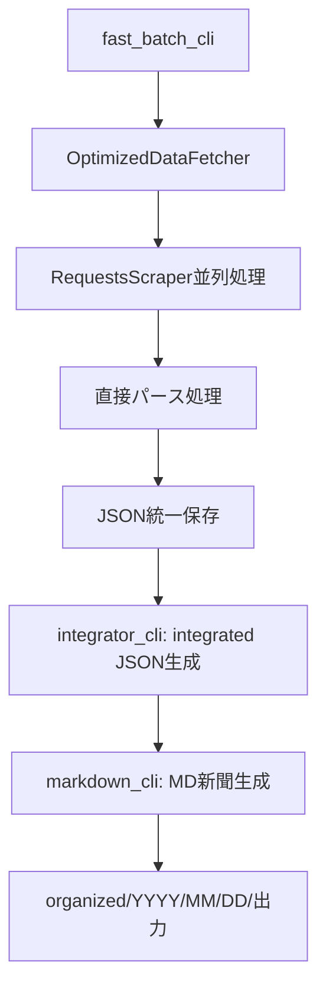
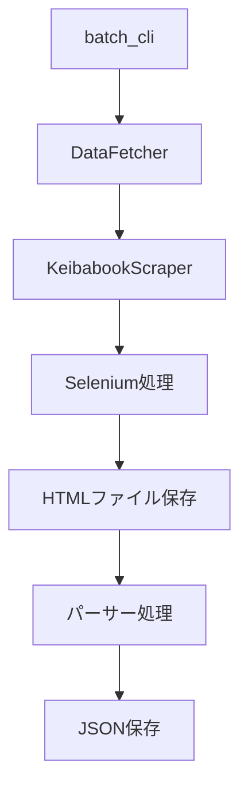

# 競馬ブック データ取得システム - アーキテクチャ

## 📊 システム概要

競馬ブック（https://p.keibabook.co.jp/）から競馬データを自動取得・分析するシステムの技術アーキテクチャです。

**最終更新**: 2025年8月23日  
**システムバージョン**: v2.4（MD新聞対応）  
**主要技術**: Python 3.11+, requests, BeautifulSoup4, 並列処理  

---

## 🏗️ システム構成

### 新世代アーキテクチャ（v2.4）

```
src/keibabook/
├── 📁 batch/                   # 統合バッチ処理システム
│   ├── core/
│   │   └── common.py           # 共通ユーティリティ・統計管理
│   ├── data_fetcher.py         # 従来版データ取得モジュール
│   └── optimized_data_fetcher.py # 🚀 最適化版データ取得モジュール
├── 📁 scrapers/                # スクレイパーモジュール
│   ├── requests_scraper.py     # 🚀 高速版（HTTP直接、並列対応）
│   ├── keibabook_scraper.py    # 従来版（Selenium）
│   └── legacy_scrapers.py      # レガシー機能統合
├── 📁 parsers/                 # パーサーモジュール
│   ├── seiseki_parser.py       # 成績データ解析
│   ├── syutuba_parser.py       # 出馬表データ解析
│   ├── cyokyo_parser.py        # 調教データ解析
│   ├── danwa_parser.py         # 厩舎の話解析
│   └── nittei_parser.py        # 日程データ解析
├── 📁 utils/                   # ユーティリティ
│   ├── config.py               # 設定管理・Cookie管理
│   └── logger.py               # ログ設定
├── fast_batch_cli.py           # 🚀 高速版CLIシステム
├── integrator_cli.py           # 🔗 統合CLI（integrated JSON生成）
└── markdown_cli.py             # 📰 MD新聞生成CLI（organized出力）
```

---

## 🔄 データフロー

### 高速版処理フロー（MD新聞まで）



### 従来版処理フロー



---

## 🚀 最適化の要点（変更なし）

- Requests + 並列処理 / セッション再利用 / 一時ファイル削減
- リトライ・エラー分類・品質スコア・メモリ監視

---

## 📰 MD新聞（markdown_cli）の役割

- 入力: integrator_cli で作成した `integrated_*.json`
- 出力: 競馬場ごとのレースMD（organized配下）
- コンテンツ: 出走表（騎手・短評・本誌印・AI指数）、調教、厩舎談話、前走インタビュー、パドック、展開図、結果 など

---

## 🔐 セキュリティ・認証

- Cookie認証、接続プール最適化、レート制御（変更なし）

---

## 🛣️ 今後の発展

- asyncio対応、キャッシュ、WebUI監視、クラウド対応（変更なし）