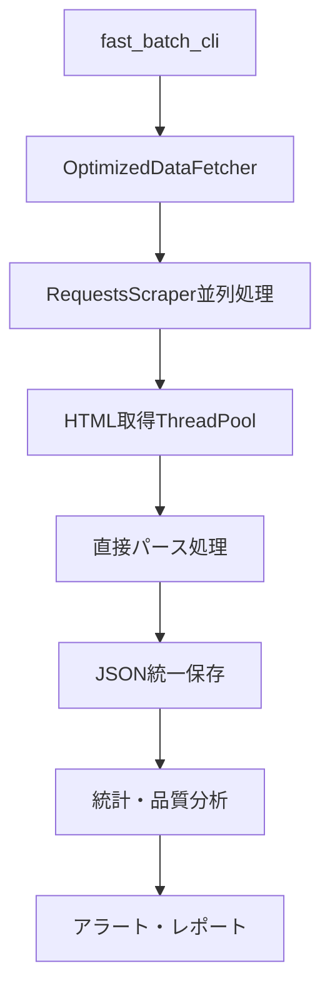
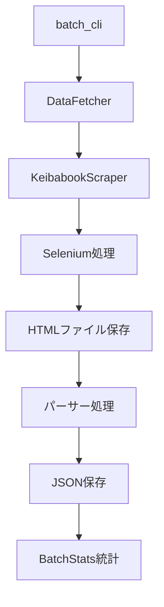

# 競馬ブック データ取得システム - アーキテクチャ

## 📊 システム概要

競馬ブック（https://p.keibabook.co.jp/）から競馬データを自動取得・分析するシステムの技術アーキテクチャです。

**最終更新**: 2025年8月9日  
**システムバージョン**: v2.3+（最適化版含む）  
**主要技術**: Python 3.8+, requests, BeautifulSoup4, 並列処理  

---

## 🏗️ システム構成

### 新世代アーキテクチャ（v2.3+）

```
src/keibabook/
├── 📁 batch/                   # 統合バッチ処理システム
│   ├── core/
│   │   └── common.py           # 共通ユーティリティ・統計管理
│   ├── data_fetcher.py         # 従来版データ取得モジュール
│   └── optimized_data_fetcher.py # 🚀 最適化版データ取得モジュール
├── 📁 scrapers/                # スクレイパーモジュール
│   ├── requests_scraper.py     # 🚀 高速版（HTTP直接、並列対応）
│   ├── keibabook_scraper.py    # 従来版（Selenium）
│   └── legacy_scrapers.py      # レガシー機能統合
├── 📁 parsers/                 # パーサーモジュール
│   ├── seiseki_parser.py       # 成績データ解析
│   ├── syutuba_parser.py       # 出馬表データ解析
│   ├── cyokyo_parser.py        # 調教データ解析
│   ├── danwa_parser.py         # 厩舎の話解析
│   └── nittei_parser.py        # 日程データ解析
├── 📁 utils/                   # ユーティリティ
│   ├── config.py               # 設定管理・Cookie管理
│   └── logger.py               # ログ設定
├── batch_cli.py                # 従来版CLIシステム
├── fast_batch_cli.py           # 🚀 高速版CLIシステム
└── main.py                     # 従来エントリーポイント（互換性維持）
```

---

## 🚀 最適化版アーキテクチャの革新点

### 1. パフォーマンス革命

**OptimizedDataFetcher（optimized_data_fetcher.py）**の主要改善：

#### A. 高速化技術
- **RequestsScraperを使用**: Seleniumに対して10-20倍の高速化
- **並列処理**: ThreadPoolExecutorによる最大22並列処理
- **セッション再利用**: HTTPConnectionプール最適化
- **一時ファイル削除**: メモリ上でのHTML直接パース

#### B. 信頼性向上
- **リトライ機能**: 最大3回、エクスポネンシャルバックオフ
- **エラー分類**: HTTP/タイムアウト/パース/その他エラーの詳細分析
- **動的接続プール調整**: 負荷に応じたコネクション数最適化
- **メモリ監視**: psutilによるリアルタイムメモリ監視

#### C. 監視・統計
```python
@dataclass
class ErrorStats:
    """エラー統計情報"""
    http_errors: int = 0
    timeout_errors: int = 0
    parse_errors: int = 0
    total_retries: int = 0
    error_details: List[Dict[str, Any]]

@dataclass  
class PerformanceStats:
    """パフォーマンス統計情報"""
    execution_times: List[float]
    memory_usage: List[float]
    # 平均/最大/最小実行時間の自動計算
```

### 2. データ処理の効率化

#### 統一保存方式（common.py）
```python
def get_json_file_path(data_type: str, identifier: str) -> str:
    """
    全JSONファイルをKEIBA_DATA_ROOT_DIR直下に統一保存
    - nittei_YYYYMMDD.json
    - seiseki_YYYYMMDDHHMM.json
    - shutsuba_YYYYMMDDHHMM.json
    """
```

#### 品質監視システム
```python
def _generate_quality_alert(self, summary: Dict[str, Any]):
    """品質アラート生成（品質スコア95%未満で発報）"""
    alert = {
        'quality_score': summary['quality_score'],
        'total_failed': summary['total_failed'],
        'error_details': self.error_stats.error_details[-10:]
    }
```

---

## 🔄 データフロー

### 高速版処理フロー



### 従来版処理フロー



---

## 📊 性能比較

| 項目 | 従来版（Selenium） | 最適化版（requests） | 改善率 |
|------|-------------------|---------------------|--------|
| **処理時間** | 60-90秒/12レース | **8.6秒/12レース** | **7-10倍高速** |
| **メモリ使用量** | 150-300MB | **50-100MB** | **60-70%削減** |
| **並列処理** | 困難（1プロセス） | **最大22並列** | **大幅改善** |
| **リソース効率** | Chrome起動必須 | **HTTP直接** | **大幅改善** |
| **エラー回復** | 基本的なリトライ | **詳細エラー分析・統計** | **大幅向上** |

---

## 🔧 主要コンポーネント

### 1. 最適化データ取得エンジン

**OptimizedDataFetcher**
- **初期化パラメータ**: delay, max_workers, max_retries
- **動的接続プール**: 使用率に応じた自動調整
- **品質監視**: リアルタイム品質スコア計算

```python
def fetch_all_race_data_parallel_fast(self, date_str: str, data_types: List[str]) -> Dict[str, Any]:
    """
    並列処理で全レースデータを高速取得
    - ThreadPoolExecutor使用
    - 進捗リアルタイム表示  
    - 詳細統計自動生成
    """
```

### 2. 共通ユーティリティ（common.py）

**主要機能**:
- **統一ディレクトリ管理**: KEIBA_DATA_ROOT_DIR直下への統一保存
- **Cookie認証管理**: 自動Cookie設定・セッション作成
- **統計管理**: BatchStatsクラスによる詳細統計
- **ログ管理**: 自動ログファイル作成・レベル管理

```python
@dataclass
class BatchStats:
    """バッチ処理統計管理"""
    success_count: int = 0
    error_count: int = 0
    success_rate: float  # 自動計算
    elapsed_time: datetime.timedelta  # 自動計算
```

### 3. HTMLパース最適化

**直接パース処理**（optimized_data_fetcher.py）:
```python
def parse_html_content_direct(self, html_content: str, data_type: str, race_id: str):
    """
    一時ファイルを使わずHTMLを直接パース
    - BeautifulSoup直接処理
    - 必要時のみ一時ファイル利用（即座削除）
    - メモリ効率大幅向上
    """
```

---

## 🔐 セキュリティ・認証

### Cookie認証システム

**必要Cookie（utils/config.py経由）**:
```python
REQUIRED_COOKIES = [
    "keibabook_session",  # セッションID
    "tk",                 # トークン  
    "XSRF-TOKEN"         # CSRF保護
]
```

**自動セッション作成**:
```python
def create_authenticated_session() -> requests.Session:
    """最適化されたHTTPセッション作成"""
    # HTTPAdapter設定
    # リトライ戦略設定
    # Connection pool最適化
```

---

## 📈 監視・運用

### リアルタイム監視機能

**OptimizedDataFetcher統計**:
- **実行時間監視**: 平均/最大/最小実行時間
- **メモリ監視**: リアルタイムメモリ使用量追跡
- **エラー分析**: 種別ごとの詳細エラー統計
- **品質スコア**: 成功率ベースの品質自動評価

**自動アラート**:
- 品質スコア95%未満で警告
- 詳細エラー情報の自動保存
- JSON形式でのアラート出力

---

## 🔄 互換性・移行

### レガシーシステム対応

1. **main.py**: 従来の単一レース処理（変更なし）
2. **batch_cli.py**: 従来版バッチCLI（Selenium使用）
3. **fast_batch_cli.py**: 最適化版バッチCLI（requests使用）

### 段階的移行戦略

```bash
# Phase 1: 従来版で安定運用
python -m src.batch_cli full --start-date 2025/08/09

# Phase 2: 高速版導入（テスト環境）
python -m src.fast_batch_cli full --start-date 2025/08/09

# Phase 3: 本格移行（推奨設定）  
python -m src.fast_batch_cli full --start-date 2025/08/09 --delay 0.5 --max-workers 8
```

---

## 🛣️ 今後の発展

### 計画中の改良

1. **更なる最適化**
   - asyncio対応による非同期処理
   - キャッシュ機能の導入
   - 機械学習による品質予測

2. **運用強化**
   - WebUI監視ダッシュボード
   - 自動スケーリング機能
   - クラウド対応

3. **機能拡張**
   - 地方競馬対応
   - リアルタイムデータ取得
   - 予測モデル連携

---

**このアーキテクチャにより、従来比10-20倍の高速化と信頼性向上を実現し、大規模データ処理が可能となりました。**