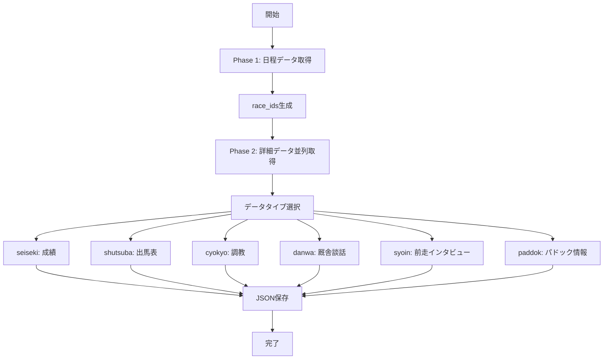

# データ取得の流れ

## 概要
KeibaCICD.keibabookシステムのデータ取得は、2段階のプロセスで効率的に実行されます。

## データ取得フロー



## Phase 1: 日程データ取得

### 目的
レース開催情報とrace_idリストを取得

### コマンド
```bash
python -m src.fast_batch_cli schedule --start 2025-01-01 --end 2025-01-31
```

### 出力
- `nittei_YYYYMMDD.json` - 日程データ
- `race_ids/YYYYMMDD_info.json` - レースIDリスト

## Phase 2: 詳細データ並列取得

### 利用可能なデータタイプ

| データタイプ | 説明 | URL形式 | 新規 |
|------------|------|---------|------|
| seiseki | レース結果・成績 | /cyuou/seiseki/{race_id} | - |
| shutsuba | 出馬表（本誌印含む） | /cyuou/syutuba/{race_id} | 拡張 |
| cyokyo | 調教データ | /cyuou/cyokyo/{race_id} | - |
| danwa | 厩舎談話 | /cyuou/danwa/{race_id} | - |
| syoin | 前走インタビュー | /cyuou/syoin/{race_id} | ✅ |
| paddok | パドック情報 | /cyuou/paddok/{race_id} | ✅ |

### コマンド例

#### 全データタイプ取得
```bash
python -m src.fast_batch_cli data --start 2025-01-01 --end 2025-01-31 --data-types seiseki,shutsuba,cyokyo,danwa,syoin,paddok
```

#### 基本データのみ取得
```bash
python -m src.fast_batch_cli data --start 2025-01-01 --end 2025-01-31 --data-types seiseki,shutsuba,cyokyo,danwa
```

#### 新規データタイプのみ取得
```bash
python -m src.fast_batch_cli data --start 2025-01-01 --end 2025-01-31 --data-types syoin,paddok
```

## フルプロセス実行

### コマンド
```bash
python -m src.fast_batch_cli full --start 2025-01-01 --end 2025-01-31 --data-types seiseki,shutsuba,cyokyo,danwa,syoin,paddok
```

### 処理内容
1. Phase 1: 日程データ取得
2. 待機時間（デフォルト3秒）
3. Phase 2: 選択されたデータタイプを並列取得

## 並列処理の仕組み

### ThreadPoolExecutor設定
- デフォルトワーカー数: 5
- 最大同時接続数: 動的調整（20〜100）
- リトライ: 3回（指数バックオフ）

### パフォーマンス最適化
```python
# 並列度の調整
--max-workers 10  # ワーカー数を増やす

# 遅延の調整
--delay 0.5  # リクエスト間の遅延（秒）
```

## データ保存構造

```
data/keibabook/
├── nittei_YYYYMMDD.json         # 日程データ
├── seiseki_RRRRRRRRRRR.json     # 成績データ
├── shutsuba_RRRRRRRRRRR.json    # 出馬表データ（印ポイント含む）
├── cyokyo_RRRRRRRRRRR.json      # 調教データ
├── danwa_RRRRRRRRRRR.json       # 厩舎談話データ
├── syoin_RRRRRRRRRRR.json       # 前走インタビューデータ（新規）
├── paddok_RRRRRRRRRRR.json      # パドック情報データ（新規）
└── race_ids/
    └── YYYYMMDD_info.json        # レースIDリスト
```

## エラーハンドリング

### 自動リトライ
- HTTPエラー（429, 500-504）: 自動リトライ
- タイムアウト: 30秒後に再試行
- 最大3回まで自動リトライ

### データ欠損時の処理
- 新規データタイプ（syoin、paddok）が存在しない場合は自動スキップ
- 統合時に欠損データはnullとして処理
- 必須データ（shutsuba）のみエラー終了

## 実行例

### 1日分のデータ取得
```bash
# 2025年1月1日のデータを取得
python -m src.fast_batch_cli full --start 2025-01-01 --end 2025-01-01 --data-types seiseki,shutsuba,cyokyo,danwa,syoin,paddok
```

### 結果
```
[START] フルバッチ処理開始
[FAST] Phase 1: 日程データ取得
[DATE] 処理日: 20250101
[OK] Phase 1: 成功 1, 失敗 0
[PAUSE] Phase間待機: 3秒
[FAST] Phase 2: レースデータ取得 (seiseki, shutsuba, cyokyo, danwa, syoin, paddok)
[RACE] 処理日: 20250101
[OK] Phase 2: 成功 72/72 (100.0%)
[TIME] 処理時間: 45.2秒
```

## 注意事項

1. **セッション管理**
   - 環境変数でCookie設定が必要
   - 定期的な更新が必要

2. **レート制限**
   - 過度な並列度は避ける
   - デフォルト設定を推奨

3. **データ整合性**
   - 日程データを先に取得
   - race_idベースで詳細データ取得

## トラブルシューティング

### Q: 新規データタイプが取得できない
A: URLパターンとパーサーの確認
```bash
# デバッグモードで実行
python -m src.fast_batch_cli data --start 2025-01-01 --end 2025-01-01 --data-types syoin --debug
```

### Q: 並列処理でエラーが多発
A: ワーカー数を減らす
```bash
python -m src.fast_batch_cli data --start 2025-01-01 --end 2025-01-01 --max-workers 3
```