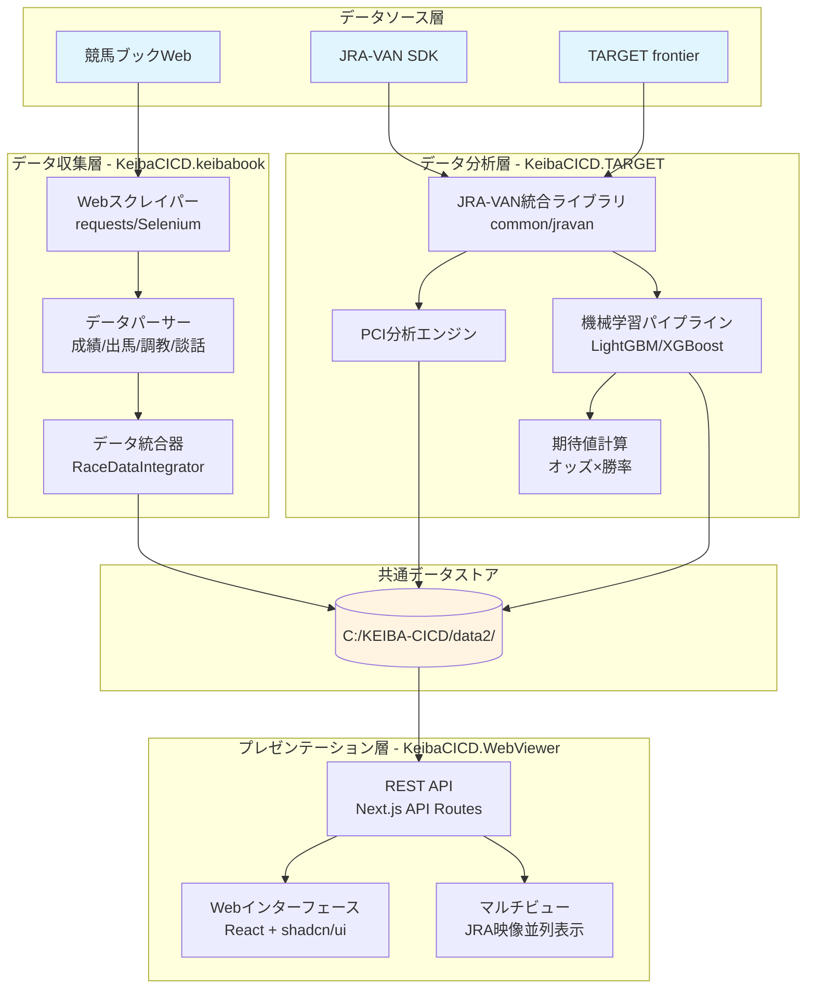
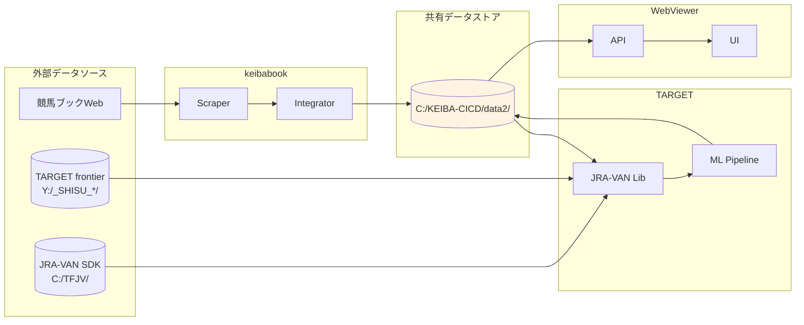

# KeibaCICD システムアーキテクチャ v3.0

> **最終更新**: 2026-02-06
> **ステータス**: 現行運用中
> **対象バージョン**: v3.0（次期バージョンアップ準備）

---

## 📋 目次

1. [プロジェクト概要](#プロジェクト概要)
2. [システム全体構成](#システム全体構成)
3. [3つのコアモジュール](#3つのコアモジュール)
4. [データフロー](#データフロー)
5. [技術スタック](#技術スタック)
6. [ディレクトリ構造](#ディレクトリ構造)
7. [環境変数](#環境変数)
8. [主要エントリーポイント](#主要エントリーポイント)

---

## 🎯 プロジェクト概要

**KeibaCICD** は、週末競馬予想でプラス収支を実現するための統合データ分析システムです。

### ミッション
> 毎週の競馬予想でプラス収支を実現し、推理エンターテインメントとして競馬を楽しむ

### 設計思想
- **データ駆動**: 複数ソースからの自動データ取得
- **AI協調**: 専門エキスパートAIチームによる分析
- **期待値重視**: オッズ×勝率による投資判断
- **継続改善**: 予想と結果の記録・学習

---

## 🏗️ システム全体構成

### アーキテクチャ図



### レイヤー構造

| レイヤー | 役割 | 主要技術 |
|---------|------|---------|
| **データソース層** | 外部データ提供 | 競馬ブックWeb, JRA-VAN SDK, TARGET frontier |
| **データ収集層** | スクレイピング・統合 | Python, Selenium, requests, BeautifulSoup |
| **データ分析層** | ML予測・指数計算 | Python, LightGBM, XGBoost, scikit-learn |
| **プレゼンテーション層** | UI・可視化 | Next.js, React, TypeScript, Tailwind CSS |
| **データストア層** | JSON/Markdown永続化 | ファイルシステム（共有ドライブ） |

---

## 🧩 3つのコアモジュール

### 1. KeibaCICD.keibabook - データ収集モジュール

**場所**: `keiba-cicd-core/KeibaCICD.keibabook/`

**責務**:
- 競馬ブックWebサイトからのデータスクレイピング
- レース情報の統合（成績・出馬表・調教・談話）
- JSON/Markdown形式での出力

**主要コンポーネント**:
```
KeibaCICD.keibabook/
├── src/
│   ├── scrapers/           # Webスクレイパー（requests版/Selenium版）
│   ├── parsers/            # HTMLパーサー（成績/出馬/調教/談話）
│   ├── integrator/         # RaceDataIntegrator（データ統合）
│   ├── batch/              # バッチ処理システム
│   ├── fast_batch_cli.py   # 高速版CLI（推奨）
│   └── integrator_cli.py   # 統合JSON生成
├── api/                    # FastAPI バックエンド
└── gui/                    # Next.js フロントエンド（管理画面）
```

**技術スタック**:
- **言語**: Python 3.11+
- **スクレイピング**: requests 2.31, Selenium 4.15, BeautifulSoup4 4.12
- **データ処理**: pandas 2.1, numpy 1.25

**データ出力**:
```
C:/KEIBA-CICD/data2/organized/YYYY/MM/DD/{競馬場}/
├── integrated_{RACE_ID}.json   # 統合レース情報
└── {RACE_ID}.md                # Markdown新聞
```

---

### 2. KeibaCICD.TARGET - データ分析モジュール

**場所**: `keiba-cicd-core/KeibaCICD.TARGET/`

**責務**:
- JRA-VANデータの解析・ID変換
- PCI（ペース指数）分析
- 機械学習による勝率予測
- 期待値計算（オッズ×勝率）

**主要コンポーネント**:
```
KeibaCICD.TARGET/
├── common/
│   └── jravan/             # JRA-VAN統合ライブラリ（統一IF）
│       ├── id_converter.py # 馬名⇔JRA-VAN ID変換
│       ├── data_access.py  # データ取得API
│       └── parsers/        # CK/UM/DE/SEデータパーサー
├── scripts/
│   ├── analyze_pci_csv.py  # PCI基準値分析
│   ├── training_summary.py # 調教データ集計
│   └── [20+ ユーティリティ]
├── ml/
│   └── scripts/
│       ├── 01_data_preparation.py      # データ準備
│       ├── 02_feature_engineering.py   # 特徴エンジニアリング
│       ├── 03_model_training.py        # モデル訓練
│       ├── 04_backtest.py              # バックテスト
│       └── 05_prediction.py            # 予測実行
└── docs/jravan/            # JRA-VANドキュメント
```

**技術スタック**:
- **言語**: Python 3.8+
- **機械学習**: LightGBM 4.0+, XGBoost 2.0+, scikit-learn 1.3+
- **データ処理**: pandas 2.0+, numpy 1.24+
- **ハイパーパラメータ調整**: optuna 3.3+

**データ入力**:
- JRA-VAN SDK (`C:/TFJV/`): CK/UM/DE/SEファイル
- TARGET frontier独自指数 (`Y:/_SHISU_ST/`, `Y:/_SHISU_SP/`)
- keibabook統合JSON

**データ出力**:
```
C:/KEIBA-CICD/data2/target/
├── predictions.json         # ML予測結果
├── race_marks.json          # TARGETレース印
├── pci_standards.json       # PCI基準値
└── ml/
    ├── 01_prepared/         # 前処理済みデータ
    ├── 03_models/           # 訓練済みモデル（.pkl）
    └── 05_predictions/      # 予測結果
```

---

### 3. KeibaCICD.WebViewer - プレゼンテーションモジュール

**場所**: `keiba-cicd-core/KeibaCICD.WebViewer/`

**責務**:
- レース情報のWeb表示
- 馬プロファイル表示
- JRA映像マルチビュー
- メモ機能・資金管理

**主要コンポーネント**:
```
KeibaCICD.WebViewer/
├── src/
│   ├── app/
│   │   ├── page.tsx                    # トップ（日付選択・レース一覧）
│   │   ├── races-v2/[...]/page.tsx     # レース詳細（v2）
│   │   ├── horses-v2/[id]/page.tsx     # 馬プロファイル
│   │   ├── multi-view/                 # マルチビュー
│   │   ├── admin/                      # 管理画面
│   │   └── api/                        # REST API
│   ├── components/
│   │   ├── ui/                         # shadcn/ui コンポーネント
│   │   ├── race-v2/                    # レース表示
│   │   ├── horse-v2/                   # 馬プロファイル
│   │   └── bankroll/                   # 資金管理
│   ├── lib/
│   │   ├── data/                       # データ読込モジュール
│   │   └── config.ts                   # 設定管理
│   └── types/
│       └── index.ts                    # TypeScript型定義
└── user-data/                          # ローカル永続化（メモ等）
```

**技術スタック**:
- **フレームワーク**: Next.js 16.1 (App Router)
- **言語**: TypeScript 5.x
- **UI**: React 19.2, shadcn/ui (Radix UI)
- **スタイリング**: Tailwind CSS 4.0
- **その他**: Mermaid 11.12, date-fns 4.1

**データ入力**:
- Markdownレース情報 (`C:/KEIBA-CICD/data2/organized/`)
- JSON統合レース情報
- TARGET分析結果 (`C:/KEIBA-CICD/data2/target/`)

**アクセス**:
- `http://localhost:3000` (開発サーバー)

---

## 🔄 データフロー

### 全体データフロー図



### データフロー詳細

#### フェーズ1: データ収集（keibabook）

```
競馬ブックWeb
    ↓ [HTTP GET + Cookie認証]
KeibaCICD.keibabook/src/scrapers/requests_scraper.py
    ↓ [HTML → JSON]
KeibaCICD.keibabook/src/parsers/*.py
    ↓ [統合処理]
KeibaCICD.keibabook/src/integrator/race_data_integrator.py
    ↓ [JSON + Markdown出力]
C:/KEIBA-CICD/data2/organized/YYYY/MM/DD/{競馬場}/
```

#### フェーズ2: データ分析（TARGET）

```
C:/KEIBA-CICD/data2/organized/ (keibabook出力)
    +
C:/TFJV/ (JRA-VAN SDK)
    ↓ [ID変換・データ統合]
KeibaCICD.TARGET/common/jravan/
    ↓ [特徴エンジニアリング]
KeibaCICD.TARGET/ml/scripts/02_feature_engineering.py
    ↓ [モデル訓練・予測]
KeibaCICD.TARGET/ml/scripts/05_prediction.py
    ↓ [JSON出力]
C:/KEIBA-CICD/data2/target/predictions.json
```

#### フェーズ3: プレゼンテーション（WebViewer）

```
C:/KEIBA-CICD/data2/organized/ (レース情報)
    +
C:/KEIBA-CICD/data2/target/ (予測結果)
    ↓ [ファイルシステム読込]
KeibaCICD.WebViewer/src/lib/data/race-reader.ts
    ↓ [API経由]
KeibaCICD.WebViewer/src/app/api/
    ↓ [React描画]
ブラウザUI (http://localhost:3000)
```

---

## 🛠️ 技術スタック

### モジュール別技術スタック

| 技術カテゴリ | keibabook | TARGET | WebViewer |
|-------------|-----------|--------|-----------|
| **言語** | Python 3.11+ | Python 3.8+ | TypeScript 5.x |
| **フレームワーク** | FastAPI | - | Next.js 16.1 |
| **Webスクレイピング** | Selenium, requests, BS4 | - | - |
| **データ処理** | pandas, numpy | pandas, numpy | - |
| **機械学習** | - | LightGBM, XGBoost, scikit-learn, optuna | - |
| **UI** | Next.js (管理画面) | - | React 19, shadcn/ui, Tailwind CSS 4 |
| **テスト** | pytest | pytest | - |
| **ビジュアライゼーション** | - | matplotlib, seaborn | Mermaid 11.12 |

### 共通ライブラリ

- **環境変数**: python-dotenv (Python), dotenv (Node.js)
- **日付処理**: date-fns (Node.js)
- **Markdown**: remark, remark-gfm (Node.js)
- **文字コード変換**: iconv-lite (Node.js)

---

## 📂 ディレクトリ構造

### プロジェクトルート

```
c:/KEIBA-CICD/_keiba/
├── ai-team/                        # AIエージェント統合ガイドライン
│   ├── knowledge/                  # 共通知識ベース
│   │   ├── CLAUDE.md               # 統合ガイドライン v1.0
│   │   ├── DATA_SPECIFICATION.md   # データ仕様書
│   │   ├── ARCHITECTURE.md         # 本ドキュメント ⭐
│   │   └── ...
│   ├── experts/                    # エキスパート定義
│   └── project.md                  # プロジェクト概要
├── keiba-cicd-core/                # コアモジュール群
│   ├── KeibaCICD.keibabook/        # データ収集モジュール
│   ├── KeibaCICD.TARGET/           # データ分析モジュール
│   ├── KeibaCICD.WebViewer/        # プレゼンテーションモジュール
│   ├── KeibaCICD.JraVanSync/       # JRA-VAN同期（補助）
│   ├── docs/                       # 統合ドキュメント
│   │   ├── project/                # プロジェクト計画
│   │   ├── development/            # 開発ガイドライン
│   │   └── archive/                # アーカイブ
│   └── README.md                   # ルートREADME
└── .claude/                        # Claude設定
    └── CLAUDE.md                   # リダイレクト用
```

### データディレクトリ

```
C:/KEIBA-CICD/data2/          # KEIBA_DATA_ROOT_DIR
├── organized/                      # keibabook統合出力
│   └── YYYY/MM/DD/{競馬場}/
│       ├── integrated_{RACE_ID}.json
│       └── {RACE_ID}.md
├── races/                          # レースJSONデータ
│   └── YYYY/MM/DD/
│       ├── seiseki/
│       ├── syutuba/
│       ├── cyokyo/
│       └── danwa/
├── horses/                         # 馬データ
│   └── profiles/
│       └── {馬ID}_{馬名}.md
├── target/                         # TARGET分析結果
│   ├── predictions.json
│   ├── race_marks.json
│   ├── pci_standards.json
│   ├── analysis/
│   └── ml/
│       ├── 01_prepared/
│       ├── 03_models/
│       └── 05_predictions/
└── logs/                           # 実行ログ

C:/TFJV/                            # JV_DATA_ROOT_DIR (JRA-VAN SDK)
├── CK_DATA/                        # 調教データ
├── UM_DATA/                        # 馬マスタ
├── DE_DATA/                        # 出馬表
└── SE_DATA/                        # 成績データ

Y:/                                 # TARGET frontierデータ
├── _SHISU_ST/                      # TARGET独自指数
├── _SHISU_SP/
├── _BABA/                          # クッション値・含水率
└── TFJ_*.DAT                       # バイナリデータ
```

---

## 🔧 環境変数

### 環境変数一覧

| 環境変数名 | 説明 | デフォルト値 | 使用モジュール |
|-----------|------|-------------|---------------|
| **KEIBA_DATA_ROOT_DIR** | Pythonデータルートディレクトリ | `C:\KEIBA-CICD\data2` | keibabook, TARGET |
| **JV_DATA_ROOT_DIR** | JRA-VANローカルデータディレクトリ | `C:\TFJV` | TARGET, WebViewer |
| **DATA_ROOT** | WebViewerデータルートディレクトリ | `C:\KEIBA-CICD\data2` | WebViewer |
| **KEIBABOOK_SESSION** | 競馬ブックセッションCookie | - | keibabook |
| **KEIBABOOK_TK** | 競馬ブックTKトークン | - | keibabook |
| **KEIBABOOK_XSRF_TOKEN** | 競馬ブックXSRFトークン | - | keibabook |

### 環境変数設定方法

**keibabook/.env**:
```ini
KEIBA_DATA_ROOT_DIR=C:\KEIBA-CICD\data2
JV_DATA_ROOT_DIR=C:\TFJV
KEIBABOOK_SESSION=your_session_token
KEIBABOOK_TK=your_tk_token
KEIBABOOK_XSRF_TOKEN=your_xsrf_token
```

**WebViewer/.env.local**:
```ini
DATA_ROOT=C:/KEIBA-CICD/data2
JV_DATA_ROOT_DIR=C:/TFJV
```

---

## 🚀 主要エントリーポイント

### KeibaCICD.keibabook

| エントリーポイント | コマンド | 用途 |
|------------------|---------|------|
| **高速バッチ処理** | `python src/fast_batch_cli.py --date YYYY-MM-DD` | requestsベース並列処理（推奨） |
| **従来版バッチ** | `python src/batch_cli.py --date YYYY-MM-DD` | Seleniumベース処理 |
| **統合JSON生成** | `python src/integrator_cli.py --date YYYY-MM-DD` | integrated JSON生成 |
| **Markdown新聞** | `python src/markdown_cli.py --date YYYY-MM-DD` | Markdown新聞生成 |
| **管理API** | `cd api && uvicorn main:app` | FastAPI管理サーバー |
| **管理GUI** | `cd gui && npm run dev` | Next.js管理画面 |

### KeibaCICD.TARGET

| エントリーポイント | コマンド | 用途 |
|------------------|---------|------|
| **調教データ集計** | `python scripts/training_summary.py YYYY-MM-DD` | 調教データTAB出力 |
| **PCI分析** | `python scripts/analyze_pci_csv.py` | PCI基準値分析 |
| **データ準備** | `python ml/scripts/01_data_preparation.py` | ML用データ準備 |
| **特徴エンジニアリング** | `python ml/scripts/02_feature_engineering.py` | 特徴量作成 |
| **モデル訓練** | `python ml/scripts/03_model_training.py` | LightGBM訓練 |
| **バックテスト** | `python ml/scripts/04_backtest.py` | 過去データ検証 |
| **予測実行** | `python ml/scripts/05_prediction.py` | レース予測 |

### KeibaCICD.WebViewer

| エントリーポイント | コマンド | 用途 |
|------------------|---------|------|
| **開発サーバー** | `npm run dev` | http://localhost:3000 |
| **本番ビルド** | `npm run build` | 本番用ビルド |
| **本番起動** | `npm start` | 本番サーバー起動 |

---

## 📊 データ形式仕様

### レース統合JSON（integrated JSON）

**格納先**: `C:/KEIBA-CICD/data2/organized/YYYY/MM/DD/{競馬場}/integrated_{RACE_ID}.json`

**構造**:
```json
{
  "race_info": {
    "race_id": "2026020101010101",
    "race_name": "東京新聞杯",
    "grade": "G3",
    "distance": 1600,
    "track": "芝",
    "weather": "晴",
    "baba": "良"
  },
  "horses": [
    {
      "wakuban": 1,
      "umaban": 1,
      "horse_name": "ドウデュース",
      "sex_age": "牡5",
      "jockey": "福永祐一",
      "weight": 58.0,
      "odds": 2.5
    }
  ],
  "metadata": {
    "data_version": "2.0",
    "created_at": "2026-02-06T10:00:00",
    "data_sources": {
      "seiseki": "OK",
      "shutsuba": "OK",
      "cyokyo": "OK"
    }
  }
}
```

### ML予測結果JSON

**格納先**: `C:/KEIBA-CICD/data2/target/predictions.json`

**構造**:
```json
{
  "2026020101010101": {
    "predictions": [
      {
        "umaban": 1,
        "win_prob": 0.35,
        "expected_value": 0.875
      }
    ]
  }
}
```

---

## 🔗 関連ドキュメント

- **[統合ガイドライン](./CLAUDE.md)** - AIエージェントチーム全体指針
- **[データ仕様書](./DATA_SPECIFICATION.md)** - データ構造・形式詳細
- **[セットアップガイド](./SETUP_GUIDE.md)** - 環境構築手順（次ステップで作成予定）
- **[モジュール詳細](./MODULE_OVERVIEW.md)** - 各モジュール詳細説明（次ステップで作成予定）
- **[プロジェクト計画](../../keiba-cicd-core/docs/project/project-plan.md)** - 3年計画・フェーズ定義
- **[開発ガイドライン](../../keiba-cicd-core/docs/development/development-guidelines.md)** - コーディング規約

---

## 📝 メンテナンス履歴

| 日付 | バージョン | 変更内容 |
|------|-----------|---------|
| 2026-02-06 | v3.0 | 初版作成（カカシ）：3モジュール構成の包括的なアーキテクチャドキュメント |

---

**作成者**: カカシ（AI相談役）
**承認**: ふくだ君
**次回レビュー予定**: 2026-03-01
