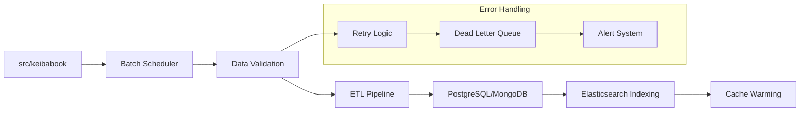
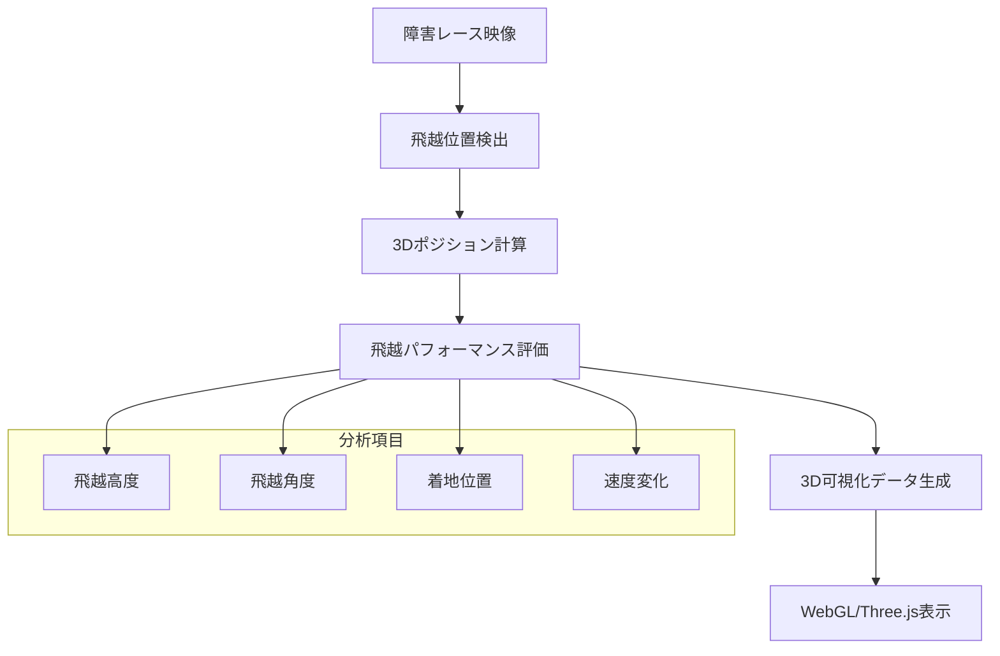

# KeibaCICD システムアーキテクチャ概要

## 1. システム概要

### 1.1 プロダクトビジョン
KeibaCICDは、エンジニアリング手法を活用した競馬データ分析システムです。期待値ベースの合理的な予測により、感情的な予想からデータドリブンな分析への移行を支援し、持続可能な競馬の楽しみ方を提供します。

### 1.2 主要機能
- **期待値計算システム**: 全出走馬の勝率算出とオッズ比較
- **馬キャラクター分析**: 馬の個性と特性の可視化
- **レース質分析**: コース特性と展開予想の統合分析
- **3D可視化**: レースフローの直感的な表現
- **収支管理**: 長期的な投資管理とメンタルケア
- **障害レース専用分析**: 飛越データの収集・分析と3D可視化

## 2. システム全体構成

### 2.1 アーキテクチャ概要図

```
┌─────────────────────────────────────────────────────────────┐
│                    Frontend Layer                           │
│  ┌─────────────────┐  ┌─────────────────┐  ┌─────────────┐ │
│  │   Next.js App   │  │  3D Visualizer  │  │  Dashboard  │ │
│  │   (App Router)  │  │   (Three.js)    │  │   (D3.js)   │ │
│  └─────────────────┘  └─────────────────┘  └─────────────┘ │
└─────────────────────────────────────────────────────────────┘
                              │
                              │ HTTPS/WebSocket
                              ▼
┌─────────────────────────────────────────────────────────────┐
│                    API Gateway Layer                        │
│  ┌─────────────────┐  ┌─────────────────┐  ┌─────────────┐ │
│  │   FastAPI       │  │   C#/.NET API   │  │   Auth API  │ │
│  │  (Analysis)     │  │  (JRA-VAN)      │  │             │ │
│  └─────────────────┘  └─────────────────┘  └─────────────┘ │
└─────────────────────────────────────────────────────────────┘
                              │
                              │ Internal Network
                              ▼
┌─────────────────────────────────────────────────────────────┐
│                   Data Processing Layer                     │
│  ┌─────────────────┐  ┌─────────────────┐  ┌─────────────┐ │
│  │  Scraping       │  │   ML Pipeline   │  │  ETL Jobs   │ │
│  │  (Keibabook)    │  │   (Analysis)    │  │             │ │
│  └─────────────────┘  └─────────────────┘  └─────────────┘ │
└─────────────────────────────────────────────────────────────┘
                              │
                              │ Database Connections
                              ▼
┌─────────────────────────────────────────────────────────────┐
│                    Data Storage Layer                       │
│  ┌─────────────────┐  ┌─────────────────┐  ┌─────────────┐ │
│  │   PostgreSQL    │  │    MongoDB      │  │    Redis    │ │
│  │ (Structured)    │  │  (Documents)    │  │   (Cache)   │ │
│  └─────────────────┘  └─────────────────┘  └─────────────┘ │
│  ┌─────────────────┐  ┌─────────────────┐                  │
│  │ Elasticsearch   │  │   File Storage  │                  │
│  │   (Search)      │  │    (Assets)     │                  │
│  └─────────────────┘  └─────────────────┘                  │
└─────────────────────────────────────────────────────────────┘
```

### 2.2 マイクロサービス間通信仕様

#### 2.2.1 サービス間認証
- **JWT認証**: マイクロサービス間の認証にJWTトークンを使用
- **mTLS**: 高セキュリティが要求される通信でのmutual TLS
- **サービスメッシュ**: Istioによるトラフィック管理とセキュリティポリシー

#### 2.2.2 API Gateway詳細
- **レート制限**: 
  - ユーザーあたり: 1000 req/hour
  - IPアドレスあたり: 10000 req/hour
  - サービスあたり: 無制限（内部通信）
- **リクエストルーティング**:
  - `/api/analysis/*` → FastAPI (Analysis Service)
  - `/api/jravan/*` → C#/.NET API
  - `/api/auth/*` → Auth Service
- **キャッシュ戦略**:
  - GET リクエスト: Redis Cache (TTL: 5分)
  - POST/PUT/DELETE: Cache invalidation

### 2.3 技術スタック詳細

#### Frontend
- **Framework**: Next.js 14+ (App Router)
- **Language**: TypeScript
- **Styling**: Tailwind CSS
- **3D Graphics**: Three.js, React Three Fiber
- **Charts**: D3.js, Recharts
- **Animation**: Framer Motion
- **State Management**: Zustand
- **HTTP Client**: Axios

#### Backend APIs
- **Analysis API**: FastAPI (Python 3.11+)
- **JRA-VAN API**: ASP.NET Core (C# 12)
- **Authentication**: JWT + OAuth 2.0
- **API Documentation**: OpenAPI/Swagger

#### Data Processing
- **Scraping**: Python (既存keibabook)
- **ML/Analytics**: Python (scikit-learn, pandas, numpy)
- **NLP**: spaCy, transformers
- **ETL**: Apache Airflow (将来的)

#### Data Storage
- **Primary DB**: PostgreSQL 15+
- **Document Store**: MongoDB 7+
- **Cache**: Redis 7+
- **Search**: Elasticsearch 8+
- **File Storage**: MinIO (S3互換)

#### Infrastructure
- **Containerization**: Docker, Docker Compose
- **Orchestration**: Kubernetes (将来的)
- **Monitoring**: Prometheus, Grafana
- **Logging**: ELK Stack

## 3. データフロー設計

### 3.1 バッチ処理フロー



### 3.2 データ取得フロー

```
External Sources → Scraping Layer → Raw Data Storage → Processing → Structured Storage
     │                  │               │                │              │
JRA-VAN API         Keibabook       MongoDB          FastAPI      PostgreSQL
競馬ブック           Scraper        (Raw JSON)       Analytics    (Structured)
```

### 3.3 エラーハンドリングフロー

#### 3.3.1 スクレイピング失敗時のリトライ戦略
```python
# 指数バックオフによるリトライ
retry_delays = [1, 2, 4, 8, 16]  # 秒
max_retries = 5

# HTTP エラーコード別の対応
- 429 (Rate Limit): 長時間待機後リトライ
- 503 (Service Unavailable): 短時間待機後リトライ
- 404 (Not Found): リトライせずエラーログ記録
- 500 (Internal Server Error): 標準リトライ
```

#### 3.3.2 データ不整合時の処理フロー
```
データ検証エラー → 不整合データ隔離 → 手動レビュー → 修正/除外判定
       │                    │              │            │
   Validation          Quarantine      Manual Review   Clean/Discard
   Error Alert         Table           Dashboard       Decision
```

#### 3.3.3 アラート通知の仕組み
- **Slack通知**: 緊急度高のエラー
- **メール通知**: 日次集計レポート
- **Dashboard**: リアルタイム監視画面

### 3.4 分析処理フロー

```
Structured Data → ML Pipeline → Analysis Results → Cache → Frontend
      │              │              │             │         │
  PostgreSQL    Feature Eng.    Predictions    Redis    Next.js
  MongoDB       Model Training   Probabilities  Cache    Dashboard
```

### 3.5 リアルタイム更新フロー

```
External Updates → WebSocket → Cache Update → Frontend Notification
      │              │            │               │
   オッズ変更      FastAPI      Redis Update    Live Update
   出走変更        Server       Invalidation    (WebSocket)
```

## 4. 特殊分析機能

### 4.1 障害レース専用アーキテクチャ

#### 4.1.1 飛越データ収集・分析フロー


#### 4.1.2 3D可視化のためのWebGL/Three.js統合
```typescript
// 障害レース3D可視化コンポーネント
interface JumpData {
  position: { x: number; y: number; z: number };
  height: number;
  angle: number;
  speed: number;
  timestamp: number;
}

interface HurdleRaceVisualization {
  trackLayout: TrackGeometry;
  obstacles: ObstaclePosition[];
  horseTrajectories: HorseTrajectory[];
  jumpAnalytics: JumpData[];
}
```

#### 4.1.3 リアルタイム分析のWebSocket設計
```javascript
// WebSocketイベント定義
const SOCKET_EVENTS = {
  JUMP_DETECTED: 'jump_detected',
  POSITION_UPDATE: 'position_update',
  PERFORMANCE_METRICS: 'performance_metrics',
  ANALYSIS_COMPLETE: 'analysis_complete'
};

// 分析結果のリアルタイム配信
socket.on('jump_detected', (data) => {
  updateJumpVisualization(data);
  calculatePerformanceMetrics(data);
});
```

## 5. セキュリティアーキテクチャ

### 5.1 認証・認可
- **認証方式**: JWT + Refresh Token
- **認可**: RBAC (Role-Based Access Control)
- **外部認証**: OAuth 2.0 (Google, GitHub)
- **API保護**: Rate Limiting, CORS

### 5.2 データ保護
- **暗号化**: TLS 1.3 (通信), AES-256 (保存)
- **機密情報**: 環境変数、Secrets管理
- **アクセス制御**: Database-level permissions
- **監査ログ**: 全API呼び出しの記録

### 5.3 インフラセキュリティ
- **ネットワーク**: VPC, Security Groups
- **コンテナ**: 最小権限の原則
- **脆弱性管理**: 定期的なセキュリティスキャン

## 6. パフォーマンス要件

### 6.1 レスポンス時間
- **API応答**: < 200ms (95%ile)
- **ページロード**: < 2秒 (初回)
- **3D描画**: 60fps維持
- **データ更新**: < 5秒 (リアルタイム)

### 6.2 スループット
- **同時ユーザー**: 1,000人
- **API呼び出し**: 10,000 req/min
- **データ処理**: 全レース分析 < 30分

### 6.3 可用性
- **稼働率**: 99.9%
- **RTO**: < 4時間
- **RPO**: < 1時間

## 7. 拡張性設計

### 7.1 水平スケーリング
- **API**: ロードバランサー + 複数インスタンス
- **Database**: Read Replica, Sharding
- **Cache**: Redis Cluster
- **Storage**: 分散ファイルシステム

### 7.2 垂直スケーリング
- **CPU**: ML処理の並列化
- **Memory**: 大容量データ処理
- **Storage**: SSD, NVMe対応

## 8. 既存システム統合

### 8.1 Keibabook統合
- **保持**: 既存のsrc/keibabook構造
- **拡張**: 新しい分析機能の追加
- **データ**: 既存JSONファイルの活用
- **ID体系**: race_id形式の維持

### 8.2 JRA-VAN統合
- **新規**: C#/.NET APIの構築
- **データ**: リアルタイムデータ取得
- **同期**: 既存データとの整合性確保

## 9. 運用・保守

### 9.1 監視・可観測性の強化

#### 9.1.1 分散トレーシング
- **トレーシングシステム**: Jaeger
- **トレースID設計**: 
  ```
  Format: {service_id}-{timestamp}-{random_id}
  Example: analysis-20250106123456-abc123def
  ```
- **スパン定義**:
  - API Gateway → Analysis Service
  - Analysis Service → Database
  - ML Pipeline → Model Inference

#### 9.1.2 カスタムメトリクス
**ビジネスメトリクス:**
- 期待値計算精度 (accuracy_rate)
- 的中率 (hit_rate)
- 収益率 (roi_percentage)
- ユーザー満足度 (user_satisfaction_score)

**技術メトリクス:**
- スクレイピング成功率 (scraping_success_rate)
- データ処理レイテンシ (data_processing_latency)
- API可用性 (api_availability)
- キャッシュヒット率 (cache_hit_rate)

#### 9.1.3 アラート設定
```yaml
alerts:
  - name: high_error_rate
    condition: error_rate > 5%
    duration: 5m
    severity: critical
    
  - name: low_scraping_success
    condition: scraping_success_rate < 90%
    duration: 10m
    severity: warning
    
  - name: prediction_accuracy_drop
    condition: accuracy_rate < 70%
    duration: 30m
    severity: warning
```

### 9.2 ログ管理
- **構造化ログ**: JSON形式
- **集約**: ELK Stack
- **保持期間**: 90日間

### 9.3 バックアップ
- **データベース**: 日次フルバックアップ
- **ファイル**: 増分バックアップ
- **復旧テスト**: 月次実施

## 10. 開発・デプロイメント

### 10.1 開発環境
- **ローカル**: Docker Compose
- **CI/CD**: GitHub Actions
- **テスト**: 自動テスト + 手動テスト

### 10.2 CI/CDパイプライン詳細

#### 10.2.1 自動テスト戦略
```yaml
stages:
  - unit-test:
      coverage: "> 80%"
      tools: [pytest, jest]
  - integration-test:
      database: PostgreSQL + MongoDB
      external-apis: Mock JRA-VAN
  - e2e-test:
      browser: [Chrome, Firefox, Safari]
      scenarios: 期待値計算、3D可視化
  - performance-test:
      load: 1000 concurrent users
      duration: 30 minutes
  - security-scan:
      tools: [OWASP ZAP, Bandit, npm audit]
```

#### 10.2.2 デプロイメント自動化
- **Kubernetes マニフェスト管理**: GitOps方式
- **Helm Charts**: アプリケーションのパッケージ管理
```yaml
# helm chart例
apiVersion: v2
name: keiba-cicd
version: 1.0.0
dependencies:
  - name: postgresql
    version: 12.0.0
  - name: mongodb
    version: 13.0.0
  - name: elasticsearch
    version: 8.0.0
```
- **ArgoCD**: GitOpsによる自動デプロイ
- **カナリアデプロイ**: Fluxによる段階的リリース

### 10.3 デプロイメント戦略
- **Blue-Green**: ゼロダウンタイム
- **カナリア**: 段階的リリース
- **ロールバック**: 即座に前バージョンに復旧

## 11. 今後の拡張計画

### 11.1 Phase 1 (MVP)
- 基本的な期待値計算
- 馬キャラクター分析
- シンプルなダッシュボード

### 11.2 Phase 2 (機能拡張)
- 3D可視化
- レース質分析
- リアルタイム更新

### 11.3 Phase 3 (高度化)
- 機械学習モデルの高度化
- モバイルアプリ
- ソーシャル機能 