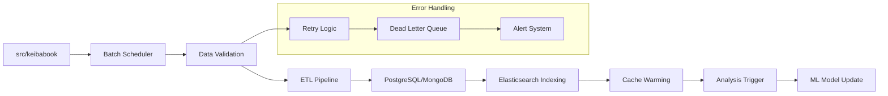
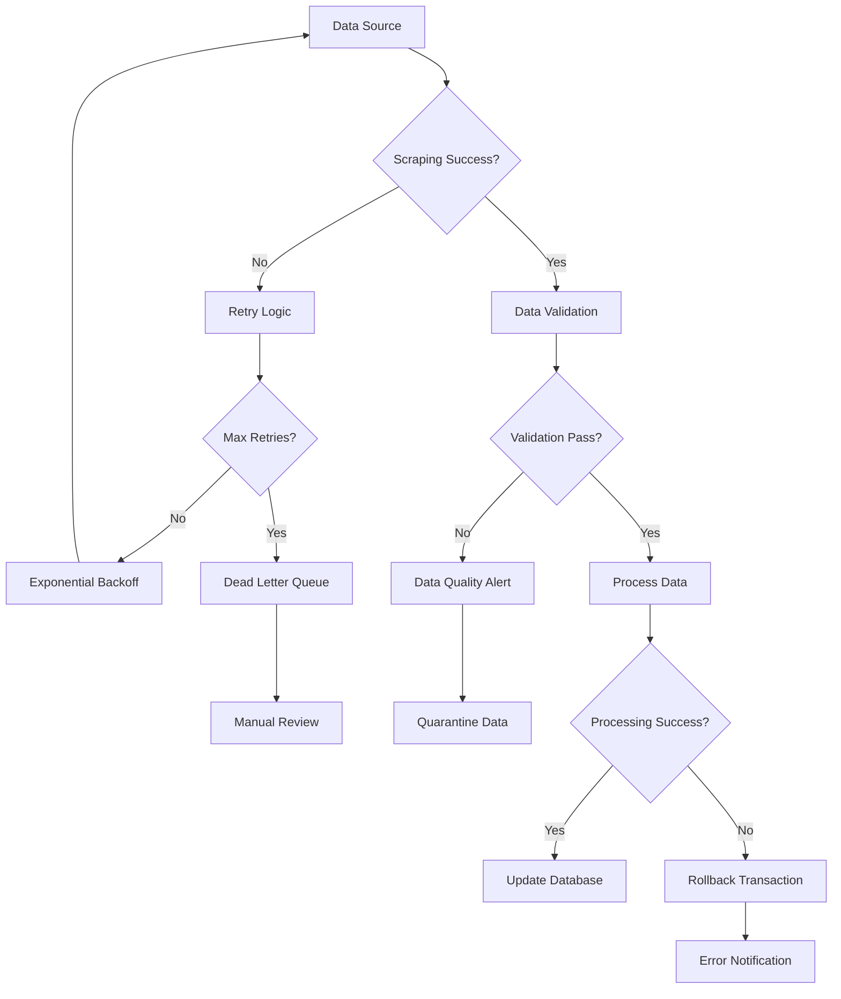
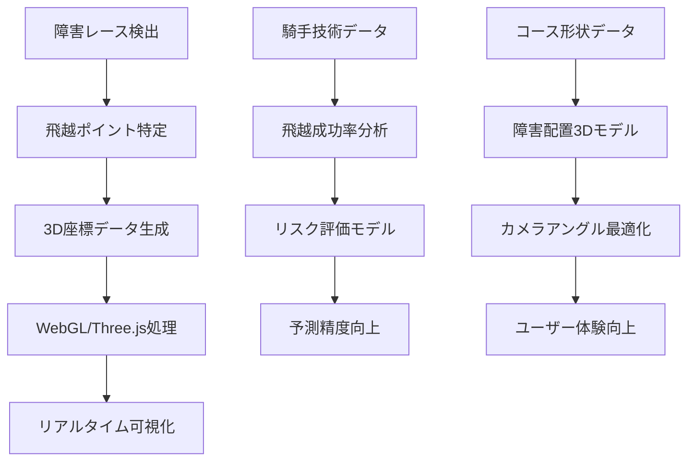

# KeibaCICD システムアーキテクチャ概要

## 1. システム概要

### 1.1 プロダクトビジョン
KeibaCICDは、エンジニアリング手法を活用した競馬データ分析システムです。期待値ベースの合理的な予測により、感情的な予想からデータドリブンな分析への移行を支援し、持続可能な競馬の楽しみ方を提供します。

### 1.2 主要機能
- **期待値計算システム**: 全出走馬の勝率算出とオッズ比較
- **馬キャラクター分析**: 馬の個性と特性の可視化
- **レース質分析**: コース特性と展開予想の統合分析
- **3D可視化**: レースフローの直感的な表現
- **収支管理**: 長期的な投資管理とメンタルケア

## 2. システム全体構成

### 2.1 アーキテクチャ概要図

```
┌─────────────────────────────────────────────────────────────┐
│                    Frontend Layer                           │
│  ┌─────────────────┐  ┌─────────────────┐  ┌─────────────┐ │
│  │   Next.js App   │  │  3D Visualizer  │  │  Dashboard  │ │
│  │   (App Router)  │  │   (Three.js)    │  │   (D3.js)   │ │
│  └─────────────────┘  └─────────────────┘  └─────────────┘ │
└─────────────────────────────────────────────────────────────┘
                              │
                              │ HTTPS/WebSocket
                              ▼
┌─────────────────────────────────────────────────────────────┐
│                    API Gateway Layer                        │
│  ┌─────────────────┐  ┌─────────────────┐  ┌─────────────┐ │
│  │   FastAPI       │  │   C#/.NET API   │  │   Auth API  │ │
│  │  (Analysis)     │  │  (JRA-VAN)      │  │             │ │
│  └─────────────────┘  └─────────────────┘  └─────────────┘ │
└─────────────────────────────────────────────────────────────┘
                              │
                              │ Internal Network
                              ▼
┌─────────────────────────────────────────────────────────────┐
│                   Data Processing Layer                     │
│  ┌─────────────────┐  ┌─────────────────┐  ┌─────────────┐ │
│  │  Scraping       │  │   ML Pipeline   │  │  ETL Jobs   │ │
│  │  (Keibabook)    │  │   (Analysis)    │  │             │ │
│  └─────────────────┘  └─────────────────┘  └─────────────┘ │
└─────────────────────────────────────────────────────────────┘
                              │
                              │ Database Connections
                              ▼
┌─────────────────────────────────────────────────────────────┐
│                    Data Storage Layer                       │
│  ┌─────────────────┐  ┌─────────────────┐  ┌─────────────┐ │
│  │   PostgreSQL    │  │    MongoDB      │  │    Redis    │ │
│  │ (Structured)    │  │  (Documents)    │  │   (Cache)   │ │
│  └─────────────────┘  └─────────────────┘  └─────────────┘ │
│  ┌─────────────────┐  ┌─────────────────┐                  │
│  │ Elasticsearch   │  │   File Storage  │                  │
│  │   (Search)      │  │    (Assets)     │                  │
│  └─────────────────┘  └─────────────────┘                  │
└─────────────────────────────────────────────────────────────┘
```

### 2.2 技術スタック詳細

#### Frontend
- **Framework**: Next.js 14+ (App Router)
- **Language**: TypeScript
- **Styling**: Tailwind CSS
- **3D Graphics**: Three.js, React Three Fiber
- **Charts**: D3.js, Recharts
- **Animation**: Framer Motion
- **State Management**: Zustand
- **HTTP Client**: Axios

#### Backend APIs
- **Analysis API**: FastAPI (Python 3.11+)
- **JRA-VAN API**: ASP.NET Core (C# 12)
- **Authentication**: JWT + OAuth 2.0
- **API Documentation**: OpenAPI/Swagger

#### Data Processing
- **Scraping**: Python (既存keibabook)
- **ML/Analytics**: Python (scikit-learn, pandas, numpy)
- **NLP**: spaCy, transformers
- **ETL**: Apache Airflow (将来的)

#### Data Storage
- **Primary DB**: PostgreSQL 15+
- **Document Store**: MongoDB 7+
- **Cache**: Redis 7+
- **Search**: Elasticsearch 8+
- **File Storage**: MinIO (S3互換)

#### Infrastructure
- **Containerization**: Docker, Docker Compose
- **Orchestration**: Kubernetes (将来的)
- **Monitoring**: Prometheus, Grafana
- **Logging**: ELK Stack

### 2.3 マイクロサービス間通信仕様

#### 2.3.1 サービス間認証
- **JWT/mTLS**: サービス間通信の暗号化・認証
- **Service Mesh**: Istio導入検討（Phase 3）
- **Certificate Management**: cert-manager自動証明書管理
- **Token Rotation**: 24時間ごとの自動ローテーション

```yaml
# サービス間認証設定例
apiVersion: security.istio.io/v1beta1
kind: PeerAuthentication
metadata:
  name: default
spec:
  mtls:
    mode: STRICT
```

#### 2.3.2 API Gateway詳細
- **レート制限**: 
  - 一般ユーザー: 100 req/min
  - 認証ユーザー: 1000 req/min
  - 内部サービス: 無制限
- **リクエストルーティング**: パス・ヘッダーベース
- **キャッシュ戦略**: 
  - 静的データ: 1時間
  - 動的データ: 5分
  - リアルタイムデータ: キャッシュなし

```yaml
# API Gateway設定例
apiVersion: networking.istio.io/v1beta1
kind: VirtualService
metadata:
  name: keiba-api
spec:
  http:
  - match:
    - uri:
        prefix: "/api/v1/analysis"
    route:
    - destination:
        host: analysis-api
    fault:
      delay:
        percentage:
          value: 0.1
        fixedDelay: 5s
```

## 3. データフロー設計

### 3.1 データ取得フロー

```
External Sources → Scraping Layer → Raw Data Storage → Processing → Structured Storage
     │                  │               │                │              │
JRA-VAN API         Keibabook       MongoDB          FastAPI      PostgreSQL
競馬ブック           Scraper        (Raw JSON)       Analytics    (Structured)
```

### 3.2 分析処理フロー

```
Structured Data → ML Pipeline → Analysis Results → Cache → Frontend
      │              │              │             │         │
  PostgreSQL    Feature Eng.    Predictions    Redis    Next.js
  MongoDB       Model Training   Probabilities  Cache    Dashboard
```

### 3.3 リアルタイム更新フロー

```
External Updates → WebSocket → Cache Update → Frontend Notification
      │              │            │               │
   オッズ変更      FastAPI      Redis Update    Live Update
   出走変更        Server       Invalidation    (WebSocket)
```

### 3.4 バッチ処理フロー



**バッチ処理詳細:**
- **スケジューラー**: Cron + Python APScheduler
- **データ検証**: スキーマ検証、重複チェック、整合性確認
- **ETL**: Extract (JSON) → Transform (正規化) → Load (DB)
- **インデックス**: Elasticsearch全文検索インデックス更新
- **キャッシュ**: Redis予熱処理
- **分析**: 新データに基づくML模型再訓練

### 3.5 エラーハンドリングフロー



**エラーハンドリング戦略:**
- **スクレイピング失敗**: 指数バックオフによる3回リトライ
- **データ不整合**: 隔離処理 + 手動レビュー
- **処理失敗**: トランザクションロールバック + アラート通知
- **アラート**: Slack/Email通知、PagerDuty連携

## 4. セキュリティアーキテクチャ

### 4.1 認証・認可
- **認証方式**: JWT + Refresh Token
- **認可**: RBAC (Role-Based Access Control)
- **外部認証**: OAuth 2.0 (Google, GitHub)
- **API保護**: Rate Limiting, CORS

### 4.2 データ保護
- **暗号化**: TLS 1.3 (通信), AES-256 (保存)
- **機密情報**: 環境変数、Secrets管理
- **アクセス制御**: Database-level permissions
- **監査ログ**: 全API呼び出しの記録

### 4.3 インフラセキュリティ
- **ネットワーク**: VPC, Security Groups
- **コンテナ**: 最小権限の原則
- **脆弱性管理**: 定期的なセキュリティスキャン

## 5. パフォーマンス要件

### 5.1 レスポンス時間
- **API応答**: < 200ms (95%ile)
- **ページロード**: < 2秒 (初回)
- **3D描画**: 60fps維持
- **データ更新**: < 5秒 (リアルタイム)

### 5.2 スループット
- **同時ユーザー**: 1,000人
- **API呼び出し**: 10,000 req/min
- **データ処理**: 全レース分析 < 30分

### 5.3 可用性
- **稼働率**: 99.9%
- **RTO**: < 4時間
- **RPO**: < 1時間

## 6. 拡張性設計

### 6.1 水平スケーリング
- **API**: ロードバランサー + 複数インスタンス
- **Database**: Read Replica, Sharding
- **Cache**: Redis Cluster
- **Storage**: 分散ファイルシステム

### 6.2 垂直スケーリング
- **CPU**: ML処理の並列化
- **Memory**: 大容量データ処理
- **Storage**: SSD, NVMe対応

## 7. 既存システム統合

### 7.1 Keibabook統合
- **保持**: 既存のsrc/keibabook構造
- **拡張**: 新しい分析機能の追加
- **データ**: 既存JSONファイルの活用
- **ID体系**: race_id形式の維持

### 7.2 JRA-VAN統合
- **新規**: C#/.NET APIの構築
- **データ**: リアルタイムデータ取得
- **同期**: 既存データとの整合性確保

## 8. 運用・保守

### 8.1 監視
- **システム**: CPU, Memory, Disk使用率
- **アプリケーション**: エラー率, レスポンス時間
- **ビジネス**: 予測精度, ユーザー行動

### 8.2 ログ管理
- **構造化ログ**: JSON形式
- **集約**: ELK Stack
- **保持期間**: 90日間

### 8.3 バックアップ
- **データベース**: 日次フルバックアップ
- **ファイル**: 増分バックアップ
- **復旧テスト**: 月次実施

### 8.4 分散トレーシング

#### 8.4.1 Jaeger/Zipkin導入
```python
# 分散トレーシング設定
from opentelemetry import trace
from opentelemetry.exporter.jaeger.thrift import JaegerExporter
from opentelemetry.sdk.trace import TracerProvider
from opentelemetry.sdk.trace.export import BatchSpanProcessor

# トレーサー設定
trace.set_tracer_provider(TracerProvider())
tracer = trace.get_tracer(__name__)

jaeger_exporter = JaegerExporter(
    agent_host_name="jaeger-agent",
    agent_port=6831,
)

span_processor = BatchSpanProcessor(jaeger_exporter)
trace.get_tracer_provider().add_span_processor(span_processor)

# 使用例
@tracer.start_as_current_span("race_analysis")
def analyze_race(race_id: str):
    with tracer.start_as_current_span("fetch_race_data") as span:
        span.set_attribute("race.id", race_id)
        race_data = fetch_race_data(race_id)
    
    with tracer.start_as_current_span("calculate_probabilities"):
        probabilities = calculate_win_probabilities(race_data)
    
    return probabilities
```

#### 8.4.2 トレースID設計
- **フォーマット**: `{service}-{timestamp}-{random}`
- **例**: `analysis-20250607-abc123def456`
- **伝播**: HTTP Header `X-Trace-ID`
- **ログ連携**: 全ログにトレースID埋め込み

### 8.5 カスタムメトリクス

#### 8.5.1 ビジネスメトリクス
```python
# Prometheusカスタムメトリクス
from prometheus_client import Counter, Histogram, Gauge

# 予測精度メトリクス
prediction_accuracy = Gauge(
    'keiba_prediction_accuracy_ratio',
    'Prediction accuracy ratio',
    ['model_version', 'race_type']
)

# 的中率メトリクス
hit_rate = Gauge(
    'keiba_hit_rate_percentage',
    'Hit rate percentage',
    ['bet_type', 'time_period']
)

# API呼び出し回数
api_requests_total = Counter(
    'keiba_api_requests_total',
    'Total API requests',
    ['method', 'endpoint', 'status']
)

# レスポンス時間
api_request_duration = Histogram(
    'keiba_api_request_duration_seconds',
    'API request duration',
    ['method', 'endpoint']
)
```

#### 8.5.2 技術メトリクス
```python
# スクレイピング成功率
scraping_success_rate = Gauge(
    'keiba_scraping_success_rate',
    'Scraping success rate',
    ['source', 'data_type']
)

# データ処理時間
data_processing_duration = Histogram(
    'keiba_data_processing_duration_seconds',
    'Data processing duration',
    ['process_type', 'data_size']
)

# キャッシュヒット率
cache_hit_rate = Gauge(
    'keiba_cache_hit_rate',
    'Cache hit rate',
    ['cache_type', 'key_pattern']
)
```

#### 8.5.3 Grafanaダッシュボード設定
```json
{
  "dashboard": {
    "title": "KeibaCICD Monitoring",
    "panels": [
      {
        "title": "Prediction Accuracy",
        "type": "stat",
        "targets": [
          {
            "expr": "keiba_prediction_accuracy_ratio",
            "legendFormat": "{{model_version}}"
          }
        ]
      },
      {
        "title": "API Response Time",
        "type": "graph",
        "targets": [
          {
            "expr": "histogram_quantile(0.95, keiba_api_request_duration_seconds_bucket)",
            "legendFormat": "95th percentile"
          }
        ]
      },
      {
        "title": "Scraping Success Rate",
        "type": "singlestat",
        "targets": [
          {
            "expr": "avg(keiba_scraping_success_rate)",
            "legendFormat": "Success Rate"
          }
        ]
      }
    ]
  }
}
```

## 9. 開発・デプロイメント

### 9.1 開発環境
- **ローカル**: Docker Compose
- **CI/CD**: GitHub Actions
- **テスト**: 自動テスト + 手動テスト

### 9.2 デプロイメント戦略
- **Blue-Green**: ゼロダウンタイム
- **カナリア**: 段階的リリース
- **ロールバック**: 即座に前バージョンに復旧

### 9.3 CI/CDパイプライン詳細

#### 9.3.1 自動テスト戦略

```yaml
# .github/workflows/ci-cd.yml
name: KeibaCICD CI/CD Pipeline

on:
  push:
    branches: [main, develop]
  pull_request:
    branches: [main]

jobs:
  unit-test:
    runs-on: ubuntu-latest
    steps:
      - uses: actions/checkout@v4
      - name: Setup Python
        uses: actions/setup-python@v4
        with:
          python-version: '3.11'
      - name: Install dependencies
        run: |
          pip install -r requirements.txt
          pip install pytest pytest-cov
      - name: Run unit tests
        run: |
          pytest src/tests/unit/ --cov=src/ --cov-report=xml
      - name: Upload coverage
        uses: codecov/codecov-action@v3

  integration-test:
    needs: unit-test
    runs-on: ubuntu-latest
    services:
      postgres:
        image: postgres:15
        env:
          POSTGRES_PASSWORD: test
        options: >-
          --health-cmd pg_isready
          --health-interval 10s
          --health-timeout 5s
          --health-retries 5
      mongodb:
        image: mongo:7
      redis:
        image: redis:7
    steps:
      - uses: actions/checkout@v4
      - name: Run integration tests
        run: |
          pytest src/tests/integration/ --verbose

  e2e-test:
    needs: integration-test
    runs-on: ubuntu-latest
    steps:
      - uses: actions/checkout@v4
      - name: Setup Node.js
        uses: actions/setup-node@v4
        with:
          node-version: '18'
      - name: Install Playwright
        run: |
          npm install @playwright/test
          npx playwright install
      - name: Run E2E tests
        run: |
          npx playwright test

  performance-test:
    needs: e2e-test
    runs-on: ubuntu-latest
    steps:
      - uses: actions/checkout@v4
      - name: Run load tests
        run: |
          pip install locust
          locust -f tests/performance/locustfile.py --headless -u 100 -r 10 -t 300s

  security-scan:
    needs: unit-test
    runs-on: ubuntu-latest
    steps:
      - uses: actions/checkout@v4
      - name: Run Bandit security scan
        run: |
          pip install bandit
          bandit -r src/ -f json -o security-report.json
      - name: Run npm audit
        run: |
          npm audit --audit-level moderate

  deploy:
    needs: [e2e-test, performance-test, security-scan]
    runs-on: ubuntu-latest
    if: github.ref == 'refs/heads/main'
    steps:
      - name: Deploy to production
        run: |
          # Kubernetes deployment
          kubectl apply -f k8s/
```

#### 9.3.2 デプロイメント自動化

```yaml
# k8s/deployment.yaml
apiVersion: apps/v1
kind: Deployment
metadata:
  name: keiba-analysis-api
spec:
  replicas: 3
  strategy:
    type: RollingUpdate
    rollingUpdate:
      maxSurge: 1
      maxUnavailable: 0
  selector:
    matchLabels:
      app: keiba-analysis-api
  template:
    metadata:
      labels:
        app: keiba-analysis-api
    spec:
      containers:
      - name: api
        image: keiba/analysis-api:latest
        ports:
        - containerPort: 8000
        env:
        - name: DATABASE_URL
          valueFrom:
            secretKeyRef:
              name: db-secret
              key: url
        livenessProbe:
          httpGet:
            path: /health
            port: 8000
          initialDelaySeconds: 30
          periodSeconds: 10
        readinessProbe:
          httpGet:
            path: /ready
            port: 8000
          initialDelaySeconds: 5
          periodSeconds: 5
```

**Helm Charts使用例:**
```yaml
# helm/values.yaml
replicaCount: 3
image:
  repository: keiba/analysis-api
  tag: "latest"
  pullPolicy: IfNotPresent

service:
  type: ClusterIP
  port: 80

ingress:
  enabled: true
  annotations:
    kubernetes.io/ingress.class: nginx
    cert-manager.io/cluster-issuer: letsencrypt-prod
  hosts:
    - host: api.keibacicd.com
      paths:
        - path: /
          pathType: Prefix
  tls:
    - secretName: api-tls
      hosts:
        - api.keibacicd.com
```

**ArgoCD GitOps設定:**
```yaml
# argocd/application.yaml
apiVersion: argoproj.io/v1alpha1
kind: Application
metadata:
  name: keiba-cicd
  namespace: argocd
spec:
  project: default
  source:
    repoURL: https://github.com/user/keiba-cicd-core
    targetRevision: HEAD
    path: k8s
  destination:
    server: https://kubernetes.default.svc
    namespace: keiba-production
  syncPolicy:
    automated:
      prune: true
      selfHeal: true
    syncOptions:
    - CreateNamespace=true
```

## 10. 今後の拡張計画

### 10.1 Phase 1 (MVP)
- 基本的な期待値計算
- 馬キャラクター分析
- シンプルなダッシュボード

### 10.2 Phase 2 (機能拡張)
- 3D可視化
- レース質分析
- リアルタイム更新

### 10.3 Phase 3 (高度化)
- 機械学習モデルの高度化
- モバイルアプリ
- ソーシャル機能 

## 11. 特殊分析機能

### 11.1 障害レース専用アーキテクチャ

#### 11.1.1 飛越データ収集・分析フロー



**障害レース特有の要素:**
- **飛越ポイント**: 各障害の3D座標・高さ・角度
- **騎手技術**: 飛越成功率、落馬リスク、技術レーティング
- **馬の適性**: 障害経験、飛越能力、スタミナ配分
- **コース特性**: 障害間距離、勾配、芝状態

#### 11.1.2 3D可視化のWebGL/Three.js統合

```typescript
// 障害レース3D可視化コンポーネント例
interface ObstacleRaceVisualization {
  course: {
    obstacles: ObstaclePoint[];
    terrain: TerrainMesh;
    camera_positions: CameraAngle[];
  };
  horses: {
    positions: Vector3[];
    jump_trajectories: BezierCurve[];
    risk_indicators: RiskLevel[];
  };
  real_time: {
    current_position: number;
    next_obstacle: ObstaclePoint;
    estimated_arrival: number;
  };
}

class ObstacleRaceRenderer {
  private scene: THREE.Scene;
  private camera: THREE.PerspectiveCamera;
  private renderer: THREE.WebGLRenderer;
  
  renderJumpTrajectory(horse: Horse, obstacle: Obstacle): void {
    // 飛越軌道の3D描画
    const curve = new THREE.CatmullRomCurve3([
      horse.approach_point,
      obstacle.takeoff_point,
      obstacle.landing_point
    ]);
    
    const geometry = new THREE.TubeGeometry(curve, 20, 0.1, 8, false);
    const material = new THREE.MeshBasicMaterial({ 
      color: this.getRiskColor(horse.jump_risk) 
    });
    
    this.scene.add(new THREE.Mesh(geometry, material));
  }
}
```

#### 11.1.3 リアルタイム分析のWebSocket設計

```python
# 障害レースリアルタイム分析
class ObstacleRaceWebSocket:
    async def handle_race_progress(self, race_id: str):
        """障害レース進行のリアルタイム分析"""
        while race_in_progress:
            current_data = await self.get_current_positions(race_id)
            
            # 次の障害までの分析
            for horse in current_data.horses:
                next_obstacle = self.get_next_obstacle(horse.position)
                jump_prediction = self.predict_jump_success(
                    horse, next_obstacle
                )
                
                await self.broadcast_update({
                    "type": "jump_prediction",
                    "horse_number": horse.number,
                    "obstacle_id": next_obstacle.id,
                    "success_probability": jump_prediction.probability,
                    "risk_factors": jump_prediction.risks,
                    "optimal_trajectory": jump_prediction.trajectory
                })
            
            await asyncio.sleep(0.1)  # 100ms間隔更新
``` 