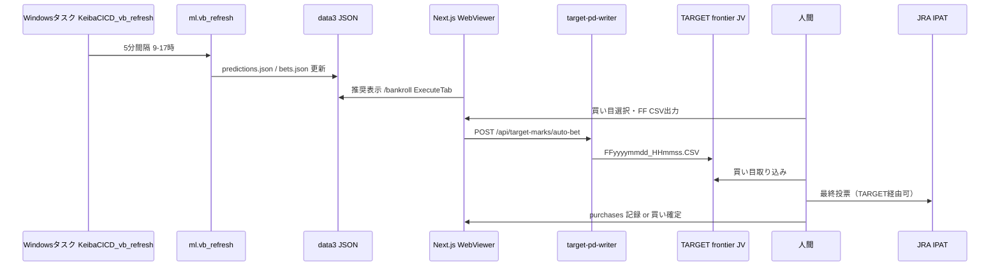

# 01. 現状分析（AS-IS）

## 1. システム境界

| 項目 | 値 |
|------|-----|
| リポジトリ | `c:\KEIBA-CICD\_keiba\keiba-cicd-core` |
| 現行スタック | keiba-v2: Python 3.10+ / LightGBM / Next.js 16 |
| データ | `C:\KEIBA-CICD\data3\`（JSON）、MySQL `mykeibadb`（オッズ・払戻） |
| TARGET | `C:\TFJV\TXT\` FF CSV、UmaMark DAT |

## 2. エンドツーエンドフロー（現行）

## 3. 実装済みコンポーネント

### 3.1 Python（購入判断）

| モジュール | パス | 役割 |
|-----------|------|------|
| bet_engine | `keiba-v2/ml/bet_engine.py` | VB Floor 2層、Kelly、PRESETS |
| generate_bets | `keiba-v2/ml/generate_bets.py` | predictions → bets.json |
| vb_refresh | `keiba-v2/ml/vb_refresh.py` | 直前オッズ再計算 + bets 再生成 |
| settle_purchases | `keiba-v2/ml/settle_purchases.py` | purchases 精算（mykeibadb払戻） |
| win5_pick | `keiba-v2/ml/win5_pick.py` | WIN5 推奨 |

現役プリセット: **`tansho_ippon` のみ**（`ACTIVE_PRESETS`）。

### 3.2 Web（半自動実行UI）

| コンポーネント | パス | 機能 |
|---------------|------|------|
| ExecuteTab | `web/src/components/bankroll/ExecuteTab.tsx` | 推奨一覧、FF CSV、買い確定 |
| bet-engine.ts | `web/src/app/predictions/lib/bet-engine.ts` | ライブオッズでEV再計算 |
| target-pd-writer | `web/src/lib/data/target-pd-writer.ts` | FF CSV（Shift-JIS, 12フィールド） |
| auto-bet API | `web/src/app/api/target-marks/auto-bet/route.ts` | FF 一括出力 |
| bankroll/check | `web/src/app/api/bankroll/check/route.ts` | 日上限・レース上限・券種ROI警告 |
| confirmed-bets | `web/src/app/api/bankroll/confirmed-bets/route.ts` | 確定スナップショット |
| purchases | `web/src/app/api/purchases/[date]/route.ts` | 購入CRUD |

### 3.3 データファイル

| ファイル | パス | 内容 |
|----------|------|------|
| predictions.json | `data3/races/YYYY/MM/DD/` | 推論・VB・EV |
| bets.json | 同上 | 推奨買い目（preset別） |
| selective_bets.json | 同上 | 厳選候補 |
| purchases | `data3/userdata/purchases/{date}.json` | 購入記録 |
| confirmed_bets | `data3/confirmed_bets/{date}.json` | 確定時点スナップショット |
| bankroll config | `data3/bankroll/config.json` | 上限・Kelly設定 |

## 4. 未実装・ギャップ（優先度順）

| # | ギャップ | 影響 | 関連ロードマップ |
|---|---------|------|------------------|
| 1 | **購入オーケストレータ** | 締切に合わせた自動判断・キューなし | web-roadmap §13 Phase 2–3 |
| 2 | **IPAT/TARGET 成否の取得** | 投票成功/失敗がシステムに戻らない | §7-3 |
| 3 | **購入実行の監査ログ** | 税務・障害調査に不十分 | review Phase 4, CLAUDE.md |
| 4 | **状況ダッシュボード** | 複数レースの購入パイプラインが一望できない | 本パッケージ §04 |
| 5 | **generate_bets と v4_predict の未連結** | 初回betsはvb_refresh依存 | analysis_pipeline.md |
| 6 | **JIT（オッズ乖離UI）** | 締切直前EV転落が見えにくい | web-roadmap §13 Phase 1 |
| 7 | **horse exposure 自動ガード** | 同一馬依存の過剰ベット | web-roadmap §10 |
| 8 | **DD 4層防御の自動連動** | アラートは設計のみ | web-roadmap §11 |
| 9 | **GitHub Actions CI** | 購入系の回帰テストなし | — |

## 5. ExecuteTab UX の現状（要点）

**できること**

- 日付選択、メイン/他プリセットの推奨表示
- チェックした買い目のみ FF CSV 出力
- 買い確定 → `confirmed_bets` に保存（推奨から消えても残る）

**できないこと・弱い点**

- TARGET に CSV を書いた**後**の状態（取込済みか、IPAT送信済みか）が不明
- レース単位の締切カウントダウンとパイプライン状態がない
- `bankroll/check` は購入**前**の1件チェックのみ（レース横断のキュー管理なし）
- エラー時のリトライ・冪等性の概念が UI にない
- 通知（音・デスクトップ・LINE等）なし

## 6. パイプラインと自動化の接点

| トリガ | 現状 | 自動購入への拡張案 |
|--------|------|-------------------|
| vb_refresh（5分） | オッズ・bets更新 | → Orchestrator に `ODDS_REFRESHED` イベント発火 |
| 管理画面 v4_predict | predict + closing | → 朝の `SCHEDULED` レース一覧生成 |
| ExecuteTab 手動 | FF CSV | → 承認後に同 API を Orchestrator から呼ぶ |
| settle_purchases | 事後精算 | → `SETTLED` 状態へ遷移 |

## 7. 既存設計との整合

| ドキュメント | 自動購入との関係 |
|-------------|------------------|
| `betting_system_design.md` | Layer1 VB Floor → 購入候補の不変条件。ライブオッズで再判定 |
| `BETTING_STRATEGY_v3.0.md` | EV駆動・Kelly。Orchestrator は変更しない |
| `operations_architecture_principles.md` | L4/L5分離、Themis目隠し、実行系リスク対策 |
| `web-roadmap.md` §13 | JIT Phase 1–3 = 本プロジェクトの前半 |
| `review_ml_accuracy...` Phase 4 | PAT/IPAT連携 = 本プロジェクトの後半 |

## 8. AS-IS まとめ

KeibaCICD は **「予想と買い目推奨の自動化」は高度**だが、**「購入実行の自動化と可視化」はほぼ未着手**。  
既存の FF CSV・bankroll・confirmed_bets は **Phase 0–2 の土台として再利用可能**であり、ゼロから作る必要はない。
