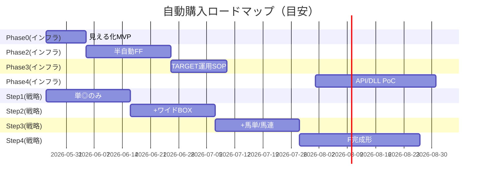

# 06. フェーズ別ロードマップ

> **2026-05-23 更新**: 朝会の結果、Phase 1（JIT 可視化）は Session 118 で /odds-race 画面に統合済のため削除。
> 加えて、購入戦略の積み上げ軸として **Step 1–4** を追加。Phase（インフラ層）と Step（戦略層）は直交する2軸として並走する。
> 詳細: [./09_MY_MARKS_AND_STRATEGY.md](./09_MY_MARKS_AND_STRATEGY.md)、[./10_BANKROLL_CONTROL.md](./10_BANKROLL_CONTROL.md)

## 1. 全体像

※ 日付は議論用の目安。リソースにより変動。Phase と Step は **並走可能**（インフラと戦略は独立軸）。

## 2. Phase 0 — 見える化 MVP（推奨: 最初のスプリント）

**ゴール**: 購入はまだ手動のまま、**パイプライン状態を1画面で見られる**。

| タスク | 成果物 | 工数感 |
|--------|--------|--------|
| ledger スキーマ実装 | `purchase_ledger/{date}.json` | S |
| GET status API | `/api/auto-purchase/status` | S |
| 手動イベントPOST | approve, confirm-ipat, skip | S |
| `/auto-purchase` ページ | 表+ドロワー+緊急停止 | M |
| レース一覧生成 | predictions/bets から SCHEDULED 初期化 | S |
| ExecuteTab リンク | コックピットへ | XS |

**受け入れ基準**

- [ ] 開催日に全レースが表に並ぶ
- [ ] 人手で状態を進められる（FF済→IPAT確認）
- [ ] 緊急停止でモード stopped

**購入自動度**: 0%

---

## 3. Phase 1（削除済 — JIT 可視化）

> **2026-05-23 削除**: 本 Phase の主目的（オッズ乖離・EV転落バッジ・閾値表示）は Session 118 で `/odds-race/[raceId]` のシグナルタブ・チャートタブ・複合フィルタタブとして実装済。
> したがって独立 Phase としては不要と判断し、削除する。
>
> **代替**: 締切判断は `/odds-race` の「🎯シグナルタブ」（買い度判定 + 急騰アラート + クイックフィルタ）で行う。Phase 2 以降の orchestrator は odds-race の状態を購読する形で接続する。
>
> 経緯参照: MEMORY.md Session 118 セクション

---

## 4. Phase 2 — 半自動 FF（web-roadmap §13 Phase 2–3 前半）

**ゴール**: 締切 N 分前に **承認済み** レースの FF CSV を自動出力。

| タスク | 成果物 |
|--------|--------|
| purchase_orchestrator.py | tick + 締切スケジュール |
| タスクスケジューラ登録 | 1分間隔 |
| bankroll ガード統合 | 出力前 check |
| 承認フロー | semi モード |
| auto_ff フラグ | デフォルトOFF |

**受け入れ基準**

- [ ] T-7 で FF が `C:\TFJV\TXT\` に出る
- [ ] 上限超過レースは SKIPPED
- [ ] vb_refresh 2回失敗で stopped

**購入自動度**: 30%（IPAT・TARGET取込は手）

---

## 5. Phase 3 — TARGET 運用完成

**ゴール**: TARGET IPAT 連動の **再現可能な SOP** と UI チェックリスト。

| タスク | 成果物 |
|--------|--------|
| 運用マニュアル | `docs/auto-purchase/TARGET_IPAT_SOP.md` |
| UI チェックリスト | TARGET取込□ IPAT確認□ 完了報告□ |
| STALE 検知 | タイムアウトアラート |
| トレーニング | 1開催日ドライラン記録 |

**受け入れ基準**

- [ ] 非エンジンが SOP だけで1日運用できる
- [ ] 一括投票失敗時の復旧手順が1ページにある

**購入自動度**: 50–70%

---

## 6. Phase 4 — 完全自動化の選択肢（将来）

**ゴール**: 成否が API で取れる実行経路の PoC。

| タスク | 成果物 |
|--------|--------|
| JRA-IPAT-API 見積 | 判断資料 |
| PoC 単勝1点 | 成功/失敗ログ |
| または ipathelper_dll 評価 | セキュリティレビュー |
| Themis 統合 | review Phase 4 |
| 監査ログ | 改ざん防止 |

**ゲート**: Phase 3 で **30レース以上** semi 運用 without S1インシデント

**購入自動度**: 80–95%

---

## 6.5 Step 段階ロードマップ（戦略層）

**位置づけ**: Phase 0–4 が「**自動化の深さ**」（見える化→半自動→TARGET連動→API）を扱うのに対し、Step 1–4 は「**買い方の広さ**」（単勝のみ→F完成形）を扱う直交軸。
詳細は [./09_MY_MARKS_AND_STRATEGY.md](./09_MY_MARKS_AND_STRATEGY.md) §3 参照。

### 6.5.1 Step 1 — 単◎のみ（2–3週間）

**ゴール**: 印読み込み・購入フロー・bankroll 配分の基盤確立。

| タスク | 成果物 | 工数感 |
|--------|--------|--------|
| 印モーダル UI 修正 | `Ⅲ` 追加 / `★` 削除 / `消` value 分離 | S |
| `ml/strategies/base.py` | 戦略 I/F 定義 | S |
| `ml/strategies/tansho.py` | 単◎買い目生成 | M |
| `bankroll/config.json` 拡張 | 絶対額上限・上書き対応 | M |
| `/api/bankroll/check` 拡張 | absolute mode + override | M |

**受け入れ基準**

- [ ] My印 `◎` が打たれたレースで、単◎の買い目が自動生成される
- [ ] `bankroll/check` が絶対額上限を返す
- [ ] レース個別の金額上書きが UI から可能

**Step 1 と並走する Phase**: Phase 0 + Phase 2 前半

---

### 6.5.2 Step 2 — + ワイド ◎-○-▲ BOX（2–3週間）

**ゴール**: 複数券種ポートフォリオ配分の初実装。

| タスク | 成果物 |
|--------|--------|
| `ml/strategies/wide.py` | ワイドBOX買い目生成 |
| 配分ロジック | 単◎ + ワイドBOX の比率設計 |
| `ml/sim/ticket_sweep.py` | 過去レースでの sweep 評価 |

**受け入れ基準**

- [ ] `◎ ○ ▲` の3印が揃ったレースでワイドBOX 3点が生成
- [ ] 単◎との配分が config から制御可能

---

### 6.5.3 Step 3 — + 馬単 ◎→○ / 馬連 ◎-○（2–3週間）

**ゴール**: 順序・組み合わせ券種の追加。

| タスク | 成果物 |
|--------|--------|
| `ml/strategies/umaren.py` | 馬連・馬単買い目生成 |
| 配分の3券種化 | 単 + ワイド + 馬連/馬単 |
| situation 分類器 | `1strong_total` vs `2strong_balanced` の分岐 |

---

### 6.5.4 Step 4 — F 完成形（30日）

**ゴール**: 三連単・三連複を追加し、全6券種ポートフォリオ最適化。

| タスク | 成果物 |
|--------|--------|
| `ml/strategies/sanrentan.py` | 三連単・三連複 |
| F 配分最適化 | 6券種の Kelly 風配分 |
| 「死に馬券なし」検証 | 印通り着順での収支シミュ |

**ゲート**: Step 3 で **3開催日以上** の semi 運用 without S1インシデント

---

## 7. 既存ロードマップとの対応

| 既存 | 本ロードマップ |
|------|----------------|
| web-roadmap §7-3 | Phase 2–4 |
| web-roadmap §13 Phase 1 | **Session 118 で実装済**（Phase 1 削除の経緯参照） |
| web-roadmap §13 Phase 2–3 | Phase 2–3 |
| web-roadmap §10 horse exposure | Phase 2 後半 or 2.5 |
| web-roadmap §11 DD | Phase 0 ヘッダ + Phase 2 自動連動 |
| review Phase 4 | Phase 4 |
| ai-team ROADMAP v5.0 | Phase 0–2 と同期 |
| **本書 §6.5 Step 1–4** | 09_MY_MARKS_AND_STRATEGY.md §3 と同期 |

## 8. 並列化可能なワークストリーム

| ストリーム | 担当候補 | 依存 |
|-----------|----------|------|
| A: ledger + API | Backend agent | なし |
| B: UI コックピット | Frontend agent | Aのモック可 |
| C: orchestrator | Python agent | A |
| D: JIT predictions UI | Frontend agent | オッズAPI |
| E: TARGET SOP | 人間+ドキュメント | Phase 2 |

## 9. やらないこと（スコープ外）

- netkeiba スクレイピングによる投票
- 風街・キャラ連動の自動購入
- GitHub Actions からの本番投票
- 複数口座の自動ローテ（Phase 4 以降検討）

## 10. 成功指標（3ヶ月後）

| 指標 | 目標 |
|------|------|
| IPAT確認漏れ（STALE） | < 5% |
| 承認リードタイム中央値 | < 3分 |
| 手動 purchases 修正率 | < 10% |
| semi モード運用日数 | 8開催日以上 |
| Step 進捗 | Step 2 完了（ワイドBOX 実戦投入） |

## 11. Phase ↔ Step 対応マトリクス

各 Phase（縦・インフラ層）と Step（横・戦略層）の組み合わせで、実装内容が定まる。

|  | Step 1: 単◎ | Step 2: +ワイド | Step 3: +馬連/馬単 | Step 4: F完成 |
|---|---|---|---|---|
| **Phase 0**: 見える化 | 単◎の状態を表示 | ワイド/単の併記 | 3券種の表示 | 6券種の表示 |
| **Phase 2**: 半自動FF | 単◎ FF 自動生成 | + ワイド FF | + 馬連/馬単 FF | F 全体 FF |
| **Phase 3**: TARGET SOP | 単◎ の TARGET 取込手順 | 複数券種の取込手順 | 順序券種の SOP | F 完成 SOP |
| **Phase 4**: API/DLL | 単◎ API投票 | ワイド API | 順序券種 API | F 完全自動 |

**推奨実装順序**: 縦軸（Phase）を1段上げてから、横軸（Step）を1段進める。両方同時に進めるとデバッグ困難。

## 12. 次のアクション

- [ ] **シズネ**: Phase 1 削除に伴い、本書を参照している他文書（web-roadmap §13 含む）に齟齬がないか確認
- [ ] **カカシ先生**: Step 1 のタスクを GitHub Issue 化（§6.5.1 のテーブルをそのまま起票）
- [ ] **ふくだ君**: Step 1 開始日の確定（朝会で「2026-05-26 から」の合意があるが、要再確認）
