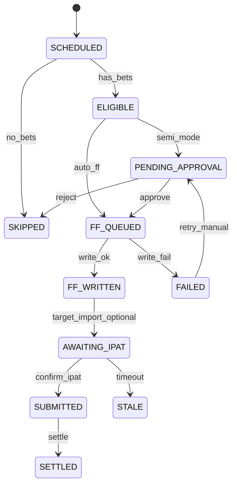

# 07. データスキーマ・イベント契約

> **【v1 → v2 ブリッジ通知 / 2026-05-23 シズネ追記】**
>
> 本章は **v1 スキーマの概念定義** として保存・参照する位置づけです。
> 実装で使用する正式スキーマは **v2** に拡張済みです。下記の追加要素は本章に書かず、14 章を参照してください:
>
> - `strategy_name` / `formation_type` / `pattern_label` / `raw_legs` / `notes` の 5 フィールド
> - `portfolio_id` (A/B/C... seq 採番) / `portfolio_strategy` による意思決定束の集約
> - ledger イベント拡張 (07 章 13 種 + 12 章 5 種 + 13 章 4 種 = **計 22 種**)
> - `_index.jsonl` (SHA256 改ざん防止追記台帳) / `pattern_label_rename_history.jsonl`
>
> **参照**: [14_LEDGER_SCHEMA.md](./14_LEDGER_SCHEMA.md) (v1.1 — 2026-05-23 ふくだ君フィードバック反映済)
>
> 本章の §3 (`purchase_ledger/YYYY-MM-DD.json`) / §5 (イベント定義) は **v1 概念のまま据え置き**。新規実装は 14 章の v2 仕様に従うこと。`bets_summary` / `preset` 等の v1 フィールドはマイグレ対象です (14 章 §2.2 / §7-5 参照)。

## 1. ファイル配置

| ファイル | パス | SoT |
|----------|------|-----|
| 購入台帳 | `data3/userdata/purchase_ledger/YYYY-MM-DD.json` | パイプライン状態 |
| 自動購入設定 | `data3/userdata/auto_purchase_config.json` | モード・閾値 |
| 購入記録（既存） | `data3/userdata/purchases/YYYY-MM-DD.json` | 税務・収支 |
| 確定スナップ（既存） | `data3/confirmed_bets/YYYY-MM-DD.json` | 判断時点 |
| オーケストレータログ | `data3/logs/purchase_orchestrator/` | デバッグ |

## 2. `auto_purchase_config.json`

```json
{
  "version": 1,
  "mode": "semi",
  "emergency_stop": false,
  "stopped_at": null,
  "stopped_by": null,
  "stopped_reason": null,
  "thresholds": {
    "min_minutes_before_post": 7,
    "ff_trigger_minutes_before_post": 7,
    "stale_minutes_after_ff": 5,
    "max_daily_auto_races": 20,
    "vb_refresh_max_age_minutes": 10
  },
  "dd_tiers": {
    "yellow_pct": -20,
    "orange_pct": -30,
    "red_pct": -40
  },
  "notifications": {
    "browser": true,
    "sound_on_failed": true
  }
}
```

## 3. `purchase_ledger/YYYY-MM-DD.json`

```json
{
  "version": 1,
  "date": "2026-05-23",
  "mode": "semi",
  "summary": {
    "total_races": 36,
    "needs_action": 3,
    "submitted": 5,
    "skipped": 10,
    "failed": 0
  },
  "races": [
    {
      "race_id": "2026052306010407",
      "venue": "東京",
      "race_number": 7,
      "post_time": "2026-05-23T12:35:00+09:00",
      "deadline_est": "2026-05-23T12:33:00+09:00",
      "state": "PENDING_APPROVAL",
      "pipeline": {
        "odds_refreshed": true,
        "approved": false,
        "ff_written": false,
        "target_imported": false,
        "ipat_confirmed": false,
        "settled": false
      },
      "preset": "tansho_ippon",
      "bets_summary": {
        "count": 2,
        "total_amount": 1200
      },
      "skip_reason": null,
      "ff_csv_path": null,
      "confirmed_bet_ids": [],
      "idempotency_key": "2026052306010407:tansho_ippon:abc123",
      "last_vb_refresh_at": "2026-05-23T12:24:01+09:00",
      "ev_warnings": ["umaban:3:ev_collapsed"],
      "updated_at": "2026-05-23T12:24:05+09:00"
    }
  ],
  "events": [
    {
      "id": "evt-001",
      "at": "2026-05-23T12:24:01+09:00",
      "type": "VB_REFRESH_OK",
      "race_id": "2026052306010407",
      "payload": { "bets_count": 2 }
    }
  ]
}
```

## 4. 状態遷移



## 5. イベント型一覧

| type | 発火元 | payload 例 |
|------|--------|------------|
| `MODE_CHANGED` | UI | `{ mode, by }` |
| `EMERGENCY_STOP` | UI | `{ reason, by }` |
| `VB_REFRESH_OK` | vb_refresh | `{ races_updated }` |
| `VB_REFRESH_FAIL` | vb_refresh | `{ error }` |
| `EV_COLLAPSED` | orchestrator | `{ umaban }` |
| `APPROVED` | UI | `{ by }` |
| `REJECTED` | UI | `{ reason }` |
| `FF_WRITTEN` | orchestrator | `{ path, count }` |
| `FF_FAILED` | orchestrator | `{ error }` |
| `TARGET_IMPORTED` | UI（人手） | `{ by }` |
| `IPAT_CONFIRMED` | UI（人手） | `{ by }` |
| `SETTLED` | settle_purchases | `{ payout }` |
| `STALE` | orchestrator | `{ stage }` |

## 6. 既存スキーマとのマッピング

### purchases（既存）

ledger `SUBMITTED` 時に purchases items を生成 or 同期:

```json
{
  "race_id": "...",
  "bet_type": "tansho",
  "selection": [3],
  "amount": 500,
  "odds": 10.4,
  "status": "pending",
  "source": "auto_purchase",
  "ledger_idempotency_key": "..."
}
```

### confirmed_bets（既存）

`APPROVED` 時に ExecuteTab と同様のスナップショットを保存し、`confirmed_bet_ids` に ID を記録。

## 7. idempotency_key 生成

```
{idempotency_key} = {race_id}:{preset}:{sha256(sorted bets normalized)}
```

同一キーで `FF_WRITTEN` 済みなら再出力しない（手動 `force=true` のみ再出力）。

## 8. API リクエスト/レスポンス

### POST `/api/auto-purchase/races/{raceId}/approve`

```json
// Request
{ "preset": "tansho_ippon", "force": false }
// Response
{ "ok": true, "state": "FF_QUEUED", "ff_csv_path": null }
```

### POST `/api/auto-purchase/races/{raceId}/confirm-ipat`

```json
// Request
{ "note": "IPAT画面で確認済み" }
// Response
{ "ok": true, "state": "SUBMITTED" }
```

### POST `/api/auto-purchase/emergency-stop`

```json
{ "reason": "DD -30%" }
```

## 9. 初期化バッチ

`python -m ml.purchase_ledger_init --date 2026-05-23`

1. `data3/races/.../predictions.json` からレース一覧
2. `bets.json` から ELIGIBLE / SKIPPED 初期判定
3. ledger ファイル新規作成 or マージ

## 10. TypeScript 型（実装用）

```typescript
export type PurchaseRaceState =
  | 'SCHEDULED' | 'ELIGIBLE' | 'PENDING_APPROVAL' | 'FF_QUEUED'
  | 'FF_WRITTEN' | 'AWAITING_IPAT' | 'SUBMITTED' | 'SKIPPED'
  | 'FAILED' | 'STALE' | 'SETTLED';

export interface PurchaseLedgerRace {
  race_id: string;
  venue: string;
  race_number: number;
  post_time: string;
  deadline_est: string;
  state: PurchaseRaceState;
  pipeline: {
    odds_refreshed: boolean;
    approved: boolean;
    ff_written: boolean;
    target_imported: boolean;
    ipat_confirmed: boolean;
    settled: boolean;
  };
  preset: string;
  bets_summary: { count: number; total_amount: number };
  skip_reason: string | null;
  ff_csv_path: string | null;
  idempotency_key: string;
  last_vb_refresh_at: string | null;
  ev_warnings: string[];
  updated_at: string;
}
```
