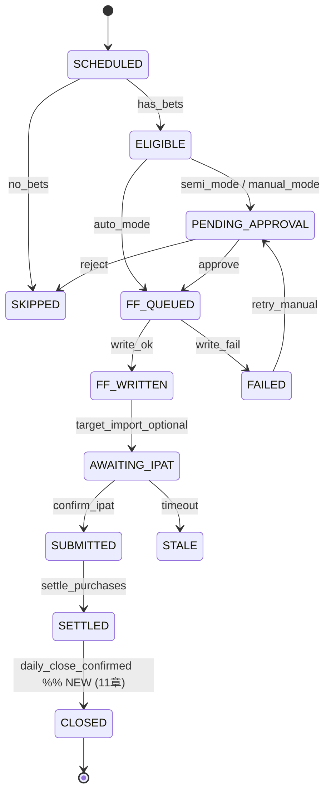

# 14. Ledger スキーマ v2 — strategy / portfolio / raw_legs / 全イベント統合

> **作成日**: 2026-05-23（自己紹介3論点 §3 のメタ強化案を実装に落とす）
> **改訂履歴**:
> - **2026-05-23 v1.0** 初稿。07 章 v1 に対する v2 拡張の正式定義。`strategy_name` / `formation_type` / `pattern_label` / `raw_legs` / `notes` の 5 フィールド追加、`portfolio_id` / `portfolio_strategy` による集約、12 章 v2.2 / 13 章で増えた合計 18 種の ledger イベントを §6 で一元登録。
> - **2026-05-23 v1.1** ふくだ君フィードバック (c) 反映。§11 論点 1 (portfolio_id seq) を「同一レースで複数 portfolio が現実に起きる (F戦法 + 独立単勝の併存)」を根拠に **A 固定案を撤回 → A/B/C... seq を本格採用** に確定。§3.1 で採番ルール・冪等性・F戦法と独立単勝の併存 JSON 例を本格定義。§3.3 集計 API に `portfolio_seq` パラメータ追加。§11 論点 2 (rename UI) / 論点 3 (raw_legs 馬名併記) はシズネ提案通り確定し §11 から削除（§4 / §9 に反映済）。
> - **2026-05-25 v1.2** Session 129-132 で target_clicker / launcher / 失敗系を実装した結果、 ledger event を **22 種 → 30 種** に拡張 (シズネ Session 132 レビュー 🟡 F)。 追加 8 種: `VOTE_FAILED` (Session 129), `IPAT_START_FAILED` / `TARGET_SAVE_FAILED` (Session 130), `TARGET_DIALOG_UNKNOWN` / `IPAT_SESSION_EXPIRED` (Session 131), `IPAT_SESSION_EXPIRED_POSTVOTE` / `IPAT_SESSION_RECOVERED` / `IPAT_SESSION_RECOVERY_FAILED` (Session 132)。 すべて `_record_failure_event()` 共通ヘルパ (writer.py) 経由で events_{YYYY-MM}.jsonl + ledger.events[] の両方に記録。 「便利な復旧フローを意図的に作らない」 シズネ原則 (= 自動リトライ無し、 復旧結果も人手で照合必須) を payload 構造で構造的に保持。
> **担当**: シズネ（記録・税務・几帳面担当）
> **位置づけ**: 07 章 v1 が定義した「ledger ファイル配置と最小スキーマ」の **上位互換 v2 仕様**。07 章は v1 として保存し概念定義として残す。実装は本書 v2 に従う。
> **関連**: [./07_DATA_SCHEMA_AND_EVENTS.md](./07_DATA_SCHEMA_AND_EVENTS.md)（v1 ベース）、[./09_MY_MARKS_AND_STRATEGY.md](./09_MY_MARKS_AND_STRATEGY.md) §3（F戦法 Step1-4）、[./10_BANKROLL_CONTROL.md](./10_BANKROLL_CONTROL.md) §3（bankroll 配分）、[./11_DAILY_CLOSE.md](./11_DAILY_CLOSE.md) §4-7（ポートフォリオ単位集約・税務記録）、[./12_KILL_SWITCH_COOLDOWN.md](./12_KILL_SWITCH_COOLDOWN.md) §4.6（kill switch / モード遷移イベント）、[./13_AUTO_RECONCILIATION.md](./13_AUTO_RECONCILIATION.md)（突合結果イベント）

---

ふくだ君、カカシ先生。自己紹介 §3 でシズネが「ledger メタは最初から固めとけ、後で泣く」と警告した件、実装に落とせる粒度まで詰めました。**核心は「raw_legs を JSON 原型で残すのが命綱」**。pattern_label は後から rename できる設計にしておけば、「その他」で溜めてから「あ、これ実は F-Step3 だった」と後付け命名で集計できます。これが効くと、運用 6 ヶ月後に「過去半年の F-Step3 系の ROI どうだった？」が pandas 一発で出る。

---

## 1. データモデル全体図（v1 → v2 差分明示）

### 1.1 v1（07 章現状）

```
purchase_ledger/{date}.json
├ version: 1
├ races[]
│   └ race_id, state, pipeline, preset, bets_summary, idempotency_key, ...
└ events[]
    └ id, at, type, race_id, payload
```

`bets_summary` は `{ count, total_amount }` のみ。**個々の券種・買い目・配分が ledger に書かれていない**。SUBMITTED 時に既存 `purchases/{date}.json` に同期されて初めて個別の bet が記録される。

### 1.2 v2（本書）

```
purchase_ledger/{date}.json
├ version: 2
├ races[]
│   ├ race_id, state, pipeline, idempotency_key, ...（v1 継承）
│   └ portfolios[]                       ← NEW: 同一意思決定の券種束
│       ├ portfolio_id
│       ├ portfolio_strategy             ← "F-Step3" / "tansho_ippon" / "single" 等
│       ├ created_at
│       ├ tickets[]                      ← NEW: ticket レコード（v1 の bets を拡張）
│       │   ├ ticket_id
│       │   ├ strategy_name              ← NEW (シズネ §3 提案)
│       │   ├ formation_type             ← NEW
│       │   ├ pattern_label              ← NEW (rename 可)
│       │   ├ raw_legs (JSON 原型)        ← NEW (命綱)
│       │   ├ notes                      ← NEW (自由欄)
│       │   ├ bet_type, total_amount, idempotency_key（v1 継承）
│       │   └ ipat_confirmed_at, payout, settled_at（突合後追記）
│       └ portfolio_total, portfolio_pnl, portfolio_roi
└ events[]
    └ (v1 継承 + 12/13 章で増えた 18 種を §6 に正式登録)

pattern_label_rename_history.jsonl              ← NEW
purchase_ledger/_index.jsonl                    ← NEW (SHA256 追記台帳)
```

**v1 → v2 主要差分**:

| 項目 | v1 | v2 |
|---|---|---|
| 個別 bet の記録 | `purchases/` 側のみ | `ledger.races[].portfolios[].tickets[]` に正式格納 |
| 戦略メタ | なし | `strategy_name` / `pattern_label` / `formation_type` |
| 買い目原型 | なし | `raw_legs` （JSON 原型保存）|
| 同一意思決定の束 | なし | `portfolio_id` / `portfolio_strategy` |
| pattern の後付け命名 | なし | `pattern_label` rename + audit |
| 改ざん防止 | なし | `_index.jsonl` に SHA256 追記 |
| イベント種類 | 13 種 | 13 + 5 (kill_switch/mode) + 4 (recon) + 8 (target_clicker/launcher v1.2) = **30 種**（§6 で一元登録）|

`purchases/` / `confirmed_bets/` の役割は変更なし（11 章 §7 で確定済）。**ledger v2 は「意図 + 配分 + 戦略メタ」の SoT、purchases は「税務 SoT、IPAT 突合後の事実」、confirmed_bets は「判断時点の不変 snapshot」** という三層関係は不変。

---

## 2. ticket レコード新スキーマ

### 2.1 フィールド定義

| フィールド | 型 | 必須 | 意味・例 |
|---|---|---|---|
| `ticket_id` | string | ✅ | `{portfolio_id}#t{seq}` 形式（例: `pf-20260523-K05-A#t3`）|
| `strategy_name` | string | ✅ | 戦略ラベル。例: `"F-Step3"` / `"tansho_ippon"` / `"selective_v3_emerging_w"` / `"manual"` |
| `formation_type` | enum | ✅ | `"single"` / `"box"` / `"formation"` / `"nagashi"` / `"wheel"` のいずれか |
| `pattern_label` | string | ✅ | 後付け分類用ラベル。**初期は `"その他"` を多用、運用しながら命名**。rename 可（§4）|
| `raw_legs` | object | ✅ | 買い目の原型 JSON（券種ごとに構造が違う、§2.3 参照）|
| `notes` | string | ✅ (空文字可) | 自由欄。手動メモ・上書き理由・例外運用の説明等 |
| `bet_type` | enum | ✅ | `tansho` / `fukusho` / `wakuren` / `umaren` / `wide` / `umatan` / `sanrenpuku` / `sanrentan` / `win5` |
| `total_amount` | int | ✅ | 円。`amount_per_combo × combo_count` の検算済値 |
| `amount_per_combo` | int | optional | フォーメーション/BOX 時の1点単価 |
| `combo_count` | int | optional | フォーメーション/BOX 時の点数（検算用）|
| `idempotency_key` | string | ✅ | `{race_id}:{bet_type}:{sha256(normalized raw_legs)}:{strategy_name}` |
| `created_at` | ISO8601 | ✅ | ticket 生成時刻（FF 出力前）|
| `submitted_at` | ISO8601 | optional | IPAT 送信完了時刻 |
| `ipat_confirmed_at` | ISO8601 | optional | IPAT 突合で OK 確認できた時刻 |
| `payout` | int | optional | 払戻額（settle 後）|
| `settled_at` | ISO8601 | optional | settle 完了時刻 |
| `ev_at_decision` | number | optional | 判断時点 EV（confirmed_bets と整合）|

### 2.2 既存 v1 フィールドとの関係

| v1 (07 §3) | v2 での扱い |
|---|---|
| `races[].bets_summary.count` | `portfolios[].tickets.length` の合計から動的算出（重複保持しない）|
| `races[].bets_summary.total_amount` | `portfolios[].portfolio_total` の合計から動的算出（同上）|
| `races[].preset` | `portfolios[0].portfolio_strategy` にマージ（preset は廃止、strategy_name に統一）|
| `races[].idempotency_key` | **portfolio 単位の idempotency_key として残す**。ticket 単位は §2.1 で別途定義。両者で多重防止 |

> シズネ注: `preset` 概念を `strategy_name` に統一するのは命名整理。`tansho_ippon` も `F-Step3` も両方「戦略ラベル」なので、別フィールドに分ける必然性がない。マイグレーション時に `preset → strategy_name` を機械的に rename する（§7 参照）。

### 2.3 raw_legs の券種別 JSON 構造

**ここが本書の核心**。後で集計・後付け命名・税務調査に答えるための原型保存。

#### 2.3.1 単勝・複勝（単一馬）

```json
{
  "bet_type": "tansho",
  "raw_legs": { "horses": [13] }
}
```

#### 2.3.2 馬連・ワイド・馬単（2 頭組み合わせ）

```json
// 単一買い目
{
  "bet_type": "umaren",
  "raw_legs": { "horses": [8, 13] }
}

// BOX
{
  "bet_type": "umaren",
  "formation_type": "box",
  "raw_legs": { "box": [8, 13, 17], "combo_count": 3 }
}

// 馬単フォーメーション（順序あり）
{
  "bet_type": "umatan",
  "formation_type": "formation",
  "raw_legs": {
    "axis_1st": [17],
    "axis_2nd": [11, 13],
    "combo_count": 2
  }
}
```

#### 2.3.3 三連単・三連複（F戦法の中核）

```json
// 三連単フォーメーション（F-Step3 の典型例）
{
  "bet_type": "sanrentan",
  "formation_type": "formation",
  "strategy_name": "F-Step3",
  "pattern_label": "その他",   // 後から "F-Step3-axis2-wide" 等にrename
  "raw_legs": {
    "jiku1": [17],
    "jiku2": [11],
    "aite3": [2, 3, 9, 12, 13, 16],
    "combo_count": 6
  },
  "amount_per_combo": 300,
  "total_amount": 1800,
  "notes": "本命2頭+相手6頭ワイド型。前走重賞2着組+穴の若手"
}

// 三連複 BOX
{
  "bet_type": "sanrenpuku",
  "formation_type": "box",
  "raw_legs": { "box": [3, 8, 13], "combo_count": 1 },
  "amount_per_combo": 1000,
  "total_amount": 1000
}
```

#### 2.3.4 軸流し（nagashi）

```json
// 三連単 1 着固定流し
{
  "bet_type": "sanrentan",
  "formation_type": "nagashi",
  "raw_legs": {
    "axis_position": "1st",
    "axis": [17],
    "partners": [2, 3, 9, 11, 13],
    "combo_count": 20
  }
}
```

### 2.4 TypeScript 型定義（実装直結）

```typescript
export type FormationType = "single" | "box" | "formation" | "nagashi" | "wheel";
export type BetType = "tansho" | "fukusho" | "wakuren" | "umaren" | "wide"
                    | "umatan" | "sanrenpuku" | "sanrentan" | "win5";

// raw_legs の Discriminated Union
export type RawLegs =
  | { horses: number[] }                                          // single (tansho/fukusho/umaren/wide/umatan)
  | { box: number[]; combo_count: number }                        // box
  | { axis_1st: number[]; axis_2nd?: number[]; axis_3rd?: number[]; combo_count: number }  // formation
  | { jiku1?: number[]; jiku2?: number[]; aite3?: number[]; combo_count: number }          // F戦法 三連単
  | { axis_position: "1st" | "2nd" | "3rd"; axis: number[]; partners: number[]; combo_count: number };  // nagashi

export interface Ticket {
  ticket_id: string;
  strategy_name: string;
  formation_type: FormationType;
  pattern_label: string;          // 初期 "その他" 可
  raw_legs: RawLegs;
  notes: string;                  // 空文字許容
  bet_type: BetType;
  total_amount: number;
  amount_per_combo?: number;
  combo_count?: number;
  idempotency_key: string;
  created_at: string;             // ISO8601
  submitted_at?: string;
  ipat_confirmed_at?: string;
  payout?: number;
  settled_at?: string;
  ev_at_decision?: number;
}

export interface Portfolio {
  portfolio_id: string;
  portfolio_strategy: string;     // "F-Step3" / "tansho_ippon" / "manual" 等
  created_at: string;
  tickets: Ticket[];
  portfolio_total: number;        // tickets.total_amount 合計
  portfolio_pnl?: number;         // settle 後
  portfolio_roi?: number;         // settle 後
  idempotency_key: string;        // portfolio 単位の冪等キー
}
```

---

## 3. portfolio 単位の集約

### 3.1 portfolio_id の採番ルール（v1.1 で本格採用）

```
pf-{YYYYMMDD}-{venue_code}{race_no}-{seq}

例: pf-20260523-K05-A   (2026-05-23 京都 5R の 1 個目: F戦法 portfolio)
    pf-20260523-K05-B   (2026-05-23 京都 5R の 2 個目: 独立な単勝1本 portfolio)
    pf-20260523-T07-A   (2026-05-23 東京 7R の 1 個目)
```

- `venue_code`: 1 文字（K=京都/T=東京/H=阪神/N=中山/Y=東京/S=札幌/X=函館/A=新潟/F=福島/I=小倉/C=中京）
- `seq`: 同一レース内で portfolio 作成順に increment する **大文字英字** (`A` → `B` → `C` ... → `Z`)。レース跨ぎでリセット（翌レースは再び `A` から）。

#### 3.1.1 seq 形式を「大文字英字 A/B/C...」に決定した理由 (v1.1)

| 候補 | 採否 | 理由 |
|---|---|---|
| **`A` 固定（v1.0 当初案）** | ❌ 撤回 | ふくだ君フィードバック「F戦法と独立な単勝1本が同一レースで併存することが現実にある」を受け不採用 |
| **`A`/`B`/`C`... (大文字英字)** | ✅ **採用** | (a) 14 章既存例で全て採用済、(b) race_no (2 桁数字) と視覚分離、(c) 1 レース 26 個超は現実に発生しない、(d) 順序が直感的 |
| `01`/`02`/... (2 桁数字) | ❌ | `pf-20260523-K05-01` だと「K05 の 1 個目」と「K0501」が紛らわしい。race_no と seq の境界が曖昧 |

> シズネ判断: ふくだ君から「英字 or 数字どっち」の判断委任があったので、可読性最優先で **A/B/C 確定**。26 個超のエッジケース (現実には発生しない) で破綻したら `AA`/`AB` に拡張する設計余地は残す。

#### 3.1.2 採番ルール詳細

```
[初回 portfolio 作成時]
  当日 ledger ファイルから race_id 一致の portfolio を全走査
       ↓
  未使用の最小英字を選択 (A → B → C ... の順)
       ↓
  portfolio_id = pf-{date}-{venue}{race_no}-{選択英字}
```

**冪等性 (再起動時の重複防止)**:

- 採番は **当日 ledger ファイル内の既存 portfolio を毎回全走査** して未使用文字を選ぶ実装にする（config DB の連番カウンタは使わない）
- 同一意思決定 (同じ portfolio_strategy + 同じ tickets セット) が再投入された場合、`portfolio_idempotency_key` で重複検査し、既存 portfolio が見つかれば **新規 portfolio を作らず既存を返す**（seq を消費しない）
- プロセス再起動・並行書き込み時も file lock + 再走査で安全。連番カウンタ方式 (DB に next_seq を持つ) は採用しない（再起動時 race condition リスク）

```python
# pseudo-code: portfolio 採番
def assign_portfolio_seq(ledger_data: dict, race_id: str) -> str:
    existing_seqs = {
        p["portfolio_id"].split("-")[-1]
        for race in ledger_data["races"]
        if race["race_id"] == race_id
        for p in race.get("portfolios", [])
    }
    for c in "ABCDEFGHIJKLMNOPQRSTUVWXYZ":
        if c not in existing_seqs:
            return c
    raise RuntimeError(f"portfolio seq exhausted for race {race_id}")  # 26 個超は想定外
```

```typescript
// portfolio_idempotency_key の生成
function makePortfolioIdempotencyKey(
  race_id: string,
  portfolio_strategy: string,
  tickets: Ticket[]
): string {
  const ticketSig = tickets
    .map(t => `${t.bet_type}:${normalizeRawLegs(t.raw_legs)}:${t.total_amount}`)
    .sort()
    .join("|");
  return `${race_id}:${portfolio_strategy}:${sha256(ticketSig)}`;
}
```

#### 3.1.3 F戦法 + 独立単勝が同一レースで併存する例 (v1.1)

ふくだ君フィードバック「同一レースで二つの意思決定がある」を実装に落とした例。京都 5R で F-Step2 (本命2頭軸の三連単+ワイド+単勝) と、別軸で「△の若手が走りそう」という独立な単勝1本を併走させるケース:

```json
{
  "race_id": "2026052308050500",
  "portfolios": [
    {
      "portfolio_id": "pf-20260523-K05-A",
      "portfolio_strategy": "F-Step2",
      "created_at": "2026-05-23T12:28:40+09:00",
      "tickets": [
        {
          "ticket_id": "pf-20260523-K05-A#t1",
          "strategy_name": "F-Step2",
          "formation_type": "single",
          "pattern_label": "その他",
          "raw_legs": { "horses": [8, 13] },
          "bet_type": "umaren",
          "total_amount": 1000,
          "idempotency_key": "...",
          "created_at": "2026-05-23T12:28:40+09:00",
          "notes": ""
        }
      ],
      "portfolio_total": 1000,
      "idempotency_key": "2026052308050500:F-Step2:sha256_xxx"
    },
    {
      "portfolio_id": "pf-20260523-K05-B",
      "portfolio_strategy": "tansho_ippon",
      "created_at": "2026-05-23T12:35:12+09:00",
      "tickets": [
        {
          "ticket_id": "pf-20260523-K05-B#t1",
          "strategy_name": "tansho_ippon",
          "formation_type": "single",
          "pattern_label": "その他",
          "raw_legs": { "horses": [4] },
          "bet_type": "tansho",
          "total_amount": 500,
          "idempotency_key": "...",
          "created_at": "2026-05-23T12:35:12+09:00",
          "notes": "△若手単独勝負、F-Step2 とは完全独立"
        }
      ],
      "portfolio_total": 500,
      "idempotency_key": "2026052308050500:tansho_ippon:sha256_yyy"
    }
  ]
}
```

**ポイント**:
- `portfolio_id` の seq が `A` (F-Step2) と `B` (tansho_ippon) で別。**意思決定の分離が ID レベルで担保**される
- `idempotency_key` も別物 (portfolio_strategy が違うため衝突しない)
- 集計 API では `portfolio_seq=A` だけ抽出すれば F-Step2 単独の ROI が出る、`portfolio_seq=B` で独立単勝だけの集計も可能
- daily_close 時の `portfolio_pnl` は portfolio ごとに独立計算 → 「F戦法は赤字だが独立単勝が黒字」のような切り分けが可能

### 3.2 F戦法 portfolio の表現例

11 章 §4.4 の「2026-05-23 京5R F_partial_step2」を v2 で表現:

```json
{
  "race_id": "2026052308050500",
  "portfolios": [
    {
      "portfolio_id": "pf-20260523-K05-A",
      "portfolio_strategy": "F-Step2",
      "created_at": "2026-05-23T12:28:40+09:00",
      "tickets": [
        {
          "ticket_id": "pf-20260523-K05-A#t1",
          "strategy_name": "F-Step2",
          "formation_type": "single",
          "pattern_label": "その他",
          "raw_legs": { "horses": [8, 13] },
          "notes": "",
          "bet_type": "umaren",
          "total_amount": 1000,
          "idempotency_key": "...",
          "created_at": "2026-05-23T12:28:40+09:00"
        },
        {
          "ticket_id": "pf-20260523-K05-A#t2",
          "strategy_name": "F-Step2",
          "formation_type": "single",
          "pattern_label": "その他",
          "raw_legs": { "horses": [8, 13] },
          "notes": "",
          "bet_type": "wide",
          "total_amount": 3000,
          "idempotency_key": "...",
          "created_at": "2026-05-23T12:28:40+09:00"
        },
        {
          "ticket_id": "pf-20260523-K05-A#t3",
          "strategy_name": "F-Step2",
          "formation_type": "single",
          "pattern_label": "その他",
          "raw_legs": { "horses": [13] },
          "notes": "",
          "bet_type": "tansho",
          "total_amount": 3000,
          "idempotency_key": "...",
          "created_at": "2026-05-23T12:28:40+09:00"
        }
      ],
      "portfolio_total": 7000,
      "idempotency_key": "2026052308050500:F-Step2:sha256..."
    }
  ]
}
```

### 3.3 portfolio 単位の集計 API

```
GET /api/ledger/portfolios?from=2026-05-01&to=2026-05-23&strategy=F-Step2
→ {
    "portfolios": [...],
    "summary": {
      "count": 18,
      "invest_total": 126000,
      "payout_total": 142800,
      "pnl": 16800,
      "roi_pct": 113.3,
      "hit_count": 11,
      "hit_rate": 0.611
    }
  }
```

11 章 §6.3 の「ポートフォリオ別収支」レポートはこの API を叩いて生成。

#### 3.3.1 pattern_label 集計 API に `portfolio_seq` フィルタ追加 (v1.1)

§3.1.3 の F戦法 + 独立単勝併存ケースを切り分けて集計するため、`portfolio_seq` パラメータをサポート:

```
GET /api/ledger/by-pattern?label=F-Step3&from=2026-05-01&to=2026-05-23&portfolio_seq=A
  → seq=A の portfolio (本命系 F-Step3) のみ集計

GET /api/ledger/by-pattern?label=tansho_ippon&from=2026-05-01&to=2026-05-23&portfolio_seq=B
  → seq=B の portfolio (独立単勝) のみ集計

GET /api/ledger/by-pattern?label=F-Step3&from=2026-05-01&to=2026-05-23
  → portfolio_seq 省略時は全 seq 横断集計（既存挙動互換）
```

| パラメータ | 必須 | 型 | 意味 |
|---|---|---|---|
| `label` | ✅ | string | pattern_label 完全一致 (現状は完全一致のみ、prefix match は将来対応) |
| `from` / `to` | ✅ | YYYY-MM-DD | 期間 |
| `portfolio_seq` | optional | `A`/`B`/.../`Z` | 指定時は該当 seq の portfolio のみ集計対象 |
| `strategy` | optional | string | portfolio_strategy で追加絞り込み (例: `F-Step3` & `portfolio_seq=A` の AND) |
| `as_of` | optional | YYYY-MM-DD | §4.3 の as_of 集計（rename 履歴遡及）|

**運用想定**: 「F戦法本体 (seq=A) は ROI 110% / 独立単勝勝負 (seq=B) は ROI 78%、独立単勝が足を引っ張ってる」のような切り分けに使う。Step 3 以降の F戦法成熟期に頻用想定。

---

## 4. pattern_label の運用

### 4.1 初期運用フロー

```
[Step 1 開始時]
  全 ticket の pattern_label = "その他" で運用開始
       ↓
[Step 1-3 運用中]
  ふくだ君が「あ、これ実は ◎-◎ 厚め型だな」と気付く
       ↓
[後付け命名]
  /analysis/pattern-naming 画面で 過去 ticket を絞り込み
       ↓
  pattern_label を一括 rename
   ("その他" → "F-Step3-axis2-wide" 等)
       ↓
  rename history に audit ログ追記
       ↓
[集計]
  GET /api/ledger/by-pattern?label=F-Step3-axis2-wide
   で命名後の集計が一発で出る
```

### 4.2 rename の audit

`data3/userdata/purchase_ledger/pattern_label_rename_history.jsonl`:

```jsonl
{"at":"2026-06-15T14:30:00+09:00","by":"user:fukuda","action":"rename","from":"その他","to":"F-Step3-axis2-wide","filter":{"strategy_name":"F-Step3","bet_type":"sanrentan","date_from":"2026-05-01","date_to":"2026-06-14"},"affected_ticket_ids":["pf-20260523-K05-A#t3","pf-20260524-T07-A#t2",...],"affected_count":18}
{"at":"2026-06-20T09:15:00+09:00","by":"user:fukuda","action":"rename","from":"F-Step3-axis2-wide","to":"F-Step3-balanced","filter":{...},"affected_ticket_ids":[...],"affected_count":12}
```

| フィールド | 意味 |
|---|---|
| `from` / `to` | rename 前後の pattern_label |
| `filter` | rename 対象を選んだフィルタ条件（再現性確保）|
| `affected_ticket_ids` | 実際に更新された ticket_id のリスト |
| `affected_count` | 件数（検算用）|

**保持期間: 7 年**（税務調査で「なんで集計値が変わったの」を説明できるように）。

### 4.3 集計が壊れない設計

ふくだ君から想定される質問: 「pattern_label を rename したら過去の集計レポートと値が合わなくなるのでは？」

対策:

1. **レポート生成時に pattern_label の snapshot を埋め込む**: `reports/{date}.md` 生成時点での pattern_label を Markdown 内に文字列として焼き込む。後から rename されてもレポート本体は変わらない
2. **rename 履歴の jsonl を集計 API が参照可能**: `GET /api/ledger/by-pattern?label=F-Step3&as_of=2026-06-14` のように `as_of` を渡せば、その時点の pattern_label で集計できる
3. **デフォルトは「最新の pattern_label」で集計**: 上記 2. は監査用、通常運用は最新ラベルで OK（rename した意図は「より正確な分類」なので、過去も新ラベルで集計するのが望ましい）

---

## 5. 状態遷移（07 v1 + 11 章 CLOSED 統合）

07 §4 の状態遷移図は `SETTLED` 止まり。11 章 §7 で `CLOSED` 状態（日次クローズ確定後）が追加された。v2 で統合:



`CLOSED` は不変状態。日次クローズで `purchase_ledger/{date}.json` に `closed_at` フィールドが付き、以降は read-only。

---

## 6. ledger イベント正式登録（v1 13 種 + 12 章 5 種 + 13 章 4 種 + 16/17/18 章 8 種 = 30 種）

07 §5 で 13 種定義済。12 章 §4.6 / 13 章で追加された 9 種、 さらに 16 (TARGET_AUTOCLICK) / 17 (NOTIFICATION_LAYER) / 18 (TARGET_FULL_AUTOMATION) 実装で増えた 8 種 (Session 129-132) を v2 で正式登録する。

### 6.1 全イベント一覧

| # | type | 発火元 | payload | 出典 |
|---|---|---|---|---|
| 1 | `MODE_CHANGED` | UI | `{ from, to, by }` | 07 v1 |
| 2 | `EMERGENCY_STOP` | UI | `{ reason, by }` | 07 v1（12章 `KILL_SWITCH_TRIGGERED` に置換予定だが互換維持）|
| 3 | `VB_REFRESH_OK` | vb_refresh | `{ races_updated }` | 07 v1 |
| 4 | `VB_REFRESH_FAIL` | vb_refresh | `{ error }` | 07 v1 |
| 5 | `EV_COLLAPSED` | orchestrator | `{ umaban }` | 07 v1 |
| 6 | `APPROVED` | UI | `{ by, portfolio_id }` | 07 v1（v2 で `portfolio_id` 追加）|
| 7 | `REJECTED` | UI | `{ reason, portfolio_id }` | 07 v1（同上）|
| 8 | `FF_WRITTEN` | orchestrator | `{ path, count, portfolio_id }` | 07 v1（同上）|
| 9 | `FF_FAILED` | orchestrator | `{ error }` | 07 v1 |
| 10 | `TARGET_IMPORTED` | UI（人手）| `{ by }` | 07 v1 |
| 11 | `IPAT_CONFIRMED` | UI（人手）| `{ by, portfolio_id }` | 07 v1 |
| 12 | `SETTLED` | settle_purchases | `{ payout, portfolio_id }` | 07 v1 |
| 13 | `STALE` | orchestrator | `{ stage, portfolio_id }` | 07 v1 |
| 14 | `KILL_SWITCH_TRIGGERED` | orchestrator/reconcile | `{ trigger_reason, trigger_detail, dd_pct, eod_at }` | **12 章 §4.6** |
| 15 | `DAILY_OPT_IN` | UI | `{ mode_after: "manual", snapshot }` | **12 章 §4.6** |
| 16 | `MANUAL_OPT_OUT_DAY` | UI | `{ reason?, snapshot }` | **12 章 §4.6** |
| 17 | `DAILY_OPT_IN_RECONSIDERED` | UI | `{ snapshot }` | **12 章 §4.6** |
| 18 | `MODE_PROMOTED_TO_SEMI` | UI | `{ from_mode, at, bankroll_at_change }` | **12 章 §4.3.1** |
| 19 | `MODE_PROMOTED_TO_AUTO` | UI | `{ from_mode, at, bankroll_at_change }` | **12 章 §4.3.1** |
| 20 | `MODE_DEMOTED_TO_SEMI` | UI | `{ from_mode, at, reason?, approval_queue_size_at_demote }` | **12 章 §4.3.1-bis (v2.2)** |
| 21 | `MODE_DEMOTED_TO_MANUAL` | UI | `{ from_mode, at, reason?, approval_queue_size_at_demote }` | **12 章 §4.3.1-bis (v2.2)** |
| 22 | `RECONCILIATION_COMPLETED` | reconcile | `{ severity_max, ledger_only, ipat_only, target_only, amount_mismatch }` | **13 章**（前ターン保留分）|
| 23 | `VOTE_FAILED` | target_clicker.auto_vote | `{ failure_action: "timeout"\|"rejected"\|"error", reason, attempted_amount?, attempted_umaban?, strategy_name?, by: "target_clicker.auto_vote" }` | **16 章 / Session 129** |
| 24 | `IPAT_START_FAILED` | target_clicker.menu_runner | `{ reason, strategies_tried: ["menu","uia","win32","shortcut","coords"], attempted_total_yen?, by: "target_clicker.menu_runner" }` | **16 章 §10 / Session 130** (シズネ N) |
| 25 | `TARGET_SAVE_FAILED` | target_clicker.menu_runner | `{ reason, error_type?, receipt_numbers: [...], ipat_already_committed: true, manual_action_required: "TARGET ウィンドウで F10 + 「はい」 を手動押下、 または無視", by: "target_clicker.menu_runner.finalize_save_to_target" }` | **16 章 §10 / Session 130** (シズネ M, rollback 不可なので人手対応指示 payload に必須化) |
| 26 | `TARGET_DIALOG_UNKNOWN` | target_clicker.launcher | `{ by: "target_clicker.launcher.auto_dismiss_dialogs", unknown_dialogs: [{title, class, handle}], version_mismatch?: string }` | **18 章 §1.1 / Session 131** (シズネ 🔴 B, whitelist v2 外 dialog を `abort_on_unknown=True` で即 abort) |
| 27 | `IPAT_SESSION_EXPIRED` | target_clicker.launcher | `{ by: "target_clicker.launcher.precheck_ipat_session", stage: "pre-flight", reason, attempted_total_yen }` | **18 章 §1.3 Phase 4-C-min / Session 131** (シズネ 🔴 D, pre-flight でセッション有効性を `selective_vote.bat` 走り出し前に検証) |
| 28 | `IPAT_SESSION_EXPIRED_POSTVOTE` | target_clicker.auto_vote (event hook) | `{ detected_phase: "vote_dialog_timeout"\|"result_dialog_timeout"\|"explicit_error_dialog", detected_dialog_title?, matched_keyword?, vote_already_clicked: bool, manual_review_required: bool (= vote_already_clicked), pattern_source: "default"\|"file", by: "target_clicker.auto_vote (session_expired hook)" }` | **18 章 §1.3 Phase 4-C-full / Session 132** (検知 3 パターン、 投票 click 後の result_dialog_timeout は **受付不明 = manual_review_required=True** で人手照合必須) |
| 29 | `IPAT_SESSION_RECOVERED` | target_clicker.launcher | `{ elapsed_sec, steps_completed: ["close_dialog","open_ipat_menu","wait_login","wait_main","precheck"], by: "target_clicker.launcher.recover_ipat_session" }` | **18 章 §1.3 Phase 4-C-full / Session 132** (TARGET 再起動なし復旧、 ふくだ手動暗証番号入力経由。 **設計書 §1.3 範囲外: 復旧成功後の bets[] 自動再送は しない**) |
| 30 | `IPAT_SESSION_RECOVERY_FAILED` | target_clicker.launcher | `{ failure_action: "manual_required"\|"timeout"\|"error", reason, elapsed_sec?, steps_completed: [...], manual_action_required: "TARGET ウィンドウから手動で IPAT 投票を再起動して暗証番号を入力してください", by: "target_clicker.launcher.recover_ipat_session" }` | **18 章 §1.3 Phase 4-C-full / Session 132** (復旧失敗時は呼び出し側 = runner.py で残り abort、 自動リトライしない原則の構造的実装) |

> シズネ注: `MODE_CHANGED` (No.1) と `MODE_PROMOTED_TO_*` / `MODE_DEMOTED_TO_*` (No.18-21) は粒度が違う。`MODE_CHANGED` は粗い汎用イベント、`MODE_PROMOTED/DEMOTED_TO_*` は遷移方向と承認キュー件数まで含む詳細イベント。互換性のため両方残し、新規実装は詳細側を必ず使う（汎用側は legacy）。

> シズネ注 (v1.2): No.23-30 の **失敗系 8 種** は writer.py 内 `_record_failure_event()` 共通ヘルパ経由で記録される (race_id が 16 桁有効なら ledger.events[] にも追記、 不明なら events_{YYYY-MM}.jsonl のみ)。 `manual_action_required` field を持つ event (`TARGET_SAVE_FAILED` / `IPAT_SESSION_RECOVERY_FAILED`) は **rollback 不可能** = 人手対応が責任を持つ前提、 payload に手順を明示することで「気付かせる + 手順を提示する + 監査証跡を残す」 三点セットを構造化している。 同じく `IPAT_SESSION_EXPIRED_POSTVOTE` の `manual_review_required=True` (= vote_already_clicked=True) は「投票 click 済だが受付不明」 = ふくだは IPAT 残高/履歴を手動照合する義務を負う、 を構造的に明示する。

### 6.2 既存イベント (1-13) の v2 拡張

- 全イベントの payload に `portfolio_id?: string` をオプショナルに追加（portfolio 単位のトラッキングを可能にする）
- `EV_COLLAPSED` の payload に `ticket_id?: string` 追加（どの ticket の EV が崩れたか特定可能に）
- `SETTLED` の payload に `portfolio_pnl` / `portfolio_roi` 追加（portfolio 単位の損益記録）

### 6.3 失敗系イベント (23-30) の I/O 経路 (v1.2)

Session 129-132 で追加された 8 種は writer.py 内の `_record_failure_event()` 共通ヘルパで一元処理する:

```python
def _record_failure_event(*, event_type, race_id, payload) -> RecordResult:
    # 1) event 構築 (id=evt-{uuid}, at, type, race_id, portfolio_id=None, ticket_id=None, payload)
    # 2) events_{YYYY-MM}.jsonl に追記 (jsonl_append.append_jsonl で fsync 済)
    # 3) race_id が 16 桁有効なら ledger.events[] にも追記 + _index.jsonl 更新
    # 4) RecordResult(success=True, action="recorded") を返す
```

| 振り分けルール | 該当 event |
|---|---|
| race_id が 16 桁の有効 race_id | `VOTE_FAILED`, `TARGET_DIALOG_UNKNOWN`, `IPAT_SESSION_EXPIRED`, `IPAT_SESSION_EXPIRED_POSTVOTE`, `IPAT_SESSION_RECOVERED`, `IPAT_SESSION_RECOVERY_FAILED` (auto_vote 経由) → **両方記録** |
| race_id 不明 / 起動段階で発生 | `IPAT_START_FAILED` (1 runner で複数 race を投票しようとしたケース → 全 race_id に分散記録), `TARGET_SAVE_FAILED` (同上), 復旧 CLI 単独実行時の `IPAT_SESSION_RECOVERED` / `IPAT_SESSION_RECOVERY_FAILED` (race_id 空 = jsonl のみ) |

**監査時の追跡経路**:

1. **events_{YYYY-MM}.jsonl** を時系列 grep — 失敗系 event の発生時刻と payload が全て揃う (jsonl_append fsync で並行書き込みロスト 0)
2. **ledger.events[]** (race 単位) — 該当 race の portfolio/ticket 文脈と一緒に確認
3. **audit_{YYYY-MM}.jsonl** (target_clicker/userdata 配下) — TTS notify_text / notify_spoken まで含めた raw 監査ログ

「ledger 失敗時は本体 (audit JSONL) と独立 — 投票自体は成功してるので止めない」 原則 (runner.py:656-659) を維持しつつ、 ledger 失敗自体は stderr に出るので二重監査可能。

---

## 7. 税務・監査対応

### 7.1 保存・改ざん防止

| データ | 保存先 | 保持期間 | 改ざん防止 |
|---|---|---|---|
| `purchase_ledger/{date}.json` | `data3/userdata/purchase_ledger/` | **7 年** | `_index.jsonl` に SHA256 追記。closed 後 read-only |
| `purchase_ledger/_index.jsonl` | 同上 | **7 年** | 追記のみ。各行 `{date, sha256, closed_at, ticket_count, total_amount}` |
| `pattern_label_rename_history.jsonl` | 同上 | **7 年** | 追記のみ |
| 既存 `purchases/{date}.json` | `data3/userdata/purchases/` | **7 年** | 既存運用継続。IPAT 突合後上書き、それ以降 read-only |
| 既存 `confirmed_bets/{date}.json` | `data3/confirmed_bets/` | **7 年** | 既存運用継続。**判断時点 snapshot、絶対に書き換えない** |

### 7.2 SHA256 追記台帳

`purchase_ledger/_index.jsonl`:

```jsonl
{"date":"2026-05-23","sha256":"a3f5...","closed_at":"2026-05-23T19:42:11+09:00","ticket_count":18,"total_amount":56900,"portfolio_count":7}
{"date":"2026-05-24","sha256":"b8c1...","closed_at":"2026-05-24T20:15:33+09:00","ticket_count":12,"total_amount":42000,"portfolio_count":5}
```

翌日起動時にハッシュ検証 → 不一致なら警告（11 章 §8.2 と整合）。

### 7.3 雑所得計算に必要なフィールド

年次集計で必要な最小セット:

| 集計項目 | 算出ソース |
|---|---|
| 年間総購入額 | `Σ portfolios[].portfolio_total`（全 ledger 全レース）|
| 年間総払戻額 | `Σ portfolios[].tickets[].payout`（settle 済のみ）|
| 年間差額（一時所得対象）| 上記の差 |
| レース単位の的中/外れ | `tickets[].payout > 0` で判定 |
| 戦略別集計 | `tickets[].strategy_name` でグループ化 |

> シズネ注: 雑所得申告では「外れ馬券は経費控除不可」が原則。**ただし継続的・営利目的の購入が認定されれば一時所得 → 雑所得扱いとなり全外れ馬券が経費化** という最高裁判例（H27.3.10）がある。**「継続的・営利目的」を証明する一次資料がまさに ledger と reports**。pattern_label / strategy_name / raw_legs が「思いつきで買ってない、戦略を持って買っている」の証拠になる。

### 7.4 ticket 修正・rename の audit trail

- ticket の `notes` 修正・`pattern_label` rename は **events[] に専用イベント** で記録
  - `TICKET_NOTES_UPDATED`: `{ ticket_id, before, after, at, by }`
  - `TICKET_PATTERN_RELABELED`: `{ ticket_id, from, to, at, by }`
- `raw_legs` / `bet_type` / `total_amount` / `idempotency_key` は **closed 後絶対に変更不可**（DB 制約・API バリデーション両方で強制）

---

## 8. マイグレーション計画

### 8.1 現状確認（2026-05-23 時点）

```
C:/KEIBA-CICD/data3/userdata/purchase_ledger/  → 未作成（ディレクトリごと存在しない）
C:/KEIBA-CICD/data3/userdata/purchases/        → 8 ファイル（2026-01-04 〜 2026-02-28）
C:/KEIBA-CICD/data3/confirmed_bets/             → 既存運用継続
```

`purchase_ledger/` は **クリーン適用** で OK。既存データ移行不要。

### 8.2 適用順序

1. **Step 1 開始前**: 本書 v2 スキーマで `purchase_ledger/` ディレクトリ新規作成
2. **Step 1 (単◎運用)** 開始時に v2 で書き始める → v1 ファイルは一切作らない
3. `purchases/` 既存 8 ファイルは触らない（税務 SoT として継続、ledger 側からの import 不要）
4. 07 章 v1 はドキュメントとして残す（概念定義として参照可能）

### 8.3 もし将来 v1 ファイルが生まれた場合

万一テスト等で v1 形式 (`version: 1`) のファイルが書き出された場合のマイグレ手順:

```python
# keiba-v2/ml/purchase_ledger/migrate_v1_to_v2.py (擬似コード)
def migrate(v1_data: dict) -> dict:
    v2 = {"version": 2, "date": v1_data["date"], "mode": v1_data["mode"],
          "races": [], "events": v1_data.get("events", [])}
    for race in v1_data["races"]:
        # bets_summary しか情報がないので、最小限の portfolio を 1 個作る
        portfolio = {
            "portfolio_id": f"pf-{race['race_id'][:8]}-XX-A-legacy",
            "portfolio_strategy": race.get("preset", "unknown"),
            "created_at": race["updated_at"],
            "tickets": [],  # v1 には個別 ticket がないので空
            "portfolio_total": race["bets_summary"]["total_amount"],
            "idempotency_key": race["idempotency_key"],
        }
        race["portfolios"] = [portfolio]
        del race["bets_summary"]; del race["preset"]
        v2["races"].append(race)
    return v2
```

ただし v1 から v2 への自動マイグレは **情報損失あり**（個別 ticket が再現できない）。本質的には Step 1 着手前に v2 でスタートするのが正解。

---

## 9. シズネからの注意点

1. **raw_legs を JSON 原型で残すのが命綱**: bet_type と total_amount だけだと「同じ金額で同じ馬券種を買った」までしか分からない。`(17)-(11)-(2,3,9,12,13,16)` という構造そのものに「F戦法の意思」が宿るので、構造を捨てると後で泣く。容量懸念は無視してよい（1 ticket あたり数百バイト）。

2. **pattern_label の rename 多用で集計が壊れる懸念**: §4.3 の 3 段防御（snapshot 焼き込み / as_of 集計 / 最新ラベル既定）で対処済だが、**rename は月 1 回程度に抑える運用ルール**を推奨。気軽に rename しすぎると audit ログが膨大になり、結果として誰も追わなくなる。**「分類が安定するまでは "その他" 多用 → 月 1 回まとめて命名」** がベスト。

3. **portfolio_id seq 必須化 (v1.1 強化)**: 同一意思決定が再投入された場合、`makePortfolioIdempotencyKey()` (§3.1) で多重防止する。**再起動時にも順序を保証**するため、portfolio_id の `seq` (A/B/C...) は config DB に持つカウンタではなく、当日 ledger ファイル内の既存 portfolio を全走査して未使用文字を選ぶ実装にすること（順序依存バグ回避、§3.1.2 の `assign_portfolio_seq()` 参照）。

   > **v1.1 重要**: v1.0 当初案では「seq は A 固定で当面 OK」としていたが、ふくだ君から「**同一レースで F戦法と独立な単勝1本のような二つの意思決定がある。A/B/C... seq 付与必要**」という現場感覚のフィードバックを受け、**A 固定案は撤回**。Step 1 (単◎のみ) 期間中も seq=A から始める実装で進め、Step 2 以降で B/C を当然のように使う運用に備えること。「現在は A しか使わないから seq を文字列定数で書き込む」ような手抜き実装は厳禁 — 後で必ず B が出現する。

4. **F戦法 portfolio_strategy の命名規則**: `F-Step1` / `F-Step2` / `F-Step3` / `F-Step4` を予約語とし、`tansho_ippon` / `selective_v3` / `manual` も予約語扱い。後から自由文字列にしてしまうとタイポで集計分裂する。**enum で型定義し、UI ドロップダウン強制が安全**。

5. **既存 `preset` を `strategy_name` に統一するマイグレ注意**: 既存コード（`/api/auto-purchase/races/{raceId}/approve` の `preset` パラメータ等）も合わせて rename が必要。互換性のため一時的に両フィールド許容して deprecation warning を出すフェーズを 2 週間挟むのが安全。

6. **`confirmed_bets` への ev_at_decision 二重保存**: ticket.ev_at_decision と confirmed_bets.ev は同じ値を二箇所に持つ。理由は「ledger だけ見て監査できるべき」「confirmed_bets は判断時点 snapshot として独立性を持つべき」の両立。データ整合性は SETTLED → CLOSED 遷移時にバリデーションで担保。

7. **税務調査対応の説明可能性**: §7.3 で書いた「営利目的の継続性証明」は ledger v2 の最大の付加価値。strategy_name × pattern_label × raw_legs の三点セットがあれば「計画的に戦略を持って買ってます」が一目で示せる。**v1 のままだと税務リスクが残る**（bets_summary しかなく、意思が見えない）。

8. **events[] の肥大化対策**: 1 日 20 レース × portfolio 平均 1.5 × ticket 平均 3 × イベント平均 5 = 450 イベント/日。半年で約 80,000 行。JSON ファイル単位なら問題ないが、API レスポンスで全 events を返さないこと（`?include_events=false` をデフォルト、必要時のみ取得）。

---

## 10. 次のアクション

### 10.1 Step 1 (単◎のみ) で最低限必要なフィールド

Step 1 では 1 portfolio × 1 ticket（単勝1点）だけなので、**v2 スキーマの最小サブセット** で開始可能:

| カテゴリ | 必須フィールド |
|---|---|
| portfolio | `portfolio_id`, `portfolio_strategy`, `created_at`, `portfolio_total`, `idempotency_key` |
| ticket | `ticket_id`, `strategy_name`, `formation_type:"single"`, `pattern_label:"その他"`, `raw_legs:{horses:[N]}`, `bet_type:"tansho"`, `total_amount`, `idempotency_key`, `created_at` |
| events | 1-13 (07 v1 全部) + `KILL_SWITCH_TRIGGERED` / `DAILY_OPT_IN` / `MODE_*` 系（既に 12 章で実装予定）+ 23-30 (target_clicker/launcher 失敗系 8 種、 v1.2 で追加、 §6.3 経路で記録) |

### 10.2 Step 2 以降で追加するフィールド

| Step | 追加 |
|---|---|
| **Step 2** (ワイド ◎-○-▲ BOX 追加) | `formation_type:"box"`, `raw_legs.box`, `combo_count`, portfolio 内複数 ticket |
| **Step 3** (馬単/馬連追加) | `formation_type:"formation"`, `raw_legs.axis_1st/2nd` |
| **Step 4** (F 完成形) | `raw_legs.jiku1/jiku2/aite3`, portfolio_strategy `"F-Step4"` 予約語 |

### 10.3 担当別 TODO

- [ ] **カカシ先生**: `keiba-v2/ml/purchase_ledger/` 配下に v2 スキーマの dataclass + write/read I/O 実装。Step 1 着手前に I/F 確定
- [ ] **カカシ先生**: `makePortfolioIdempotencyKey()` / `normalizeRawLegs()` の純関数実装 + pytest（全 raw_legs 形式カバー）
- [ ] **Backend agent**: `/api/ledger/portfolios` / `/api/ledger/by-pattern` の実装（§3.3, §4.3）
- [ ] **Frontend agent**: `/analysis/pattern-naming` 画面の実装（rename UI + filter + audit ログ表示）。**着手タイミング: Step 3 開始時** (v1.1 確定、§11.1 参照)。Step 1-2 期間中は jsonl 直編集で運用
- [ ] **シズネ**: 既存 `/api/auto-purchase/races/{raceId}/approve` の `preset` → `strategy_name` rename 影響範囲調査（grep + 互換維持期間 2 週間提案）
- [x] **シズネ**: 07 章 v1 の冒頭に「**v2 拡張は 14 章を参照、v1 は概念定義として残す**」の bridge コメント追加 (v1.1 で完了、07 章冒頭 §0 参照)
- [ ] **ふくだ君**: §9-4 の予約語リスト（F-Step1〜4 / tansho_ippon / selective_v3 / manual）確認・追加要望

---

## 11. 決め切れていない論点（ふくだ君判断仰ぐ）

### 11.1 確定済み (v1.1 でクローズ)

| # | 元論点 | 決定 | 反映先 |
|---|---|---|---|
| 1 | portfolio_id の `seq` (A/B/C...) | ✅ **A/B/C... 大文字英字 seq を本格採用**（A 固定案は撤回）。同一レースで F戦法 + 独立単勝のような併存が現実にある (ふくだ君フィードバック)。 | §3.1 / §3.1.1 / §3.1.2 / §3.1.3 / §3.3.1 / §9-3 |
| 2 | pattern_label の rename UI のタイミング | ✅ **Step 3 着手時に作る** (シズネ提案採用)。Step 1-2 は jsonl 直編集で OK。 | §10.3 (担当別 TODO) |
| 3 | raw_legs の馬名併記 | ✅ **しない** (シズネ提案採用)。`raw_legs` は馬番のみで保存、UI 表示時に horse_name_index から補完。`horse_names` フィールドはスキーマに追加しない。 | §2.3 (raw_legs 構造定義はそのまま、馬名フィールド非追加) / §9-1 (raw_legs の最小性原則と整合) |

### 11.2 残論点

1. **`raw_legs` の正規化ルール**: `horses: [13, 8]` と `horses: [8, 13]` は馬連では同一買い目。正規化（ソート）を `idempotency_key` 計算前に強制すべき。馬単・三連単（順序意味あり）と分けて正規化ロジックを書く必要あり。**シズネ提案: §2 の `normalizeRawLegs()` 純関数で bet_type ごとにルール分岐、pytest で全パターンカバー**。**→ カカシ先生実装時に確認**

---

> 「raw_legs を JSON で残すのが命綱」。これが本書 14 章の一行サマリです。Step 1 で単勝 1 点しか書かない時期から、JSON 構造を捨てない器を作っておきましょう。後から「あの時の判断構造どうだった」を再現できるのは原型データだけです。 — シズネ
