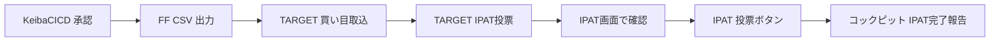

# TARGET IPAT 連動 運用SOP（草案）

> **ステータス**: 朝会後に運用者と突合して確定  
> **前提**: KeibaCICD は FF CSV まで。IPAT 最終投票は人手。

## 1. 公式注意事項（要約）

TARGET frontier JV の IPAT連動は、IPAT の**非公開仕様を独自解析**して利用している。

- 予告なく仕様変更があり、機能停止・誤入力の可能性がある  
  → [IPAT連動機能設定 FAQ](https://targetfaq.jra-van.jp/faq/detail?id=473)
- **投票確認前に買い目・金額を必ず目視確認**
- 複数レース一括時、一部失敗しても他は通るが、**成否が TARGET に返らない**場合がある  
  → [IPATGO FAQ](https://targetfaq.jra-van.jp/faq/detail?id=670)

## 2. 事前準備（開催週1回）

| # | 項目 | 確認 |
|---|------|------|
| 1 | TARGET「環境設定」→「IPAT連動機能設定」同意チェック | □ |
| 2 | INET-ID / 加入者番号 / P-ARS / 暗証番号 | □ |
| 3 | ブラウザから手動 IPAT ログイン・100円テスト投票 | □ |
| 4 | KeibaCICD `auto_purchase_config.json` mode=semi | □ |
| 5 | vb_refresh タスクスケジューラ稼働 | □ |

## 3. 当日フロー（1レースあたり）

| 手順 | 操作 | 担当 | コックピット状態 |
|------|------|------|------------------|
| 1 | コックピットでレース確認・承認 | 人間 | PENDING → FF |
| 2 | FF CSV が `C:\TFJV\TXT\` に出力されたことを確認 | 人間/自動 | FF_WRITTEN |
| 3 | TARGET「買い目取り込み」 | 人間 | TARGET取込□ |
| 4 | TARGET「IPAT投票」→ IPAT画面 | 人間 | AWAITING_IPAT |
| 5 | 買い目・金額・合計を目視確認 | 人間 | — |
| 6 | IPAT「投票」ボタン | 人間 | SUBMITTED |
| 7 | コックピット「IPAT投票完了」 | 人間 | SUBMITTED |

## 4. 一括操作時の追加手順

複数レースをまとめて IPAT 送信した場合:

1. エラー表示が出ても、**IPAT の「直前の投票結果」で実際の成否を確認**
2. コックピット上の「投票済」表示は誤っている可能性あり（TARGET FAQ）
3. 成功したレースのみ `confirm-ipat`。失敗レースは `FAILED` + 手動再投票

## 5. トラブルシューティング

| 症状 | 原因候補 | 対応 |
|------|----------|------|
| IPAT画面が開かない | セキュリティソフト・回線 | 手動ブラウザ IPAT。mode=manual |
| 金額が違う | オッズ変動・取込ミス | 投票前停止。ledger にメモ |
| 全レースエラー | IPAT仕様変更 | TARGET アップデート確認。SOP停止 |
| FF がない | Orchestrator失敗 | ExecuteTab から手動 FF |
| 締切切れ | 承認遅れ | 見送り。次レースへ |

## 6. KeibaCICD との役割分担

| システム | 責任範囲 |
|----------|----------|
| KeibaCICD | EV判断、金額、FF CSV、ledger、緊急停止 |
| TARGET | 買い目取込、IPAT入力補助 |
| 人間 | 最終投票、成否確認、例外判断 |
| IPAT/JRA | 契約成立、払戻 |

## 7. 記録

- コックピットの `confirm-ipat` は **「IPAT画面で確認した」宣言** であり、API成否ではない
- 税務・収支は `purchases` + `settle_purchases` を SoT とする
- 争議時は IPAT Web の投票履歴をマスターとする
