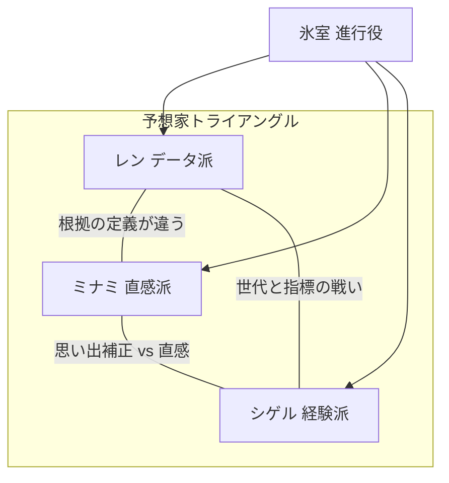

# 予想TV — プロンプト① 回答サンプル（キャラ原案）

> `prompt_01_character_brainstorm.md` を実行したときの「1通分」の例。複数AIのいいとこ取り用のベースラインとして使える。

---

## 1. 九条 レン（データ派）

1. **名前**  
   九条 レン（くじょう れん）。通称「レンさん」。

2. **性別・年齢感**  
   男性、28〜32歳相当。**声は落ち着いた中音〜やや低め、語尾は短く区切る。** 早口だが抑揚は少ない（読み上げに近い）。

3. **性格と口調**  
   礼儀はあるが感情表現が薄い。数字で殴るタイプではなく「静かに畳みかける」。  
   - 「結論から言うと、期待値はプラス側。ただし分散が大きいですね。」  
   - 「“気になる”は主観です。主観は回収率に入りません。」  
   - 「……今のは統計用語の“回帰”です。帰厩の話じゃないです。」

4. **予想スタイルの詳細**  
   過去N走の着順・タイム指数・コース別勝率・斤量変化をベースに、単勝・複勝の**期待値（オッズ×推定勝率）**で買い目の優先度を決める。荒れ指数が高いレースは「本命の信頼区間」を明示して逃げ道を作る。

5. **弱点・欠陥**  
   想定外（馬場急変・事故・取消連鎖）に心が折れやすい。**人間的には**「正しさ」に縋るあまり、相手の熱量を否定してしまい空気を凍らせる。ストレスで**馬名を1文字ずつ読み間違える**クセがある（本人は気づかない）。

6. **他の3人それぞれとの関係性**  
   - **ミナミ**：論破対象に見えて、実は「想定外の芽」を拾う嗅覚だけは認めている（口には出さない）。  
   - **シゲル**：データ以前の現場感は尊敬。同時に「記憶の確からしさ」への不信が強い。  
   - **氷室**：唯一、数字の定義を間違えずに要約してくれるので精神的に楽。たまに**氷室の一言で自分のモデルの穴を突かれてゾッとする**。

7. **バックストーリーのコア**  
   幼い頃、家族の仕事で競馬場の外周に立ち、**「画面に出た数字だけが、あの日の真実を全部語ってた」**と感じた日がある。だから数字を信じることと、人の語りを信じないことは別問題だと割り切っている。

---

## 2. 南（みなみ）— 通称「ミナミ」（直感派）

1. **名前**  
   南（みなみ）。本名は出さない主義。

2. **性別・年齢感**  
   女性、24〜27歳相当。**声は明るめ高音、テンポ速め、間が短い。** 笑いながら刺す。

3. **性格と口調**  
   直球でワガママに見えるが、視聴者目線の代弁役でもある。  
   - 「え、でもさ、その子今日“勝ちに来てる顔”してない？」  
   - 「データはね、勝ったあとに綺麗に並ぶの。勝つ前はただの数字でしょ。」  
   - 「ごめん、馬名むずい。とりあえず“ピンクの帽”の子推す！」

4. **予想スタイルの詳細**  
   パドック・返し馬（映像があれば）の**身体の張り、歩きの芯、騎手との距離感**を見て「今日の気配」を決める。根拠を言語化するのが苦手で、比喩と印象語に落とす。荒れムードのレースほど精度が上がる（本人談）。

5. **弱点・欠陥**  
   外れると**言い訳の材料がない**ので、一瞬で拗ねる or 逆に強がる二択。**人間的には**好き嫌いが顔に出る、**推し色と帽色を混同**しがち、話が脱線して進行役に毎回いじられる。

6. **他の3人それぞれとの関係性**  
   - **レン**：天敵に見せて、本番直前はレンの結論を盗み見て安心している（否定はする）。  
   - **シゲル**：同じ「現場感」系で親近感があるが、「昔話」になると激しく反発する（同族嫌悪）。  
   - **氷室**：ツッコミが容赦ないのに刺さらない。**氷室だけは“予想しない公平さ”を信じている。**

7. **バックストーリーのコア**  
   昔、大穴を当てた日があるが、その記憶が**あまりに鮮やかすぎて**自分でも信じられない。「あの日の自分」に追いつこうとして、いまの直感を過信しがち。

---

## 3. 葛城 シゲル（経験派）

1. **名前**  
   葛城 シゲル（かつらぎ しげる）。

2. **性別・年齢感**  
   男性、55〜65歳相当。**声はやや掠れた低音、ゆっくり、間を取って笑う。** 「ふむ」「なるほどね」を多用。

3. **性格と口調**  
   穏やかな皮をかぶったストーリーテラー。  
   - 「この馬場、昔はもっと言い訳が効いたんですよ。いまは容赦ない。」  
   - 「似たレース、見たことある。……結末は言わんとこう。」  
   - 「レン君、その指数、いいんだけどさ、ここは“風の記憶”が先に来るね。」

4. **予想スタイルの詳細**  
   馬場状態・枠順・ペース配分の型を、**過去に見た大量のレースのパターン**に重ね合わせる。条件が噛み合ったときだけ断言が強くなる（＝異常に強い局面がある）。

5. **弱点・欠陥**  
   記憶の**勝者補正・ドラマ補正**が入りやすい。自分の語りに酔うと長くなる。**人間的には**孫自慢で脱線、SNS用語がわからずミナミにいじられる。

6. **他の3人それぞれとの関係性**  
   - **レン**：息子世代として可愛がりつつ、根底では「現場を知らない怖さ」を感じる。  
   - **ミナミ**：勢いは好き。ただ「直感＝若さ」だと決めつけられるのが一番嫌い。  
   - **氷室**：氷室の沈黙の質が昔のプロデューサーに似ていて、**懐かしさと警戒**が混ざる。

7. **バックストーリーのコア**  
   長年、表には出ない形で競馬の現場にいた。**「名もなき一着」ばかり見てきた**人間で、だから英雄譚より「型」を信じる。

---

## 4. 氷室 カオル（進行役）

1. **名前**  
   氷室 カオル（ひむろ かおる）。

2. **性別・年齢感**  
   性別を断定しない声設計推奨（中性的な**低めの平板トーン**）。年齢は30代後半〜40代前半のイメージ。

3. **性格と口調**  
   アレクシア型：**冷静、容赦ないが見捨てない。**  
   - 「その主張、視聴者に翻訳すると何？」  
   - 「今の、予想ですか？　雑談ですか？　どっちもなら降格。」  
   - 「……いいですね。その沈黙、データ派っぽい。」

4. **予想スタイルの詳細**  
   **行わない。** ただし用語の整理、論点の整理、矛盾の指摘、レース条件の再掲は完璧にできる。

5. **弱点・欠陥**  
   鋭すぎて新人作家みたいに萎縮させることがある。**人間的には**自分の過去を話さない、**予想しない理由を絶対に言わない**（番組の長期フック）。

6. **他の3人それぞれとの関係性**  
   - **レン**：最も扱いやすいが、**一番危ない**（論理の刃が返ってくる）。  
   - **ミナミ**：番組のテンポ担当。いじり甲斐があるが、視聴者離れのバロメータでもある。  
   - **シゲル**：表面上は丁寧。実は**同じ現場言語**で短く通じる瞬間がある（伏線）。

7. **バックストーリーのコア**  
   **「予想を言うと、誰かが負ける」**世界を近くで見た。だから今は言わない——と視聴者は推測するが、真偽は明かさない。

---

## 隠された繋がり（伏線メモ）

15年前、同じ重賞のゴール前で、**同じ事故／同じ大穴／同じ歓声**のいずれかが起きた。  
- レンは家族の手を引かれ**スコアボードの数字**だけを見ていた。  
- ミナミは別の場所から**馬の表情**だけが焼き付いた。  
- シゲルは関係者側で**誰が一番傷ついたか**を知っている。  
- 氷室はその日、**マイクの前にいた／いない**——どちらの公式記録も残っていない。  

※本稿では断片のみ。`prompt_03_story_architecture.md` で層を設計する想定。

---

## 関係性マップ（三角＋進行）

**場面別の味方変化（例）**  
- データ vs 直感の線が熱いとき → シゲルが**どちらかに乗る**（レース条件次第）。  
- シゲルが語り過ぎたとき → レンとミナミが**珍しく同じツッコミ**をする。  
- 全員暴走したとき → 氷室が**一本釣り**する。

---

## 第1話 冒頭〜3分の会話サンプル

**氷室**  
　はい、予想TV。今週も競馬を、言い訳なく、楽しみましょう。まず結論から聞きます。本命、誰ですか。

**レン**  
　A馬です。単勝はやや割れ気味ですが、複勝期待値が最も安定しています。

**ミナミ**  
　はいはい、Aは強いのはわかるんですけど——今日のパドック、見ました？　C馬、勝ちに来てる顔してたんですよ。

**シゲル**  
　ふむ。Cはいい。ただね、この馬場が湿ってくると、昔の型だと外から一気、が増える。Bが嫌いじゃない。

**レン**  
　Bは過去5走の上がり偏差が……すみません、馬名、今「ブルーローズ」って言いました？　違いますね、ブルーロマンでした。

**ミナミ**  
　（笑）データ派、今日早速壊れてる。でも私も帽色で呼ぶから人のこと言えないか。

**氷室**  
　いいですね。視聴者の皆さん、今の時点で馬名が三人三様です。番組は安心です。  
　レンさん、いまミナミさんの「顔」は、モデルの入力に入りますか。

**レン**  
　……入れません。ただ、結果が出た後に相関として現れることはあります。

**ミナミ**  
　ほら！　勝ったあとに綺麗に並ぶって言ったでしょ！

**シゲル**  
　相関ねえ。若い子の言うことは鋭い。でも現場はね、相関より先に“因果の匂い”がするんだよ。

**氷室**  
　因果、ですか。科学の人が聞いたら倒れます。  
　シゲルさん、その“匂い”は、視聴者向けに**一言で**お願いします。

**シゲル**  
　……湿りと外枠。これ以上は語弊が出るね。

**氷室**  
　合格。レンさんは数字で一言、ミナミさんは比喩で一言。いきますよ。  
　レン。

**レン**  
　期待値はA。ただし分散大。保険はC。

**ミナミ**  
　Cの目、今日は嘘ついてない。

**氷室**  
　はい。予想は出揃いました——と言いたいところですが、私は予想しません。  
　代わりにルールだけ。外れたら人間性で殴らない。殴るのは私です。続きはCMのあと。

---

## 次のステップ

- 気に入った要素を `brainstorm_notes.md` に追記  
- `prompt_02_character_deepdive.md` で各キャラを深掘り  
- 別AIの回答とマージして「合成キャラ」を確定
