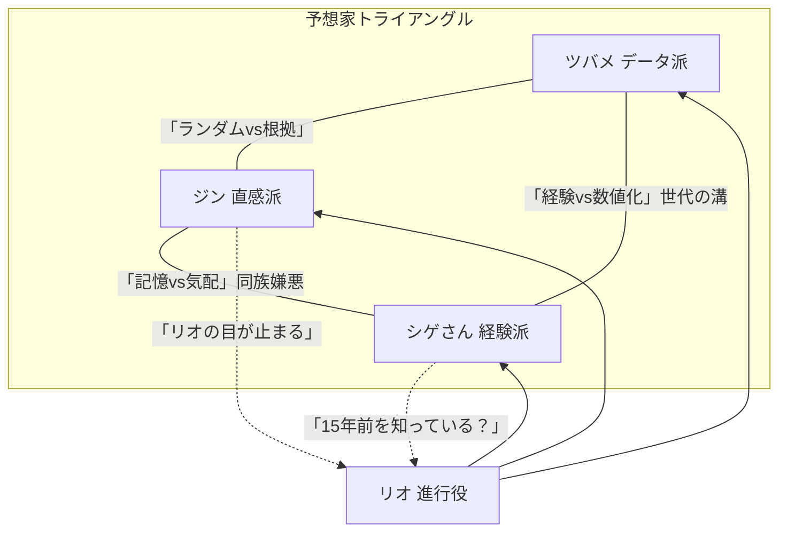

# 予想TV — プロンプト① 回答バリアントB（キャラ原案）

> `prompt_01_character_brainstorm.md` を実行した「別解」。サンプルAとのいいとこ取り比較用。  
> A との主な差異：キャラの年齢・性別構成を変更、人間的欠陥を強め、伏線の焦点を「氷室の正体」ではなく「あるレースの敗者」に置いた。

---

## 1. 白鳥 ツバメ（データ派）

1. **名前**  
   白鳥 ツバメ（しらとり つばめ）。番組内の呼ばれ方は「ツバメちゃん」か「データちゃん」（本人は後者を嫌う）。

2. **性別・年齢感**  
   女性、22〜25歳相当。**声は高くなく、フラット。喋り出しが早い。** 数値を言うとき一段トーンが下がる。

3. **性格と口調**  
   内弁慶。スタジオでは強気だが、ゲストが来ると急に標準語になって声が小さくなる。  
   - 「今週の期待値一覧です。見てください。全部赤字のオッズ帯ですよ、普通に。」  
   - 「……いえ、感情はモデルに入れません。入れたら私の出番がなくなります。」  
   - 「シゲさんがそのパターン語ると、その後だいたい外れてる。（小声）」

4. **予想スタイルの詳細**  
   競走馬のタイム指数・コース×距離×馬場状態のマトリクスを軸に、斤量補正と上がり3Fの一貫性スコアを独自計算。**出力は「買い」「様子見」「切り」の三択**で提示。悩んだ末に出した結論ほど当たらないというジンクスを自覚している。

5. **弱点・欠陥**  
   想定外（ペースが壊れる・騎手落馬）に心が折れる。**人間的には**「負けを認めるのが遅い」——外れた直後に「でもモデル上は正しかった」を15分言い続けた回がある。推しの馬が出走しているとき、**こっそりそのデータだけ省く**（シゲルには気づかれている）。

6. **他の3人それぞれとの関係性**  
   - **ジン**：直感を「ランダム生成」と呼ぶが、荒れたレースでジンが当てるたびにEXCELにそっとメモしている。  
   - **シゲル**：父くらいの年齢差で反発しつつ尊敬。シゲルの「型」を数値化しようと試みてすべて失敗。  
   - **リオ**：進行役なのにどこか採点されている気がして苦手。リオが静かなとき一番緊張する。

7. **バックストーリーのコア**  
   大学の卒業研究で「競馬のオッズに市場効率性はあるか」を書いた。指導教員から「面白いが誰にも読まれないな」と言われた日から、**読まれるデータを作る**ことに執着している。

---

## 2. ジン（直感派）

1. **名前**  
   ジン。本名を明かしたことがない。前番組ではカタカナ表記だったが今は平仮名でもいい、と本人は言っている。

2. **性別・年齢感**  
   男性、30〜35歳相当。**声は低くなく高くなく、独特のリズムがある。** 笑い声は短く、間に長いポーズを置く。

3. **性格と口調**  
   飄々としていて底が見えない。正しいことを言っているのか雑談なのかわからない話し方をする。  
   - 「今日、馬運車を降りたあの子、右耳だけ立ってたんですよね。あれ、強い。」  
   - 「理由はないです。でも理由がないのも、ひとつの理由でしょ。」  
   - 「ツバメちゃんのモデル、今週は惜しかったと思いますよ。でも惜しいは当たらないので。」

4. **予想スタイルの詳細**  
   パドック・馬体重・騎手の雰囲気・前週との気配の変化を「全部合わせたときの手触り」で判断。分析プロセスを言語化しようとすると詰まるので、最終的に比喩か短文になる。**大荒れ（10倍超）で精度が高い**ことが番組データで判明しているが、本人は信じていない。

5. **弱点・欠陥**  
   外れたとき、次回まで何も言わなくなる（実質サボり）。**人間的には**話の途中で急に別の話題を始める、約束の時間を体感で決める（10分遅刻が最短）、**馬の名前を性格で呼ぶ**（例：「ちゃんと走る子」「あのじゃじゃ馬」）。

6. **他の3人それぞれとの関係性**  
   - **ツバメ**：天才だと思っている（本人には言わない）。自分のいい加減さが彼女の足を引っ張っていないか、唯一気にしている。  
   - **シゲル**：同じ「現場で見てきた」系と思われているのが嫌。「俺は記憶で当てない、気配で当てる」。  
   - **リオ**：**リオが自分を見るときの目が、昔の関係者に似ている。** それが好きかどうかはわからない。

7. **バックストーリーのコア**  
   かつてパドック要員（馬を引く仕事）に近い立場で競馬に関わっていた——らしい。**「俺が当てるのは、馬が教えてくれるから」** という言葉を初回収録後に一度だけ言ったが、翌週には否定した。

---

## 3. 松永 信二（まつなが しんじ）— 通称「シゲさん」（経験派）

1. **名前**  
   松永 信二（まつなが しんじ）。スタジオでは全員から「シゲさん」。

2. **性別・年齢感**  
   男性、60〜67歳相当。**声は太く、ゆっくり、笑いが混じる。** 「ねえ」「そうでしょ」で段落を閉じる。

3. **性格と口調**  
   おじいちゃん的包容力があるが、核心は譲らない。自分の予想を「正解」ではなく「見立て」と呼ぶのが癖。  
   - 「その指数ね、間違ってはいないよ。でもね、間違ってないことと、当たることは別の話でね。」  
   - 「似てる。あのレースに似てる。……どのレースかって？　話すと長くなりますねえ。」  
   - 「ジン君の言う"手触り"、昔は俺もそれで生きてたよ。でも記録しないと忘れるんだよね、人間は。」

4. **予想スタイルの詳細**  
   条件（距離・コース・馬場・枠・ペース傾向）のセットを「型」として記憶し、今週のレースに最も近い過去例を3〜5個当てはめて推論する。**「このパターンは◯回見た」と言い始めたら当たる確率が上がる**が、パターンが「古すぎる」ときの見逃しがある。

5. **弱点・欠陥**  
   現代の速いペース戦を甘く見る（昔の感覚と誤差がある）。**人間的には**自分の話を止めるタイミングが掴めない、孫（本当にいる）の話で2分は潰せる、**スマホのフリック入力ができないのでメモを手書き**（チャットで文字化けする）。

6. **他の3人それぞれとの関係性**  
   - **ツバメ**：「私の時代にこの子がいたら、どれだけ助かったか」と思っている。嘘のない賞賛。ただし**自分の経験を数字に変換されると少しだけ傷つく。**  
   - **ジン**：「俺の若い頃に似ている」が、「俺より才能がある」とも思っている。だから遠慮なくいじれる。  
   - **リオ**：**15年前に会った気がする。** リオはそれを否定しない。否定しないことが一番気になる。

7. **バックストーリーのコア**  
   30年以上、競馬に関わる仕事を周辺でやってきた（馬主・調教関係者・メディアのいずれかは明示しない）。**「一番強かったあの馬が勝てなかった理由」** を知っている——と思っているが、自分の記憶が美化されているかもしれないと、深夜だけ疑う。

---

## 4. 久我 リオ（くが りお）— 進行役

1. **名前**  
   久我 リオ（くが りお）。スタッフからは「リオさん」。3人からは名前で呼ばれることが少なく、「進行」「MC」で済まされることが多い（本人は特に気にしていない）。

2. **性別・年齢感**  
   性別不問設計（中性的な**やや低め・クリアな発声**）。35〜45歳のイメージ。**声のトーンが一切ブレない**——これが逆に怖い。

3. **性格と口調**  
   感情を見せないが、冷淡ではない。**見捨てない・急かさない・でも逃がさない。**  
   - 「それ、面白いですね。続けてください——あと15秒で。」  
   - 「今のは予想ですか。確認です。」  
   - 「外れました。次。」（前言撤回や言い訳を3秒で切る）

4. **予想スタイルの詳細**  
   **行わない。** ただし、レース条件の再整理・3人の主張の矛盾点の指摘・視聴者向け用語の翻訳は番組最高精度で行う。  
   「この人、実は全員より詳しいのでは？」と感じさせるシーンを意図的に作る（制作側の指示か、本人の意思かは不明）。

5. **弱点・欠陥**  
   感情が読めないため、たまに**誰かを深く傷つけても本人が気づかない**。人間的には「笑わない」——笑うのは収録後だけとスタッフが言っている。**なぜ予想しないかを訊かれると、1〜2秒だけ間を置いてから話題を変える。** その「間」だけが唯一の感情の露出。

6. **他の3人それぞれとの関係性**  
   - **ツバメ**：一番「使いやすい」と思っている（悪意はない）。ツバメが本気で怒るとき、初めてリオが少し楽しそうに見える。  
   - **ジン**：**ジンを見るとき、リオの目が0.5秒だけ止まる。** 視聴者には誰も気づいていない。  
   - **シゲル**：シゲルの「昔話」の中に出てくる固有名詞を、全部メモしている。それを本人には言っていない。

7. **バックストーリーのコア**  
   **「予想を言うと、その馬が走れなくなる」** という経験を、比喩ではなく文字通りにした日がある——と、シゲルだけが知っている。リオ本人はその話をしたことを覚えていない（ふりをしている）。

---

## 隠された繋がり（伏線メモ）

15年前、G2の一戦。レース前夜、**一頭の馬が状態を崩した。**  
- ツバメの父親は、そのとき「◯◯の指数は問題ない」とどこかに書いた人間だった。  
- ジンは、その馬の様子を「おかしい」と感じていたが、誰にも言わなかった——言える立場になかったから。  
- シゲルは翌日のレースを「型通り」と見立てて、現場でその馬に声をかけた最後の人間かもしれない。  
- リオはその日、マイクを持っていた。何かを言った、あるいは言わなかった。記録が残っていない。

※全員「あのレース」のことを知っているが、視点が違う。同じ事実が4通りの記憶として断片的に語られていく。

---

## 関係性マップ（三角＋進行）

**場面別の味方変化（例）**  
- ツバメとジンが対立しているとき → シゲルが**どちらかの「根っこ」を支持する**（コロコロ変わる）。  
- シゲルが自分の話に入ったとき → ツバメとジンが**瞬間的に連帯**してツッコむ。  
- リオが「予想しない理由」に近づく話をしたとき → **全員が静かになる。**

---

## 第1話 冒頭〜3分の会話サンプル

**リオ**  
　今週も始まります、予想TV。レース前に言い訳を準備している方は、いまのうちにどうぞ。  
　では本命から。ツバメさん。

**ツバメ**  
　はい。今週はA馬一択です。複勝期待値が1.18で、過去同条件の類似馬では4戦3勝。切る理由がないです。

**ジン**  
　でも今朝のパドック映像、見ました？　A馬、なんか重そうじゃなかったですか。

**ツバメ**  
　馬体重プラス2キロです。誤差です。

**ジン**  
　いや数字じゃなくて、なんか……表情が、しんどそうだった。

**ツバメ**  
　表情。馬の。モデルに入れろと？

**シゲさん**  
　まあまあ。ジン君の言いたいことはわかるよ。馬にも「走りたくない日」はあるからね。  
　ただ、似たパターンは見てる。この距離、このコース。同じ条件で10年前に——

**リオ**  
　シゲさん、10年前は1分後で。

**シゲさん**  
　（苦笑）ですね。結論だけ言うと、BかCが面白い。差し脚の届く馬場だから。

**ジン**  
　Cは……なんか今日やる気ありそう。根拠ないですけど。

**ツバメ**  
　（小声）Cのデータも一応あります。複勝率38%。悪くはない。

**リオ**  
　ツバメさん、今「一応あります」と言いましたね。それ、隠してましたね。

**ツバメ**  
　（沈黙0.5秒）……出したくなかっただけです。

**リオ**  
　正直です。合格。  
　整理すると。データはA、直感はC、経験はBかC。3人で2馬に割れてます。  
　私は予想しません。ただ、割れてるレースは荒れやすいという統計だけ申し上げます。

**シゲさん**  
　……それ、予想じゃないですか。

**リオ**  
　統計です。続きはCMのあとで。

---

## 次のステップ（バリアントB視点）

- A（レン・ミナミ・シゲル・氷室）と比較して採用したい要素をリストアップ  
- 採用候補：ジンの「馬を性格で呼ぶ」弱点、リオの「目が0.5秒止まる」演出、伏線の「1頭の馬」軸  
- `brainstorm_notes.md` に「バリアントB採用メモ」として追記 → プロンプト②へ
