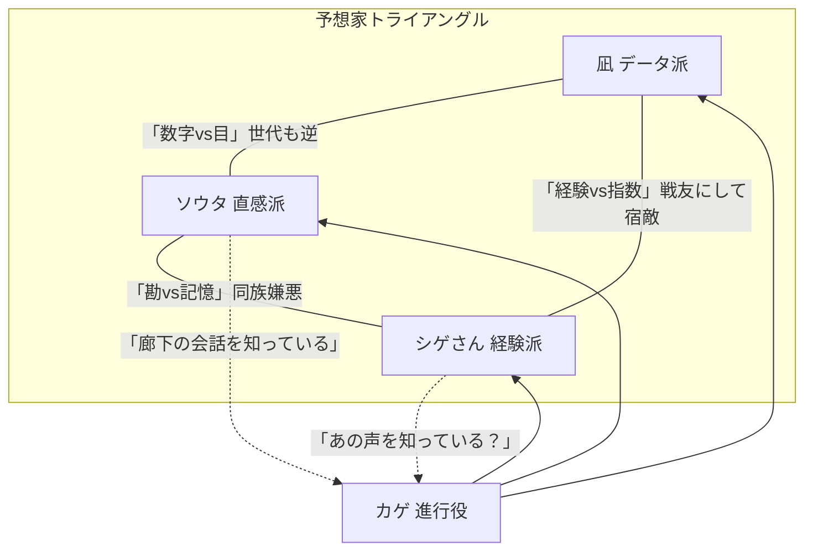

# 予想TV — プロンプト① 回答バリアントC（キャラ原案）

> `prompt_01_character_brainstorm.md` を実行した「第3案」。A・Bと性別構成・世代・口調をずらし、三角構造の力学も変えた。
> A・Bとの主な差異：データ派を年長女性、直感派を最年少男性に配置。進行役の謎を「声」に集約。

---

## 1. 霧島 凪（きりしま なぎ）— データ派

1. **名前**  
   霧島 凪。番組内では「凪さん」。視聴者からは「凪姐」と呼ばれている。

2. **性別・年齢感**  
   女性、38〜44歳相当。**声は低く、速度は中程度、語尾がすっと消える。** 数字を読むときだけ声量が上がる。

3. **性格と口調**  
   落ち着きがあるが「静かに怒る」タイプ。相手を否定せず、数字を並べて自壊させる。  
   - 「ソウタくんの"勘"、先週も聞きましたね。先週の回収率、覚えてますか？」  
   - 「期待値はね、感情より先に答えを出すの。だから嫌われるんだけど。」  
   - 「あら。シゲさんの"型"、今回はデータと一致してます。珍しいわね——褒めてるのよ。」

4. **予想スタイルの詳細**  
   独自の複合指数（タイム偏差＋コース適性＋枠順バイアス＋騎手リーディング補正）をExcelで管理。**買い目を「S・A・B・C」の4段階**に分類し、Sランクが出たときだけ強気な単勝を打つ。オッズの歪みを見つけるのが最も得意で、「この馬、過小評価されてる」が口癖。

5. **弱点・欠陥**  
   モデルが想定していない事態（出走取消・落馬・大逃げ崩壊）に対応できず、**レース後にExcelを閉じて30分黙る**。人間的には完璧主義で、自分の予想が外れると他人の的中を素直に祝えない（数秒遅れて「……おめでとう」）。**紅茶の銘柄にこだわりすぎて収録前に機嫌が変わる。**

6. **他の3人それぞれとの関係性**  
   - **ソウタ**：息子の年齢に近い。イラつくが、荒れたレースで当てると「……悔しいけど面白い子ね」と認める。ソウタの直感を密かにモデルの変数に組み込もうとして失敗した過去がある。  
   - **シゲさん**：同世代の戦友。データと経験が噛み合ったときだけ「最強コンビ」になるが、噛み合わないと互いに「あなたの時代は終わった」「あんたの数字は冷たい」の応酬になる。  
   - **カゲ**：カゲの整理能力を高く評価。ただ、**カゲが自分のモデルの穴を淡々と指摘してくる瞬間が一番怖い。**

7. **バックストーリーのコア**  
   元・証券アナリスト。数字で人の資産を動かす世界にいた。**「数字は嘘をつかない。でも数字を選ぶ人間は嘘をつく」**——その自覚があるから、自分のモデルを疑い続ける。

---

## 2. 朝比奈 ソウタ（あさひな そうた）— 直感派

1. **名前**  
   朝比奈 ソウタ。「ソウタ」「ソウちゃん」で呼ばれる。

2. **性別・年齢感**  
   男性、20〜23歳相当。**声は明るい中音、テンポが不規則、考えながら喋る。** 語尾が上がりがちで、断定を避ける口調。

3. **性格と口調**  
   人懐っこいが芯が強い。間違っていても「でも俺はそう思った」を曲げない。  
   - 「いや、あの馬、なんかこう……歩き方に"やってやるぞ感"があったんすよ。」  
   - 「凪さんのデータ、すごいと思います。思いますけど、それ見ちゃうと俺の目が曇るんで。」  
   - 「シゲさん、その話3回目っす。でも3回目が一番面白いっすね。」

4. **予想スタイルの詳細**  
   パドックの馬体の張り、踏み込みの深さ、尾の振り方、**騎手が馬に触れるタイミング**を見る。映像がないときはSNSのパドック写真を拡大して目の輝きを確認する（本人曰く「目が死んでる馬は走らない」）。レース前に推し馬を1頭決めたら変えない。

5. **弱点・欠陥**  
   外れると黙るのではなく**逆に饒舌になる**（言い訳ではなく「次こそ」の話を始める）。人間的には**時間にルーズ**（収録5分前到着が通常）、**馬の名前を覚えるのが苦手で帽色や枠番で呼ぶ**（「3枠の子」「赤帽のやつ」）、シゲさんの昔話に本気で感動して泣きそうになる（照れて話をそらす）。

6. **他の3人それぞれとの関係性**  
   - **凪**：怖い。でも凪が自分の直感を否定するとき、いつも少しだけ迷っている気がする。その「迷い」がソウタにとって最大の褒め言葉。  
   - **シゲさん**：おじいちゃんポジション。経験と直感は紙一重だと思っていて、シゲさんの「型」が自分の「勘」と一致する瞬間に震える。ただし「俺のは記憶じゃない、今この瞬間の話だ」というプライドがある。  
   - **カゲ**：一番リラックスできる相手。カゲに「面白い」と言われるとその週だけ的中率が上がる（オカルト）。**カゲが予想しない理由を一番知りたがっている。**

7. **バックストーリーのコア**  
   子どもの頃、祖父に連れられた競馬場で**ゴール前の地鳴り**を聴いた。あの振動と一緒に走ってきた馬の顔が忘れられない。「数字なんか見てなかった。でもあの馬が勝つってわかった」——原体験がすべての根拠。

---

## 3. 梶原 茂行（かじわら しげゆき）— 通称「シゲさん」（経験派）

1. **名前**  
   梶原 茂行。全員から「シゲさん」。

2. **性別・年齢感**  
   男性、58〜66歳相当。**声は太くて温かい、テンポはゆっくり、笑い声が長い。** 「だからさ」「ね」で文を閉じる。

3. **性格と口調**  
   包容力の塊だが、核心には触らせない。結論を最後まで出さずに語り、相手が自分で気づくのを待つ。  
   - 「この馬場でこの枠、3年前にも見た。そのとき何が起きたか……話していい？」  
   - 「凪さんのデータはいつも正しいよ。正しいんだけどね、"正しいだけ"のときがあるんだよ。」  
   - 「ソウちゃん、いいよ、泣くな泣くな。馬は泣いてる人間のほうが好きだからね。」

4. **予想スタイルの詳細**  
   距離・コース・馬場状態・展開（ペース）・季節を組み合わせた**「型」のライブラリ**を頭の中に持っている。条件が合致した型が見つかると「あ、これ知ってる」モードに入り、確信を持って推奨馬を出す。型がない場面では「今日はわからん」と正直に言う（その正直さが逆に信頼になっている）。

5. **弱点・欠陥**  
   記憶の**勝者バイアス**——外れたレースを忘れ、当たったレースだけ鮮明に語る。人間的には**話が長い**（カゲに「1分で」と言われても3分かかる）、**スマホの通知音を消し忘れて収録中に鳴る**（着信音が演歌）、**孫の運動会の話で完全に脱線**する。

6. **他の3人それぞれとの関係性**  
   - **凪**：同世代の数少ない仲間。二人だけのとき、互いに「昔のあの人」の話をする（番組では一度も出ていない人物）。凪のデータが自分の型と一致したとき「やっぱりね」と嬉しそうに笑う。  
   - **ソウタ**：孫みたいで可愛い。ソウタの直感が当たると「俺の若い頃もこうだった」と言うが、本当は自分にはなかった才能だと気づいている。  
   - **カゲ**：**カゲの声を、15年前のある番組で聴いたことがある気がする。** 確認したことはない。カゲが沈黙で場を制する技術は、昔の名プロデューサーと同じだと感じている。

7. **バックストーリーのコア**  
   元・地方競馬の裏方（厩務か場内運営か、詳細は語らない）。**「勝てなかった馬のほうが多い。でも走った馬は全部覚えてる」**——この言葉の重みが、経験派の根幹にある。

---

## 4. カゲ（進行役）

1. **名前**  
   カゲ。本名不明。名前の由来を訊かれると「影が薄いから」と答えるが、存在感は番組で一番強い。

2. **性別・年齢感**  
   性別を特定しない設計（**中性的な、ガラスのように透明な中低音**）。30代後半〜40代前半。**声にまったく感情の波がない**——だからこそ、ごく稀に声が揺れる瞬間が事件になる。

3. **性格と口調**  
   必要なことだけ言う。無駄が嫌い。だが冷酷ではなく、**言葉を削ることで相手の言葉を引き出す**技術。  
   - 「続けてください。ただし結論を先に。」  
   - 「今の発言、予想ですか、願望ですか。」  
   - 「……面白い。」（この一言を出すハードルが異常に高いことを全員が知っている）

4. **予想スタイルの詳細**  
   **行わない。** レース条件の要約、3人の主張の構造化、矛盾の可視化、視聴者向けの翻訳を担う。競馬用語の正確な使い分けは3人の誰より上。ときどき出す「ちなみに」の一言が、3人の予想を根底から揺さぶる。

5. **弱点・欠陥**  
   鋭さが**相手の傷に触れる**ことがある（本人は気づいているが止められない）。人間的には**自分のことを一切語らない**、**笑顔を見た人間がスタッフにもいない**（収録後に一人で笑っているという噂だけがある）、予想しない理由を訊かれると**0.8秒の沈黙のあと別の話題に移る**。

6. **他の3人それぞれとの関係性**  
   - **凪**：最も信頼している出演者。凪のモデルの前提条件を正確に要約できるのはカゲだけ。凪もそれを知っていて、カゲにだけ本音を漏らす瞬間がある。  
   - **ソウタ**：テンポの壊し屋だが、番組の空気を変えるのに不可欠。**ソウタが本気で悔しがっているとき、カゲは少しだけ長く待つ**——それがカゲなりの優しさ。  
   - **シゲさん**：シゲさんの昔話を「短くしてください」と毎回切るが、**収録後にシゲさんの話の続きを廊下で聞いている**ことをソウタだけが知っている。

7. **バックストーリーのコア**  
   **「声の仕事」を以前やっていた**——実況か、解説か、アナウンスか。ある日を境にやめた。やめた理由は語らない。シゲさんが「15年前に聴いたことがある声」と感じているのは偶然ではないかもしれない。

---

## 隠された繋がり（伏線メモ）

15年前、ある秋のG2。**本命馬が最終コーナーで故障し、レースが一変した。**  
- 凪はそのレースの単勝を「買い」と判断したデータを持っていた。**数字は正しかった。でも馬は走れなかった。** 以来「数字の正しさ」と「結果」の間にある溝を埋められないでいる。  
- ソウタはまだ子どもだった。祖父と一緒にゴール前にいた。**故障した馬の目を見た。** あの目が「走りたかった目」だったことを忘れていない。直感派の原点はここにある。  
- シゲさんは裏方としてそのレースに関わっていた。**故障馬の朝の状態を「型通り」と判断した自分**を、30年経った今でも許していない。  
- カゲはその日、**実況席にいたかもしれない。** もしいたなら、あの瞬間に何を言ったのか——あるいは言えなかったのか。

※4人の記憶は同じレースの同じ瞬間を指しているが、視点が完全に異なる。物語が進むにつれ、断片が合わさっていく。

---

## 関係性マップ（三角＋進行）

**場面別の味方変化（例）**  
- 凪 vs ソウタが白熱 → シゲさんが**どちらの味方にもなれる**（条件次第で立場が変わる）。  
- シゲさんが昔話モード → 凪とソウタが**世代を超えて連帯ツッコミ**。  
- カゲが「ちなみに」と切り出したとき → **全員が一瞬黙る。** その一言で予想が覆ることがあるから。  
- ソウタが本気で外して落ち込んだとき → 凪が**データで慰める**（「あなたの直感、過去3回中2回は正解だったわよ」）。

---

## 第1話 冒頭〜3分の会話サンプル

**カゲ**  
　予想TV、始めます。今週も予想家3人が集まりました。外れても責任は取りません。取るのは視聴者です。  
　では凪さんから。

**凪**  
　今週の本命はA馬。複合指数でSランク。過去5走の上がりが安定していて、この距離のコース適性も高い。  
　迷う要素はありません。

**ソウタ**  
　え、でも凪さん、A馬って今朝のパドックで首が硬かったんすよ。なんかこう、いつもと違うっていうか——

**凪**  
　首の硬さは指数に入ってないわね。入れる方法があったら教えて。

**ソウタ**  
　いや、だから、数字じゃなくて——

**シゲさん**  
　まあまあ。ソウちゃんの言いたいことはわかるよ。馬にもね、「今日じゃない日」ってあるんだよ。  
　この馬場、この枠順、3年前にも同じ条件があってね——

**カゲ**  
　シゲさん。3年前は後半で。今は今週の話を。

**シゲさん**  
　（笑）はいはい。じゃあ結論だけ。B馬。差し脚が活きる馬場だから。

**ソウタ**  
　俺はC馬っす。今日、目が違う。やる気の目してた。

**凪**  
　……C馬の複勝率は34%。低くはないけど、S評価には遠い。

**カゲ**  
　凪さん、今のトーン、少し迷ってませんか。

**凪**  
　……迷ってません。データは迷いません。

**カゲ**  
　データは迷わない。人は迷う。  
　整理します。データはA、直感はC、経験はB。見事に割れました。

**ソウタ**  
　カゲさんはどう思います？

**カゲ**  
　私は予想しません。

**ソウタ**  
　毎回それっすね。いつか言ってくださいよ。

**カゲ**  
　……。  
　CMです。

**シゲさん**  
　（小声）……今の間、長かったね。

---

## A・Bとの差異まとめ（比較用）

| 要素 | A（レン・ミナミ・シゲル・氷室） | B（ツバメ・ジン・シゲさん・リオ） | **C（凪・ソウタ・シゲさん・カゲ）** |
|------|------|------|------|
| データ派 | 若い男性（冷静） | 若い女性（内弁慶） | **年長女性（完璧主義）** |
| 直感派 | 若い女性（直球） | 中年男性（飄々） | **最年少男性（素直・芯強い）** |
| 経験派 | 年配男性（ストーリーテラー） | 年配男性（包容力） | 年配男性（包容力＋核心を隠す） |
| 進行役 | 中性的（鋭い） | 中性的（感情を見せない） | 中性的（**声の過去が伏線**） |
| 伏線の軸 | 同じ日の記憶 | 1頭の馬の事故 | **故障事故＋声の仕事** |
| 三角の力学 | 均等な対立 | ツバメ中心に回る | **凪とシゲさんが戦友、ソウタが風穴** |

---

## 次のステップ

- A・B・Cの3案から「このキャラのこの要素」を抜き出して `brainstorm_notes.md` に追記
- 合成キャラを仮決定 → `prompt_02_character_deepdive.md` で深掘り
- 特に検討したい軸：データ派の性別・年齢、直感派の口調、進行役の伏線設計
