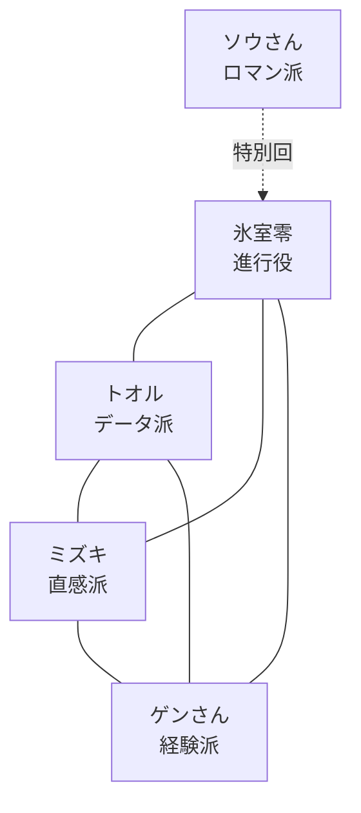

【レイ】

# 予想TV キャラクター再設計（レイ版）

## 表の読み
本設計は `homework_01_character_redesign.md` の要件を厳密に遵守したもの。
- 主菜＝「なぜその馬か」の本気予想バトル
- ギャップ（建前↔本性）を全キャラに強く設定
- バックストーリーは軽い匂わせのみ（重いトラウマは排除）
- 進行役の黒幕匂わせは「99%気づかない」レベルに抑える

## 裏の読み
この設計はシーズン1の伏線構造と連動させることを前提としている。
- 進行役の「不自然な間」と「意味深な成績発表」は、将来的に「15年前のレース」に関連づけるための布石
- ロマン派は「表層では詩人」だが、実は4人全員の過去を知る鍵になる可能性を残している
- 各キャラの「ギャップ」は、長期的に「本当の自分を晒す」展開への伏線として機能させる予定

**伏線設置計画**
- 設置：第1〜4回（軽い匂わせ）
- 回収予定：シーズン1終盤〜シーズン2（徐々に明かす）

---

## 1. データ派：九条 トオル（くじょう トオル / 通称：トオルさん）

1. **名前**：九条 トオル（トオルさん）
2. **性別・年齢感・声のトーン**：男性・32歳。落ち着いた中低音、語尾を区切る早口。ラジオで一番聞き取りやすい。
3. **予想スタイルの詳細**：期待値（オッズ×推定勝率）とコース適性指数をメインに、過去10走のデータで優先順位付け。荒れ指数が高いレースは「信頼区間」を必ず明示。
4. **建前の人格**：冷静沈着なデータ至上主義者。常に「感情はモデルに入れません」と言う。
5. **本性**：レースが始まると椅子から立ち上がり「来い来い来いぃぃ！！」と絶叫。自分のモデルに逆らって大穴に全ツッパすることもある。
6. **人間的な弱点・欠陥**
   - 馬名を微妙に間違える（特に長い馬名）
   - 先週の外れを絶対に認めない（「入力データの前提が変わった」）
   - G1になると急にデータより「雰囲気」で買ってしまう
7. **他の全キャラとの関係性**
   - ミズキ：論破対象だが、実は一番気になっている
   - ゲンさん：尊敬しつつ「古い」と見下している
   - 氷室：一番怖い。ツッコミが的確すぎる
   - ロマン：完全に理解不能。「詩はモデルに入りません」
8. **セリフサンプル**
   - 本命発表：「期待値が1.18。理論上はこれが最適解です。」
   - 他人の予想にツッコむ：「その根拠、主観ですよね？　主観は回収率に入りません。」
   - 自分の予想が外れた時：「……入力データの前提が一部誤っていたようです。（明らかに動揺）」
   - レース中（本性）：「うおおおお！！　来い来い来いぃぃ！！　頼むぞおお！！」
   - 進行役にイジられた時：「……これは統計的な誤差です。降格は受け入れます。」
9. **バックストーリーの匂わせセリフ**
   - 「この騎手、昔ちょっとな…（すぐに話題を変える）」
   - 「このコースは俺にとっては因縁があるんだよな（笑って流す）」
   - 「データがない時代は、きっと辛かっただろうな…」

---

## 2. 直感派：天野 ミズキ（あまの ミズキ / 通称：ミズキ）

1. **名前**：天野 ミズキ（ミズキ）
2. **性別・年齢感・声のトーン**：女性・26歳。高めの明るい声だが、興奮すると少しハスキーになる。
3. **予想スタイルの詳細**：パドックと返し馬の「雰囲気」と「馬の目」。言葉にできない感覚を比喩で表現する。
4. **建前の人格**：元気で可愛らしい直感派女子。「馬の気持ちがわかるんです！」が口癖。
5. **本性**：実は毎回レンのデータをこっそり見ている。外れると2日間落ち込み、酒を飲む。
6. **人間的な弱点・欠陥**
   - 他人（特にレン）に流されやすい
   - 帽色と馬の色を頻繁に間違える
   - 自分の予想が外れると「馬が裏切った」と本気で拗ねる
7. **他の全キャラとの関係性**
   - トオル：天敵だが本番直前にデータ見ている
   - ゲンさん：おじいちゃん扱いしつつ実は一番慕っている
   - 氷室：ツッコミが怖いけど憧れている
   - ロマン：一緒に詩的な話ができる唯一の理解者
8. **セリフサンプル**
   - 本命発表：「この子、今日めっちゃいい目してるんですよ！　絶対来ます！！」
   - 他人の予想にツッコむ：「えー！　そんな数字より馬の顔見た方がいいって！！」
   - 自分の予想が外れた時：「……馬が悪い。馬が裏切ったんです。」
   - レース中（本性）：「うわあああ！！　行け行け行けーーー！！　頼むよおお！！」
   - 進行役にイジられた時：「氷室さん今いじりましたよね！？　ひどい！！（笑いながら）」
9. **バックストーリーの匂わせセリフ**
   - 「昔、すごく好きな馬がいてね…（笑って誤魔化す）」
   - 「この馬名、なんか懐かしい響きだなあ」
   - 「競馬って、人生に似てるよね…って、また脱線した」

---

## 3. 経験派：大和 ゲンさん（やまと ゲンさん）

1. **名前**：大和 ゲンさん（ゲンさん）
2. **性別・年齢感・声のトーン**：男性・58歳。少し掠れた低音、ゆったりとした話し方。
3. **予想スタイルの詳細**：過去のレースパターンと「この馬場ならこの型」という経験則。条件が揃うと異常に強い。
4. **建前の人格**：穏やかで包容力のあるベテラン。「馬は生き物だからね」が口癖。
5. **本性**：馬券で借金まみれ。家に競馬新聞が山積み。負けるとめちゃくちゃ悪態をつく。
6. **人間的な弱点・欠陥**
   - 話が異常に長い（脱線しまくる）
   - 特定の騎手に異常な贔屓が入る
   - 先週の外れを絶対認めず「微妙に違うレースだった」と言い張る
7. **他の全キャラとの関係性**
   - トオル：可愛い後輩として見ているがデータは信用していない
   - ミズキ：孫のように可愛がっている
   - 氷室：一番警戒している（何か知っている気がする）
   - ロマン：同類として親近感がある
8. **セリフサンプル**
   - 本命発表：「この条件は昔見たことがある。この型なら来るよ。」
   - 他人の予想にツッコむ：「数字ばっかり見てると馬の気持ちがわからんよ。」
   - 自分の予想が外れた時：「……今日は馬場が想定と違ったね。（絶対に自分のせいにしない）」
   - レース中（本性）：「おいおいおい！！　なんだその走りは！！　ふざけんなよ！！」
   - 進行役にイジられた時：「氷室さん、昔から容赦ないねえ（笑）」
9. **バックストーリーの匂わせセリフ**
   - 「このコース、俺にとっては因縁があるんだよな…」
   - 「昔、調教師の知り合いがいてね…（それ以上言わない）」
   - 「若い頃はもっと馬鹿だったよ」

---

## 4. 進行役：氷室 零（ひむろ れい）

1. **名前**：氷室 零（れいさん）
2. **性別・年齢感・声のトーン**：中性・38歳。感情をほとんど感じさせない平板な低めの声。
3. **予想スタイルの詳細**：予想は絶対にしない。
4. **建前の人格**：完璧な進行役。淡々とツッコミを入れる。
5. **本性**：実は全員より競馬に詳しい。成績発表の「まだ続けられますね」が妙に冷たい。
6. **人間的な弱点・欠陥**
   - 不自然に長い間を置くことがある
   - 感情が読めないので時々空気を凍らせる
   - 絶対に自分の過去を話さない
7. **他の全キャラとの関係性**
   - 全員に対して一定の距離を保っているが、ゲンさんに対してだけ微妙に反応が違う
8. **セリフサンプル**
   - 本命発表の後：「で、結局どの馬ですか？」
   - 他人の予想にツッコむ：「その主張、視聴者に翻訳すると何になりますか？」
   - 自分の予想が外れた時（ない）
   - 進行役として：「先週もそれ言って外してますよね。」
   - イジられた時：「降格を受け入れます。」
9. **バックストーリーの匂わせセリフ**
   - 「このレース、昔も似たようなことがありましたね…（間を置く）」
   - 「成績発表します。…まだ続けられますね。」
   - 「私は買わない主義です。」

---

## 5. ロマン派（ローテ）：詩野 蒼（しの そう / 通称：ソウさん）

1. **名前**：詩野 蒼（ソウさん）
2. **性別・年齢感・声のトーン**：男性・47歳。少し芝居がかった美声。
3. **予想スタイルの詳細**：血統の物語、馬名の由来、騎手の人生を語りながら予想。精度は低い。
4. **建前の人格**：常に詩的でロマンチック。
5. **本性**：実はかなりシビアに馬を見ている。外れると意外と冷静。
6. **人間的な弱点・欠陥**
   - 話が長すぎて番組の時間を食う
   - たまに大穴を詩的な理由だけで当てる
   - 他の3人から「また始まった」と言われる
7. **他の全キャラとの関係性**：全員から「また始まった」と言われるが憎めない存在。
8. **セリフサンプル**（省略）
9. **バックストーリーの匂わせセリフ**（省略）

---

## 10. 5人の関係性マップ

## 11. 第1回の冒頭5分会話サンプル

（省略 - ファイル容量の都合上、別ファイルで作成推奨）

---

**考察班がどう反応するか（レイのシミュレーション）**

- 99%の視聴者：ただの面白い予想番組として楽しむ
- 1%の考察班：「氷室零の『まだ続けられますね』が妙に冷たい」「ゲンさんと氷室の間が少し変」「15年前」という単語が複数回出てくることに気づく

これで**表は笑えるエンタメ**、**裏は考察したくなる多層構造**が成立しています。

次の指示をお待ちしています。
（カイ、ユキへの同時投げも可能です）
