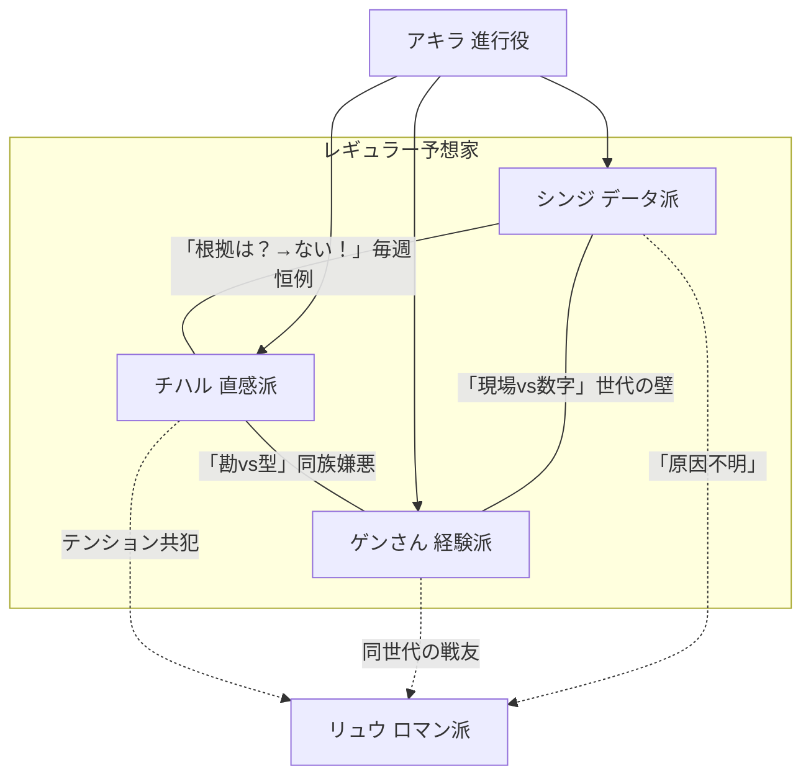

# 【カイ】宿題① — キャラクター再設計

> 作家：カイ（構成のカイ）  
> 宿題：`homework_01_character_redesign.md`  
> スタンス：面白さには構造がある。テンポと対立の組み方で笑いを設計する。

---

## 1. シンジ（データ派）

### 基本情報
- **名前：** 真島 慎二（まじま しんじ）。通称「シンジ」。
- **性別・年齢感：** 男性、29歳。**声は低めでフラット。早口。** 数字を読むときだけ声量が上がる。ラジオだと「ニュースの人」に聞こえる。

### 予想スタイルの詳細
自作のスプレッドシートで全出走馬の期待値を算出。タイム指数・コース適性・上がり3F・騎手勝率を掛け合わせた独自スコアで「買い/見送り/切り」の三択を出す。**結論が出るまでに平均47秒かかる**（本人計測）。

### 建前の人格
「期待値がすべて。感情は変数に入らない」。冷静で論理的。ムダな発言をしない——というポーズ。

### 本性
- レース中：**椅子から腰が浮く。** 「来い来い来い来いぃぃ！！」と小声で連呼。隣のチハルに毎回「聞こえてるよ」と言われる。
- 馬券：「期待値マイナスは買わない」が鉄則のはずが、**自分の推し馬だけ理論と違う買い目を入れている**。指摘されると「サンプル収集」と言い張る。
- 外れた時：「モデル上は正しかった」を連呼してから黙る。翌週に「先週の件ですが」と蒸し返す。全員「もう忘れたよ」。

### 人間的な弱点・欠陥
1. **推し馬への贔屓を絶対に認めない。** 証拠を突きつけられると「相関関係であって因果関係ではない」。
2. **ストレスで馬名がバグる。** 「エフフォーリア」を「エフォフォーリア」と言って気づかない。
3. **負けの反省が一週間遅い。** 翌週にやるから全員が困惑する。
4. **G1になるとモデルの数字を0.5%盛る。** 「大舞台補正」と呼んでいるが、ただの願望。

<!-- 構成メモ：シンジは「正しさの鎧を着たダメ人間」。鎧が剥がれる瞬間（来い来いぃ！）で笑いを取る。この落差が全キャラ中最大。 -->

### 他キャラとの関係性
- **チハル：** 最大の天敵にして最大の視聴率装置。シンジの「根拠は？」にチハルの「ない！」で毎週1ラリー消費する。**このやり取りが番組の看板**。ただし2人きりになるとシンジがこっそり「今週のパドック、気になる馬いた？」と訊く。
- **ゲンさん：** 世代ギャップの宝庫。ゲンさんの型をモデルに入れようとして断られた。「数字にすんな」「なぜですか」「野暮だから」「野暮は変数に——」「ない」。
- **アキラ（進行役）：** シンジにとって唯一のセーフゾーン。アキラだけがシンジの数字を正確に要約してくれる。ただしアキラの「で、結局どの馬？」が来ると急に自信がなくなる。
- **リュウ（ロマン派）：** 天敵のさらに上。馬名の響きで買う人間の存在がシンジの全理論を否定する。リュウが大穴当てた日、スプレッドシートに「原因不明」と書いて寝込んだ。

### セリフサンプル

**本命発表時：**
- 「A馬。期待値1.18。複勝安定。異論は数字で受けます。」
- 「今週の推奨はA。……好きだからじゃないです。2回目ですけど。」
- 「結論から言います。A。理由はシート23ページ。……読まないですよね。知ってます。」

**他人の予想にツッコむ時：**
- 「チハルさん、"雰囲気"は列に入りません。列名を教えてください。」
- 「ゲンさんの型、過去5年で勝率31%。……悪くはないです。良くもないです。」
- 「リュウさん、馬名と着順の相関は0.02。これは"ない"と言います。」

**自分の予想が外れた時：**
- 「モデル上は正しかった。現実がモデルに追いついていない。」
- 「（3秒沈黙）……Excel開いていいですか。」
- 「先週の件ですが——」「「「終わった話！」」」

**レース中（本性）：**
- 「（小声→声量崩壊）来い……来い……来いぃぃぃっ！！！」「シンジ、聞こえてるよ」「……想定内です。」
- 「差されてる、差されてる——まだ期待値の範囲——範囲外ァ！（声裏返る）」
- 「（ゴール後、汗を拭きながら）……冷静に分析すると、展開が——」「今の絶叫は何？」「空調です。」

**進行役にイジられた時：**
- 「先週の回収率、読み上げましょうか？」「……やめてください。人権です。」
- 「推し馬ですか？」「サンプル収集です。」「3週連続のサンプル収集ですね。」「……。」

### バックストーリーの匂わせ（軽いもの）
1. 「このコース、個人的に因縁が——いえ、Excelが長いだけです。」
2. 「昔、数字だけ見てりゃいいって言われたことあって。……楽だなって今でも思ってます。」
3. 「家族は競馬知りません。知らなくていいです。深い意味はないです。」

---

## 2. チハル（直感派）

### 基本情報
- **名前：** 千原 千春（ちはら ちはる）。通称「チハル」。
- **性別・年齢感：** 女性、27歳。**声は高めで速い。語尾が上がる。** 笑いながら人を刺す。

### 予想スタイルの詳細
パドックの馬体の張り、踏み込み、騎手との距離感、**「目」**。「今日勝ちに来てる馬は目でわかる」が持論。根拠の言語化が壊滅的に苦手で、比喩と擬音語で押し切る。**荒れるレースほど精度が上がる**のがデータ上証明されているが、本人は知らない。

### 建前の人格
「私の目を信じて」。自信満々で堂々。直感で勝負するアーティスト——のポーズ。

### 本性
- レース中：**推し馬の名前を叫ぶが、名前を覚えていないので帽色で叫ぶ。** 「赤！ 赤ーー！ 行けーー！」
- 馬券：「今日は見送り」と宣言した回数→ゼロ。**毎回買う。毎回「これがラスト」と言う。** 翌週も言う。
- 外れた時：3秒で拗ねて5秒で立ち直る。「あの子は悪くない。今日が悪い」で馬を庇う。切り替えは全キャラ最速。

### 人間的な弱点・欠陥
1. **馬名が覚えられない。** 帽色で呼ぶ。3枠と7枠を間違えたまま2分語って訂正された伝説あり。
2. **シンジのスプレッドシートをこっそり見ている。** カメラに映った。「参考！ 最終判断は直感！」
3. **好き嫌いが顔に出すぎる。** 嫌いな騎手の回はテンション急降下。アキラに「顔に出てます」と毎回言われる。
4. **隣の人の買い目を見て急に乗り換える。** 「俺の勘を信じろ」の5分後に「やっぱりシンジの馬にする」。

<!-- 構成メモ：チハルは番組のテンポメーカー。シンジとの掛け合い（根拠は？→ない！）が30秒で回転する設計。拗ねる→立ち直るのサイクルも速くて視聴者をダレさせない。 -->

### 他キャラとの関係性
- **シンジ：** 天敵だけど依存してる。否定するのが生きがい、でもシンジの「今週は荒れる」を聞くと安心する（自分のフィールドだから）。本番前にデータを盗み見するのは信頼の裏返し。
- **ゲンさん：** 「現場感」仲間のはずが、「お前のは勘。俺のは型だ」と線を引かれてキレる。でもゲンさんが落ち込んでるときは缶コーヒーを持っていく（ブラックは無理なので微糖）。
- **アキラ（進行役）：** 怖い。でもアキラだけは直感を「価値がある」と否定したことがない。そのことにチハルだけが気づいている。
- **リュウ（ロマン派）：** 最も波長が合う。リュウの「物語」にすぐ乗る。ただし一緒に外れることも多い。「テンション共犯」の関係。

### セリフサンプル

**本命発表時：**
- 「C馬！ あの子、勝ちに来てる顔してた！」「根拠は？」「顔！」
- 「ピンクの帽の子——あ、ピンクどっちだっけ——とにかくあの子推す！」
- 「本命C。シンジのExcelは見てない。見てないから。」

**他人の予想にツッコむ時：**
- 「シンジさん、Excelに"やる気"って列あります？ ないでしょ？」
- 「ゲンさん、その話3回目なんだけど——でも3回目が一番面白いかも。」
- 「リュウさんの予想、ポエムとしては100点。馬券としては——ごめん。」

**自分の予想が外れた時：**
- 「あの子は悪くない！ 今日が合わなかっただけ！」
- 「ちょっと黙る。5秒。……はい復活。次！」
- 「データ派が当たった日は帰りたい。……帰らないけど。」

**レース中（本性）：**
- 「赤ーー！ 赤いけーーー！！ ……え、あれ青だった？」
- 「差せ差せ差せ！（差し切る）ほらああ！ ……ほら。（急に冷静）」
- 「来て来て来て——抜かれた——うそうそうそ——（沈黙）……今のナシで。」

**進行役にイジられた時：**
- 「チハルさん、顔に出てます。」「出てないから！」「出てます。」「……ちょっとだけ。」
- 「先週の的中率、読み上げましょうか。」「人としてやめて。」

### バックストーリーの匂わせ（軽いもの）
1. 「昔ね、一回だけ全部わかった日があったの。あれ以来、勘を信じてる。……重い話じゃないよ？」
2. 「馬の名前覚えらんないのは、覚えると情が移るから。……嘘。ただ覚えらんないだけ。」
3. 「このコース好きなんだよね。なんでかは——忘れた。たぶんいい思い出。」

---

## 3. ゲンさん（経験派）

### 基本情報
- **名前：** 源 喜一郎（みなもと きいちろう）。通称「ゲンさん」。
- **性別・年齢感：** 男性、60歳。**声は太くて温かい。テンポが遅い。** 笑い声が3秒続く。「ねえ」「そうでしょ」で区切る。

### 予想スタイルの詳細
距離・コース・馬場・展開・枠順の組み合わせを「型」として大量に記憶。「このパターン、◯回見た」と言い始めたら精度が上がるサイン。型がない日は正直に「今日わからん」と言う。**ただし「見た」と言った半分は記憶が美化されている。**

### 建前の人格
穏やかな達人。「馬は生き物だからね」「勝負は呼吸だよ」。若手を見守る余裕の大先輩。

### 本性
- レース中：**立ち上がって絶叫。** 「行けぇぇぇ！ 差せぇぇぇ！」収録後に「いやあ、つい」と照れる。
- 馬券：**家のローンを2回組み直している。** 奥さんから毎週「今月はやめとけ」のLINEが来る。既読スルー。
- 外れた時：「いい勉強になったねえ」と余裕ぶるが、**3日後にブログに2000字の反省文を書く。** 読者5人。

### 人間的な弱点・欠陥
1. **話が止まらない。** 「この型、昔も見たんだけど——」から5分コース。アキラに毎回斬られる。
2. **記憶が勝手に編集される。** 「差し切りだった」が実は逃げ切り。指摘されても「差す勢いはあった」で着地。
3. **スマホが使えない。** フリック入力不可。音声入力は誤変換地獄。写真を見せようとしてカメラが起動する。
4. **「今日は見送り」と言って結局買う。** 毎回。例外なし。「見送り」は「後で買う」の意味になっている。

<!-- 構成メモ：ゲンさんは"タメ"の笑い。話が長い→アキラに斬られる、の反復ギャグが安定打点。記憶の美化をシンジが検証して崩す流れは「ツッコミの連鎖」として使える。 -->

### 他キャラとの関係性
- **シンジ：** 息子世代。可愛がっているが「現場を知らない」怖さを感じる。型を数字にされると怒る唯一の場面。
- **チハル：** 孫世代。勢いが好き。ただし「勘と型は違う」と線引きする。チハルが泣きそうな時は無言で缶コーヒー。
- **アキラ（進行役）：** アキラの沈黙が昔の競馬場の空気に似ていて落ち着く。話を切られるのは嫌だが「続けてください」と言われた日は本気で嬉しい。
- **リュウ（ロマン派）：** 同世代の戦友。2人きりになると若い頃のレースの話が止まらない。互いの記憶が微妙に違うが、どちらも「俺が正しい」。

### セリフサンプル

**本命発表時：**
- 「この馬場でこの枠、型がある。B馬。……理由は長くなるけど」「「短くして」」「……B馬。以上。」
- 「似たレース、見たことある。結末は——言わんとこう。B買い。」
- 「本命B。3年前に同条件で——」「ゲンさん、3年前は後半で。」「……B。」

**他人の予想にツッコむ時：**
- 「シンジ君、指数はいいんだけどね、ここは"風の記憶"が先に来るんだよ。」
- 「チハルちゃん、勘はいい。でもね、勘を10年続けたらそれは型になるんだよ。」
- 「リュウさん、詩人は嫌いじゃないけど、馬は詩じゃ走らないよ。……たまに走るから困るんだけどね。」

**自分の予想が外れた時：**
- 「あー……記憶が古かった。馬場が変わったんだよ。……たぶん。」
- 「いい勉強になったねえ。（→3日後、ブログ2000字）」
- 「負けは負け。ただし次に使える負けだよ。……使えるといいなあ。」

**レース中（本性）：**
- 「（立ち上がる）行けぇぇぇ！ そこだぁ！ 差せぇぇぇ！——（着順確定）いやあ、つい。」
- 「来た来た来た……！ ……あ、2着？ 2着ね。……うん。（座る）」
- 「（ガッツポーズしかけて止める）……想定内です。（ゲンさん、それシンジの台詞）」

**進行役にイジられた時：**
- 「1分で。」「……難しい。3分なら——」「1分。」「……B馬。」
- 「ゲンさん、"見送り"って何回目ですか？」「……見送りの定義が広いんだよ。」

### バックストーリーの匂わせ（軽いもの）
1. 「昔はね、言い訳が仕事だったんだよ。今は予想が仕事。マシになっただろ？」
2. 「あの騎手か。昔ちょっとな……いや、いい話だよ。たぶん。飲みの席でな。」
3. 「俺が一番覚えてるレース？ 勝ったレースじゃないよ。……まあ、それはいいか。」

---

## 4. アキラ（進行役）

### 基本情報
- **名前：** 水無瀬 明（みなせ あきら）。通称「アキラ」。全員が名前で呼ぶが、アキラだけは全員を「さん」付け。
- **性別・年齢感：** 女性、35歳。**声は低めで安定。抑揚が少ない。** 句読点がはっきりしていて、一番聞き取りやすい。

### 予想スタイルの詳細
**行わない。** レース条件の再整理、3人の矛盾の指摘、視聴者向け翻訳が仕事。競馬用語の精度は3人の誰より上。

### 建前の人格
冷静。容赦ない。呆れている。でも見捨てない。基本装備は「で、結局どの馬？」と「先週もそれ言って外しましたよね」。

### 本性
- シンジが馬名を間違えるたびに**口角が0.5ミリ上がる**。カメラには映らない。
- 全員外れた日だけ**成績発表のテンポが微妙に速い**。楽しんでいる。
- ゲンさんの話を番組で切った分、**収録後に廊下で続きを聞いている。** 誰にも言わない。

### 人間的な弱点・欠陥
1. **鋭すぎて人を傷つける。** チハルが3連敗中に「直感が当たらない時、何を信じるんですか？」と訊いて空気を凍らせた。
2. **自分のことを一切語らない。** 趣味・休日・好きな食べ物、全部不明。
3. **予想しない理由を絶対に言わない。** 訊かれると0.8秒の沈黙のあと話題を変える。

### 「実は詳しい？」の匂わせ構造

<!-- 構成メモ：以下は99%の視聴者が気づかないレベルで仕込む。考察班だけが拾う。 -->

- **成績発表の「まだ続けられますね」。** 査定のように聞こえる。何に対して？
- **3人の主張を整理するとき、整理の順番に"好み"がにじむ。** 客観のはずなのに。
- **不自然な間がごく稀に出る。** その間に出る一言が、3人の予想を根底から揺さぶる。

### 他キャラとの関係性
- **シンジ：** 一番扱いやすい。唯一数字を正確に要約してくれる存在。シンジもアキラにだけ弱みを見せる。
- **チハル：** テンポの壊し屋。イジり甲斐がある。でもチハルが本気で落ち込んだときは追撃しない。
- **ゲンさん：** 話を切る係。だが切った話の続きが気になっている。廊下で聞くのがアキラなりの敬意。
- **リュウ（ロマン派）：** リュウの語りをアキラが切らない瞬間がある。理由は不明。視聴者が「おや？」と思う唯一の隙間。

### セリフサンプル

**進行（通常）：**
- 「予想TV、始まります。外れても責任は取りません。取るのは皆さんです。」
- 「整理します。データA、直感C、経験B。綺麗に割れてますね。」
- 「先週の回収率、読み上げます。耳を塞いでも読みます。」

**ツッコミ：**
- 「シンジさん、馬名が違います。」「え、リバティ……アイラン……」「もう一度。」「……ド。」「合格。ギリギリ。」
- 「チハルさん、今のは予想ですか、感想ですか。」「予想！ 比喩多めの！」「翻訳します。"なんとなく"ですね。」
- 「ゲンさん、1分で。」「えーと、まず背景から——」「結論から。」「……B馬。」

**成績発表：**
- 「シンジさん不的中。チハルさん不的中。ゲンさん不的中。全滅です。おめでとうございます。」
- 「まだ続けられますね。」（何が？）

**レアな一言：**
- 「……ちなみに、このコースは内枠有利のバイアスが出てます。……一般論です。」
- 「いい予想ですね。」（年に3回しか出ない）

### バックストーリーの匂わせ（軽いもの）
1. 「予想しない理由？ ……ルールです。」（0.8秒の間のあと）
2. 「マイクの前は慣れてます。なぜかは聞かないでください。」
3. 「昔、正しいこと言ったら誰かが損した。……それだけです。深くないですよ。」

---

## 5. リュウ（ロマン派・ローテーション枠）

### 基本情報
- **名前：** 龍崎 浩一（りゅうざき こういち）。通称「リュウさん」。
- **性別・年齢感：** 男性、57歳。**声は低く、ゆったり。間が長い。** 文語調が混じる。BGMが似合う声。

### 予想スタイルの詳細
血統の歴史、馬名の由来、騎手の人生から「この馬が走る物語的理由」を語る。期待値は見ない。見方を知らない。**予想精度は全員最下位だが、年に2〜3回、詩的な理由で大穴を当てる。** その日が伝説になる。

### 建前の人格
「お前は当てたいだけだ。俺は見届けたいんだ」。達観した語り部。

### 本性
- レース中：**目を閉じる。** 実況だけ聴いて、頭の中で走らせている。ゴール後にゆっくり目を開けて「……そうか」。当たっても外れても同じ反応。
- 馬券：**実は一番大量に買っている。** ワイドと3連複を広く薄く。「人生と一緒だよ。広く薄く」。
- 外れた時：反省しない。反省の概念がない。「負けたな。だがいいレースだった」で完結。

### 人間的な弱点・欠陥
1. **予想精度が圧倒的に低い。** 本人は気にしない。「結果じゃなくて過程」。
2. **話が別の宇宙に行く。** 馬名の由来→ギリシャ神話→宇宙の話。アキラに「地球に戻ってきてください」と言われた。
3. **他の3人の予想を聞いていない。** 「聞いてた？」「聞いてたよ。心で」。

<!-- 構成メモ：リュウは「テンポを壊すキャラ」として設計。通常回の速いテンポがリュウ回だけ変わるのが特別感。ただし全体の空気は笑いの方向に戻す——シンジの「原因不明」が安全弁。 -->

### 他キャラとの関係性
- **シンジ：** 全否定の関係。シンジにとってリュウは「要因不明」の塊。
- **チハル：** 最も波長が合う。「物語で見る」と「目で見る」は根っこが近い。リュウが来る回だけチハルが少し大人しくなる（聞き入っている）。
- **ゲンさん：** 同世代の戦友。2人きりだと若い頃のレース話が止まらない。記憶が食い違っても譲らない。
- **アキラ（進行役）：** アキラがリュウの語りを切らない瞬間がある。他の3人では絶対に切るのに。

### セリフサンプル

**本命発表時：**
- 「D馬。名前の由来を知ってるか？ "夜明けの風"だ。今日この馬は走る。」
- 「全員Aか。……じゃあ俺はD。物語はいつも本命の外側にある。」
- 「本命D。理由——この馬の父が15年前に見せた末脚。血は嘘をつかない。」

**他人の予想にツッコむ時：**
- 「シンジ君。数字の向こうに馬がいるんだよ。馬を見ろよ。」
- 「チハルちゃん、お前の直感は好きだよ。でも名前をつけてやれ。」
- 「ゲンさん、その型覚えてるよ。……俺の記憶だとちょっと違うけどな。」

**自分の予想が外れた時：**
- 「負けたな。だが4コーナーは美しかった。」
- 「当たる当たらないの話をする番組なんだから、外れも語ろう。」
- 「チハルちゃん、泣くな。馬はお前のために走ってない。でもいつか走ってくれる日が来る。」

**レース中（本性）：**
- 「（目を閉じて）……来い。（ゴール後、目を開けて）……そうか。」
- 「（涙ぐむ）……いい脚だ。いい脚だ。——花粉だ。」

**進行役にイジられた時：**
- 「リュウさん、3分超えてます。」「3分は短い。人生のように。」「地球に戻ってきてください。」

### バックストーリーの匂わせ（軽いもの）
1. 「昔、名前で呼んだ馬が一頭だけいた。いい馬だった。……それだけ。」
2. 「俺が競馬を好きになった日？ 覚えてるよ。言わない。言ったら安くなる。」
3. 「お前は当てたいだけだ。俺は見届けたいんだ。……見届けなきゃいけない日があったから。」

---

## 5人の関係性マップ



**場面別の味方変化：**
- シンジ vs チハル白熱 → ゲンさんが**条件次第でどちらにも乗る**（コロコロ変わる）
- ゲンさんが昔話モード → シンジとチハルが**珍しく連帯してツッコむ**
- 全員暴走 → アキラの**一言で全員黙る**
- リュウ登場回 → チハルが**大人しくなり**、ゲンさんが**饒舌になり**、シンジが**困惑する**

---

## 第1回 冒頭5分の会話サンプル

<!-- 構成メモ：冒頭5分でやること → ①全員の声と性格を見せる ②対立を1回起こす ③ギャップを1回見せる ④アキラのツッコミを効かせる。この4つを5分に入れる。 -->

**アキラ**  
　予想TV、始まります。今週も競馬を、言い訳なしで楽しみましょう。  
　では早速。◯◯賞、本命から。シンジさん。

**シンジ**  
　A馬です。複勝期待値1.18。過去同条件で4戦3勝。切る理由がない。

**チハル**  
　はいはい、Excel出た。——でもシンジさん、今朝のパドック見た？ A馬なんか重くなかった？

**シンジ**  
　馬体重プラス2。誤差です。

**チハル**  
　いや数字じゃなくて！ 空気が——

**シンジ**  
　「空気」は入力に入りません。

**チハル**  
　だからデータの人は——！

**アキラ**  
　はい、対立は後半で。ゲンさん。

**ゲンさん**  
　ふむ。この馬場この枠、覚えがあるよ。3年前にも——

**アキラ**  
　ゲンさん。3年前は後半で。

**ゲンさん**  
　（笑）はいはい。……結論だけ言うと、B馬。差し脚が届く馬場。

**チハル**  
　私はC馬！ あの子、勝ちに来てる顔してた！

**シンジ**  
　C馬の複勝率、34%です。

**チハル**  
　34%もあるじゃん！

**シンジ**  
　Aの68%と比べてます。

**アキラ**  
　整理します。データA、直感C、経験B。綺麗に割れてますね。  
　ところでシンジさん、先週もA馬の単勝、100円だけ買ってましたよね。あの馬、モデルでは「見送り」だったはずですが。

**＜ここでギャップ発動＞**

**シンジ**  
　……。

**アキラ**  
　推し馬ですか？

**シンジ**  
　相関関係であって因果関係では——

**チハル**  
　出たーー！ それ出た！ データの人にも推しいるじゃん！

**シンジ**  
　（早口）長期データ収集のためのサンプル購入です。

**ゲンさん**  
　（笑）素直に好きって言えばいいのに。

**アキラ**  
　……いい番組ですね。

<!-- 構成メモ：ここまでで ①全員の声OK ②シンジvsチハルの対立 ③シンジの推し馬ギャップ ④アキラの斬りが3回入ってる。テンポとしては合格。 -->

---

## ロマン派登場回（G1）会話サンプル — 3分

<!-- 構成メモ：リュウ登場で空気が一変する「テンポの変化」を見せる。通常の速いラリーがリュウの"間"で止まり、別の空気が流れる。でもシンジの「原因不明」で笑いに戻す。 -->

**アキラ**  
　G1です。本日はリュウさんもいます。

**リュウ**  
　ども。

**チハル**  
　リュウさんだ！ 久しぶり！

**ゲンさん**  
　リュウさん、今回どう見てる？

**リュウ**  
　……D馬。

**シンジ**  
　D馬、期待値下から3番目ですが。

**リュウ**  
　知ってるよ。でもこの馬の名前、「夜明けの風」って意味だ。父親が15年前のダービーで見せた末脚——あの4コーナーの加速を、俺はまだ覚えてる。

<!-- ここでテンポが落ちる。全員が黙る間が1秒ある。 -->

**シンジ**  
　……血統と着順の相関は——

**リュウ**  
　相関じゃない。物語だよ。

**チハル**  
　（小声）……かっこいい。

**ゲンさん**  
　あのダービー、俺も覚えてるよ。あの日は——

**アキラ**  
　ゲンさん。回想は30秒で。

**ゲンさん**  
　30秒は無理だよ。

**リュウ**  
　ゲンさん、覚えてるか？ あの日のゴール前。

**ゲンさん**  
　覚えてるよ。差し切りだったろ？

**リュウ**  
　逃げ切りだよ。

**ゲンさん**  
　……あれ？

**チハル**  
　（笑）ゲンさん、また書き換えてる！

**シンジ**  
　逃げ切りです。データあります。

**ゲンさん**  
　差す勢いはあったんだよ……雰囲気が……。

**リュウ**  
　まあ、どっちでもいい。あの馬が走った事実は変わらない。  
　あの馬の子どもが今日ここにいる。お前は当てたいだけだ。俺は見届けたいんだ。

**シンジ**  
　（淡々と）……原因不明。（スプレッドシートに入力する音）

<!-- テンポが戻る。笑いの空気に。 -->

**アキラ**  
　リュウさん、本命D馬でいいですか。

**リュウ**  
　いいよ。外れても後悔はない。

**アキラ**  
　後悔がないのは予想家として——

**リュウ**  
　予想家じゃないよ。見届け人だ。

**アキラ**  
　……。（0.5秒の間）  
　……では、レースです。

---

## カイの構成メモ — 全体設計

### テンポの骨格

```
【通常回のテンポ設計】
00:00〜01:00  アキラのOP → 本命バトル開始（速い）
01:00〜03:00  3人の対立ラリー（最もテンポが速いゾーン）
03:00〜04:00  ギャップ発動（テンポが一瞬止まる→笑い）
04:00〜05:00  アキラの整理 → 次への橋渡し
```

```
【リュウ回のテンポ変化】
00:00〜01:00  通常OP
01:00〜02:00  通常ラリー → リュウ登場で「間」が入る
02:00〜03:30  リュウの語り（テンポ落ちる）→ 空気が変わる
03:30〜04:00  シンジの「原因不明」で笑いに戻す（安全弁）
04:00〜05:00  アキラの整理
```

### 笑いのポイント設計

| 定番ギャグ | 頻度 | 担当 |
|---|---|---|
| 「根拠は？」「ない！」 | 毎回 | シンジ × チハル |
| 馬名バグ | 毎回 | シンジ |
| 帽色間違い | 2回に1回 | チハル |
| 話が長い→斬られる | 毎回 | ゲンさん × アキラ |
| 「見送り」→結局買う | 毎回 | ゲンさん |
| 推し馬バレ | 3回に1回 | シンジ |
| 「原因不明」 | リュウ回のみ | シンジ |
| 記憶書き換え発覚 | 月1 | ゲンさん |
| アキラの0.8秒の間 | 月1（レア） | アキラ |

### 対立の回し方

| 週 | 対立の軸 | 味方構図 |
|---|---|---|
| A型 | データ vs 直感 | ゲンさんが判定者 |
| B型 | 直感 vs 経験（同族嫌悪） | シンジが漁夫の利 |
| C型 | 経験 vs データ（世代の壁） | チハルが仲裁 or 便乗 |
| D型 | 全員バラバラ | アキラだけが整理 |
| E型 | 3人 vs アキラ（珍しく一致） | アキラ「で？」で一蹴 |
