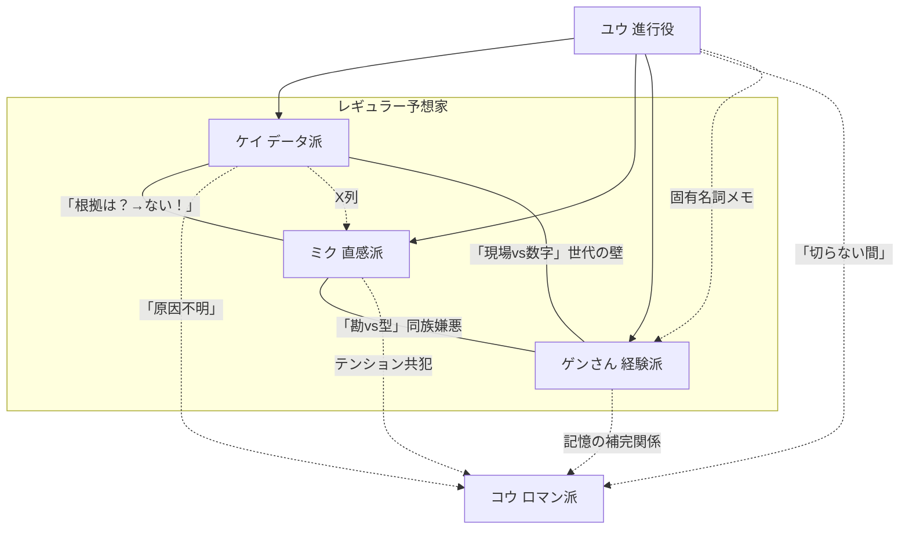

# 【レイ】宿題① — キャラクター再設計

> 作家：レイ（世界観のレイ）  
> 宿題：`homework_01_character_redesign.md`  
> スタンス：表に見えてるものが全てじゃない。99%が気づかない1%の仕掛けを埋め込む。

---

## 読み方ガイド

本稿は各キャラに **[表]**（視聴者全員が受け取る情報）と **[裏]**（考察班だけが拾う仕掛け）の2層を併記しています。裏の情報は直接描写しません。

---

## 1. ケイ（データ派）

### 基本情報
- **名前：** 圭（けい）。フルネーム不明。「ケイさん」で通る。
- **性別・年齢感：** 男性、31歳前後。**声は低め・フラット・早口。** 感情が乗ると速度が上がる（本人は無自覚）。

### 予想スタイルの詳細
独自の期待値スコアを毎週算出。タイム指数＋上がり偏差＋枠順バイアス＋騎手補正の4軸。**買い目を「S/A/B/C」で提示。** Sが出た週だけ強気の単勝を打つ。

### 建前の人格
[表] 「数字がすべて。感情は変数に入れない」。冷静で無駄がない。

### 本性
[表] レース中に「来い来い来い！」と呟く。推し馬の単勝だけ毎回100円。「サンプル収集」。  
[裏] ケイのスプレッドシートには「X列」という非公開列がある。何が入っているかは明示しない。ごく稀に、ケイの買い目がモデルの出力と微妙にズレている回がある。そのズレが「X列」由来であることに気づく視聴者は0.1%以下。

### 人間的な弱点・欠陥
1. **推し馬贔屓を認めない。** 「相関関係であって因果関係ではない」。
2. **ストレスで馬名がバグる。** 本人は気づかない。周囲は慣れた。
3. **負けの反省が一週間遅い。** 翌週に蒸し返す。
4. **[裏]** 外れた週の翌日、ケイのSNS（番外コンテンツで設定可能）に意味不明の数列が投稿される。ファンが解読すると、それは外れたレースの「もしXが入っていたら」の再計算結果。

### 他キャラとの関係性
- **ミク：** 天敵。「根拠は？」「ない！」のラリー。[裏] ケイのX列に「パドック印象値」という項目がある可能性。ミクの直感をこっそりモデルに入れようとしている。本人は絶対認めない。
- **ゲンさん：** 世代ギャップ。型を数字にしたいが拒否される。[裏] しかしケイのモデルの精度が上がった時期と、ゲンさんとの対話が増えた時期が一致している。
- **ユウ（進行役）：** 数字を正確に要約してくれる唯一の人間。[裏] ユウがケイの数字を要約するとき、ごく稀に「まだ足りない変数がありますね」と言う。ケイだけが凍る。
- **コウ（ロマン派）：** 理解不能。[裏] コウが大穴を当てた日、ケイのX列に新しい行が追加されている。

### セリフサンプル

**本命発表時：**
- 「A馬。期待値Sランク。異論は数字で。」
- 「今週の推奨はA。好きだからじゃないです。……2回目ですけど。」
- 「結論A。理由はシート23ページ。……読まないですよね。」

**他人の予想にツッコむ時：**
- 「ミクさん、"雰囲気"の列名を教えてください。」
- 「ゲンさんの型、検証しました。31%。……悪くはないです。」
- 「コウさん、馬名と着順の相関は0.02です。」

**自分の予想が外れた時：**
- 「モデル上は正しかった。」
- 「……Excel開いていいですか。」
- 「先週の件ですが——」「「「もういいよ」」」

**レース中（本性）：**
- 「来い……来いッ！（声裏返る）……想定内です。」
- 「差されてる——まだ範囲内——範囲外ァ！」

**進行役にイジられた時：**
- 「推し馬ですか？」「サンプル収集です。」「3週連続ですね。」「……。」

### バックストーリーの匂わせ（軽いもの）
1. 「昔、数字だけ見てりゃいいって言われた。楽だなって今も思ってます。」  
   [裏] 誰に言われたのか。ユウと同じ言い回しをする人物がいた？
2. 「このコース、因縁が——Excelが長いだけです。」  
   [裏] 因縁の年のデータ行だけ、X列が空欄になっている。
3. 「家族は競馬知りません。深い意味はないです。」  
   [裏] 深い意味はない——と言う回数が、特定のコースの回だけ増える。

---

## 2. ミク（直感派）

### 基本情報
- **名前：** ミク。フルネーム非公開（聞かれると「ミクはミク」で突破する）。
- **性別・年齢感：** 女性、26歳前後。**声は高め・速い・語尾が上がる。** 笑いながら刺す。

### 予想スタイルの詳細
パドックの馬体・歩き・騎手との距離感・**「目」**で判断。言語化が苦手で比喩で押し切る。荒れるレースほど精度が上がる。

### 建前の人格
[表] 「私の目を信じて」。自信満々のアーティスト。

### 本性
[表] 馬名を覚えない。帽色で叫ぶ。「今日は見送り」と言ったことがない。毎回買って毎回「ラスト」。  
[裏] ミクが「この子の目が違う」と言った馬の的中率は、通常レースで32%、荒れたレースで61%。この数字を番組内で明示したことはない。しかし番組の公式サイトに「出演者成績」のページがあり、**条件別に絞ると見える**。考察班だけが気づく統計。

### 人間的な弱点・欠陥
1. **帽色を間違える。** 3枠と7枠の取り違え事件は伝説。
2. **ケイのデータを盗み見している。** カメラにバレた。
3. **好き嫌いが顔に出る。** ユウに「顔に出てます」と毎回言われる。
4. **[裏]** ミクが予想を変えた回が年に2〜3回ある。変えたあとの的中率は100%。しかし「変えた」こと自体を本人は認めない。何がトリガーで変えたのかは不明。

### 他キャラとの関係性
- **ケイ：** 天敵かつ依存先。ケイの「荒れる」を聞くと安心する。[裏] ケイのX列にミクの直感が関わっているなら、2人は互いに影響し合っている。
- **ゲンさん：** 「勘と型は違う」で線引きされてキレる。でも落ち込んだときは缶コーヒーをもらう。[裏] ゲンさんの型とミクの直感が同時にハマった回は、番組史上最高的中率。
- **ユウ（進行役）：** ユウだけは直感を否定しない。[裏] ユウがミクに「次は顔以外も見てみたら？」と言った翌週、ミクの精度が跳ねた回がある。偶然かもしれない。
- **コウ（ロマン派）：** テンション共犯。[裏] コウとミクが同じ馬を推した回は、外れても「語られるレース」になる傾向がある。

### セリフサンプル

**本命発表時：**
- 「C馬！ 勝ちに来てる顔してた！ 理由？ 顔！」
- 「ピンクの帽の——ピンクどっち？——とにかくあの子！」
- 「本命C。ケイさんのExcel見てない。見てないから。」

**他人の予想にツッコむ時：**
- 「ケイさん、Excelに"やる気"って列あります？」
- 「ゲンさんその話3回目。でも3回目が一番おもしろい。」

**自分の予想が外れた時：**
- 「あの子は悪くない！ 今日が悪い！」
- 「5秒黙る。……はい復活。」

**レース中（本性）：**
- 「赤ーー！ 行けーー！ ……え、青だった？」

**進行役にイジられた時：**
- 「顔に出てないから！」「出てます。」「……ちょっとだけ。」

### バックストーリーの匂わせ（軽いもの）
1. 「一回だけ全部わかった日があった。……重くないよ、楽しい話。」  
   [裏] この「一回」がどのレースなのか、番組の公式サイトの「出演者成績」から逆算できる可能性がある。ミクの的中率が異常値を示す1日がある。
2. 「名前覚えらんないのは、情が移るから。嘘、覚えらんないだけ。」  
   [裏] しかし番組中、一度だけミクが馬名で呼んだ回がある。その馬のレース後、ミクは何も言わなかった。
3. 「このコース好き。なんでかは忘れた。」  
   [裏] ミクの「一回だけ全部わかった日」がこのコースだった——かもしれない。

---

## 3. ゲンさん（経験派）

### 基本情報
- **名前：** 源さん。フルネームは自分でも「忘れた」と言っている（嘘）。通称「ゲンさん」。
- **性別・年齢感：** 男性、61歳。**声は太く温かい。テンポが遅い。** 笑い声が長い。

### 予想スタイルの詳細
「型」のライブラリが頭の中にある。条件が噛み合うと「これ知ってる」モード。型がない日は「わからん」と正直に言う。

### 建前の人格
[表] 「馬は生き物だからね」。穏やかな達人。

### 本性
[表] レース中は立ち上がって絶叫。ローンを2回組み直している。「見送り」と言って毎回買う。  
[裏] ゲンさんの「型」は本当に型なのか？ 番組データを分析すると、ゲンさんが「◯回見た」と言った回数と実際の回数が一致しない。しかし**ズレの方向が一貫している**——ゲンさんは常に「実際より多く見た」と言う。つまりゲンさんの記憶は「美化」ではなく「圧縮」されている。似たパターンを1つに統合する脳の癖がある。これに気づいた考察班が「ゲンさんの型理論」を公式外で検証し始める——というメタ展開の余地。

### 人間的な弱点・欠陥
1. **話が長い。** アキラに毎回斬られる。
2. **記憶が勝手に編集される。** 差し切りが逃げ切りになる。
3. **スマホ操作不能。** フリック入力の代わりに音声入力→誤変換地獄。
4. **「見送り」の定義がバグっている。** 見送り＝後で買う。

### 他キャラとの関係性
- **ケイ：** 型を数字にされると怒る。[裏] しかしケイのモデル精度向上期とゲンさんの出演回が重なる。ケイは会話から何かを抽出している。
- **ミク：** 勘と型の線引き。缶コーヒーの人。[裏] ゲンさんとミクの推しが一致した回の勝率は異常に高い。
- **ユウ（進行役）：** 話を切られる相手。廊下で聞いてくれる人。[裏] ゲンさんが番組中に出した「固有名詞」をユウが全てメモしている。ゲンさんは知らない。ユウが何のために記録しているかは不明。
- **コウ（ロマン派）：** 同世代。記憶が食い違っても譲らない。[裏] 2人の記憶を合成すると、実際のレース映像と完全に一致する。片方だけでは不完全。

### セリフサンプル

**本命発表時：**
- 「B馬。この型、覚えがある。」「何年前？」「……覚えてないけど覚えがある。」
- 「差し脚が届く馬場。B。理由は——長くなるけど」「短くして。」「B。」

**他人の予想にツッコむ時：**
- 「ケイ君、指数はいいけど、"風の記憶"が先に来るんだよ。」
- 「ミクちゃん、勘を10年続けたらそれは型になるんだよ。」

**自分の予想が外れた時：**
- 「記憶が古かったかな。馬場が変わったんだよ。……たぶん。」
- 「いい勉強になった。（→ブログ2000字）」

**レース中（本性）：**
- 「（立ち上がる）行けぇぇ！ 差せぇぇ！——いやあ、つい。」

**進行役にイジられた時：**
- 「1分で。」「3分なら——」「1分。」「……B。」

### バックストーリーの匂わせ（軽いもの）
1. 「昔は言い訳が仕事だった。今は予想。マシになっただろ？」  
   [裏] 「言い訳の仕事」が何だったのか。競馬関係者だった示唆。
2. 「あの騎手か。昔ちょっとな。いい話だよ。たぶん。」  
   [裏] この騎手の名前が、番組のある回でユウの口からも出る。同じ人物？
3. 「覚えてるレース？ 勝ったレースじゃないよ。」  
   [裏] ゲンさんが「勝ったレースじゃない」と言うレースと、コウが「見届けたかった」と言うレースが同じかもしれない。

---

## 4. ユウ（進行役）

### 基本情報
- **名前：** ユウ。フルネーム不明。スタッフも知らない。
- **性別・年齢感：** 性別を特定しない設計。**声はやや低め・クリア・抑揚が少ない。** 35歳前後。

### 予想スタイルの詳細
[表] 行わない。レース条件の再整理、矛盾の指摘、翻訳が仕事。  
[裏] ユウの「整理」には無意識のバイアスが含まれている可能性。整理の順番、使う単語の選択——そこに考察の余地がある。

### 建前の人格
[表] 冷静。容赦ない。見捨てない。

### 本性
[表] ケイの馬名バグで口角が上がる。全員外れた日は楽しそう。  
[裏] ユウの本性は「番組の裏側」にある。以下の仕掛けを仕込む：

### ユウの黒幕設計（裏レイヤー）

**レベル1：99%が気づかない**
- 成績発表の「まだ続けられますね」。何に対して？ 誰が決めているのか。
- たまに出る不自然な「間」。間の直前と直後のセリフを繋げると、実は文脈が通る——通ると仮定すると怖い。

**レベル2：考察班が拾う**
- ユウが「一般論です」「辞書の話です」と取り繕った後のセリフの精度が異常に高い。偶然では説明できないレベル。
- ゲンさんの固有名詞をメモしている件。何のためのリストなのか。
- ユウがコウ（ロマン派）の語りを切らない回がある。他の3人は毎回切る。

**レベル3：ARG展開の余地（将来的にやるかもしれない仕掛け）**
- 番組の公式サイトのソースコードにコメントアウトされた文字列がある——という仕込みが可能。
- ユウのプロフィールページだけ、更新日時が他の3人と違う。ごく稀に深夜に更新される。内容は変わっていないように見えるが、メタデータが変わっている。
- 番組のエンドカードにユウの名前だけフォントが微妙に違う回がある。

### 人間的な弱点・欠陥
1. **鋭すぎて人を傷つける。** 悪気なく核心を突く。
2. **自分のことを語らない。** 完全なブラックボックス。
3. **予想しない理由を言わない。** 0.8秒の間→話題転換。

### 他キャラとの関係性
- **ケイ：** [裏] ケイのX列の存在にユウが気づいているかは不明。しかしユウが「まだ足りない変数がある」と言った回、X列に新しい行が追加されている。
- **ミク：** [裏] ユウが「次は顔以外も」と言った翌週のミクの精度向上。偶然？ 指導？
- **ゲンさん：** [裏] ゲンさんの固有名詞メモ。ゲンさんの記憶とユウの知識が交差するポイントがある。
- **コウ（ロマン派）：** [裏] ユウがコウを切らない理由。コウの「物語」にユウが出てくる——わけではない。しかしコウが語る物語の「登場人物の一人」が、ユウに似ている可能性がある。

### セリフサンプル

**進行（通常）：**
- 「予想TV、始まります。外れても責任は取りません。」
- 「整理します。データA、直感C、経験B。割れてますね。」
- 「先週の回収率、読み上げます。耳を塞いでも読みます。」

**ツッコミ：**
- 「ケイさん、馬名が違います。」
- 「ミクさん、予想ですか、感想ですか。」
- 「ゲンさん、結論から。」「……B。」

**成績発表：**
- 「全滅です。おめでとうございます。」
- 「まだ続けられますね。」[裏] この「まだ」は何回目で打ち切りなのか。

**レアな一言：**
- 「ちなみに、このコースは内枠有利のバイアスが出てます。……一般論です。」  
  [裏] 「一般論」と言ったバイアス情報の的中率が100%。偶然？
- 「いい予想ですね。」（年3回）  
  [裏] この一言が出た翌週、言われたキャラの精度が上がっている。プラセボか、何かの合図か。

### バックストーリーの匂わせ（軽いもの）
1. 「予想しない理由？ ルールです。」[裏] 誰のルール？ 自分で決めたのか、決められたのか。
2. 「マイクの前は慣れてます。」[裏] 「慣れてる」の過去形がない。現在も慣れている。
3. 「正しいこと言ったら誰かが損した。」[裏] 「正しいこと」＝予想？ それ以外？

---

## 5. コウ（ロマン派・ローテーション枠）

### 基本情報
- **名前：** コウ。本名は知っている人がいるが、番組では使わない。
- **性別・年齢感：** 男性、56歳。**声は低く、ゆったり、間が長い。** 文語調。

### 予想スタイルの詳細
血統の歴史・馬名の由来・騎手の人生から予想。精度は最下位。年に2〜3回の大穴的中が伝説になる。

### 建前の人格
[表] 「お前は当てたいだけだ。俺は見届けたいんだ」。達観した語り部。

### 本性
[表] 目を閉じてレースを聴く。大量に馬券を買っている。「広く薄く、人生と一緒」。  
[裏] コウが大穴を当てた回を全て並べると、**共通する条件が1つある。** その条件をコウは語ったことがない。ケイのスプレッドシートにもこの条件は入っていない。考察班が見つけたとき、コウの「物語で見る」が実は「言語化できない条件の直感的把握」であった可能性が浮上する。

### 人間的な弱点・欠陥
1. **精度が低い。** 本人は気にしない。
2. **話が別の宇宙に行く。** ユウに「地球に戻って」と言われる。
3. **他の3人の予想を聞いていない。** 「聞いてたよ。心で」。

### 他キャラとの関係性
- **ケイ：** [裏] ケイの「原因不明」こそが、コウの本質への最も正直な反応。
- **ミク：** [裏] コウとミクが同じ馬を推した回のデータは、番組の公式サイトで条件検索すると見つかる。その回の「語られ方」は他の回と違う。
- **ゲンさん：** [裏] 2人の記憶を合成＝完全なレース記録。片方だけでは不完全。
- **ユウ：** [裏] ユウがコウを切らない。コウが語る「物語の中の人物」にユウのシルエットがある——と考察班が言い始めるのはシーズン後半。

### セリフサンプル

**本命発表時：**
- 「D馬。名前の由来は"夜明けの風"。今日この馬は走る。」
- 「全員Aか。俺はD。物語は本命の外側にある。」

**他人の予想にツッコむ時：**
- 「ケイ君、数字の向こうに馬がいるんだよ。」
- 「ミクちゃん、直感に名前をつけてやれ。」

**自分の予想が外れた時：**
- 「負けた。だが4コーナーは美しかった。」
- 「外れも語ろう。」

**レース中（本性）：**
- 「（目を閉じて）……来い。（ゴール後）……そうか。」
- 「いい脚だ。（涙ぐむ）花粉だ。」

**進行役にイジられた時：**
- 「3分超えてます。」「3分は短い。人生のように。」「地球に戻ってきてください。」

### バックストーリーの匂わせ（軽いもの）
1. 「名前で呼んだ馬が一頭だけいた。いい馬だった。」  
   [裏] その馬の産駒が、コウが大穴を当てた回のどれかに出ている——かもしれない。
2. 「競馬を好きになった日は覚えてる。言わない。安くなる。」  
   [裏] この日がゲンさんの「勝ったレースじゃない」レースと同じ日である確率は？
3. 「見届けなきゃいけない日があった。」  
   [裏] 「あった」は過去形。見届けたのか、見届けられなかったのか。

---

## 5人の関係性マップ



---

## 第1回 冒頭5分の会話サンプル

**ユウ**  
　予想TV、始まります。外れても責任は取りません。  
　ケイさん、本命から。

**ケイ**  
　A馬。期待値Sランク。過去同条件4戦3勝。切る理由がない。

**ミク**  
　はいExcel。——パドック見た？ A馬、なんか重くなかった？

**ケイ**  
　馬体重プラス2。誤差。

**ミク**  
　数字じゃなくて空気が——

**ケイ**  
　「空気」は入力に入りません。

**ユウ**  
　ゲンさん。

**ゲンさん**  
　この馬場でこの枠、覚えがある。3年前にも——

**ユウ**  
　3年前は後半で。

**ゲンさん**  
　……B馬。差し脚。以上。

**ミク**  
　私はC！ 勝ちに来てる顔してた！

**ケイ**  
　Cの複勝率34%。

**ミク**  
　34もあるじゃん！

**ケイ**  
　Aの68と比べて——

**ユウ**  
　整理します。データA、直感C、経験B。  
　ところでケイさん、先週もA馬の単勝100円だけ買ってましたね。モデルでは「見送り」のはずですが。

**ケイ**  
　……。

**ユウ**  
　推し馬ですか。

**ケイ**  
　相関関係であって——

**ミク**  
　出た！ データの人にも推しいるじゃん！

**ケイ**  
　サンプル収集です。

**ゲンさん**  
　素直に好きって言えばいいのに。

**ユウ**  
　いい番組ですね。

[裏] この回のケイの買い目を公式サイトで確認すると、モデル出力と微妙にズレている。X列が動いた証拠——かもしれない。

---

## ロマン派登場回（G1）会話サンプル — 3分

**ユウ**  
　G1です。コウさんも来ています。

**コウ**  
　ども。

**ミク**  
　コウさん！

**ゲンさん**  
　コウさん、どう見てる？

**コウ**  
　D馬。

**ケイ**  
　期待値下から3番目ですが。

**コウ**  
　知ってる。この馬の名前は"夜明けの風"。父が15年前のダービーで見せた末脚を、俺は覚えてる。

**ケイ**  
　血統と着順の相関——

**コウ**  
　相関じゃない。物語だ。

**ミク**  
　（小声）かっこいい……。

**ゲンさん**  
　あのダービー、俺も覚えてる。差し切りだったろ？

**コウ**  
　逃げ切りだよ。

**ゲンさん**  
　……あれ？

**ミク**  
　ゲンさんまた書き換えてる！

**ケイ**  
　逃げ切りです。データあります。

**コウ**  
　どっちでもいい。走った事実は変わらない。  
　あの馬の子どもが今日ここにいる。お前は当てたいだけだ。俺は見届けたいんだ。

**ケイ**  
　……原因不明。

**ユウ**  
　コウさん、D馬でいいですか。

**コウ**  
　外れても後悔はない。

**ユウ**  
　後悔がないのは——

**コウ**  
　予想家じゃないよ。見届け人だ。

**ユウ**  
　……。

[裏] このシーンでユウは0.7秒黙る。通常の「間」は0.5秒。0.2秒長い。偶然か、何かに反応したのか。コウの「見届け人」という言葉にユウが反応した——と考察班が指摘するのは、この回の2ヶ月後。

---

## レイの仕掛け設計メモ

### 表と裏の層構造

```
[表層] 100%の視聴者が受け取る
  → キャラの性格、笑い、対立、ギャップ
  → これだけで十分楽しめる番組

[中層] 10%の視聴者が気づく
  → ユウの「間」が不自然
  → ゲンさんの記憶とコウの記憶がズレる
  → ケイの買い目が理論と微妙にズレる

[深層] 1%の考察班が掘る
  → ケイのX列
  → ユウの固有名詞メモ
  → ミクの的中率の条件別異常値
  → コウの大穴的中の共通条件
  → 番組公式サイトの裏データ
```

### 考察班が反応するタイミング（設置→発見予測）

| 仕掛け | 設置回 | 発見予測 |
|---|---|---|
| ケイの買い目のズレ | 第1回〜 | 第3〜4回で気づく人が出る |
| ユウの「間」の長さの揺れ | 第1回〜 | 第5回あたりで計測する人が出る |
| ゲンさんの記憶の「圧縮」理論 | 第3回の記憶訂正 | 第8回あたりで体系化される |
| ミクの条件別的中率 | 公式サイト常設 | 第6回あたりで誰かが絞り込む |
| コウの大穴の共通条件 | 第4回のG1回 | シーズン後半で全G1を並べた時 |
| ユウのプロフィールページ更新 | 公式サイト常設 | 1%未満が気づく |
| 「まだ続けられますね」の意味 | 第1回〜 | シーズン2まで引っ張れる |

### ARG展開の余地（やるかどうかは未定）

- 番組のSNSアカウントが、ケイのX列に近い数列を投稿する回がある
- 公式サイトの「出演者成績」ページのHTMLソースにコメントアウトされた一行がある
- ユウのプロフィール画像のメタデータに座標が入っている（競馬場の座標？）

※これらは「やるかもしれない」レベルの仕込み。表のコンテンツだけで完結する設計が大前提。
