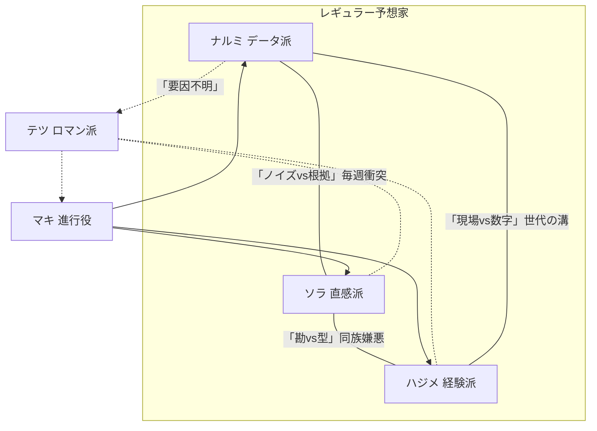

# 【ユキ】宿題① — キャラクター再設計

> 作家：ユキ（感情のユキ）  
> 宿題：`homework_01_character_redesign.md`  
> スタンス：キャラが生きてれば物語は勝手に動く。建前と本性の落差の中に、愛嬌を埋め込む。

---

## 1. 鳴海 圭吾（なるみ けいご）— 通称「ナルミ」（データ派）

### 基本情報
- **性別・年齢感：** 男性、30歳前後。**声は低めで落ち着いている。語尾を飲み込む癖がある。** ラジオで聴くと一番「まとも」に聞こえるが、それは建前。
- **声の特徴：** 淡々とした読み上げ口調。句読点で区切る。感情が乗ると早口になる（本人は気づいていない）。

### 予想スタイルの詳細
タイム指数・上がり3F・コース別勝率・斤量変化をExcelで一元管理。買い目を「期待値」で順位づけし、上位3頭を機械的に推奨。「感情を入れない」が信条だが、**自分の推し馬が出走するときだけ、こっそり期待値の閾値を0.02下げている**（バレたことはない——と本人は思っている）。

### 建前の人格
冷静。論理的。余計なことは言わない。「期待値がプラスなら買い、マイナスなら見送り。それだけです」が口癖。数字の裏付けがない意見は「ノイズ」と呼ぶ。

### 本性
- レース中：画面に向かって**小声で「来い……来い……来いっ……！」と呟く**。本人は無意識。隣のソラに毎回バレている。
- 馬券：「期待値マイナスの馬券は買わない」と公言しているが、**推し馬の単勝だけは毎回100円買っている**。財布の中に馬券が溜まっている。
- 外れた時：「モデル上は正しかった」を3分間言い続けてから、急に黙る。黙ったあとにExcelを開く音がする。

### 人間的な弱点・欠陥
1. **推し馬への贔屓を絶対に認めない。** 指摘されると「相関関係であって因果関係ではない」と論点をずらす。
2. **ストレスで馬名を微妙に間違える。**「ナミュール」を「ナミュエル」、「リバティアイランド」を「リバティランド」と言う。本人は気づかない。
3. **負けを認めるのが異常に遅い。** 翌週になってようやく「先週の件ですが」と振り返る。その頃には全員忘れている。

### 他キャラとの関係性
- **ソラ：** 天敵。「ノイズ」と呼んでいるが、ソラが荒れたレースで当てるたびにExcelにこっそり記録している。ソラにだけはデータを見せない（見せると「ほら、私のほうが上じゃん」と言われるのが怖い）。
- **ハジメ：** データ以前の現場感は尊敬。「ハジメさんの型をモデルに入れたい」と言ったら「数字にすんな」と断られた。
- **マキ（進行役）：** 唯一、自分の数字を正確に要約してくれるので精神的に楽。ただしマキに「で、結局どの馬？」と訊かれると急に自信がなくなる。
- **テツ（ロマン派）：** 理解不能。「馬名の響きで買う」という行為がナルミの全存在を否定している。しかしテツが大穴を当てた日、Excelに「要因不明」と書いて3日悩んだ。

### セリフサンプル

**本命発表時：**
- 「期待値順にA、B、C。特にAは複勝期待値が安定しています。……好きとか嫌いとかじゃないです。」
- 「今週は全頭の上がり偏差を比較しました。結論から言うとA馬です。理由は23ページ目に。」
- 「本命はA。……あと、この馬が好きだからとかじゃないです。（2回目）」

**他人の予想にツッコむ時：**
- 「ソラさん、"雰囲気がいい"はモデルに入りません。入れ方があったら論文にします。」
- 「ハジメさんの型、検証しました。過去5年で勝率31%です。……悪くはないです。悪くは。」
- 「テツさん、馬名の響きと着順の相関は0.02です。ゼロです。」

**自分の予想が外れた時：**
- 「……モデル上は正しかった。結果がモデルに追いついてないだけです。」
- 「（3秒沈黙）……Excel、開いていいですか。」
- 「先週の件ですが——」「「「もう忘れたよ」」」

**レース中（本性）：**
- 「（小声で）来い……来い……来い……ッ！！（馬が差し切る）……想定通りです。」
- 「あ、あ、差されてる。差されてるけど……まだ、まだ期待値の範囲内……ッ！（範囲外）」
- 「（声が裏返って）なんで逃げた！　逃げのデータ入れてないのに！……いえ、冷静です。」

**進行役にイジられた時：**
- 「マキさん、先週の話は——」「先週の回収率、読み上げましょうか？」「……やめてください。」
- 「データに感情はありません。」「じゃあ今の声の震えは何？」「……空調です。」

### バックストーリーの匂わせセリフ（軽いもの）
1. 「昔、数字だけ見てればいいって言われたんですよ。楽だなって思った。……今でも思ってます。」
2. 「家族は競馬を知りません。知らないほうがいいと思ってます。……深い意味はないです。」
3. 「このコース、個人的に因縁があるんですけど——いえ、因縁っていうか、Excelが長いだけです。」

---

## 2. 天野 ソラ（あまの そら）— 直感派

### 基本情報
- **性別・年齢感：** 女性、26歳前後。**声は明るく、テンポが速い。笑いながら喋る。** 間が短くて、次の人の出番を奪う。
- **声の特徴：** 語尾が上がる。「でしょ？」「じゃん？」が多い。興奮すると声が1オクターブ上がる。

### 予想スタイルの詳細
パドックの馬体の張り、歩きの芯、騎手との距離感、**そして「目」**。「今日やる気のある馬は目でわかる」が持論。根拠の言語化が苦手で、比喩と印象語で押し切る。**荒れるレースほど精度が上がる**（本人談。データ上も実はそう）。

### 建前の人格
自信満々。「私の目を信じて」が口癖。直感で勝負する姿がカッコいい——と本人は思っている。レース前は堂々としている。

### 本性
- レース中：**推し馬の名前を連呼する。** 「行け行け行けーーー！！　あの子ーーー！！」（馬名を忘れている）
- 馬券：「今日は見送り」と言った回がゼロ。**毎回買う。毎回「これが最後」と言う。** ナルミに「先週も最後って言ってましたよ」と指摘されても「先週の私は別人」で突破する。
- 外れた時：一瞬で拗ねる。3秒黙ったあと「でもあの子は悪くない！今日が合わなかっただけ！」と馬を庇う。

### 人間的な弱点・欠陥
1. **馬名を覚えられない。** 帽色や枠番で呼ぶ（「ピンクの子」「3枠のやつ」）。3枠と7枠を間違えたまま2分間語ったことがある。
2. **ナルミのデータをこっそり見ている。** 本番直前にスマホでナルミのスプレッドシートを開いているのがカメラに映ったことがある。「参考にしてるだけ！最終判断は直感！」
3. **好き嫌いが顔に出る。** 嫌いな騎手のレースになると急にテンションが下がる。マキに「ソラさん、顔に出てますよ」と毎回言われる。

### 他キャラとの関係性
- **ナルミ：** 天敵だけど、いないと不安。ナルミのデータを否定するのが生きがいだが、実はナルミが「今週は荒れる」と言った週だけ自信が出る（自分の土俵だから）。
- **ハジメ：** 「現場感」仲間だと思いたいが、ハジメに「お前のは勘。俺のは型だ」と線を引かれるとキレる。同族嫌悪。
- **マキ（進行役）：** ツッコミが怖いけど、マキだけは「直感は直感で価値がある」と一度も否定したことがない。そのことにソラだけが気づいている。
- **テツ（ロマン派）：** 最も共感できる相手。テツの「馬には物語がある」という考えに「わかる！」と即座に乗る。ただしテツの予想を真に受けると一緒に外れる。

### セリフサンプル

**本命発表時：**
- 「C馬！ 今日あの子、勝ちに来てる顔してた。理由？ 顔！」
- 「えっとね、パドックで——ピンクの帽の子——あ、ピンクどっちだっけ——とにかくあの子！」
- 「本命はC。ナルミさんのデータは知らない。見てない。見てないから。」

**他人の予想にツッコむ時：**
- 「ナルミさん、Excelの中に"やる気"って項目あります？ ないでしょ。」
- 「ハジメさん、その話3回目ー。でも3回目が一番おもしろいかも。」
- 「テツさんの予想、詩としては100点。馬券としては——ごめん。」

**自分の予想が外れた時：**
- 「……あの子は悪くない。悪くない。今日が合わなかっただけ。（目が潤む）」
- 「ちょっと黙る。5秒だけ。……5秒経った。次の話していい？」
- 「データ派が当たった日は帰りたくなる。……帰らないけど。」

**レース中（本性）：**
- 「行けーーーー！！ あの子ーー！！ いやあの子じゃなくて……3枠ーーー！！」
- 「差せ差せ差せ差せ！（馬が差し切る）ほらあああ！……ほら。ほら。（急に冷静）」
- 「え、あ、抜かれ——うそ、うそうそうそ、待って——（沈黙）……。今のなかったことにして。」

**進行役にイジられた時：**
- 「マキさん！ 顔に出てないから！」「出てます。」「……ちょっとだけ。」
- 「先週の的中率、読み上げないで。お願い。人として。」

### バックストーリーの匂わせセリフ（軽いもの）
1. 「昔ね、一回だけ"全部わかった"日があったの。あれ以来、勘を信じてる。……重い話じゃないよ？ 楽しい話。」
2. 「このコース、好きなんだよね。なんでかは——えーと、なんでだろ。忘れた。」
3. 「馬の名前覚えられないのはね、覚えると情が移るから。……嘘。覚えられないだけ。」

---

## 3. 月島 肇（つきしま はじめ）— 通称「ハジメさん」（経験派）

### 基本情報
- **性別・年齢感：** 男性、58歳前後。**声は太くて温かい、テンポはゆっくり。** 「ねえ」「そうでしょ」で段落を閉じる。笑い声が長い。
- **声の特徴：** 独特の「間」がある。結論を出す前に必ず2秒溜める。この2秒がリスナーを引きつける。

### 予想スタイルの詳細
距離・コース・馬場状態・展開・枠順の組み合わせを「型」として大量に記憶。「このパターンは◯回見た」と言い始めたら当たる確率が上がる。条件が噛み合わないときは正直に「今日はわからん」と言う（その正直さが信頼になっている）。**ただし「見た」と言ったパターンの半分は記憶が美化されている。**

### 建前の人格
穏やかな大先輩。若手を見守る余裕。「馬は生き物だからね」が口癖で、データだけでは測れないものがあると諭す。達観した空気を出している。

### 本性
- レース中：**立ち上がる。** 「行けぇ！ そこだぁ！ 差せぇぇぇ！」とスタジオで叫ぶ。収録後に「いやあ、つい」と照れる。
- 馬券：「馬は生き物だからね」と言いながら、**馬券で家のローンを2回組み直している。** 奥さんに「今月はやめとけ」と毎週LINEが来る（既読スルー）。
- 外れた時：「いい勉強になったねえ」と余裕を見せるが、**3日後のブログに2000字の反省文を書く**。読者は5人。

### 人間的な弱点・欠陥
1. **話が長い。** 「この型、昔も見たんだけど——」から始まると5分は止まらない。マキに毎回切られる。
2. **記憶の美化。** 「あのダービー馬は差し切った」と語った馬が実は逃げ切り。指摘されると「……あれ？ でも差す勢いがあった気がするんだよなあ」で着地する。
3. **スマホが使えない。** フリック入力ができないのでメモは手書き。LINEの返信は音声入力だが、誤変換が多すぎてソラに翻訳してもらっている。孫の運動会の写真を見せようとしてカメラが起動する。

### 他キャラとの関係性
- **ナルミ：** 息子世代。可愛がっているが「現場を知らない怖さ」を感じている。ナルミがデータでハジメの型を検証しようとすると「数字にすんな！」と珍しく怒る。
- **ソラ：** 孫世代。勢いが好き。ただし「直感＝若さ」と決めつけられるのが一番嫌い。「俺のは型だ。勘とは違う」と線を引く。でもソラが泣きそうなときは黙って缶コーヒーを渡す。
- **マキ（進行役）：** マキの沈黙の質が昔の競馬場の空気に似ていて、懐かしさがある。マキに話を切られるのは嫌だが、マキが「続けてください」と言った回は本気で嬉しい。
- **テツ（ロマン派）：** 同世代の匂い。テツの「競馬は物語だ」に共感するが、「物語に賭けるな」とも思っている。テツと2人きりになると、若い頃の馬の話を延々としてしまう。

### セリフサンプル

**本命発表時：**
- 「この馬場でこの枠、型がある。B馬。……理由は長くなるけど——」「「短くして」」「……B馬。差し脚。以上。」
- 「似たレース、見たことある。結末は……言わんとこう。ただB馬は買いだよ。」
- 「本命はB。3年前の同条件で同じ脚質の馬が勝ってる。……え、覚えてないって？ 俺は覚えてるよ。」

**他人の予想にツッコむ時：**
- 「ナルミ君、その指数いいんだけどさ、ここは"風の記憶"が先に来るんだよ。」
- 「ソラちゃん、勘はいい。でもね、勘を10年続けるとそれは"型"になるんだよ。」
- 「テツさん、詩人は嫌いじゃないけど、馬は詩じゃ走らないよ。……でもたまに走るから困る。」

**自分の予想が外れた時：**
- 「あー……いや、これは俺の記憶が古かった。馬場が変わったんだよ、きっと。……きっと。」
- 「いい勉強になったねえ。（3日後にブログに2000字書く）」
- 「負けは負け。ただしこの負けは次に使える。……使えるかな。使いたい。」

**レース中（本性）：**
- 「（立ち上がる）行けぇぇぇ！ そこだぁ！ 差せぇぇぇ！——（着順確定）……いやあ、つい。座ります。」
- 「あ、あ、行った行った行った！……あ、止まった。……止まったね。（座る）」
- 「来た来た来た来た……！（ガッツポーズ）……え、2着？ ……2着ね。うん。」

**進行役にイジられた時：**
- 「マキさん、1分って言ったよね。」「言いました。3分経ってます。」「……そんなに？」
- 「短くします。えーと、まず背景から——」「結論から。」「……B馬。」

### バックストーリーの匂わせセリフ（軽いもの）
1. 「昔はね、言い訳が仕事だったんだよ。今は予想が仕事。マシになったでしょ？」
2. 「あの騎手か。昔ちょっとな……。いや、いい話だよ。いい話。たぶん。」
3. 「俺が一番覚えてるレース？ 勝ったレースじゃないよ。……まあ、いいか。飲みの席でね。」

---

## 4. 槇村 真帆（まきむら まほ）— 通称「マキ」（進行役）

### 基本情報
- **性別・年齢感：** 女性、34歳前後。**声はやや低めでクリア、テンポが一定。** 抑揚が少ないからこそ、たまに出る感情が際立つ。
- **声の特徴：** 句読点がはっきりしている。「。」で確実に止まる。全員の中で一番聞き取りやすい。

### 予想スタイルの詳細
**行わない。** ただし、レース条件の再整理、3人の主張の矛盾点の指摘、視聴者向け用語の翻訳は番組最高精度。競馬用語の使い分けは3人の誰より正確。

### 建前の人格
冷静。容赦ない。呆れている。でも見捨てない。「で、結局どの馬？」「先週もそれ言って外しましたよね」が基本装備。

### 本性
- 番組中はほぼ無表情だが、**ナルミが馬名を間違えるたびに口角が0.5ミリ上がる**。カメラには映らないレベル。
- 成績発表を淡々と行うが、**全員外れた日だけ微妙にテンポが速い**（楽しんでいる）。
- 収録後、ハジメの話の続きを廊下で聞いている。本番で切った分を取り返すかのように。

### 人間的な弱点・欠陥
1. **鋭すぎて傷つける。** 悪気なく核心を突く。ソラが3連敗中に「直感が当たらない時期、何を信じるんですか？」と訊いて空気を凍らせたことがある。
2. **自分のことを一切語らない。** 趣味も休日も不明。スタッフも知らない。
3. **予想しない理由を絶対に言わない。** 訊かれると0.8秒の沈黙のあと話題を変える。この「間」だけが唯一の感情の隙間。

### 「実は詳しい？」匂わせの仕組み
99%の視聴者は気づかないが、注意深い人だけが引っかかるレベル：
- 成績発表の「まだ続けられますね」が妙に意味深。査定しているように聞こえる。
- 3人の主張を整理するとき、**自分の意見を混ぜていないはずなのに、整理の仕方に「好み」が見える。**
- たまに不自然な間がある。その間に、3人が「……今の、何？」と反応する。

### 他キャラとの関係性
- **ナルミ：** 一番扱いやすい。データを正確に要約できるのはマキだけ。ナルミもそれを知っていて、マキにだけは弱みを見せる（「……マキさん、今週のモデル、自信ないです」）。
- **ソラ：** テンポの壊し屋。イジり甲斐があるが、ソラが本気で落ち込んでいるときは追撃しない。「次は顔以外も見てみたら？」と実務的な宿題を渡す（ソラはそれを優しさと解釈する）。
- **ハジメ：** 話を切るのが仕事だが、**切った話の続きが気になっている。** 廊下で聞くのはマキなりの敬意。ハジメだけが「マキさん、昔どこかで会ったかな」と言ったことがある。マキは「気のせいです」と返した。
- **テツ（ロマン派）：** テツが来る回は進行が難しくなる（脱線が倍になる）。しかしマキはテツの語りを切らないことがある。珍しい。理由は言わない。

### セリフサンプル

**進行（通常）：**
- 「はい、予想TV。今週も始まります。外れても責任は取りません。取るのは皆さんです。」
- 「整理します。データはA、直感はC、経験はB。見事に割れてますね。」
- 「先週の回収率、読み上げます。……聞きたくない人は耳を塞いでください。塞いでも読みます。」

**ツッコミ：**
- 「ナルミさん、馬名が違います。もう一度。」「えっ、あ、リバティ……アイラン……ド。」「合格。ギリギリ。」
- 「ソラさん、今のは予想ですか。感想ですか。」「予想！ 比喩多めの！」「翻訳します。つまり"なんとなく"ですね。」
- 「ハジメさん、1分でまとめてください。」「……難しい。2分なら——」「1分。」「……B馬。」

**成績発表：**
- 「先週の結果です。ナルミさん、不的中。ソラさん、不的中。ハジメさん、不的中。全滅です。おめでとうございます。」
- 「ソラさん、3連敗です。何か一言。」「……5秒だけ黙っていい？」「3秒で。」
- 「まだ続けられますね。」（意味深）

**レアな感情の露出：**
- 「……ちなみに、このコースは内枠有利のバイアスが出てます。（1秒沈黙）……一般論です。」
- 「いい予想ですね。」（この一言のハードルが異常に高い）

### バックストーリーの匂わせセリフ（軽いもの）
1. 「予想しない理由？ ……ルールです。」（0.8秒の間のあと）
2. 「マイクの前に立つのは慣れてます。……なぜかは聞かないでください。」
3. 「昔、正しいことを言ったら、結果的に誰かが損した。それだけです。……深くないですよ。」

---

## 5. 神代 鉄朗（かみしろ てつろう）— 通称「テツさん」（ロマン派・ローテーション枠）

### 基本情報
- **性別・年齢感：** 男性、55歳前後。**声は低く、ゆったりと響く。** 文語調が混じる。句読点の間が異常に長い。
- **声の特徴：** ラジオで聴くと一人だけ別の番組に聞こえる。BGMが似合う声。

### 予想スタイルの詳細
血統の歴史、馬名の由来、騎手の人生、レースの物語性から予想する。「この馬は今日、走る理由がある」が判断基準。**予想精度は4人中最低**だが、年に2〜3回、詩的な理由で大穴を当てる。その日は伝説になる。

### 建前の人格
達観した語り部。「お前は当てたいだけだ。俺は見届けたいんだ」が信条。馬券の話をしているようで人生を語っている。

### 本性
- レース中：**目を閉じる。** 実況を聴きながら、頭の中でレースを走らせている。ゴール後にゆっくり目を開けて「……そうか」と一言。当たっても外れても同じ反応。
- 馬券：**実は一番多く買っている。** 「当てることが目的じゃない」と言いながら、ワイドと3連複を大量に買う。「広く薄く、人生と一緒だよ」。
- 外れた時：「負けたな。だが、いいレースだった」で完結。反省しない。反省する概念がない。

### 人間的な弱点・欠陥
1. **予想精度が低い。** 圧倒的に低い。でも本人は気にしていない。「俺の予想は結果じゃなくて過程だから」。
2. **話が脱線どころか、別の宇宙に行く。** 馬名の由来から宇宙の話になったことがある。マキに「地球に戻ってきてください」と言われた。
3. **他の3人の予想を全く聞いていない。** 自分の世界に入っている。ソラに「テツさん聞いてた？」と言われて「聞いてたよ。心で」と返す。

### 他キャラとの関係性
- **ナルミ：** 「データは正しい。でもデータに物語はない」が基本スタンス。ナルミを否定はしないが、ナルミの世界観と全く噛み合わない。ナルミにとってテツは「要因不明」の塊。
- **ソラ：** 最も波長が合う。ソラの「目で見る」とテツの「物語で見る」は根っこが近い。テツが来る回だけソラが大人しくなる（聞き入っている）。
- **ハジメ：** 同世代の匂い。2人きりになると、若い頃見たレースの話を延々とする。お互いの記憶が微妙に違うが、どちらも「俺の記憶が正しい」と思っている。
- **マキ（進行役）：** テツの語りをマキが切らない瞬間がある。マキがテツに対してだけ見せる「間」がある。理由は不明。

### セリフサンプル

**本命発表時：**
- 「D馬。この馬の名前の由来を知ってるか？ "夜明けの風"だよ。今日、この馬は走る。」
- 「本命はD。理由は——この馬の父が、15年前のダービーで見せた末脚を覚えているからだ。血は嘘をつかない。」
- 「全員A推しか。……じゃあ俺はD。理由は——物語はいつも、本命の外側にある。」

**他人の予想にツッコむ時：**
- 「ナルミ君、数字の向こうに馬がいるんだよ。馬を見ろよ。」
- 「ソラちゃん、お前の直感、俺は好きだよ。でも直感に名前をつけてやれ。」
- 「ハジメさん、その型、覚えてるよ。……俺の記憶だとちょっと違うけどな。」

**自分の予想が外れた時：**
- 「負けたな。だが、あの馬が走った4コーナーは美しかった。」
- 「当たる当たらないの話をする番組なんだから、外れも語ろうよ。」
- 「ソラちゃん、泣くな。馬はな、お前のために走ってるんじゃない。でもお前のために走ってくれた日は、いつか来る。」

**レース中（本性）：**
- 「（目を閉じている）……来い。（ゴール）……そうか。（目を開ける）」
- 「（実況を聴きながら、ゆっくり立つ）……いい脚だ。いい脚だ。（涙ぐむ）……いや、花粉だ。」

**進行役にイジられた時：**
- 「マキさん、時間オーバーかな。」「3分前からです。」「3分は短い。人生のように。」「……地球に戻ってきてください。」

### バックストーリーの匂わせセリフ（軽いもの）
1. 「昔、一頭だけ、名前で呼んだ馬がいた。……いい馬だったよ。それだけ。」
2. 「俺が競馬を好きになった日？ 覚えてるよ。覚えてるけど、言わない。言ったら安くなる。」
3. 「お前は当てたいだけだ。俺は見届けたいんだ。……見届けなきゃいけなかった日があるから。」

---

## 5人の関係性マップ

**場面別の味方変化：**
- ナルミ vs ソラが白熱 → ハジメが**その日の条件次第でどちらにも乗る**（コロコロ変わる）
- ハジメが昔話モード → ナルミとソラが**珍しく連帯してツッコむ**
- 全員暴走 → マキが**一言で全員を黙らせる**
- テツ登場回 → ソラが**大人しくなり**、ハジメが**饒舌になり**、ナルミが**困惑する**

---

## 第1回 冒頭5分の会話サンプル

**マキ**  
　予想TV、始まります。今週もレースの前に言い訳を準備してる方、どうぞ。  
　では早速。今週の◯◯賞、本命から。ナルミさん。

**ナルミ**  
　A馬です。複勝期待値が安定しています。過去同条件の類似馬では4戦3勝。切る理由がないです。

**ソラ**  
　はいはい、Excelの人が来た。——でもさ、ナルミさん、今朝のパドック見た？ A馬、なんか重くなかった？

**ナルミ**  
　馬体重プラス2キロです。誤差です。

**ソラ**  
　いや数字じゃなくて！ なんか、こう、空気が——

**ナルミ**  
　「空気」は入力に入りません。

**ソラ**  
　だからデータの人は——！

**マキ**  
　はい、対立は1分後に。ハジメさん。

**ハジメ**  
　ふむ。この馬場でこの枠、見たことあるよ。3年前にも同じ条件で——

**マキ**  
　ハジメさん。3年前は後半で。

**ハジメ**  
　（苦笑）……結論だけ言うと、B馬。差し脚の届く馬場だから。

**ソラ**  
　私はC馬！ あの子、今日勝ちに来てる顔してた！

**ナルミ**  
　C馬の複勝率は34%です。

**ソラ**  
　34%もあるじゃん！

**ナルミ**  
　……Aの68%と比べてます。

**マキ**  
　整理します。データはA、直感はC、経験はB。三人三様ですね。  
　ソラさん、ちなみに「勝ちに来てる顔」の具体的な根拠は？

**ソラ**  
　えっと、目が……なんか、こう、キラッて——

**マキ**  
　キラッ。

**ソラ**  
　……翻訳しないで。死ぬタイプだから。

**ハジメ**  
　まあまあ。ソラちゃんの言いたいことはわかるよ。馬にも「今日じゃない日」ってあるからね。

**ソラ**  
　ハジメさん……！ わかってくれる……！

**ハジメ**  
　わかるよ。昔も同じことを——

**マキ**  
　昔話、禁止。

**ハジメ**  
　……（笑）はい。

**ナルミ**  
　ちなみにソラさん、さっきから「C馬」って言ってますけど、帽色で言うと何色ですか？

**ソラ**  
　え、ピンク——あ、ピンクじゃない。えっと——

**ナルミ**  
　赤です。

**ソラ**  
　赤！ 赤ね！ ……知ってた。

**マキ**  
　知ってなかったですね。  
　——では馬券の話に。今回の買い目——

**＜ここでナルミの本性が出る＞**

**ナルミ**  
　単勝A、複勝A。以上です。期待値プラスの買い目だけ。感情は入れません。

**マキ**  
　ナルミさん、先週もA馬の単勝を100円だけ買ってましたよね。あの馬、モデルでは「見送り」だったはずですが。

**ナルミ**  
　……。

**マキ**  
　推し馬ですか？

**ナルミ**  
　……相関関係であって因果関係ではないです。

**ソラ**  
　出た！ それ出た！ 推し馬じゃん！ データの人にも推しいるじゃん！

**ナルミ**  
　（早口で）推しではなく長期データ収集のためのサンプル購入です。

**ハジメ**  
　（笑）若いねえ。素直に好きって言えばいいのに。

**マキ**  
　……いい番組ですね。レースは14時50分です。結果は来週。  
　外れても、責任は取りません。

---

## G1回（テツさん登場）会話サンプル — 3分

**マキ**  
　今週はG1です。特別ゲストとして、テツさんが来ています。

**テツ**  
　ども。

**ソラ**  
　テツさんだ！ 久しぶり！

**ハジメ**  
　おお、テツさん。今日のレース、どう見てる？

**テツ**  
　……D馬だな。

**ナルミ**  
　D馬、期待値は下から3番目ですが。

**テツ**  
　知ってるよ。でもこの馬の名前、「夜明けの風」って意味なんだ。  
　父親が15年前のダービーで見せた末脚——あの4コーナーの加速を、俺はまだ覚えてる。

**ナルミ**  
　……血統と着順の相関は——

**テツ**  
　相関じゃない。物語だよ。

**ソラ**  
　（小声で）……かっこいい。

**ハジメ**  
　テツさんの気持ちはわかるよ。俺もあのダービー、覚えてる。あの日は——

**マキ**  
　ハジメさん、回想は30秒以内で。

**ハジメ**  
　……30秒じゃ無理だよ。

**テツ**  
　ハジメさん。覚えてるか、あの日のゴール前。

**ハジメ**  
　覚えてるよ。……俺の記憶だと、差し切りだったんだけど——

**テツ**  
　逃げ切りだよ。

**ハジメ**  
　……あれ？

**ソラ**  
　（爆笑）ハジメさん！ また記憶書き換えてる！

**ナルミ**  
　（淡々と）差し切りではなく逃げ切りです。データがあります。

**ハジメ**  
　……差す勢いがあったんだよ。雰囲気が。

**テツ**  
　まあ、どっちでもいい。あの馬が走った事実は変わらない。  
　そしてあの馬の子どもが、今日ここにいる。——お前は当てたいだけだ。俺は見届けたいんだ。

**ナルミ**  
　……（Excelに「要因不明」と入力する音）

**マキ**  
　テツさん、予想はD馬ということでいいですか。

**テツ**  
　いいよ。外れても後悔はない。

**マキ**  
　後悔がないのは予想家として——

**テツ**  
　予想家じゃないよ。見届け人だ。

**マキ**  
　……。（0.5秒の間）  
　……いい言葉ですね。  
　では、レースです。

---

## ユキの設計意図メモ

**キャラの感情設計として意識したこと：**

1. **ギャップの落差は「恥ずかしさ」から生む。** ナルミの推し馬バレ、ソラの帽色間違い、ハジメのレース中絶叫——全員が「本性を見せたくないのにバレる」構造。恥ずかしさが愛嬌になる。

2. **弱点は「ダメだけど憎めない」のラインを死守。** 致命的な欠陥ではなく、「ああ、いるいるこういう人」レベル。自分にも覚えがある弱さ。

3. **関係性は「好きと嫌いが同居する」設計。** ナルミはソラを「ノイズ」と呼ぶが、ソラが当てるとExcelに記録する。ソラはナルミのデータを否定するが、本番前に盗み見する。好きだから攻撃する、嫌いだけど頼る。この矛盾が人間。

4. **マキの「間」はすべての感情の受け皿。** マキが黙る0.8秒に、視聴者は自分の感情を投影する。マキが笑わないからこそ、「いい予想ですね」の一言が重い。

5. **テツは「異物」として機能させる。** テツが来ると空気が変わる。笑いのテンポが落ちて、少しだけ深い空気が流れる。でもすぐにナルミが「要因不明」と打ち込んで笑いに戻る。重くなりすぎない安全弁をナルミに持たせた。
