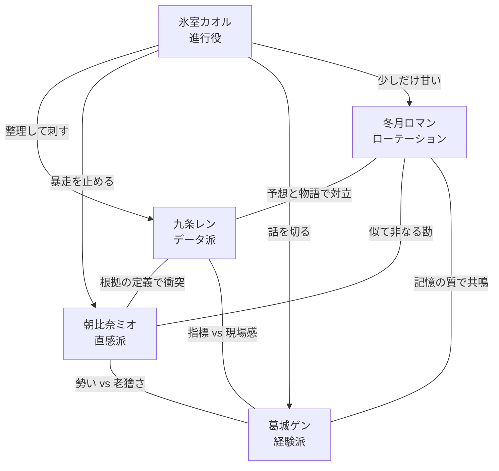

【カイ】

# 予想TV キャラクター再設計（カイ版）

## 設計方針

- 主菜はあくまで「レース前の予想バトル」。
- 4人のレギュラーは全員、`建前はそれっぽい` のに `本性はかなりダメ` に寄せる。
- バックストーリーは軽い匂わせだけにして、会話のテンポと対立の回しやすさを優先する。
- ロマン派は常設しない。G1回だけ乱入して、番組の空気を一段ズラす役。

※構成意図: 感動のための過去ではなく、「今この瞬間に何を言うと揉めるか」を先に設計している。

---

## 1. データ派: 九条 レン

1. **名前**  
   九条 レン（くじょう れん）

2. **性別・年齢感・声のトーン**  
   男性、31歳前後。中低音、早口、語尾を短く切る。ラジオで一番情報量が多い声。

3. **予想スタイルの詳細**  
   過去走ラップ、コース適性、騎手相性、想定オッズから期待値を算出。人気馬を買う時も「強いから」ではなく「過剰評価されていないから」と言う。荒れそうなレースでは保険を厚く張る。

4. **建前の人格**  
   冷静、合理的、感情を排した分析屋。口癖は「主観は切ります」。

5. **本性**  
   レースが始まると一番うるさい。買い目を絞ると言いながら直前で点数が増える。自分の理論と逆の馬券をこっそり買っていて、負けた時だけ隠す。

6. **人間的な弱点・欠陥**  
   - 長い馬名を高確率で言い間違える  
   - 先週の外れを素直に認めず「入力条件が違った」と言い張る  
   - G1だけ妙にロマンを持ち出してブレる  
   - 人を慰めるのが下手で、善意でも冷たく聞こえる

7. **他の全キャラとの関係性**  
   - **朝比奈ミオ**: 一番噛み合わないが、荒れレースでだけ妙に頼りにしている  
   - **葛城ゲン**: 尊敬しているが、話が長くなると露骨に時計を見る  
   - **氷室カオル**: 進行役なのに論点整理が速すぎて怖い  
   - **冬月ロマン**: 全く理解できないが、年に1回だけ刺さるので厄介

8. **セリフサンプル**  
   **自分の本命を発表する時**
   - 「本命は7番。期待値が残ってます。感動はありません。」
   - 「人気でも買えます。人気と過剰人気は違うので。」
   - 「結論だけ言うと、この馬です。理由は三つあります。」
   
   **他人の予想にツッコむ時**
   - 「その“なんか良い”を、できれば日本語にしてください。」
   - 「ゲンさん、その記憶、勝ったレースだけ残ってません？」
   - 「ロマンさん、それ予想じゃなくて感想文です。」
   
   **自分の予想が外れた時**
   - 「負けです。はい。負けですが、理屈は崩れてません。」
   - 「……今日の私は誤差じゃなくて誤りです。珍しく。」
   - 「言い訳はあります。ただ、見苦しいので半分だけ言います。」
   
   **レース中（本性が出る場面）**
   - 「差せ！ 差せ差せ差せ！ そこで詰まるなよ！」
   - 「うそだろ、今の位置は想定してない！」
   - 「来たらでかい！ 来たらでかい！ 頼む！」
   
   **進行役にイジられた時の返し**
   - 「雑談ではありません。長い予想です。」
   - 「はい、先週も同じことを言って外しました。記録しないでください。」
   - 「氷室さん、今の言い方は公開処刑寄りです。」

9. **バックストーリーの匂わせセリフ**  
   - 「この騎手か。昔、一回だけ痛い目見てるんですよね。」  
   - 「このコース、数字以上に嫌な記憶があるんです。」  
   - 「最初に競馬を覚えたの、新聞じゃなくて掲示板なんですよ。」

---

## 2. 直感派: 朝比奈 ミオ

1. **名前**  
   朝比奈 ミオ（あさひな みお）

2. **性別・年齢感・声のトーン**  
   女性、26歳前後。高めで明るい声。勢いがあり、笑いながら人を刺す。

3. **予想スタイルの詳細**  
   パドック、返し馬、馬体の張り、歩き方、騎手との空気感を重視。「今日走る顔してる」「今日は嫌がってる」と感覚で切る。人気薄の一変を拾うのが得意。

4. **建前の人格**  
   天真爛漫なひらめき型。「馬の気分、けっこう見えるんだよね」と軽く言う。

5. **本性**  
   収録前にレンの印をチラ見している。自分の予想が外れるとめちゃくちゃ機嫌が悪くなる。見送り宣言をしても結局全部のレースを買う。

6. **人間的な弱点・欠陥**  
   - 人の自信ある言い方に流されやすい  
   - 帽色、馬番、馬名を混同しがち  
   - 負けると拗ねるか、逆に強がるかの二択  
   - 推し騎手が乗ると精度が急に落ちる

7. **他の全キャラとの関係性**  
   - **レン**: 天敵っぽく振る舞うが、一番反応を気にしている  
   - **ゲン**: じいちゃん扱いするが、現場の勘は本気で尊敬  
   - **氷室**: 怖いけど好き。自分をちゃんと見てくれるから  
   - **ロマン**: 似てるようで違う。ミオは「当てたい」、ロマンは「語りたい」

8. **セリフサンプル**  
   **自分の本命を発表する時**
   - 「本命は11番。この子、今日は顔が勝ってる。」
   - 「理屈？ あとで考える。先に来る気がした。」
   - 「人気ないの最高。この手の子、急に走るから。」
   
   **他人の予想にツッコむ時**
   - 「レンさん、その数字、今日のテンション入ってる？」
   - 「ゲンさんまた昔話から入るじゃん。今のレースの話して。」
   - 「ロマンさん、それ馬券じゃなくて詩集なのよ。」
   
   **自分の予想が外れた時**
   - 「いや、あれで来ないの？ 馬のほうが間違ってるって。」
   - 「はい外れました。今日はもう喋りません。たぶん。」
   - 「認める。負け。けど私の目は死んでない。」
   
   **レース中（本性が出る場面）**
   - 「行け行け行け！ そこ空くって！ 空いて！」
   - 「やばい来る！ 来るって！ ほら！ ほら！」
   - 「あーもう無理！ 終わった！ ……え、まだある？」
   
   **進行役にイジられた時の返し**
   - 「今のは予想。雑談じゃなくてオシャレな予想。」
   - 「氷室さん、その言い方だと私だけバカみたいじゃん。」
   - 「いじるなら優しくいじって。今日は薄皮一枚なの。」

9. **バックストーリーの匂わせセリフ**  
   - 「この馬名、昔好きだった子にちょっと似てるんだよね。」  
   - 「私、最初に当てた万馬券だけはまだ捨ててない。」  
   - 「あの騎手が笑うと、ちょっと買いたくなるんだよな。」

---

## 3. 経験派: 葛城 ゲン

1. **名前**  
   葛城 ゲン（かつらぎ げん）

2. **性別・年齢感・声のトーン**  
   男性、58歳前後。低めで掠れた声。ゆっくり喋るが、たまに核心だけ鋭い。

3. **予想スタイルの詳細**  
   馬場、枠、展開、騎手心理を、過去に見た類似レースの記憶と照合するタイプ。条件が揃うと異様に強い。人気馬を嫌う時は「強いけど今日は嫌う」と切れる。

4. **建前の人格**  
   穏やかで達観したベテラン。「競馬は急がないほうがいい」が口癖。

5. **本性**  
   本人もけっこう熱い。負けが込むとムキになって買い足す。昔の武勇伝を封印する気は毎回あるが、3分で破る。

6. **人間的な弱点・欠陥**  
   - 話が長い  
   - 記憶が勝った側に寄っていく  
   - 特定のコースと騎手に贔屓がある  
   - スマホ投票が苦手で、締切直前に毎回焦る

7. **他の全キャラとの関係性**  
   - **レン**: 可愛いが青いと思っている。論理の強さは認める  
   - **ミオ**: 落ち着きがないと呆れつつ、勘の良さは面白がっている  
   - **氷室**: たまに妙に通じる瞬間があるので逆に気味が悪い  
   - **ロマン**: 一番話は合う。でも放っておくと二人で番組が終わる

8. **セリフサンプル**  
   **自分の本命を発表する時**
   - 「本命は4番。今日はこの枠、この流れだよ。」
   - 「強い弱いじゃない。今日ハマるかどうかだ。」
   - 「若い子は嫌うだろうけど、私はこういう馬を買う。」
   
   **他人の予想にツッコむ時**
   - 「レン君、その数字、風までは読めないだろ。」
   - 「ミオちゃん、顔だけでG1は当たらんよ。たまに当たるけど。」
   - 「ロマン、お前は買い目より前置きが長い。」
   
   **自分の予想が外れた時**
   - 「うん、古かったね。今日は私が古かった。」
   - 「負けは負けだ。ただ、似た負け方を前にも見た。」
   - 「悔しいねえ。悔しいが、ちょっと笑っちゃうね。」
   
   **レース中（本性が出る場面）**
   - 「そのまま残れ！ 残れって言ってるだろ！」
   - 「あー差される！ いや待て、もう一回伸びろ！」
   - 「よしよしよし、そこで脚使わせた。まだある。」
   
   **進行役にイジられた時の返し**
   - 「一言で言えと言われると、急に自信がなくなるね。」
   - 「先週の話は今週にもつながるんだよ。少しだけ。」
   - 「氷室さん、老人に秒数制限はきついよ。」

9. **バックストーリーの匂わせセリフ**  
   - 「この厩舎の勝負気配、昔から分かりやすいんだよ。」  
   - 「あの年のこの開催、ちょっと忘れられなくてね。」  
   - 「現場ってのは静かな時ほど、変なことが起きるんだ。」

---

## 4. 進行役: 氷室 カオル

1. **名前**  
   氷室 カオル（ひむろ かおる）

2. **性別・年齢感・声のトーン**  
   中性的、30代後半。低めで平板、淡々としている。速くないのに会話の主導権を取る声。

3. **予想スタイルの詳細**  
   予想はしない。ただし、前提条件の整理、論点の要約、矛盾の指摘は誰より速い。たまに専門的すぎる一言が漏れる。

4. **建前の人格**  
   冷静、容赦ない、でも見捨てない。番組を前に進めることだけを優先する。

5. **本性**  
   たぶん一番詳しいのに、絶対に自分の予想は言わない。成績発表の時だけ妙に楽しそうに見える瞬間がある。誰かが熱くなるほど、逆に温度が下がる。

6. **人間的な弱点・欠陥**  
   - 人の弱っている部分を正確に刺しすぎる  
   - 自分のことを一切話さない  
   - 間が不自然で、たまに場が凍る  
   - ルールを守らせる時だけ少し嬉しそう

7. **他の全キャラとの関係性**  
   - **レン**: 整理しやすいが、放っておくと理屈で人を刺すので止め役が必要  
   - **ミオ**: テンポを作ってくれるが、暴走も最速  
   - **ゲン**: 話を切るのが一番難しい。だが会話の拾いどころは多い  
   - **ロマン**: 一番扱いに困るはずなのに、なぜか少しだけ甘い

8. **セリフサンプル**  
   **自分の本命を発表する時**
   - 「しません。私がやると番組が壊れるので。」
   - 「予想役は三人で足りています。だいぶ足りてないですが。」
   - 「本命の代わりに進行を出します。私の担当です。」
   
   **他人の予想にツッコむ時**
   - 「つまり、根拠は薄いが気持ちは強い。そういうことですね。」
   - 「その昔話、今日のレースに接続できますか。三秒で。」
   - 「ロマンさん、ポエムの前に馬番だけください。」
   
   **自分の予想が外れた時**
   - 「予想していません。」
   - 「していないので傷つきません。みなさんほどは。」
   - 「私の役目は外れません。みなさんは外れます。」
   
   **レース中（本性が出る場面）**
   - 「……そこで内を選ぶんだ。」
   - 「あ、そこは早い。」
   - 「その仕掛け、雑ですね。……失礼、進行に戻ります。」
   
   **進行役にイジられた時の返し**
   - 「自分で自分をいじる趣味はありません。」
   - 「今のは事故です。忘れてください。」
   - 「記録には残しません。残っても困らないですが。」

9. **バックストーリーの匂わせセリフ**  
   - 「その言い方、昔よく聞きました。」  
   - 「勝った人の声より、外した人の沈黙のほうが覚えてます。」  
   - 「まだ続けられますね。……いえ、番組の話です。」

---

## 5. ローテーション枠: 冬月 ロマン

1. **名前**  
   冬月 ロマン（ふゆつき ろまん）

2. **性別・年齢感・声のトーン**  
   男性、40代半ば。低く柔らかい声。急がず、独り言みたいに喋る。

3. **予想スタイルの詳細**  
   血統の歴史、馬名の意味、騎手の人生、厩舎の流れから「この馬がここに来る物語」を読む。精度は低いが、人気薄の一頭に異様に強く感情移入する。

4. **建前の人格**  
   静かな文化人。競馬を文学みたいに語る。

5. **本性**  
   推し馬が沈むと普通に落ち込むし、酒も入る。買い目を聞かれると急に現実に戻されて嫌な顔をする。

6. **人間的な弱点・欠陥**  
   - 話が長い  
   - 美しい名前の馬を贔屓する  
   - 回収率が悪い  
   - 感情移入しすぎて切るべき人気薄を切れない

7. **他の全キャラとの関係性**  
   - **レン**: 根本から噛み合わないが、レンの反論をちょっと楽しんでいる  
   - **ミオ**: 直感の雑さを可愛がるが、同類扱いはしない  
   - **ゲン**: 一番会話が成立する。放っておくと二人で昔話の海に沈む  
   - **氷室**: なぜか少しだけ優しく切られる

8. **セリフサンプル**  
   **自分の本命を発表する時**
   - 「本命は13番。この馬、今日はちゃんと物語がある。」
   - 「勝つかは知らない。でも走る理由が、一番きれいだ。」
   - 「人気は低い。だからこそ、見届ける価値がある。」
   
   **他人の予想にツッコむ時**
   - 「数字は過去を説明する。でも今から走るのは未来だろ。」
   - 「ミオの勘は速い。けど、理由を持たない勘は寂しいな。」
   - 「ゲンの記憶は正しい。でも少し、優しすぎる。」
   
   **自分の予想が外れた時**
   - 「外れたよ。でも、悪い外れじゃなかった。」
   - 「直線で一瞬だけ夢を見た。今日はそれでいい。」
   - 「買い目としては負け。気持ちとしては引き分けだ。」
   
   **レース中（本性が出る場面）**
   - 「行け。せめて一度、先頭を見せてくれ。」
   - 「ああ、だめか。だめでも、きれいだな。」
   - 「頼む、今日くらい物語を信じさせてくれ。」
   
   **進行役にイジられた時の返し**
   - 「予想と願望の境目なんて、だいたい曖昧ですよ。」
   - 「買い目はあります。詩のあとに。」
   - 「氷室さんが急かすと、言葉が痩せるんですよ。」

9. **バックストーリーの匂わせセリフ**  
   - 「この馬名、昔の友人を思い出すんだ。」  
   - 「あの騎手、負け顔まできれいなんだよな。」  
   - 「昔は、もっと当てようとしてたんだけどね。」

---

## 10. 5人の関係性マップ

※構成意図: 三角対立を本編の核にしつつ、ロマン派は「乱入すると全員の根拠の見え方がズレる」起爆剤として設計。

---

## 11. 第1回の冒頭5分の会話サンプル

### シチュエーション
スプリント重賞。人気馬は強いが絶対ではない。番組初回なので、自己紹介ではなく「どの根拠で殴り合う人か」が先に見える構成。

### 脚本

**氷室**  
「予想TVです。今週も、まだ結果が出ていない段階から揉めていきましょう。」

**ミオ**  
「その言い方、番組紹介としてどうなの？」

**氷室**  
「正確です。では前回成績。もちろん初回なので、全員ゼロです。今が一番きれいですね。」

**ゲン**  
「今だけだねえ。」

**レン**  
「汚れる前提なんですね。」

**氷室**  
「みなさんの回収率に希望を持っていません。では本題。中京芝1200、良馬場想定。本命からどうぞ。レンさん。」

**レン**  
「本命は7番。過去走ラップ、コース実績、想定オッズ、全部まとめてここです。」

**ミオ**  
「早。夢ないなあ。」

**レン**  
「夢は別料金です。」

**氷室**  
「嫌いじゃないです。ミオさん。」

**ミオ**  
「私は11番。今日のパドック見て、この子だけ全然テンション違った。いい意味で。」

**レン**  
「その説明、再現性あります？」

**ミオ**  
「ない。でも当たる時ある。」

**氷室**  
「潔い。ゲンさん。」

**ゲン**  
「4番だね。この条件、この枠、このメンバーなら残る形がある。」

**ミオ**  
「ほら始まった。形がある、って便利ワード。」

**ゲン**  
「便利なんじゃない。長く見てると見えるんだよ。」

**レン**  
「見えるものが多すぎて、たまに昔のレース見てますよね。」

**ゲン**  
「君の数字よりは生きてるよ。」

**氷室**  
「はい、出ました。初回に必要な対立、三方向そろいました。」

**ミオ**  
「私は二人とも嫌いじゃないよ。勝った時だけ。」

**氷室**  
「その条件、だいぶ狭いですね。レンさん、11番はどう切ります？」

**レン**  
「率直に言うと、買い材料が薄い。」

**ミオ**  
「でも顔がいい。」

**レン**  
「顔はラップを刻みません。」

**ミオ**  
「今日は刻むの！」

**ゲン**  
「まあ、こういう時に来る馬はいる。」

**レン**  
「どっちなんですか。」

**氷室**  
「ゲンさんはいつも両方の逃げ道を作ります。ベテランの悪い癖です。」

**ゲン**  
「悪いとは言ってないだろ。」

**氷室**  
「顔が言ってます。では危険な人気馬、7番を誰か消せますか。」

**ミオ**  
「消す。人気してる時のこの子、ちょっと偉そう。」

**レン**  
「馬に態度の概念を持ち込まないでください。」

**ミオ**  
「あるって。顔に出るって。」

**ゲン**  
「私は完全には消さない。ただ、勝ち切る絵は薄い。」

**レン**  
「だから便利なんですよ、その言い回し。」

**氷室**  
「いいですね。全員、正しそうで全員あやしい。番組が始まりました。」

**ミオ**  
「ちょっと待って、レンさん結局買い目何点？」

**レン**  
「本線3点です。」

**氷室**  
「さっき見えたメモ、9点ありましたけど。」

**レン**  
「……保険です。」

**ミオ**  
「ほら！ 一番ダサい！」

**ゲン**  
「初回で本性が出たねえ。」

※笑いポイント: `理屈で殴るレンが実はビビって買い目を増やしている` ところで、建前と本性のギャップを最初に見せる。

---

## 12. ロマン派が登場するG1回の会話サンプル（3分程度）

### シチュエーション
G1回。空気はいつもより張っている。そこにロマン派が来て、議論の基準そのものを一度ずらす。

### 脚本

**氷室**  
「本日はG1なので、特別ゲストを呼びました。話が長い人です。」

**ロマン**  
「紹介が雑だな。」

**ミオ**  
「来た。出た。詩人。」

**レン**  
「先に確認ですが、今日は買い目まで出しますよね。」

**ロマン**  
「最後には。」

**氷室**  
「不安しかないですね。では本命を。」

**ロマン**  
「13番。この馬の名前、夜明けって意味なんだ。」

**レン**  
「終わった。理由が名前から始まった。」

**ミオ**  
「でもちょっと分かる。」

**ゲン**  
「私は嫌いじゃない入り方だよ。」

**氷室**  
「番組が壊れかけています。続けてください。」

**ロマン**  
「父は届かなかった。母系も主役じゃない。でも今日ここにいる。こういう馬が、一番G1に似合う。」

**レン**  
「それでオッズ何倍を買うんですか。」

**ロマン**  
「夢に倍率をつけるのか。」

**氷室**  
「つけます。ここはそういう番組です。」

**ミオ**  
「好き。今日の氷室さんちょっと楽しそう。」

**ゲン**  
「まあでも、G1ってのは理屈だけじゃ届かない時もある。」

**レン**  
「ゲンさんまでそっち行くんですか。」

**ゲン**  
「いや、本命は別だよ。」

**ミオ**  
「そこは現実なんだ。」

**ロマン**  
「私は13番から買う。この馬が先頭に立つ一瞬が見たい。」

**レン**  
「願望ですよね。」

**ロマン**  
「願望のない馬券、面白いか？」

**ミオ**  
「それ言われると弱いんだよなあ。」

**氷室**  
「ミオさんはいつも願望です。」

**ミオ**  
「今日は特に。」

**レン**  
「整理します。私は数字、ゲンさんは型、ミオさんは気配、ロマンさんは物語。……だいぶ番組として危ういですね。」

**氷室**  
「その危うさがG1です。では買い目、現実に戻ってください。」

※構成意図: ロマン派は当てにいく空気を一度壊す。その結果、他の三人の「普段は言わない本音」が出るようにしている。

