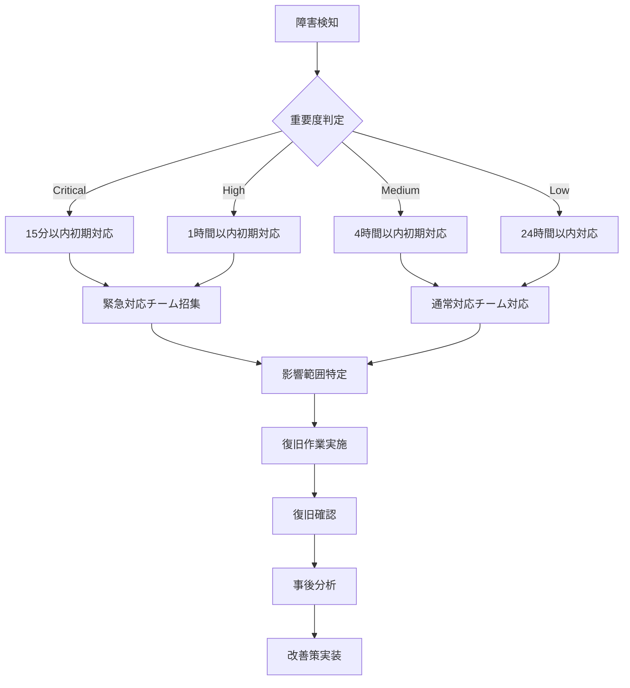

# KeibaCICD プロジェクト計画書

## 1. プロジェクト概要

### 1.1 プロジェクト名
KeibaCICD - 競馬データ分析システム

### 1.2 プロジェクトの目的
エンジニアリング手法を活用し、競馬を通じて人生を持続的に豊かにすることを目的とした、期待値ベースの合理的な競馬予測・分析システムの構築。

### 1.3 プロジェクトスコープ
- 既存の競馬ブックスクレイピングシステムの拡張
- 期待値計算システムの構築
- 馬キャラクター分析機能の実装
- レース質分析・可視化システムの開発
- 3D可視化機能の実装
- JRA-VANデータ連携システムの構築

### 1.4 成功基準
- 期待値1.2以上の馬を90%以上の精度で特定
- レース分析の完了時間30分以内
- システム稼働率99.9%以上
- ユーザー満足度80%以上

## 2. プロジェクト体制

### 2.1 プロジェクト組織
```
プロジェクトマネージャー
├── 技術リーダー
├── バックエンド開発チーム
│   ├── Python開発者（FastAPI）
│   ├── C#開発者（JRA-VAN連携）
│   └── データエンジニア
├── フロントエンド開発チーム
│   ├── Next.js開発者
│   ├── 3D可視化開発者
│   └── UI/UXデザイナー
├── データサイエンスチーム
│   ├── 機械学習エンジニア
│   └── データアナリスト
└── インフラ・DevOpsチーム
    ├── インフラエンジニア
    └── DevOpsエンジニア
```

### 2.2 役割と責任

| 役割 | 責任 | 担当者 |
|------|------|--------|
| プロジェクトマネージャー | 全体統括、進捗管理、リスク管理 | TBD |
| 技術リーダー | 技術方針決定、アーキテクチャ設計 | TBD |
| バックエンドリーダー | API設計、データベース設計 | TBD |
| フロントエンドリーダー | UI/UX設計、フロントエンド実装 | TBD |
| データサイエンスリーダー | 分析アルゴリズム設計、ML実装 | TBD |

## 3. プロジェクトスケジュール

### 3.1 全体スケジュール

```
Phase 1: 基盤構築（3ヶ月）
├── 2025年6月: 設計・準備
├── 2025年7月: インフラ構築
└── 2025年8月: 基本機能実装

Phase 2: コア機能開発（4ヶ月）
├── 2025年9月: 期待値計算システム
├── 2025年10月: 馬キャラクター分析
├── 2025年11月: レース質分析
└── 2025年12月: 統合テスト

Phase 3: 高度機能開発（3ヶ月）
├── 2026年1月: 3D可視化
├── 2026年2月: JRA-VAN連携
└── 2026年3月: 最終調整・リリース

Phase 4: 運用・改善（継続）
└── 2026年4月〜: 運用開始・機能改善
```

### 3.2 詳細スケジュール

#### Phase 1: 基盤構築（2025年6月〜8月）

**2025年6月（設計・準備）**
- Week 1-2: 要件定義・設計書作成
- Week 3-4: 技術選定・環境構築準備

**2025年7月（インフラ構築）**
- Week 1-2: データベース設計・構築
- Week 3-4: API基盤構築・CI/CD構築

**2025年8月（基本機能実装）**
- Week 1-2: 既存データ移行・ETL構築
- Week 3-4: 基本API実装・フロントエンド基盤

#### Phase 2: コア機能開発（2025年9月〜12月）

**2025年9月（期待値計算システム）**
- Week 1-2: 期待値計算ロジック実装
- Week 3-4: 予測モデル構築・テスト

**2025年10月（馬キャラクター分析）**
- Week 1-2: 性格分析アルゴリズム実装
- Week 3-4: キャラクター可視化機能

**2025年11月（レース質分析）**
- Week 1-2: レース質分析エンジン実装
- Week 3-4: 展開シミュレーション機能

**2025年12月（統合テスト）**
- Week 1-2: 機能統合・結合テスト
- Week 3-4: パフォーマンステスト・調整

#### Phase 3: 高度機能開発（2026年1月〜3月）

**2026年1月（3D可視化）**
- Week 1-2: Three.js基盤構築
- Week 3-4: レースフロー3D表示

**2026年2月（JRA-VAN連携）**
- Week 1-2: C#/.NET API構築
- Week 3-4: リアルタイムデータ連携

**2026年3月（最終調整・リリース）**
- Week 1-2: 総合テスト・バグ修正
- Week 3-4: リリース準備・本番デプロイ

## 4. リソース計画

### 4.1 人的リソース

| フェーズ | 期間 | 必要人数 | 工数（人月） |
|---------|------|----------|-------------|
| Phase 1 | 3ヶ月 | 6人 | 18人月 |
| Phase 2 | 4ヶ月 | 8人 | 32人月 |
| Phase 3 | 3ヶ月 | 6人 | 18人月 |
| **合計** | **10ヶ月** | **最大8人** | **68人月** |

### 4.2 技術リソース

#### 開発環境
- **開発マシン**: 高性能PC × 8台
- **開発ツール**: IDE、デザインツール等
- **ライセンス**: 各種開発ツールライセンス

#### インフラリソース
- **クラウド**: AWS/Azure（開発・本番環境）
- **データベース**: PostgreSQL、MongoDB、Redis
- **監視ツール**: Prometheus、Grafana
- **CI/CD**: GitHub Actions

### 4.3 予算計画

| 項目 | 金額（万円） | 備考 |
|------|-------------|------|
| 人件費 | 3,400 | 68人月 × 50万円 |
| インフラ費用 | 240 | 月20万円 × 12ヶ月 |
| ライセンス費用 | 120 | 各種ツール・サービス |
| 外部委託費 | 200 | デザイン・特殊技術 |
| その他 | 40 | 予備費 |
| **合計** | **4,000** | |

## 5. リスク管理

### 5.1 リスク一覧

| リスク | 影響度 | 発生確率 | 対策 |
|--------|--------|----------|------|
| 技術的難易度の過小評価 | 高 | 中 | プロトタイプ作成、技術検証 |
| JRA-VAN API仕様変更 | 高 | 低 | 代替データソース確保 |
| パフォーマンス要件未達 | 中 | 中 | 早期性能テスト実施 |
| キーメンバーの離脱 | 高 | 低 | 知識共有、ドキュメント化 |
| 競合サービスの登場 | 中 | 中 | 差別化機能の強化 |
| 法的規制の変更 | 中 | 低 | 法務相談、コンプライアンス確認 |

### 5.2 リスク対応計画

#### 技術リスク対応
- **プロトタイプ開発**: 高リスク機能の事前検証
- **技術スパイク**: 不明な技術要素の調査
- **代替技術準備**: メイン技術が使用不可の場合の代替案

#### プロジェクトリスク対応
- **バッファ確保**: スケジュールに20%のバッファを設定
- **段階的リリース**: MVPから段階的に機能追加
- **定期レビュー**: 週次進捗確認、月次リスク評価

## 6. 品質管理

### 6.1 品質基準

#### コード品質
- **テストカバレッジ**: 80%以上
- **コードレビュー**: 全コミット必須
- **静的解析**: SonarQube等でのコード品質チェック
- **セキュリティ**: OWASP基準準拠

#### システム品質
- **パフォーマンス**: API応答時間200ms以下
- **可用性**: 稼働率99.9%以上
- **セキュリティ**: 脆弱性スキャン実施
- **ユーザビリティ**: ユーザビリティテスト実施

### 6.2 パフォーマンステスト計画

#### 6.2.1 負荷テスト設計
```yaml
load_test_scenarios:
  normal_load:
    concurrent_users: 100
    duration: 30m
    ramp_up: 5m
    test_data: "レース検索、期待値計算"
    
  peak_load:
    concurrent_users: 1000
    duration: 15m
    ramp_up: 3m
    test_data: "重賞レース日の想定負荷"
    
  stress_test:
    concurrent_users: 2000
    duration: 10m
    ramp_up: 2m
    test_data: "限界性能の測定"
    
  endurance_test:
    concurrent_users: 500
    duration: 2h
    test_data: "長時間運用の安定性確認"
```

#### 6.2.2 パフォーマンス指標
| 指標 | 目標値 | 計測方法 |
|------|--------|----------|
| API応答時間 | 95%ile < 200ms | JMeter/Artillery |
| スループット | > 1000 req/min | 負荷テストツール |
| エラー率 | < 0.1% | アプリケーションログ |
| CPU使用率 | < 70% | システム監視 |
| メモリ使用率 | < 80% | システム監視 |
| データベース応答時間 | < 50ms | DB監視ツール |

#### 6.2.3 テストデータ設計
- **馬データ**: 10,000頭分の過去実績
- **レースデータ**: 過去5年分（約50,000レース）
- **コメントデータ**: 100万件の分析対象コメント
- **ユーザーデータ**: 10,000アカウント分

### 6.3 テスト計画

#### テスト種別
- **単体テスト**: 各機能の個別テスト
- **結合テスト**: システム間連携テスト
- **システムテスト**: 全体機能テスト
- **受入テスト**: ユーザー受入テスト
- **性能テスト**: 負荷・ストレステスト
- **セキュリティテスト**: 脆弱性テスト

#### テストスケジュール
- **継続的テスト**: 開発中の自動テスト
- **結合テスト**: Phase 2終了時
- **システムテスト**: Phase 3開始時
- **受入テスト**: リリース前1ヶ月

## 7. コミュニケーション計画

### 7.1 定期会議

| 会議名 | 頻度 | 参加者 | 目的 |
|--------|------|--------|------|
| 全体進捗会議 | 週次 | 全メンバー | 進捗共有、課題解決 |
| 技術検討会議 | 隔週 | 技術メンバー | 技術課題検討 |
| ステークホルダー報告 | 月次 | PM、リーダー | 経営層への報告 |
| リスク評価会議 | 月次 | PM、リーダー | リスク状況確認 |

### 7.2 コミュニケーションツール

- **チャット**: Slack/Teams
- **タスク管理**: Jira/GitHub Issues
- **ドキュメント**: Confluence/Notion
- **コード管理**: GitHub
- **設計書**: Figma/Miro

## 8. 変更管理

### 8.1 変更管理プロセス

1. **変更要求**: 変更要求書の提出
2. **影響分析**: 工数・スケジュール・品質への影響評価
3. **承認**: ステークホルダーによる承認
4. **実装**: 変更の実装・テスト
5. **完了報告**: 変更完了の報告

### 8.2 変更承認基準

| 変更規模 | 承認者 | 承認期間 |
|----------|--------|----------|
| 軽微（1日以内） | 技術リーダー | 即日 |
| 中規模（1週間以内） | プロジェクトマネージャー | 3日以内 |
| 大規模（1週間超） | ステークホルダー | 1週間以内 |

## 9. 成果物管理

### 9.1 成果物一覧

#### 設計書類
- システム設計書
- データベース設計書
- API設計書
- UI/UX設計書

#### 開発成果物
- ソースコード
- テストコード
- デプロイスクリプト
- 設定ファイル

#### 運用資料
- 運用手順書
- 障害対応手順書
- ユーザーマニュアル
- 保守マニュアル

### 9.2 成果物品質基準

- **レビュー**: 全成果物のレビュー実施
- **承認**: 責任者による承認
- **バージョン管理**: Git等での適切な管理
- **ドキュメント**: 最新状態の維持

## 10. プロジェクト完了基準

### 10.1 完了条件

- 全機能の実装完了
- 全テストの合格
- 性能要件の達成
- セキュリティ要件の達成
- ユーザー受入テストの合格
- 運用環境への正常デプロイ
- 運用手順書の完成
- 引き継ぎの完了

### 10.2 成功評価指標

| 指標 | 目標値 | 測定方法 |
|------|--------|----------|
| 予算達成率 | 100%以内 | 実績予算/計画予算 |
| スケジュール達成率 | 100%以内 | 実績期間/計画期間 |
| 品質達成率 | 95%以上 | 品質基準達成項目数/全項目数 |
| ユーザー満足度 | 80%以上 | ユーザーアンケート |

## 11. 障害対応計画

### 11.1 インシデント対応フロー

#### 11.1.1 障害検知から復旧まで


#### 11.1.2 障害レベル定義
| レベル | 影響度 | 対応時間 | エスカレーション |
|--------|--------|----------|-----------------|
| Critical | 全サービス停止 | 15分以内 | 即座に経営層へ報告 |
| High | 主要機能停止 | 1時間以内 | 1時間以内に管理層報告 |
| Medium | 一部機能影響 | 4時間以内 | 日次報告 |
| Low | 軽微な問題 | 24時間以内 | 週次報告 |

#### 11.1.3 復旧手順
```bash
# 1. 現状把握
kubectl get pods --all-namespaces
docker ps -a
tail -f /var/log/application.log

# 2. 緊急対応
kubectl rollback deployment/api-server
docker restart keiba-analysis

# 3. 詳細調査
kubectl logs -f deployment/api-server
curl -I https://api.keiba-cicd.com/health

# 4. 恒久対策
git revert <commit-hash>
kubectl apply -f k8s/deployment.yaml
```

### 11.2 災害対策・事業継続計画

#### 11.2.1 データバックアップ戦略
- **リアルタイムレプリケーション**: PostgreSQL、MongoDB
- **日次フルバックアップ**: 全データベース
- **週次オフサイトバックアップ**: 異なるリージョンへ保存
- **月次バックアップテスト**: 復旧手順の動作確認

#### 11.2.2 多重化・冗長化
- **アプリケーション**: 複数AZでのマルチインスタンス
- **データベース**: Master-Slave構成
- **ネットワーク**: 複数回線での冗長化
- **ストレージ**: RAID構成・レプリケーション

## 12. 技術的負債の管理計画

### 12.1 技術的負債の定期評価

#### 12.1.1 評価サイクル
- **月次**: コード品質メトリクスの確認
- **四半期**: 大規模リファクタリング計画の策定
- **年次**: 技術スタックの見直し

#### 12.1.2 SonarQubeによるコード品質測定
```yaml
sonar_quality_gates:
  coverage: "> 80%"
  duplicated_lines: "< 3%"
  maintainability_rating: "A"
  reliability_rating: "A"
  security_rating: "A"
  technical_debt_ratio: "< 5%"
```

#### 12.1.3 リファクタリング計画の策定
- **緊急度判定**: セキュリティ、パフォーマンス、保守性
- **工数見積**: 影響範囲とリスク評価
- **実施計画**: スプリント計画への組み込み
- **効果測定**: リファクタリング前後の品質比較

### 12.2 依存関係の更新戦略

#### 12.2.1 Dependabotの設定
```yaml
# .github/dependabot.yml
version: 2
updates:
  - package-ecosystem: "npm"
    directory: "/"
    schedule:
      interval: "weekly"
    reviewers:
      - "tech-lead"
    assignees:
      - "frontend-team"
      
  - package-ecosystem: "pip"
    directory: "/"
    schedule:
      interval: "weekly"
    reviewers:
      - "tech-lead"
    assignees:
      - "backend-team"
```

#### 12.2.2 更新戦略
- **セキュリティパッチ**: 即座に適用（24時間以内）
- **マイナーアップデート**: 週次での検討・適用
- **メジャーアップデート**: 四半期での計画的実施
- **EOLライブラリ**: 年次での移行計画策定

## 13. データガバナンス計画

### 13.1 データ品質管理

#### 13.1.1 スクレイピングデータの検証ルール
```python
# データ品質検証ルール
data_quality_rules = {
    "race_data": {
        "required_fields": ["race_id", "date", "venue", "entries"],
        "validation_rules": {
            "race_id": r"^\d{12}$",
            "date": "YYYY-MM-DD format",
            "entries": "min 5, max 18 horses"
        }
    },
    "horse_data": {
        "required_fields": ["horse_name", "age", "weight"],
        "validation_rules": {
            "age": "2-20 years",
            "weight": "380-600 kg"
        }
    }
}
```

#### 13.1.2 データ整合性チェック
- **レース整合性**: 出走馬数、オッズ合計値のチェック
- **時系列整合性**: レース日時の論理的整合性確認
- **クロスリファレンス**: 複数データソース間の整合性検証

#### 13.1.3 異常値検出の自動化
```python
# 異常値検出アルゴリズム
def detect_anomalies(race_data):
    anomalies = []
    
    # 統計的異常値検出
    if race_data['avg_odds'] > 100 or race_data['avg_odds'] < 1:
        anomalies.append("Unusual odds distribution")
    
    # ビジネスルール違反
    if len(race_data['entries']) < 5:
        anomalies.append("Insufficient number of entries")
    
    return anomalies
```

### 13.2 個人情報保護

#### 13.2.1 騎手・調教師名の取り扱い
- **公開情報**: JRA公式データのみ使用
- **匿名化**: 分析用途では騎手IDのみ使用
- **同意確認**: インタビューコメント等の使用許可確認

#### 13.2.2 GDPRコンプライアンス
```python
# GDPR対応データモデル
class PersonalDataHandler:
    def anonymize_data(self, data):
        """個人識別情報の匿名化"""
        pass
    
    def delete_personal_data(self, user_id):
        """忘れられる権利への対応"""
        pass
    
    def export_personal_data(self, user_id):
        """データポータビリティ権への対応"""
        pass
```

#### 13.2.3 データ保持期間の設定
| データ種別 | 保持期間 | 削除方法 |
|-----------|----------|----------|
| レース結果 | 永続 | 削除なし（公開データ） |
| ユーザー分析履歴 | 2年 | 自動削除バッチ |
| ログデータ | 90日 | 自動アーカイブ・削除 |
| 個人設定 | ユーザー削除まで | 手動削除 |

## 14. 運用移行計画

### 14.1 移行スケジュール

- **移行準備**: リリース1ヶ月前
- **段階移行**: 機能別段階的移行
- **完全移行**: 全機能移行完了
- **旧システム停止**: 移行確認後

### 14.2 運用体制

- **運用チーム**: 24時間365日監視体制
- **保守チーム**: 障害対応・機能改善
- **ユーザーサポート**: 問い合わせ対応

## 15. 継続的改善計画

### 15.1 改善サイクル

- **月次レビュー**: 運用状況・ユーザーフィードバック確認
- **四半期改善**: 機能改善・性能向上
- **年次見直し**: 大規模機能追加・技術刷新

### 15.2 改善指標

- **システム性能**: レスポンス時間、スループット
- **予測精度**: 期待値計算の精度向上
- **ユーザー満足度**: 継続的なユーザー調査
- **ビジネス価値**: ROI、ユーザー数増加

## 13. 技術的負債管理計画

### 13.1 技術的負債の定期評価

#### 13.1.1 評価プロセス
- **月次技術的負債レビュー**: 開発チーム全体での負債状況確認
- **四半期負債評価**: 外部専門家による客観的評価
- **年次技術監査**: システム全体の技術的健全性評価

#### 13.1.2 SonarQubeによるコード品質測定
```yaml
# SonarQube品質ゲート設定
quality_gates:
  coverage: ">= 80%"
  duplicated_lines: "< 3%"
  maintainability_rating: "A"
  reliability_rating: "A"
  security_rating: "A"
  code_smells: "< 100"
  bugs: "= 0"
  vulnerabilities: "= 0"
```

**測定項目:**
- **コードカバレッジ**: 80%以上維持
- **重複コード**: 3%未満
- **循環的複雑度**: 関数あたり10以下
- **技術的負債比率**: 5%未満
- **セキュリティホットスポット**: 0件

#### 13.1.3 リファクタリング計画の策定
- **緊急度分類**: Critical > High > Medium > Low
- **影響範囲評価**: システム全体への影響度分析
- **リファクタリング優先順位**: ビジネス価値 × 技術的リスク
- **実施スケジュール**: 開発スプリント内での計画的実施

### 13.2 依存関係の更新戦略

#### 13.2.1 Dependabotの設定
```yaml
# .github/dependabot.yml
version: 2
updates:
  - package-ecosystem: "pip"
    directory: "/"
    schedule:
      interval: "weekly"
    reviewers:
      - "tech-lead"
    assignees:
      - "backend-team"
    
  - package-ecosystem: "npm"
    directory: "/frontend"
    schedule:
      interval: "weekly"
    reviewers:
      - "frontend-lead"
    
  - package-ecosystem: "nuget"
    directory: "/jravan-api"
    schedule:
      interval: "weekly"
    reviewers:
      - "dotnet-team"
```

#### 13.2.2 四半期ごとの大規模アップデート
- **Q1**: Python依存関係の大規模更新
- **Q2**: Node.js/React生態系の更新
- **Q3**: .NET Core/C#依存関係の更新
- **Q4**: インフラ・ミドルウェアの更新

#### 13.2.3 セキュリティパッチの即時適用
- **Critical**: 24時間以内
- **High**: 72時間以内
- **Medium**: 1週間以内
- **Low**: 次回定期更新時

**緊急パッチ適用フロー:**
1. セキュリティアラート受信
2. 影響範囲の即座評価
3. 緊急パッチ適用判断
4. テスト環境での検証
5. 本番環境への適用
6. 事後影響確認

## 14. データガバナンス計画

### 14.1 データ品質管理

#### 14.1.1 スクレイピングデータの検証ルール
```python
# データ検証ルール例
class DataValidationRules:
    def validate_race_data(self, race_data):
        """レースデータの検証"""
        rules = [
            self.check_race_id_format,      # YYYYMMDDHHRR形式
            self.check_horse_count,         # 出走頭数の妥当性
            self.check_odds_range,          # オッズの範囲チェック
            self.check_date_consistency,    # 日付の整合性
            self.check_venue_validity,      # 競馬場コードの妥当性
        ]
        
        for rule in rules:
            if not rule(race_data):
                raise DataValidationError(f"Validation failed: {rule.__name__}")
    
    def check_race_id_format(self, data):
        """レースID形式チェック"""
        pattern = r'^\d{12}$'  # YYYYMMDDHHRR
        return re.match(pattern, data.get('race_id', ''))
    
    def check_horse_count(self, data):
        """出走頭数チェック"""
        horse_count = len(data.get('horses', []))
        return 2 <= horse_count <= 18  # 競馬の出走頭数範囲
```

#### 14.1.2 データ整合性チェック
- **参照整合性**: 外部キー制約の確認
- **論理整合性**: ビジネスルールに基づく整合性
- **時系列整合性**: 時間軸での論理的整合性
- **統計的整合性**: 統計的に異常な値の検出

#### 14.1.3 異常値検出の自動化
```python
# 異常値検出システム
class AnomalyDetector:
    def __init__(self):
        self.models = {
            'odds_anomaly': IsolationForest(),
            'time_anomaly': LocalOutlierFactor(),
            'statistical_anomaly': OneClassSVM()
        }
    
    def detect_odds_anomaly(self, odds_data):
        """オッズ異常値検出"""
        # 過去データとの比較による異常検出
        
    def detect_scraping_anomaly(self, scraped_data):
        """スクレイピングデータ異常検出"""
        # データ量、形式、内容の異常検出
```

### 14.2 個人情報保護

#### 14.2.1 騎手・調教師名の取り扱い
- **データ分類**: 公開情報として分類
- **匿名化**: 分析用途での仮名化オプション
- **アクセス制御**: 必要最小限のアクセス権限
- **保存期間**: 競馬法に基づく保存期間遵守

#### 14.2.2 GDPRコンプライアンス
```yaml
# GDPR対応チェックリスト
gdpr_compliance:
  data_mapping:
    - personal_data_inventory: "完了"
    - processing_purposes: "文書化済み"
    - legal_basis: "正当利益に基づく"
  
  rights_management:
    - access_right: "API実装済み"
    - rectification_right: "修正機能実装済み"
    - erasure_right: "削除機能実装済み"
    - portability_right: "エクスポート機能実装済み"
  
  security_measures:
    - encryption_at_rest: "AES-256"
    - encryption_in_transit: "TLS 1.3"
    - access_logging: "全アクセス記録"
    - regular_audits: "四半期実施"
```

#### 14.2.3 データ保持期間の設定
| データ種別 | 保持期間 | 削除方法 | 根拠 |
|------------|----------|----------|------|
| レース結果 | 永続 | - | 公開情報 |
| ユーザー行動ログ | 2年 | 自動削除 | プライバシー保護 |
| エラーログ | 1年 | 自動削除 | 運用要件 |
| 個人設定 | アカウント削除まで | 手動削除 | ユーザー権利 |

## 15. 障害対応計画の具体化

### 15.1 インシデント対応フロー



#### 15.1.1 検知（監視アラート）
**自動検知システム:**
```yaml
# Prometheus アラートルール
groups:
  - name: keiba_critical_alerts
    rules:
      - alert: APIResponseTimeHigh
        expr: histogram_quantile(0.95, http_request_duration_seconds_bucket) > 1
        for: 5m
        labels:
          severity: critical
        annotations:
          summary: "API response time is too high"
      
      - alert: DatabaseConnectionFailed
        expr: up{job="postgresql"} == 0
        for: 1m
        labels:
          severity: critical
        annotations:
          summary: "Database connection failed"
      
      - alert: ScrapingJobFailed
        expr: increase(scraping_job_failures_total[5m]) > 3
        for: 5m
        labels:
          severity: high
        annotations:
          summary: "Multiple scraping job failures detected"
```

#### 15.1.2 初期対応（15分以内）
**Critical障害の初期対応手順:**
1. **即座確認** (2分以内)
   - 監視ダッシュボードでの状況確認
   - 影響範囲の初期評価
   - ユーザー影響の確認

2. **緊急連絡** (5分以内)
   - オンコール担当者への自動通知
   - エスカレーション先への連絡
   - ステークホルダーへの第一報

3. **初期対応** (15分以内)
   - 緊急回避策の実施
   - ログ・メトリクスの収集
   - 復旧作業の開始

#### 15.1.3 影響範囲の特定
**影響範囲評価マトリクス:**
| 機能 | ユーザー影響 | ビジネス影響 | 技術的影響 |
|------|-------------|-------------|------------|
| 期待値計算 | 高 | 高 | 中 |
| レース検索 | 中 | 中 | 低 |
| 3D可視化 | 低 | 低 | 高 |
| データ同期 | 中 | 高 | 高 |

#### 15.1.4 復旧作業
**復旧作業優先順位:**
1. **データ整合性確保**: データ破損の防止・修復
2. **コア機能復旧**: 期待値計算・レース分析機能
3. **周辺機能復旧**: 可視化・レポート機能
4. **パフォーマンス最適化**: 性能問題の解決

#### 15.1.5 事後分析（ポストモーテム）
```markdown
# ポストモーテムテンプレート

## インシデント概要
- **発生日時**: YYYY-MM-DD HH:MM:SS
- **検知日時**: YYYY-MM-DD HH:MM:SS
- **復旧日時**: YYYY-MM-DD HH:MM:SS
- **影響時間**: X時間Y分
- **影響範囲**: 具体的な影響内容

## 根本原因分析
### 直接原因
- 何が直接的に障害を引き起こしたか

### 根本原因
- なぜその直接原因が発生したか（5 Whys分析）

## タイムライン
| 時刻 | 出来事 | 対応者 |
|------|--------|--------|
| HH:MM | 障害発生 | - |
| HH:MM | 検知 | 監視システム |
| HH:MM | 初期対応開始 | 担当者A |

## 改善アクション
| アクション | 担当者 | 期限 | 優先度 |
|------------|--------|------|--------|
| 監視強化 | インフラチーム | 1週間 | High |
| 手順改善 | 運用チーム | 2週間 | Medium |

## 学んだ教訓
- 今回のインシデントから得られた知見
- 今後の予防策
```

### 15.2 障害レベル定義と対応時間

| レベル | 定義 | 対応時間 | エスカレーション |
|--------|------|----------|------------------|
| Critical | サービス全停止、データ損失 | 15分以内 | 即座にCTO/CEO |
| High | 主要機能停止、大幅性能劣化 | 1時間以内 | 30分後にマネージャー |
| Medium | 一部機能停止、軽微な性能劣化 | 4時間以内 | 2時間後にリーダー |
| Low | 軽微な不具合、将来的リスク | 24時間以内 | 定期報告 |

## 16. パフォーマンステスト計画

### 16.1 負荷テストシナリオ

#### 16.1.1 同時接続数テスト
**基本シナリオ:**
- **通常時**: 10ユーザー同時接続
- **ピーク時**: 50ユーザー同時接続（レース開催日）
- **極限テスト**: 100ユーザー同時接続

**テストパターン:**
```python
# Locustテストシナリオ例
from locust import HttpUser, task, between

class KeibaUser(HttpUser):
    wait_time = between(1, 3)
    
    def on_start(self):
        """テスト開始時の初期化"""
        self.login()
    
    @task(3)
    def view_race_list(self):
        """レース一覧表示（高頻度）"""
        self.client.get("/api/v1/races/today")
    
    @task(2)
    def calculate_expected_value(self):
        """期待値計算（中頻度）"""
        race_id = "202501050111"
        self.client.get(f"/api/v1/races/{race_id}/expected-values")
    
    @task(1)
    def view_3d_visualization(self):
        """3D可視化（低頻度）"""
        race_id = "202501050111"
        self.client.get(f"/api/v1/races/{race_id}/3d-data")
    
    def login(self):
        """ログイン処理"""
        self.client.post("/api/v1/auth/login", json={
            "username": "test_user",
            "password": "test_password"
        })
```

#### 16.1.2 レース開催日のピークトラフィック想定
**ピーク時間帯の特徴:**
- **12:00-15:00**: 昼間レースの分析需要
- **15:30-16:30**: メインレース前の集中アクセス
- **土日**: 平日の3-5倍のトラフィック

**負荷パターン:**
```yaml
# 負荷テスト設定
load_test_scenarios:
  normal_day:
    users: 10
    spawn_rate: 1
    duration: "30m"
  
  race_day_peak:
    users: 50
    spawn_rate: 5
    duration: "1h"
    ramp_up: "10m"
    steady_state: "40m"
    ramp_down: "10m"
  
  stress_test:
    users: 100
    spawn_rate: 10
    duration: "15m"
    failure_threshold: "5%"
```

#### 16.1.3 スクレイピング処理の並列実行限界
**スクレイピング負荷テスト:**
- **同時スクレイピング数**: 1, 3, 5, 10スレッド
- **対象サイト**: 競馬ブック、JRA公式
- **データ量**: 1日分、1週間分、1ヶ月分
- **エラー率**: 5%以下を維持

**並列処理制限:**
```python
# スクレイピング並列制御
import asyncio
import aiohttp
from asyncio import Semaphore

class ScrapingLoadTest:
    def __init__(self, max_concurrent=5):
        self.semaphore = Semaphore(max_concurrent)
        self.session = None
    
    async def scrape_with_limit(self, url):
        """制限付きスクレイピング"""
        async with self.semaphore:
            async with self.session.get(url) as response:
                return await response.text()
    
    async def load_test_scraping(self, urls):
        """スクレイピング負荷テスト"""
        async with aiohttp.ClientSession() as session:
            self.session = session
            tasks = [self.scrape_with_limit(url) for url in urls]
            results = await asyncio.gather(*tasks, return_exceptions=True)
            
            # エラー率計算
            errors = sum(1 for r in results if isinstance(r, Exception))
            error_rate = errors / len(results)
            
            return {
                "total_requests": len(results),
                "errors": errors,
                "error_rate": error_rate,
                "success_rate": 1 - error_rate
            }
```

### 16.2 パフォーマンス目標値

| 項目 | 目標値 | 測定方法 |
|------|--------|----------|
| API応答時間 | 95%ile < 200ms | Prometheus監視 |
| ページロード時間 | < 2秒 | Lighthouse測定 |
| 3D描画フレームレート | > 30fps | ブラウザ開発者ツール |
| データベースクエリ | < 100ms | APM監視 |
| スクレイピング成功率 | > 95% | ログ分析 |
| 同時ユーザー処理 | 50ユーザー | 負荷テスト |

### 16.3 パフォーマンス監視・改善

#### 16.3.1 継続的パフォーマンス監視
```yaml
# パフォーマンス監視設定
monitoring:
  metrics:
    - name: "api_response_time"
      threshold: "200ms"
      alert_condition: "95th_percentile > threshold"
    
    - name: "database_query_time"
      threshold: "100ms"
      alert_condition: "average > threshold"
    
    - name: "memory_usage"
      threshold: "80%"
      alert_condition: "current > threshold"
  
  dashboards:
    - name: "Performance Overview"
      panels:
        - "API Response Times"
        - "Database Performance"
        - "Memory & CPU Usage"
        - "Error Rates"
```

#### 16.3.2 パフォーマンス改善計画
**Phase 1: 基本最適化**
- データベースインデックス最適化
- APIレスポンスキャッシュ実装
- 画像・静的ファイル最適化

**Phase 2: 高度最適化**
- CDN導入
- データベース読み取りレプリカ
- 非同期処理の最適化

**Phase 3: スケーリング対応**
- ロードバランサー導入
- マイクロサービス分割
- 自動スケーリング実装 