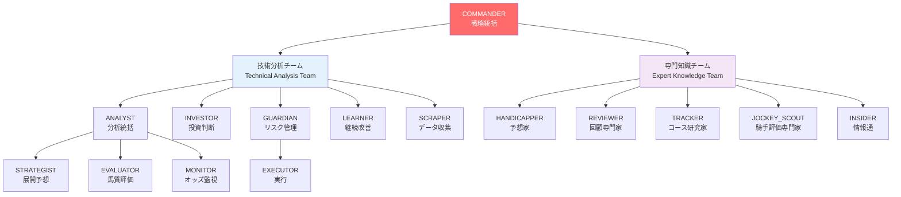
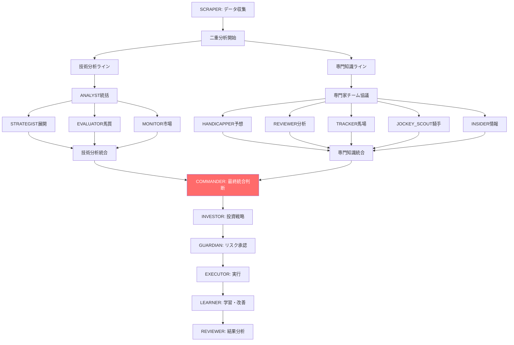

# KeibaCICD 拡張された15エージェント体制 運用ガイドライン

## 新しいチーム構成概要

### 階層的組織構造


### エージェント一覧（15エージェント体制）
| エージェント | チーム | 階層 | 専門分野 | 主要機能 |
|-------------|-------|------|----------|----------|
| **COMMANDER** | 統括 | L1 | 戦略統括 | 全体戦略・リソース配分・危機管理 |
| **ANALYST** | 技術 | L2 | 分析統括 | 技術的統合分析・品質管理 |
| **INVESTOR** | 技術 | L2 | 投資判断 | Kelly基準・ポートフォリオ管理 |
| **GUARDIAN** | 技術 | L2 | リスク管理 | 損失制限・破滅回避・安全管理 |
| **LEARNER** | 技術 | L2 | 継続改善 | AI・機械学習・パフォーマンス向上 |
| **SCRAPER** | 技術 | L2 | データ収集 | 自動データ取得・品質管理 |
| **STRATEGIST** | 技術 | L3 | 展開予想 | レース展開・ペース分析 |
| **EVALUATOR** | 技術 | L3 | 馬質評価 | 馬の能力・適性・コンディション |
| **MONITOR** | 技術 | L3 | オッズ監視 | リアルタイム市場監視・期待値計算 |
| **EXECUTOR** | 技術 | L3 | 実行 | 投資実行・取引管理 |
| **HANDICAPPER** | 専門 | L2 | 予想家 | 総合予想・直感的判断・経験則 |
| **REVIEWER** | 専門 | L2 | 回顧専門家 | レース分析・教訓抽出・パターン発見 |
| **TRACKER** | 専門 | L2 | コース研究家 | 競馬場特性・馬場分析・バイアス検出 |
| **JOCKEY_SCOUT** | 専門 | L2 | 騎手評価専門家 | 騎手技術・相性・戦術評価 |
| **INSIDER** | 専門 | L2 | 情報通 | 関係者動向・市場心理・情報分析 |

## 新しい意思決定フロー

### 統合分析プロセス


### 情報融合の仕組み
```yaml
information_fusion:
  technical_analysis:
    data_driven: "客観的データに基づく分析"
    statistical: "統計的手法・機械学習"
    quantitative: "数値化・定量的評価"
    systematic: "体系的・再現可能な手法"
    
  expert_knowledge:
    experience_based: "長年の経験に基づく判断"
    intuitive: "直感・勘・第六感"
    qualitative: "定性的・主観的評価"
    contextual: "状況・背景を考慮した判断"
    
  fusion_methodology:
    complementary: "互いの弱点を補完"
    validation: "相互検証・確認"
    weighted_integration: "信頼度に応じた統合"
    conflict_resolution: "矛盾時の解決手順"
```

## エージェント間連携マトリクス

### 技術分析チーム内連携
```yaml
technical_team_collaboration:
  ANALYST_to_specialists:
    STRATEGIST: "展開分析指示・品質基準設定"
    EVALUATOR: "馬質評価指示・適性基準設定"
    MONITOR: "市場監視指示・期待値基準設定"
    
  cross_functional:
    STRATEGIST_EVALUATOR: "展開適性の相互確認"
    EVALUATOR_MONITOR: "能力評価と市場価格の整合性"
    MONITOR_INVESTOR: "期待値情報の即座共有"
```

### 専門知識チーム内連携
```yaml
expert_team_collaboration:
  knowledge_sharing:
    HANDICAPPER_REVIEWER: "予想と過去分析の整合確認"
    TRACKER_JOCKEY_SCOUT: "コース適性と騎手適性の統合"
    INSIDER_all_experts: "関係者情報の各専門分野への提供"
    
  cross_validation:
    HANDICAPPER_TRACKER: "直感予想とコース分析の検証"
    REVIEWER_JOCKEY_SCOUT: "過去の騎手成績分析"
    all_experts: "総合的な専門家会議による統合判断"
```

### チーム間融合
```yaml
inter_team_integration:
  technical_to_expert:
    data_validation: "技術分析結果の専門家による検証"
    context_addition: "データに専門知識の文脈を追加"
    bias_correction: "統計的偏向の専門的補正"
    
  expert_to_technical:
    pattern_discovery: "専門知識による新パターンの発見"
    model_improvement: "経験則の機械学習への反映"
    quality_enhancement: "専門的洞察による精度向上"
```

## 日次運用スケジュール（15エージェント体制）

```yaml
enhanced_daily_schedule:
  "06:00-07:00":
    - "SCRAPER: 前日結果・当日データ取得"
    - "INSIDER: 関係者情報・業界動向収集"
    
  "07:00-08:00":
    - "COMMANDER: 戦略ブリーフィング準備"
    - "LEARNER: 夜間学習結果・改善提案"
    - "REVIEWER: 前日レース詳細分析"
    
  "08:00-09:00":
    - "COMMANDER: 全体方針決定・指示"
    - "ANALYST: 技術分析チーム統括開始"
    - "HANDICAPPER: 専門知識チーム統括開始"
    
  "09:00-10:00":
    - "技術分析ライン: STRATEGIST・EVALUATOR・MONITOR同時分析"
    - "専門知識ライン: TRACKER・JOCKEY_SCOUT・INSIDER詳細分析"
    
  "10:00-11:00":
    - "ANALYST: 技術分析統合"
    - "HANDICAPPER: 専門知識統合"
    - "相互情報交換・検証"
    
  "11:00-12:00":
    - "COMMANDER: 最終統合判断"
    - "INVESTOR: 投資戦略決定"
    - "GUARDIAN: リスク最終承認"
    
  "12:00-17:00":
    - "EXECUTOR: 投資実行"
    - "MONITOR: リアルタイム監視"
    - "INSIDER: 当日情報継続収集"
    
  "17:00-20:00":
    - "全エージェント: 結果記録・初期分析"
    - "REVIEWER: 当日回顧分析開始"
    - "LEARNER: 当日学習データ処理"
    
  "20:00-21:00":
    - "COMMANDER: 日次総括・明日方針"
    - "GUARDIAN: 日次リスク評価"
```

## パフォーマンス評価指標

### チーム全体目標（15エージェント体制）
```yaml
enhanced_team_kpis:
  financial_performance:
    annual_roi: "> 25%（技術×専門知識融合効果）"
    sharpe_ratio: "> 2.5"
    max_drawdown: "< 12%"
    hit_rate: "> 75%（専門知識による精度向上）"
    
  prediction_accuracy:
    technical_analysis: "> 70%"
    expert_analysis: "> 72%"
    integrated_analysis: "> 78%（融合効果）"
    dark_horse_discovery: "> 15%（専門家の眼力）"
    
  operational_excellence:
    decision_speed: "統合判断2時間以内"
    information_coverage: "> 95%（多角的情報収集）"
    conflict_resolution: "矛盾解決30分以内"
    innovation_rate: "月2件の改善実装"
```

### 専門知識チーム特有指標
```yaml
expert_team_metrics:
  HANDICAPPER:
    intuitive_accuracy: "> 75%"
    value_discovery: "月5件以上の妙味発見"
    contrarian_success: "逆張り成功率 > 60%"
    
  REVIEWER:
    lesson_extraction: "週3件の実用的教訓"
    pattern_discovery: "月1件の新パターン発見"
    accuracy_improvement: "回顧による精度向上 > 5%"
    
  TRACKER:
    bias_detection: "バイアス検出精度 > 90%"
    course_prediction: "コース影響予測精度 > 85%"
    weather_adaptation: "気象変化対応 > 95%"
    
  JOCKEY_SCOUT:
    compatibility_assessment: "人馬相性評価精度 > 80%"
    condition_evaluation: "騎手調子判定精度 > 85%"
    tactical_optimization: "戦術提案効果 > 70%"
    
  INSIDER:
    information_reliability: "情報信頼度評価精度 > 80%"
    sentiment_analysis: "市場心理読解精度 > 75%"
    early_detection: "重要情報の早期発見率 > 90%"
```

## 競合優位性と特徴

### 他システムとの差別化要因
```yaml
competitive_advantages:
  technical_sophistication:
    - "最新AI技術による高度な分析"
    - "リアルタイムビッグデータ処理"
    - "統計的に有意な予測モデル"
    
  expert_knowledge_depth:
    - "ベテラン専門家の経験則活用"
    - "人間の直感・勘の数値化"
    - "業界内部情報の合法的収集・分析"
    
  unique_fusion:
    - "技術と経験の革新的融合"
    - "客観性と主観性の最適バランス"
    - "多角的視点による死角の排除"
    
  adaptive_learning:
    - "専門知識の機械学習への反映"
    - "エージェント間の相互学習"
    - "市場変化への動的適応"
```

### 期待される成果
```yaml
expected_outcomes:
  accuracy_improvement:
    baseline: "既存技術分析: 67%"
    enhanced: "技術×専門融合: 78%"
    improvement: "+11pp（約16%向上）"
    
  roi_enhancement:
    baseline: "既存システム: 15%"
    enhanced: "15エージェント体制: 25%"
    improvement: "+10pp（約67%向上）"
    
  risk_reduction:
    baseline: "最大ドローダウン: 20%"
    enhanced: "専門リスク管理: 12%"
    improvement: "-8pp（40%リスク削減）"
    
  discovery_capability:
    new_ability: "穴馬発見率: 15%"
    insight_generation: "月10件の新知見"
    market_inefficiency: "非効率発見率: 20%"
```

---

## 実装・運用方針

### 段階的導入計画
1. **Phase 1（2週間）**: 専門知識エージェント5体の基本実装
2. **Phase 2（2週間）**: 技術分析チームとの連携構築
3. **Phase 3（2週間）**: 統合システムの調整・最適化
4. **Phase 4（継続）**: 運用・改善・拡張

### 成功の鍵
- **バランス**: 技術と経験の適切な融合
- **調整**: エージェント間の円滑な連携
- **学習**: 相互フィードバックによる継続改善
- **革新**: 新しい競馬分析手法の確立

この15エージェント体制により、KeibaCICDは技術的な精密さと人間的な洞察力を兼ね備えた、これまでにない高度な競馬予想システムとして進化します。