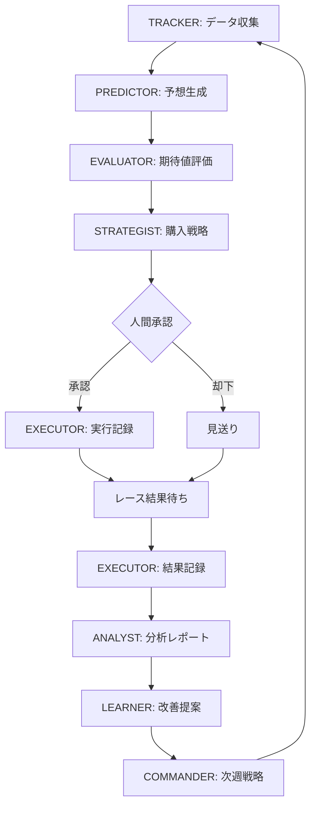

# KeibaCICD エキスパートシステム・アーキテクチャ

**AIチーム協働による馬券購入システムの設計**

このドキュメントでは、予想から購入判断、実行、分析までを担当する各エキスパートAIの役割と連携方法を定義します。

---

## 🎯 システムの全体像

```
┌─────────────────────────────────────────────────────────┐
│                   週末レース予想サイクル                  │
└─────────────────────────────────────────────────────────┘
           │
           ↓
┌─────────────────────────────────────────────────────────┐
│  Phase 1: データ収集（金曜午後）                         │
│  担当: TRACKER                                           │
│  - JRA-VAN最新データ取得                                 │
│  - 週末レース一覧取得                                     │
│  - 出走馬・調教データ収集                                 │
└─────────────────────────────────────────────────────────┘
           │
           ↓
┌─────────────────────────────────────────────────────────┐
│  Phase 2: 予想生成（金曜夜）                             │
│  担当: PREDICTOR (MLモデル)                              │
│  - 各馬の勝率予測                                         │
│  - 馬券圏内確率の算出                                     │
│  - 信頼度スコアの計算                                     │
└─────────────────────────────────────────────────────────┘
           │
           ↓
┌─────────────────────────────────────────────────────────┐
│  Phase 3: 期待値評価（土曜朝）                           │
│  担当: EVALUATOR                                         │
│  - オッズ取得                                             │
│  - 期待値計算（単勝、複勝、馬連...）                     │
│  - 期待値ランキング生成                                   │
└─────────────────────────────────────────────────────────┘
           │
           ↓
┌─────────────────────────────────────────────────────────┐
│  Phase 4: 購入戦略決定（レース30分前）                   │
│  担当: STRATEGIST                                        │
│  - ケリー基準による賭け金計算                             │
│  - リスク評価                                             │
│  - 購入推奨リスト生成                                     │
└─────────────────────────────────────────────────────────┘
           │
           ↓
┌─────────────────────────────────────────────────────────┐
│  Phase 5: 購入実行（人間承認後）                         │
│  担当: EXECUTOR                                          │
│  - 購入指示の整理                                         │
│  - 実行ログ記録                                           │
│  - 結果トラッキング                                       │
└─────────────────────────────────────────────────────────┘
           │
           ↓
┌─────────────────────────────────────────────────────────┐
│  Phase 6: 結果分析（日曜夜）                             │
│  担当: ANALYST                                           │
│  - 収支分析                                               │
│  - 戦略評価                                               │
│  - 改善提案                                               │
└─────────────────────────────────────────────────────────┘
           │
           ↓
┌─────────────────────────────────────────────────────────┐
│  Phase 7: システム改善（月曜）                           │
│  担当: LEARNER                                           │
│  - 失敗パターン分析                                       │
│  - モデル再学習判断                                       │
│  - 戦略パラメータ調整                                     │
└─────────────────────────────────────────────────────────┘
           │
           ↓
┌─────────────────────────────────────────────────────────┐
│  Phase 8: 全体調整（週次）                               │
│  担当: COMMANDER                                         │
│  - 各エージェントの調整                                   │
│  - 優先順位の設定                                         │
│  - 次週の戦略決定                                         │
└─────────────────────────────────────────────────────────┘
```

---

## 👥 エキスパートAIチーム構成

### 1. TRACKER（データ追跡エキスパート）

**役割**: データ収集の自動化と品質管理

**責任範囲**:
- JRA-VAN Data Labからの自動データ取得
- 週末レース情報のスクレイピング
- データの完全性チェック
- 欠損データの検出と通知

**スキル**:
```yaml
tools:
  - Bash (JVLink SDK実行)
  - Glob/Grep (ファイル検索)
  - WebFetch (競馬ブックスクレイピング)
  - Write (データ保存)

outputs:
  - data/weekly_races.json
  - data/horse_training.csv
  - data/odds_snapshot.json
```

**実装**: `.claude/agents/tracker.md`

---

### 2. PREDICTOR（予想エキスパート）

**役割**: 機械学習モデルによる勝率予測

**責任範囲**:
- モデル読み込みと推論実行
- 各馬の勝率・馬券圏内確率の算出
- 信頼度スコアの計算
- 予測結果の記録

**スキル**:
```yaml
tools:
  - Read (モデル・データ読み込み)
  - Bash (Python予測スクリプト実行)
  - Write (予測結果保存)

inputs:
  - ml/models/lightgbm_model.pkl
  - data/weekly_races.json

outputs:
  - predictions/YYYYMMDD_predictions.csv
  - predictions/YYYYMMDD_confidence.json
```

**実装**: `ml/scripts/05_prediction.py` + エージェント設定

---

### 3. EVALUATOR（期待値評価エキスパート）

**役割**: オッズと予測を統合し期待値を計算

**責任範囲**:
- リアルタイムオッズ取得
- 馬券種別ごとの期待値計算
- 期待値ランキング生成
- 購入候補の抽出

**スキル**:
```yaml
tools:
  - Read (予測結果読み込み)
  - WebFetch (オッズ取得)
  - Bash (期待値計算スクリプト実行)
  - Write (評価結果保存)

inputs:
  - predictions/YYYYMMDD_predictions.csv
  - odds API or スクレイピング

outputs:
  - evaluations/YYYYMMDD_expected_values.csv
  - evaluations/YYYYMMDD_recommendations.json
```

**実装**: `ml/betting/evaluator.py` (新規作成)

---

### 4. STRATEGIST（購入戦略エキスパート）

**役割**: 資金管理と最適賭け金の計算

**責任範囲**:
- ケリー基準による賭け金計算
- リスク評価（最大損失、連敗チェック）
- 購入推奨リストの生成
- 戦略パラメータの管理

**スキル**:
```yaml
tools:
  - Read (期待値評価結果読み込み)
  - Bash (戦略計算スクリプト実行)
  - Write (購入指示生成)

inputs:
  - evaluations/YYYYMMDD_expected_values.csv
  - config/strategy_params.json
  - history/bankroll.json

outputs:
  - betting/YYYYMMDD_betting_plan.json
  - betting/YYYYMMDD_risk_report.md
```

**実装**: `ml/betting/strategist.py` (新規作成)

---

### 5. EXECUTOR（実行管理エキスパート）

**役割**: 購入指示の整理と記録

**責任範囲**:
- 購入推奨リストの人間向け整理
- 実行ログの記録
- 結果トラッキング（的中/不的中）
- 収支記録

**スキル**:
```yaml
tools:
  - Read (購入計画読み込み)
  - Write (実行ログ、結果記録)
  - TodoWrite (タスク管理)

inputs:
  - betting/YYYYMMDD_betting_plan.json
  - results/YYYYMMDD_race_results.json (レース後)

outputs:
  - execution/YYYYMMDD_bet_log.json
  - execution/YYYYMMDD_results.csv
  - history/bankroll.json (更新)
```

**実装**: `ml/betting/executor.py` (新規作成)

---

### 6. ANALYST（分析エキスパート）

**役割**: 結果分析と戦略評価

**責任範囲**:
- 週次収支レポート生成
- 戦略別パフォーマンス分析
- 失敗パターンの特定
- 改善提案の作成

**スキル**:
```yaml
tools:
  - Read (実行ログ、結果データ)
  - Bash (分析スクリプト実行)
  - Write (レポート生成)
  - WebSearch (最新競馬ニュース調査)

inputs:
  - execution/YYYYMMDD_results.csv
  - history/all_bets.csv

outputs:
  - reports/weekly_YYYYMMDD.md
  - reports/strategy_evaluation.json
  - reports/improvement_proposals.md
```

**実装**: 既存ANALYSTエージェント + 専用スクリプト

---

### 7. LEARNER（学習改善エキスパート）

**役割**: システムの継続的改善

**責任範囲**:
- モデル性能のモニタリング
- 再学習の必要性判断
- 戦略パラメータの調整提案
- A/Bテスト設計

**スキル**:
```yaml
tools:
  - Read (分析レポート、実験記録)
  - Bash (再学習スクリプト実行)
  - Write (改善計画、実験設計)

inputs:
  - reports/strategy_evaluation.json
  - ml/experiments/*.json

outputs:
  - improvement/YYYYMMDD_retrain_plan.md
  - improvement/YYYYMMDD_param_adjustment.json
  - experiments/exp_YYYYMMDD_*.json
```

**実装**: 既存LEARNERエージェント + 専用スクリプト

---

### 8. COMMANDER（統括エキスパート）

**役割**: 全体調整とプロジェクト管理

**責任範囲**:
- 各エージェントのタスク調整
- 優先順位の設定
- 週次戦略会議の主催
- ドキュメント管理

**スキル**:
```yaml
tools:
  - Task (他エージェント起動)
  - Read (全ドキュメント)
  - Write (議事録、戦略文書)
  - TodoWrite (プロジェクト管理)

outputs:
  - meetings/weekly_YYYYMMDD_minutes.md
  - strategy/current_strategy.md
  - roadmap/YYYY_QX.md
```

**実装**: 既存COMMANDERエージェント

---

## 🔄 エージェント間の連携フロー

### 週次サイクル（金曜〜月曜）



### データフロー

```
raw_data/
  └─ jravan/       (TRACKER収集)
       │
       ↓
predictions/      (PREDICTOR生成)
       │
       ↓
evaluations/      (EVALUATOR計算)
       │
       ↓
betting/          (STRATEGIST決定)
       │
       ↓
execution/        (EXECUTOR記録)
       │
       ↓
reports/          (ANALYST分析)
       │
       ↓
improvement/      (LEARNER提案)
       │
       ↓
strategy/         (COMMANDER統括)
```

---

## 🛠️ 実装ロードマップ

### Phase 1: コア機能実装（2週間）

**Week 1: 予測〜評価**
- [ ] PREDICTOR: 予測スクリプト統合
- [ ] EVALUATOR: 期待値計算エンジン実装
- [ ] データフロー確立

**Week 2: 戦略〜実行**
- [ ] STRATEGIST: ケリー基準実装
- [ ] EXECUTOR: 記録システム実装
- [ ] 手動テスト実行

### Phase 2: 分析・改善（1週間）

**Week 3: 分析基盤**
- [ ] ANALYST: レポート生成自動化
- [ ] LEARNER: 実験管理システム
- [ ] バックテスト実行

### Phase 3: 自動化・連携（1週間）

**Week 4: エージェント連携**
- [ ] COMMANDER: タスク調整機能
- [ ] 各エージェントの自動起動
- [ ] 週次サイクルの自動化

---

## 📊 実験管理フレームワーク

### 実験タイプ

```yaml
experiments:
  - type: "strategy_parameter"
    variants:
      - kelly_fraction: [0.25, 0.5, 0.75, 1.0]
      - min_ev_threshold: [1.05, 1.10, 1.15, 1.20]
      - max_loss_per_day: [0.03, 0.05, 0.10]

  - type: "model_comparison"
    variants:
      - logistic_regression
      - lightgbm
      - ensemble

  - type: "bet_type_selection"
    variants:
      - win_only
      - win_and_place
      - quinella_focus
```

### 実験記録フォーマット

```json
{
  "experiment_id": "exp_20260201_kelly05_ev110",
  "type": "strategy_parameter",
  "params": {
    "kelly_fraction": 0.5,
    "min_ev_threshold": 1.10,
    "min_prob_threshold": 0.15
  },
  "period": {
    "start": "2026-01-01",
    "end": "2026-01-31"
  },
  "results": {
    "total_bets": 45,
    "hit_rate": 0.311,
    "recovery_rate": 1.087,
    "roi": 0.125,
    "sharpe_ratio": 0.45
  },
  "conclusion": "期待値110%以上、Half Kellyで安定した成績。継続採用を推奨。",
  "next_actions": [
    "期待値閾値を1.15に上げてテスト",
    "複勝馬券も組み合わせる"
  ]
}
```

---

## 💬 AIチーム会議フォーマット

### 週次戦略会議（月曜午前）

**参加**: 全エージェント + 人間

**議題**:
1. **先週の実績レビュー** (ANALYST発表)
   - 収支報告
   - 戦略別パフォーマンス
   - 失敗事例分析

2. **改善提案** (LEARNER発表)
   - モデル性能評価
   - パラメータ調整案
   - 新規実験提案

3. **今週の戦略** (STRATEGIST発表)
   - リスク設定
   - 購入方針
   - 特別ルール

4. **タスク調整** (COMMANDER)
   - 各エージェントの担当確認
   - 優先順位設定
   - スケジュール調整

5. **人間の判断**
   - 戦略承認/却下
   - リスク許容度の設定
   - 特別指示

**成果物**:
- `meetings/weekly_YYYYMMDD_minutes.md`
- `strategy/current_strategy.md` (更新)
- `tasks/this_week_tasks.md`

---

## 🎯 成功指標（KPI）

### システムレベル

- **ROI（投資収益率）**: > 10% / 月
- **回収率**: > 100% (長期平均)
- **シャープレシオ**: > 0.5
- **最大ドローダウン**: < 20%

### エージェントレベル

- **PREDICTOR**: AUC > 0.70
- **EVALUATOR**: 期待値計算精度 > 95%
- **STRATEGIST**: 破産確率 < 1%
- **ANALYST**: レポート生成時間 < 10分

### プロセスレベル

- **データ収集成功率**: > 99%
- **予測生成時間**: < 30分
- **購入判断時間**: < 5分
- **実験サイクル**: 週1回以上

---

## 📚 ドキュメント管理

### ドキュメント構成

```
ai-team/knowledge/
  ├─ CLAUDE.md                          # メインガイドライン
  ├─ EXPERT_SYSTEM_ARCHITECTURE.md     # このドキュメント
  └─ agents/
      ├─ TRACKER.md
      ├─ PREDICTOR.md
      ├─ EVALUATOR.md
      ├─ STRATEGIST.md
      ├─ EXECUTOR.md
      ├─ ANALYST.md
      ├─ LEARNER.md
      └─ COMMANDER.md

ml/docs/
  ├─ BETTING_STRATEGY_FRAMEWORK.md     # 購入戦略詳細
  └─ EXPERIMENT_GUIDE.md               # 実験ガイド

strategy/
  ├─ current_strategy.md               # 現在の戦略
  └─ archived/                         # 過去の戦略

meetings/
  └─ weekly_YYYYMMDD_minutes.md        # 議事録

experiments/
  └─ exp_YYYYMMDD_*.json               # 実験記録
```

---

## 🚀 次のステップ

### 即座に実行

1. **COMMANDER**: このドキュメントをレビューし、各エージェントの役割を確認
2. **人間**: 実装優先順位を決定（Phase 1から開始を推奨）
3. **全エージェント**: 自分の担当領域のドキュメント作成

### 今週中に実装

1. **EVALUATOR**: 期待値計算エンジン (`ml/betting/evaluator.py`)
2. **STRATEGIST**: ケリー基準実装 (`ml/betting/strategist.py`)
3. **EXECUTOR**: 記録システム (`ml/betting/executor.py`)

### 今月中に完成

1. 週次サイクルの確立
2. 最初の実験実行
3. 改善サイクルの開始

---

**このシステムで、予想精度だけでなく、購入戦略、資金管理、継続的改善のすべてを機械化し、人間は最終承認と戦略設定に集中できます。**

---

*作成日: 2026-01-30*
*バージョン: 1.0*
*次回更新: Phase 1完了後*
