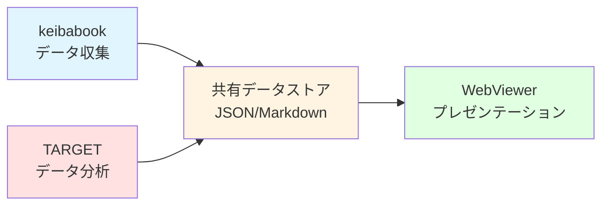
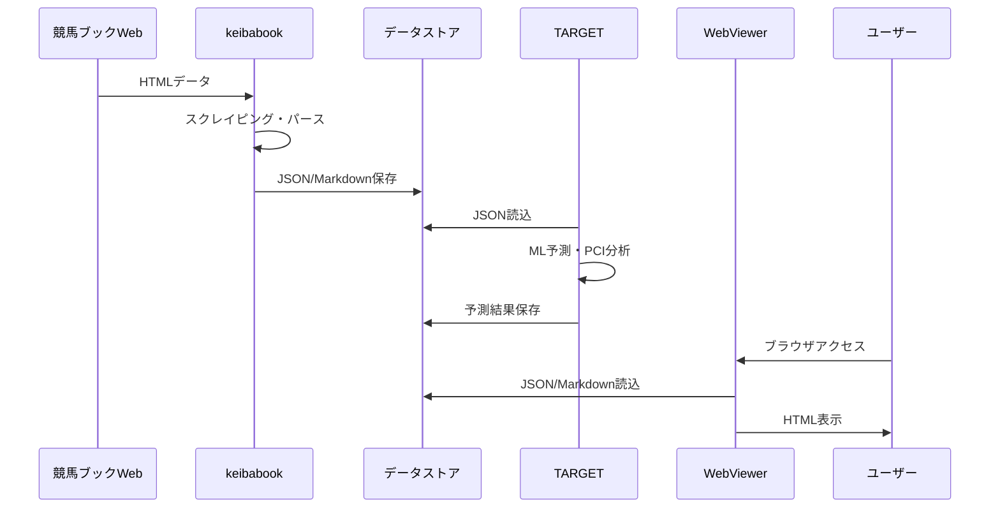

# KeibaCICD モジュール詳細ガイド v3.0

> **最終更新**: 2026-02-06
> **対象バージョン**: v3.0
> **関連**: [ARCHITECTURE.md](./ARCHITECTURE.md), [SETUP_GUIDE.md](./SETUP_GUIDE.md)

---

## 📋 目次

1. [モジュール概要](#モジュール概要)
2. [KeibaCICD.keibabook](#keibacicdk新聞book)
3. [KeibaCICD.TARGET](#keibacicdt新聞rget)
4. [KeibaCICD.WebViewer](#keibacicのwebviewer)
5. [モジュール間連携](#モジュール間連携)
6. [主要クラス・関数リファレンス](#主要クラス関数リファレンス)

---

## 🧩 モジュール概要

KeibaCICDは3つの独立モジュールで構成され、それぞれが明確な責任範囲を持ちます。



| モジュール | 責務 | 主要技術 | 入力 | 出力 |
|-----------|------|---------|------|------|
| **keibabook** | Webスクレイピング・データ統合 | Python, Selenium, requests | 競馬ブックWeb | JSON/Markdown |
| **TARGET** | JRA-VAN連携・ML分析 | Python, LightGBM, XGBoost | JRA-VAN SDK, JSON | 指数・予測JSON |
| **WebViewer** | データ表示・UI | Next.js, React, TypeScript | JSON/Markdown | WebブラウザUI |

---

## 📦 KeibaCICD.keibabook

### 概要

競馬ブックWebサイトからのデータ自動収集・統合モジュール。

**場所**: `keiba-cicd-core/KeibaCICD.keibabook/`

**主要機能**:
- 成績・出馬表・調教・談話データのスクレイピング
- レース情報の統合（RaceDataIntegrator）
- JSON/Markdown形式での出力

---

### ディレクトリ構造

```
KeibaCICD.keibabook/
├── src/
│   ├── batch/                          # バッチ処理システム
│   │   ├── core/
│   │   │   └── common.py               # 共通ユーティリティ
│   │   ├── data_fetcher.py             # 従来版データ取得
│   │   └── optimized_data_fetcher.py   # 最適化版データ取得
│   ├── scrapers/                       # スクレイパー層
│   │   ├── requests_scraper.py         # 高速版（推奨）
│   │   ├── keibabook_scraper.py        # Selenium版
│   │   ├── horse_detail_scraper.py     # 馬詳細
│   │   └── jockey_scraper.py           # 騎手データ
│   ├── parsers/                        # パーサー層
│   │   ├── base_parser.py              # パーサー基底クラス
│   │   ├── seiseki_parser.py           # 成績データ解析
│   │   ├── syutuba_parser.py           # 出馬表データ解析
│   │   ├── cyokyo_parser.py            # 調教データ解析
│   │   ├── danwa_parser.py             # 厩舎談話解析
│   │   └── paddok_parser.py            # パドック情報解析
│   ├── integrator/                     # 統合層
│   │   ├── race_data_integrator.py     # レースデータ統合
│   │   ├── markdown_generator.py       # Markdown生成（従来版）
│   │   └── markdown_generator_enhanced.py # Markdown生成（新版）
│   ├── utils/                          # ユーティリティ
│   │   ├── config.py                   # 設定管理
│   │   ├── logger.py                   # ログ管理
│   │   └── file_organizer.py           # ファイル整理
│   ├── analysis/                       # 分析ツール
│   │   ├── expected_value_calculator.py # 期待値計算
│   │   └── prediction_tracker.py       # 予想追跡
│   ├── main.py                         # メインエントリーポイント
│   ├── fast_batch_cli.py               # 高速バッチCLI ⭐推奨
│   ├── batch_cli.py                    # 従来版バッチCLI
│   ├── integrator_cli.py               # 統合CLI
│   └── markdown_cli.py                 # Markdown新聞CLI
├── api/
│   └── main.py                         # FastAPI管理サーバー
├── gui/                                # Next.js管理画面
└── docs/                               # ドキュメント
```

---

### 主要コンポーネント

#### 1. Scrapers（スクレイパー層）

**requests_scraper.py** - 高速版スクレイパー（推奨）

[src/scrapers/requests_scraper.py](../../keiba-cicd-core/KeibaCICD.keibabook/src/scrapers/requests_scraper.py)

**特徴**:
- HTTP直接リクエスト（Selenium不使用）
- 並列処理対応（複数レース同時取得）
- Cookie認証、リトライ機能搭載

**使用例**:
```python
from scrapers.requests_scraper import RequestsScraper

scraper = RequestsScraper()
html = scraper.fetch_race_data(
    race_id="2026020101010101",
    data_type="seiseki"
)
```

---

**keibabook_scraper.py** - Selenium版スクレイパー

[src/scrapers/keibabook_scraper.py](../../keiba-cicd-core/KeibaCICD.keibabook/src/scrapers/keibabook_scraper.py)

**特徴**:
- ブラウザ自動化（JavaScript実行対応）
- 安定性重視（動的コンテンツ対応）
- リトライ・エラー分類機能

---

#### 2. Parsers（パーサー層）

各データタイプごとに専用パーサーを実装。

| パーサー | 対象データ | 主要フィールド |
|---------|-----------|--------------|
| **seiseki_parser.py** | 成績データ | 着順、タイム、通過順位、上がり3F |
| **syutuba_parser.py** | 出馬表 | 馬名、騎手、斤量、オッズ |
| **cyokyo_parser.py** | 調教データ | 調教タイム、コース、調教師コメント |
| **danwa_parser.py** | 厩舎談話 | 調教師コメント、陣営評価 |
| **paddok_parser.py** | パドック | 馬体重、馬体評価 |

**使用例**:
```python
from parsers.seiseki_parser import SeisekiParser

parser = SeisekiParser()
data = parser.parse(html)
# => {'horses': [...], 'race_info': {...}}
```

---

#### 3. Integrator（統合層）

**RaceDataIntegrator** - レースデータ統合エンジン

[src/integrator/race_data_integrator.py](../../keiba-cicd-core/KeibaCICD.keibabook/src/integrator/race_data_integrator.py)

**責務**:
- 複数データソース（成績・出馬・調教・談話）の統合
- データバージョン管理
- メタデータ付与

**使用例**:
```python
from integrator.race_data_integrator import RaceDataIntegrator

integrator = RaceDataIntegrator()
integrated = integrator.integrate_race_data(
    date="2026-02-08",
    venue="東京",
    race_num=11
)
# => {'race_info': {...}, 'horses': [...], 'metadata': {...}}
```

**出力形式**:
```json
{
  "race_info": {
    "race_id": "2026020801011011",
    "race_name": "東京新聞杯",
    "grade": "G3"
  },
  "horses": [
    {
      "umaban": 1,
      "horse_name": "ドウデュース",
      "jockey": "福永祐一",
      "weight": 58.0
    }
  ],
  "metadata": {
    "data_version": "2.0",
    "created_at": "2026-02-08T10:00:00",
    "data_sources": {
      "seiseki": "OK",
      "shutsuba": "OK",
      "cyokyo": "OK"
    }
  }
}
```

---

### CLIツール

#### fast_batch_cli.py ⭐推奨

[src/fast_batch_cli.py](../../keiba-cicd-core/KeibaCICD.keibabook/src/fast_batch_cli.py)

**用途**: 指定日の全レースデータ一括取得（高速版）

**使用例**:
```bash
# 2026-02-08の全競馬場データ取得
python src/fast_batch_cli.py --date 2026-02-08

# 東京のみ取得
python src/fast_batch_cli.py --date 2026-02-08 --venue 東京
```

**オプション**:
- `--date YYYY-MM-DD`: 対象日付（必須）
- `--venue 競馬場名`: 特定競馬場のみ取得
- `--type データタイプ`: seiseki, syutuba, cyokyo等を指定

---

#### integrator_cli.py

[src/integrator_cli.py](../../keiba-cicd-core/KeibaCICD.keibabook/src/integrator_cli.py)

**用途**: 統合JSON生成

**使用例**:
```bash
# 2026-02-08の統合JSON生成
python src/integrator_cli.py --date 2026-02-08
```

**出力**:
```
C:/KEIBA-CICD/data2/organized/2026/02/08/{競馬場}/
└── integrated_{RACE_ID}.json
```

---

#### markdown_cli.py

[src/markdown_cli.py](../../keiba-cicd-core/KeibaCICD.keibabook/src/markdown_cli.py)

**用途**: Markdown新聞生成

**使用例**:
```bash
# 2026-02-08のMarkdown新聞生成
python src/markdown_cli.py --date 2026-02-08
```

**出力**:
```
C:/KEIBA-CICD/data2/organized/2026/02/08/{競馬場}/
└── {RACE_ID}.md
```

---

## 🎯 KeibaCICD.TARGET

### 概要

JRA-VANデータ解析・機械学習予測モジュール。

**場所**: `keiba-cicd-core/KeibaCICD.TARGET/`

**主要機能**:
- JRA-VAN統合ライブラリ（ID変換・データアクセス）
- PCI（ペース指数）分析
- 機械学習による勝率予測（LightGBM/XGBoost）
- 期待値計算（オッズ×勝率）

---

### ディレクトリ構造

```
KeibaCICD.TARGET/
├── common/
│   ├── jravan/                         # JRA-VAN統合ライブラリ ⭐
│   │   ├── __init__.py                 # 統一インターフェース
│   │   ├── id_converter.py             # 馬名⇔JRA-VAN ID変換
│   │   ├── race_id.py                  # レースID操作（16桁⇔18桁）
│   │   ├── data_access.py              # データ取得API
│   │   ├── trainer_mapper.py           # 調教師ID変換
│   │   ├── rt_data.py                  # RT（馬成績）データ
│   │   └── parsers/
│   │       ├── ck_parser.py            # 調教データパーサー
│   │       ├── um_parser.py            # 馬マスタパーサー
│   │       ├── de_parser.py            # 馬毎成績パーサー
│   │       └── se_parser.py            # レース成績パーサー
│   ├── config.py                       # 設定管理
│   └── __init__.py
├── scripts/
│   ├── horse_id_mapper.py              # 馬IDマッパー・インデックス構築
│   ├── parse_ck_data.py                # CKデータパーサー（レガシー）
│   ├── analyze_pci_csv.py              # PCI基準値分析
│   ├── training_summary.py             # 調教データ集計
│   └── [20+ その他ユーティリティ]
├── ml/                                 # 機械学習モジュール
│   ├── scripts/
│   │   ├── 01_data_preparation.py      # データ準備
│   │   ├── 02_feature_engineering.py   # 特徴エンジニアリング
│   │   ├── 03_model_training.py        # モデル訓練
│   │   ├── 04_backtest.py              # バックテスト
│   │   └── 05_prediction.py            # 予測実行
│   ├── betting/
│   │   ├── odds_manager.py             # オッズ管理
│   │   └── evaluator.py                # 期待値評価
│   └── requirements.txt
├── data/
│   ├── horse_name_index.json           # 馬名インデックス（2MB+）
│   └── pci_standards.json              # PCI基準値マスタ
└── docs/jravan/                        # JRA-VANドキュメント
    ├── README.md
    ├── USAGE_GUIDE.md
    ├── QUICK_REFERENCE.md
    └── data-types/
```

---

### 主要コンポーネント

#### 1. JRA-VAN統合ライブラリ（common/jravan）

**統一インターフェース** - `common/jravan/__init__.py`

[common/jravan/__init__.py](../../keiba-cicd-core/KeibaCICD.TARGET/common/jravan/__init__.py)

**提供機能**:

```python
from common.jravan import (
    # ID変換
    get_horse_id_by_name,      # 馬名 → JRA-VAN 10桁ID
    get_horse_name_by_id,      # ID → 馬名
    search_horses_by_name,     # 部分一致検索

    # レースID操作
    build_race_id,             # レースID構築
    parse_race_id,             # レースIDパース

    # データ取得
    get_horse_info,            # 馬基本情報（UM_DATA）
    analyze_horse_training,    # 調教データ分析（CK_DATA）
    get_trainer_info,          # 調教師情報
    get_race_results,          # レース結果（SE_DATA）
)
```

**使用例**:

```python
# 馬名からJRA-VAN IDに変換
horse_id = get_horse_id_by_name("ドウデュース")
# => "2019103487"

# 調教データ取得
training = analyze_horse_training("ドウデュース", "20260125")
if training["final"]:
    final = training["final"]
    print(f"最終追切: {final['time_4f']:.1f}s [{final['speed_class']}]")
    # => 最終追切: 52.3s [A]

# 馬の基本情報取得
info = get_horse_info("ドウデュース")
print(f"{info['name']} ({info['sex']}{info['age']}歳) {info['trainer_name']}")
# => ドウデュース (牡5歳) 友道康夫
```

**ドキュメント**:
- [JRA-VAN README](../../keiba-cicd-core/KeibaCICD.TARGET/docs/jravan/README.md)
- [使用ガイド](../../keiba-cicd-core/KeibaCICD.TARGET/docs/jravan/USAGE_GUIDE.md)
- [クイックリファレンス](../../keiba-cicd-core/KeibaCICD.TARGET/docs/jravan/QUICK_REFERENCE.md)

---

#### 2. ID変換（id_converter.py）

**HorseIdMapper** - 馬名⇔JRA-VAN ID変換

[common/jravan/id_converter.py](../../keiba-cicd-core/KeibaCICD.TARGET/common/jravan/id_converter.py)

**機能**:
- 馬名インデックス構築・検索
- 部分一致検索
- 最新レース情報取得

**インデックス構築**:
```bash
python scripts/horse_id_mapper.py --build-index
```

**出力**:
```json
{
  "ドウデュース": {
    "id": "2019103487",
    "name": "ドウデュース",
    "latest_race_id": "2026020801011011"
  }
}
```

---

#### 3. PCI分析（analyze_pci_csv.py）

**PCI（ペース指数）分析エンジン**

[scripts/analyze_pci_csv.py](../../keiba-cicd-core/KeibaCICD.TARGET/scripts/analyze_pci_csv.py)

**機能**:
- 競馬場・距離別PCI基準値算出
- レース種別（芝/ダ、クラス）別統計
- 異常値検出・除外

**使用例**:
```bash
python scripts/analyze_pci_csv.py
```

**出力**:
```
C:/KEIBA-CICD/data2/target/pci_standards.json
```

**PCI基準値例**:
```json
{
  "東京": {
    "1600": {
      "芝": {
        "mean": 60.5,
        "std": 3.2
      }
    }
  }
}
```

---

#### 4. 機械学習パイプライン（ml/scripts/）

**01_data_preparation.py** - データ準備

[ml/scripts/01_data_preparation.py](../../keiba-cicd-core/KeibaCICD.TARGET/ml/scripts/01_data_preparation.py)

**機能**:
- keibabook統合JSONの読み込み
- JRA-VANデータとの統合
- 前処理（欠損値処理、異常値除外）

---

**02_feature_engineering.py** - 特徴エンジニアリング

[ml/scripts/02_feature_engineering.py](../../keiba-cicd-core/KeibaCICD.TARGET/ml/scripts/02_feature_engineering.py)

**生成特徴量**:
- 過去成績統計（平均着順、勝率等）
- 調教評価（スピード分類、本数評価）
- 騎手・調教師統計
- コース適性（芝/ダ、距離別勝率）

---

**03_model_training.py** - モデル訓練

[ml/scripts/03_model_training.py](../../keiba-cicd-core/KeibaCICD.TARGET/ml/scripts/03_model_training.py)

**アルゴリズム**:
- LightGBM（デフォルト）
- XGBoost
- ハイパーパラメータ調整（Optuna）

**使用例**:
```bash
python ml/scripts/03_model_training.py
```

**出力**:
```
C:/KEIBA-CICD/data2/target/ml/03_models/
├── lightgbm_model.pkl
└── scaler.pkl
```

---

**05_prediction.py** - 予測実行

[ml/scripts/05_prediction.py](../../keiba-cicd-core/KeibaCICD.TARGET/ml/scripts/05_prediction.py)

**機能**:
- 訓練済みモデル読み込み
- 指定日レースの勝率予測
- 期待値計算（オッズ×勝率）

**使用例**:
```bash
python ml/scripts/05_prediction.py --date 2026-02-08
```

**出力**:
```json
{
  "2026020801011011": {
    "predictions": [
      {
        "umaban": 1,
        "win_prob": 0.35,
        "odds": 2.5,
        "expected_value": 0.875
      }
    ]
  }
}
```

---

## 🌐 KeibaCICD.WebViewer

### 概要

レースデータ可視化・Web UIモジュール。

**場所**: `keiba-cicd-core/KeibaCICD.WebViewer/`

**主要機能**:
- レース情報のWeb表示
- 馬プロファイル表示
- JRA映像マルチビュー
- メモ機能・資金管理

---

### ディレクトリ構造

```
KeibaCICD.WebViewer/
├── src/
│   ├── app/                            # Next.js App Router
│   │   ├── page.tsx                    # トップページ
│   │   ├── races-v2/[date]/[track]/[id]/page.tsx # レース詳細
│   │   ├── horses-v2/[id]/page.tsx     # 馬プロファイル
│   │   ├── multi-view/page.tsx         # マルチビュー
│   │   ├── admin/page.tsx              # 管理画面
│   │   └── api/                        # REST API
│   │       ├── races/route.ts          # レース一覧API
│   │       ├── horses/search/route.ts  # 馬検索API
│   │       └── notes/route.ts          # メモAPI
│   ├── components/
│   │   ├── ui/                         # shadcn/ui コンポーネント
│   │   ├── race-v2/                    # レース表示コンポーネント
│   │   ├── horse-v2/                   # 馬プロファイルコンポーネント
│   │   └── bankroll/                   # 資金管理コンポーネント
│   ├── lib/
│   │   ├── data/
│   │   │   ├── race-reader.ts          # レースデータ読込
│   │   │   └── horse-reader.ts         # 馬データ読込
│   │   └── config.ts                   # 設定管理
│   └── types/
│       └── index.ts                    # TypeScript型定義
├── user-data/                          # ローカル永続化
│   ├── notes/                          # レースメモ
│   └── horse-memo/                     # 馬メモ
└── package.json
```

---

### 主要コンポーネント

#### 1. API Routes

**GET /api/races?date=YYYY-MM-DD** - レース一覧取得

[src/app/api/races/route.ts](../../keiba-cicd-core/KeibaCICD.WebViewer/src/app/api/races/route.ts)

**レスポンス**:
```json
[
  {
    "race_id": "2026020801011011",
    "race_name": "東京新聞杯",
    "venue": "東京",
    "race_num": 11
  }
]
```

---

**GET /api/horses/search?query=馬名** - 馬検索

[src/app/api/horses/search/route.ts](../../keiba-cicd-core/KeibaCICD.WebViewer/src/app/api/horses/search/route.ts)

**レスポンス**:
```json
[
  {
    "id": "2019103487",
    "name": "ドウデュース",
    "profile_path": "/horses/profiles/2019103487_ドウデュース.md"
  }
]
```

---

#### 2. ページコンポーネント

**レース詳細ページ** - `app/races-v2/[date]/[track]/[id]/page.tsx`

[src/app/races-v2/[date]/[track]/[id]/page.tsx](../../keiba-cicd-core/KeibaCICD.WebViewer/src/app/races-v2/[date]/[track]/[id]/page.tsx)

**表示内容**:
- 出走表（HorseEntryTable）
- 調教情報（TrainingInfoSection）
- 予想セクション（PredictionSection）
- レース結果（RaceResultSection）
- メモ機能（RaceMemoSection）

---

**馬プロファイルページ** - `app/horses-v2/[id]/page.tsx`

[src/app/horses-v2/[id]/page.tsx](../../keiba-cicd-core/KeibaCICD.WebViewer/src/app/horses-v2/[id]/page.tsx)

**表示内容**:
- 基本情報（血統、性別、年齢）
- 過去レース成績（HorsePastRacesTable）
- ユーザーメモ（HorseUserMemo）

---

#### 3. データ読込モジュール

**race-reader.ts** - レースデータ読込

[src/lib/data/race-reader.ts](../../keiba-cicd-core/KeibaCICD.WebViewer/src/lib/data/race-reader.ts)

**機能**:
- Markdown形式レース情報の読込
- JSON形式統合レース情報の読込
- メタデータパース

**使用例**:
```typescript
import { readRaceData } from '@/lib/data/race-reader';

const raceData = await readRaceData({
  date: '2026-02-08',
  venue: '東京',
  raceNum: 11
});
```

---

## 🔗 モジュール間連携

### データフロー図



---

### モジュール間インターフェース

#### keibabook → データストア

**出力パス**:
```
C:/KEIBA-CICD/data2/organized/YYYY/MM/DD/{競馬場}/
├── integrated_{RACE_ID}.json
└── {RACE_ID}.md
```

**フォーマット**: JSON（RaceDataIntegrator仕様）

---

#### データストア → TARGET

**入力パス**:
```
C:/KEIBA-CICD/data2/organized/YYYY/MM/DD/{競馬場}/integrated_{RACE_ID}.json
```

**処理**: `ml/scripts/01_data_preparation.py` で読込

---

#### TARGET → データストア

**出力パス**:
```
C:/KEIBA-CICD/data2/target/
├── predictions.json
├── race_marks.json
└── pci_standards.json
```

---

#### データストア → WebViewer

**入力パス**:
```
C:/KEIBA-CICD/data2/organized/YYYY/MM/DD/{競馬場}/*.md
C:/KEIBA-CICD/data2/target/predictions.json
```

**処理**: `lib/data/race-reader.ts` で読込

---

## 📚 主要クラス・関数リファレンス

### keibabook

| クラス/関数 | 場所 | 用途 |
|-----------|------|------|
| `RequestsScraper` | `src/scrapers/requests_scraper.py` | HTTP直接リクエストスクレイパー |
| `RaceDataIntegrator` | `src/integrator/race_data_integrator.py` | レースデータ統合 |
| `SeisekiParser` | `src/parsers/seiseki_parser.py` | 成績データパーサー |
| `Config` | `src/utils/config.py` | 設定管理（環境変数・Cookie） |

---

### TARGET

| クラス/関数 | 場所 | 用途 |
|-----------|------|------|
| `get_horse_id_by_name()` | `common/jravan/__init__.py` | 馬名→JRA-VAN ID変換 |
| `analyze_horse_training()` | `common/jravan/__init__.py` | 調教データ分析 |
| `HorseIdMapper` | `common/jravan/id_converter.py` | 馬名インデックス管理 |
| `CKParser` | `common/jravan/parsers/ck_parser.py` | 調教データパーサー |

---

### WebViewer

| クラス/関数 | 場所 | 用途 |
|-----------|------|------|
| `readRaceData()` | `src/lib/data/race-reader.ts` | レースデータ読込 |
| `HorseEntryTable` | `src/components/race-v2/HorseEntryTable.tsx` | 出走表コンポーネント |
| `MultiView` | `src/app/multi-view/page.tsx` | JRA映像マルチビュー |

---

## 🔗 関連ドキュメント

- **[ARCHITECTURE.md](./ARCHITECTURE.md)** - システム全体構成
- **[SETUP_GUIDE.md](./SETUP_GUIDE.md)** - 環境構築手順
- **[CLAUDE.md](./CLAUDE.md)** - 統合ガイドライン
- **[DATA_SPECIFICATION.md](./DATA_SPECIFICATION.md)** - データ仕様書
- **[JRA-VAN使用ガイド](../../keiba-cicd-core/KeibaCICD.TARGET/docs/jravan/USAGE_GUIDE.md)** - JRA-VANライブラリ詳細

---

**作成者**: カカシ（AI相談役）
**承認**: ふくだ君
**次回レビュー予定**: 2026-03-01
