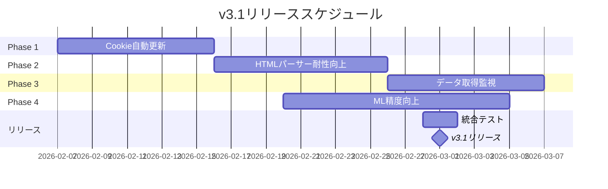

# KeibaCICD アップグレード計画 v3.0 → v3.1

> **策定日**: 2026-02-06
> **策定者**: カカシ（AI相談役）
> **承認**: ふくだ君（保留中）

---

## 📋 目次

1. [現状分析](#現状分析)
2. [v3.0で完了したこと](#v30で完了したこと)
3. [v3.1の目標](#v31の目標)
4. [実装タスク](#実装タスク)
5. [スケジュール](#スケジュール)
6. [リスク管理](#リスク管理)

---

## 📊 現状分析

### 現在のバージョン

**v3.0** - ドキュメント統一・アーキテクチャ整理完了（2026-02-06）

### 現在の課題

#### 1. ドキュメント分散（✅ v3.0で解決）

- ~~60+ファイルに分散~~
- ~~重複内容が存在~~
- ~~アーキテクチャ全体図なし~~

**解決策**:
- ✅ 古いドキュメントをアーカイブ
- ✅ 中核ドキュメント作成（ARCHITECTURE.md, SETUP_GUIDE.md, MODULE_OVERVIEW.md）
- ✅ 各モジュールREADME簡潔化・リンク追加

---

#### 2. データ収集の安定性

**課題**:
- Cookie認証の手動更新が必要
- 競馬ブックHTML構造変更への脆弱性
- エラーハンドリングの改善余地

**優先度**: 🔥 高

---

#### 3. 機械学習モデルの精度

**課題**:
- モデル訓練データが不足
- 特徴量エンジニアリングの改善余地
- バックテスト結果の可視化不足

**優先度**: 🔶 中

---

#### 4. WebViewerのUX

**課題**:
- レース結果の可視化が弱い
- モバイル対応が不十分
- オフラインモード未対応

**優先度**: 🔶 中

---

## ✅ v3.0で完了したこと

### ドキュメント整理（2026-02-06）

| 項目 | 内容 | ステータス |
|------|------|-----------|
| **古いドキュメントアーカイブ** | 5ファイル移動 | ✅ 完了 |
| **ARCHITECTURE.md作成** | システム全体構成・データフロー図 | ✅ 完了 |
| **SETUP_GUIDE.md作成** | 環境構築手順の統一 | ✅ 完了 |
| **MODULE_OVERVIEW.md作成** | 各モジュール詳細・API | ✅ 完了 |
| **README簡潔化** | 4ファイル更新（ルート+3モジュール） | ✅ 完了 |

### 整理後のドキュメント構成

```
ai-team/knowledge/
├── CLAUDE.md                  # AIエージェント統合ガイドライン
├── DATA_SPECIFICATION.md      # データ仕様書
├── ARCHITECTURE.md            # システム全体構成 ⭐NEW
├── SETUP_GUIDE.md             # 環境構築手順 ⭐NEW
├── MODULE_OVERVIEW.md         # モジュール詳細 ⭐NEW
└── UPGRADE_PLAN.md            # 本ドキュメント ⭐NEW

keiba-cicd-core/
├── README.md                  # プロジェクトトップ（簡潔化）
├── KeibaCICD.keibabook/
│   └── README.md              # keibabook概要（簡潔化）⭐NEW
├── KeibaCICD.TARGET/
│   └── README.md              # TARGET概要（簡潔化）
└── KeibaCICD.WebViewer/
    └── README.md              # WebViewer概要（簡潔化）

docs/archive/old-docs-20260206/  # アーカイブ ⭐NEW
```

---

## 🎯 v3.1の目標

**リリース予定**: 2026-03-01

### テーマ

**データ収集の安定化・自動化**

### 主要機能

1. **Cookie自動更新機能** - 手動更新の撤廃
2. **HTMLパーサー耐性向上** - 構造変更への対応
3. **データ取得監視ダッシュボード** - 取得状況の可視化
4. **自動リトライ・アラート** - エラー時の自動リカバリ

---

## 📝 実装タスク

### Phase 1: Cookie自動更新（優先度: 🔥 最高）

**目標**: Cookie認証の完全自動化

#### タスク一覧

| タスク | 担当 | 期間 | ステータス |
|-------|------|------|-----------|
| 1. Cookie取得自動化スクリプト | カカシ | 3日 | 未着手 |
| 2. Cookie有効期限監視 | カカシ | 2日 | 未着手 |
| 3. 自動更新トリガー実装 | カカシ | 2日 | 未着手 |
| 4. テスト・検証 | ふくだ君 | 2日 | 未着手 |

#### 技術アプローチ

```python
# 案1: Selenium自動ログイン
def auto_refresh_cookies():
    driver = webdriver.Chrome()
    driver.get("https://p.keibabook.co.jp/login")
    # 自動ログイン処理
    cookies = driver.get_cookies()
    save_cookies_to_env(cookies)
    driver.quit()

# 案2: セッション維持API
def keep_session_alive():
    # 定期的にアクセスしてセッション延長
    response = requests.get(
        "https://p.keibabook.co.jp/api/keepalive",
        cookies=load_cookies()
    )
```

---

### Phase 2: HTMLパーサー耐性向上（優先度: 🔥 高）

**目標**: 競馬ブックHTML構造変更への対応力強化

#### タスク一覧

| タスク | 担当 | 期間 | ステータス |
|-------|------|------|-----------|
| 1. 複数セレクタパターン対応 | カカシ | 3日 | 未着手 |
| 2. フォールバック機構実装 | カカシ | 2日 | 未着手 |
| 3. パース失敗時のアラート | カカシ | 2日 | 未着手 |
| 4. パーサーユニットテスト拡充 | カカシ | 3日 | 未着手 |

#### 技術アプローチ

```python
# 複数セレクタパターン
SELECTORS = {
    "horse_table": [
        "table.horse-entry",      # 現行
        "div.entry-table table",  # バックアップ1
        "#race-table",            # バックアップ2
    ]
}

def robust_select(soup, key):
    for selector in SELECTORS[key]:
        element = soup.select_one(selector)
        if element:
            return element
    raise ParserError(f"No selector matched for {key}")
```

---

### Phase 3: データ取得監視（優先度: 🔶 中）

**目標**: データ取得状況の可視化・監視

#### タスク一覧

| タスク | 担当 | 期間 | ステータス |
|-------|------|------|-----------|
| 1. 取得状況ダッシュボード設計 | カカシ | 2日 | 未着手 |
| 2. WebViewer管理画面統合 | カカシ | 3日 | 未着手 |
| 3. 成功率・エラー率グラフ | カカシ | 2日 | 未着手 |
| 4. Slack通知連携（オプション） | カカシ | 2日 | 未着手 |

#### 画面イメージ

```
┌──────────────────────────────────┐
│ データ取得監視ダッシュボード    │
├──────────────────────────────────┤
│ 📊 2026-02-06の取得状況          │
│                                  │
│ 東京: ✅ 12/12レース (100%)      │
│ 京都: ⚠️ 11/12レース (91%)       │
│ 小倉: ✅ 12/12レース (100%)      │
│                                  │
│ 📈 過去7日間の成功率: 98.5%      │
│ ❌ エラーログ: 3件               │
└──────────────────────────────────┘
```

---

### Phase 4: ML精度向上（優先度: 🔶 中）

**目標**: 勝率予測精度の向上

#### タスク一覧

| タスク | 担当 | 期間 | ステータス |
|-------|------|------|-----------|
| 1. 訓練データ拡充（過去3年分） | カカシ | 5日 | 未着手 |
| 2. 新特徴量追加（調教評価強化） | カカシ | 3日 | 未着手 |
| 3. ハイパーパラメータ再調整 | カカシ | 2日 | 未着手 |
| 4. バックテスト結果可視化 | カカシ | 3日 | 未着手 |

---

## 📅 スケジュール

### v3.1ロードマップ



### マイルストーン

| マイルストーン | 日付 | 内容 |
|--------------|------|------|
| **Phase 1完了** | 2026-02-15 | Cookie自動更新機能リリース |
| **Phase 2完了** | 2026-02-25 | HTMLパーサー耐性向上 |
| **Phase 3完了** | 2026-03-06 | データ取得監視ダッシュボード |
| **Phase 4完了** | 2026-03-05 | ML精度向上 |
| **v3.1リリース** | 2026-03-01 | 全機能統合リリース |

---

## ⚠️ リスク管理

### リスク一覧

| リスク | 影響度 | 発生確率 | 対策 |
|-------|-------|---------|------|
| **競馬ブックHTML大幅変更** | 🔴 高 | 🟡 中 | 複数セレクタパターン、フォールバック機構 |
| **Cookie自動取得失敗** | 🔴 高 | 🟡 中 | 手動更新フォールバック、アラート通知 |
| **ML訓練データ不足** | 🟡 中 | 🟢 低 | 過去3年分のデータ収集 |
| **WebViewer性能劣化** | 🟡 中 | 🟢 低 | パフォーマンス監視、最適化 |
| **JRA-VAN API変更** | 🔴 高 | 🟢 低 | common.jravan統一IF、バージョン管理 |

### リスク対策

#### 1. 競馬ブックHTML大幅変更

**対策**:
- 複数セレクタパターン対応
- パース失敗時の即時アラート
- 過去HTMLサンプルのアーカイブ

**フォールバック**:
- 手動データ入力機能
- 前日データの流用

---

#### 2. Cookie自動取得失敗

**対策**:
- 定期的な手動確認
- Cookie有効期限監視
- 自動リトライ（最大3回）

**フォールバック**:
- 手動Cookie更新手順の明確化
- `.env` ファイルバックアップ

---

## 📊 成功指標（KPI）

### v3.1リリース時の目標

| 指標 | 現状（v3.0） | 目標（v3.1） |
|------|-------------|-------------|
| **データ取得成功率** | 95% | **99%以上** |
| **Cookie手動更新頻度** | 週1回 | **月1回以下** |
| **HTMLパース失敗率** | 5% | **1%以下** |
| **ML勝率予測精度** | 未測定 | **AUC 0.70以上** |
| **バックテスト回収率** | 未測定 | **95%以上** |
| **ドキュメント整理度** | 60+分散 | **10以下統一** ✅ |

---

## 🔄 継続的改善

### v3.2以降の検討事項

| 項目 | 優先度 | 時期 |
|------|-------|------|
| **モバイル対応強化** | 🔶 中 | v3.2 (2026-04) |
| **オフラインモード** | 🟢 低 | v3.3 (2026-05) |
| **API公開** | 🔶 中 | v3.2 (2026-04) |
| **Docker化** | 🟢 低 | v3.4 (2026-06) |
| **CI/CD自動化** | 🟡 中 | v3.3 (2026-05) |

---

## 📚 関連ドキュメント

- **[ARCHITECTURE.md](./ARCHITECTURE.md)** - システム全体構成
- **[SETUP_GUIDE.md](./SETUP_GUIDE.md)** - 環境構築手順
- **[MODULE_OVERVIEW.md](./MODULE_OVERVIEW.md)** - モジュール詳細
- **[プロジェクト計画](../../keiba-cicd-core/docs/project/project-plan.md)** - 3年計画

---

## 📝 変更履歴

| バージョン | 日付 | 変更内容 | 作成者 |
|-----------|------|---------|--------|
| **1.0** | 2026-02-06 | 初版作成（v3.0 → v3.1計画） | カカシ |

---

**策定者**: カカシ（AI相談役）
**承認**: ふくだ君（保留中）
**次回レビュー**: 2026-02-13
