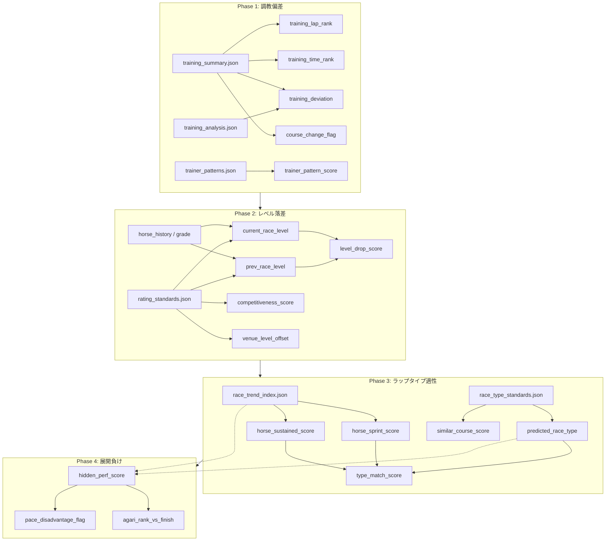

# [ARCHIVED] KeibaCICD Feature Store 仕様書

> **このドキュメントはアーカイブ済みです（2026-02-22 Session 43）。**
> 後継ドキュメント → `keiba-v2/docs/feature_roadmap.md`

**独自分析指標の特徴量定義（Feature Store仕様）**

2026年2月 | KeibaCICD Project | v1.0

---

## 概要

本ドキュメントは、KeibaCICDの予測モデルで使用する特徴量のうち、独自分析由来の中間指標（Phase 1〜4）を定義するものです。JRA-VAN生データに加え、`data3/analysis/` 配下のJSON群をソースとした特徴量の仕様を網羅します。

### データソース一覧

| ファイル | パス | 用途 |
|----------|------|------|
| training_summary.json | data3/races/YYYY/MM/DD/temp/ | 馬ごとの調教データ（lapRank, timeRank等） |
| training_analysis.json | data3/analysis/ | ランク別勝率・複勝率統計 |
| trainer_patterns.json | data3/analysis/ | 調教師×パターンのlift/score |
| rating_standards.json | data3/analysis/ | グレード別レーティング基準 |
| race_trend_index.json | data3/analysis/ | レースのtrend/rpci/l3/lap33 |
| race_type_standards.json | data3/analysis/ | コース×距離別RPCI閾値・タイプ分布 |

---

## 1. 調教偏差スコア（Phase 1）

### 1.1 training_lap_rank

| 項目 | 内容 |
|------|------|
| **状態** | ✅ 実装済（`ck_laprank_score` として） |
| **説明** | 調教lapRankの数値化。馬の追い切り評価をモデルが扱える連続値に変換する。 |
| **データソース** | training_summary.json: `summaries[horseName].lapRank` |
| **生成** | ml/features/training_features.py: `_encode_laprank()` → `LAPRANK_SCORES` |

| 尺度・型 | |
|----------|--|
| 尺度種別 | 順序尺度 |
| Python型 | int \| None |
| モデルへの渡し方 | そのままnumeric |

| 値の仕様 | |
|----------|--|
| 値域 | 1（D-）〜 16（SS）。欠損時は None。 |
| 欠損値 | フォールバックなし（推論時は -1 で埋める想定） |
| 外れ値 | 想定しない（定義済み14段階のみ） |

| 実装上の注意 | |
|--------------|--|
| データリーク | 学習時・推論時ともに同一ロジック（CK_DATAの当日確定データのみ使用） |
| 更新タイミング | レース当日確定（CK_DATA集計後） |
| 依存 | なし |

**マッピング（実装済み LAPRANK_SCORES）:**

| lapRank | スコア | lapRank | スコア |
|---------|--------|---------|--------|
| SS | 16 | B+ | 9 |
| S+ | 15 | B= | 8 |
| S= | 14 | B- | 7 |
| S- | 13 | C+ | 6 |
| A+ | 12 | C= | 5 |
| A= | 11 | C- | 4 |
| A- | 10 | D+ | 3 |
| | | D= | 2 |
| | | D- | 1 |

---

### 1.2 training_time_rank

| 項目 | 内容 |
|------|------|
| **状態** | ✅ 実装済（`ck_time_rank` として） |
| **説明** | タイムレベル（1〜5）。調教タイムの水準を表す。 |
| **データソース** | training_summary.json: `summaries[horseName].timeRank` |
| **生成** | ml/features/training_features.py: `compute_training_features()` |

| 尺度・型 | |
|----------|--|
| 尺度種別 | 順序尺度 |
| Python型 | int \| None |
| モデルへの渡し方 | そのままnumeric |

| 値の仕様 | |
|----------|--|
| 値域 | 1〜5（training_analysis.json by_timeLevel と一致）。"-" は欠損。 |
| 欠損値 | None → 推論時は -1 |
| 外れ値 | 想定しない |

| 実装上の注意 | |
|--------------|--|
| データリーク | なし（当日確定のみ） |
| 更新タイミング | レース当日確定 |
| 依存 | なし |

---

### 1.3 training_deviation

| 項目 | 内容 |
|------|------|
| **状態** | ⚠️ 未実装 |
| **説明** | 馬ごとの過去N走平均lapRankからの偏差。普段Bの馬が今回Aなら正の偏差＝仕上げ良好。 |
| **データソース** | training_summary.json の過去分蓄積（馬×出走日ごと） |
| **生成** | 要実装: ml/features/training_score.py（想定） |

| 尺度・型 | |
|----------|--|
| 尺度種別 | 間隔尺度 |
| Python型 | float |
| モデルへの渡し方 | そのままnumeric |

| 値の仕様 | |
|----------|--|
| 値域 | 要確認（例: -5 〜 +5 程度を想定） |
| 欠損値 | 過去データなし時は 0（偏差なしとみなす） |
| 外れ値 | クリッピング検討（±3σ等） |

| 実装上の注意 | |
|--------------|--|
| データリーク | 過去走のみ使用すること。当日走は除外。 |
| 更新タイミング | レース当日（過去蓄積から算出） |
| 依存 | 過去の training_summary 蓄積機構 |

**変換根拠:** 偏差 = 今回lapRankスコア − 直近5走平均lapRankスコア。

---

### 1.4 trainer_pattern_score

| 項目 | 内容 |
|------|------|
| **状態** | ⚠️ 未実装 |
| **説明** | 調教師のbest_patternとの一致度。trainer_patterns.json の lift 値を利用。 |
| **データソース** | trainer_patterns.json: `trainers[code].best_patterns[].lift`, `name` |
| **生成** | 要実装: ml/features/training_score.py（想定） |

| 尺度・型 | |
|----------|--|
| 尺度種別 | 比例尺度 |
| Python型 | float |
| モデルへの渡し方 | そのままnumeric |

| 値の仕様 | |
|----------|--|
| 値域 | 0 〜 1 程度（liftの正規化後）。非該当時は 0。 |
| 欠損値 | 調教師不在 or パターン不一致時 0 |
| 外れ値 | lift は 0〜0.2 程度の範囲想定 |

| 実装上の注意 | |
|--------------|--|
| データリーク | 過去実績から算出されたパターン。推論時も同一マッチングロジック。 |
| 更新タイミング | trainer_patterns.json のバッチ更新に依存 |
| 依存 | 調教パターン名と training_summary のマッピングロジック |

**変換根拠:** 馬の調教が best_patterns の条件（例: コース+好タイム）に合致する場合、該当 pattern の lift を採用。複数一致時は最大値を採用する想定。

---

### 1.5 course_change_flag

| 項目 | 内容 |
|------|------|
| **状態** | ⚠️ 未実装 |
| **説明** | 調教コース種別の変化（例: コース→坂路）。コンディション変化の proxy。 |
| **データソース** | training_summary.json: `weekendLocation`, `weekAgoLocation`, `finalLocation`, `weekAgoLocation` |
| **生成** | 要実装: ml/features/training_score.py（想定） |

| 尺度・型 | |
|----------|--|
| 尺度種別 | バイナリ（0/1）または名義尺度（変化パターン） |
| Python型 | int（0/1） |
| モデルへの渡し方 | そのままnumeric |

| 値の仕様 | |
|----------|--|
| 値域 | 0=変化なし, 1=変化あり（坂↔コ等） |
| 欠損値 | どちらか欠損時は 0 |
| 外れ値 | 想定しない |

| 実装上の注意 | |
|--------------|--|
| データリーク | なし |
| 更新タイミング | レース当日確定 |
| 依存 | なし |

---

## 2. レベル落差スコア（Phase 2）

### 2.1 prev_race_level

| 項目 | 内容 |
|------|------|
| **状態** | ⚠️ 部分実装（`prev_grade_level` は ordinal、mean値は未実装） |
| **説明** | 前走のレースレベル（グレード別レーティングmean値）。能力の絶対水準を表す。 |
| **データソース** | rating_standards.json: `by_grade[grade].rating.mean`。grade は前走レースのグレード。 |
| **生成** | 要実装: ml/features/race_level.py（想定）。現状は rotation_features.py で `prev_grade_level`（ordinal）を使用。 |

| 尺度・型 | |
|----------|--|
| 尺度種別 | 比例尺度 |
| Python型 | float |
| モデルへの渡し方 | そのままnumeric |

| 値の仕様 | |
|----------|--|
| 値域 | 約 50 〜 68（G1古馬67.81、未勝利50.68等） |
| 欠損値 | グレード未対応時は全体中央値（約55）でフォールバック |
| 外れ値 | クリッピング不要（ rating は bounded） |

| 実装上の注意 | |
|--------------|--|
| データリーク | 前走のみ使用。今回走は使用しない。 |
| 更新タイミング | 前走確定後。rating_standards.json は定期更新。 |
| 依存 | DB/レースマスタの grade 情報。by_grade キー（G1_古馬等）とのマッピング。 |

**GRADE と by_grade のマッピング例:** 要確認。rating_standards.json の by_grade は `G1_古馬`, `G1_3歳`, `OP`, `3勝クラス` 等。DB の grade が `G1`, `G2` 等の場合、馬齢・クラス情報との突き合わせが必要。

---

### 2.2 current_race_level

| 項目 | 内容 |
|------|------|
| **状態** | ⚠️ 未実装 |
| **説明** | 今回のレースレベル。グレードmean または出走メンバーから推定。 |
| **データソース** | rating_standards.json: `by_grade[grade].rating.mean`、または出走馬のレーティング集計 |
| **生成** | 要実装: ml/features/race_level.py（想定） |

| 尺度・型 | |
|----------|--|
| 尺度種別 | 比例尺度 |
| Python型 | float |
| モデルへの渡し方 | そのままnumeric |

| 値の仕様 | |
|----------|--|
| 値域 | 約 50 〜 68 |
| 欠損値 | 出走メンバー推定失敗時はグレードmeanで代替 |
| 外れ値 | 不要 |

| 実装上の注意 | |
|--------------|--|
| データリーク | 出走表確定後であれば問題なし。オッズ確定前の推定可。 |
| 更新タイミング | 出走表確定後 |
| 依存 | 出走メンバーの前走 grade / rating 情報 |

---

### 2.3 level_drop_score

| 項目 | 内容 |
|------|------|
| **状態** | ⚠️ 部分実装（`grade_level_diff` は ordinal 差分） |
| **説明** | prev_race_level − current_race_level。正＝今回の方がレベルが低い＝有利（降格ローテ）。 |
| **データソース** | 上記2指標の差分 |
| **生成** | 要実装: ml/features/race_level.py（想定） |

| 尺度・型 | |
|----------|--|
| 尺度種別 | 間隔尺度 |
| Python型 | float |
| モデルへの渡し方 | そのままnumeric |

| 値の仕様 | |
|----------|--|
| 値域 | 例: -15 〜 +15（クラス落差の典型範囲） |
| 欠損値 | prev/current いずれか欠損時は 0 |
| 外れ値 | ±20 程度でクリッピング検討 |

| 実装上の注意 | |
|--------------|--|
| データリーク | なし |
| 更新タイミング | 出走表確定後 |
| 依存 | prev_race_level, current_race_level |

---

### 2.4 competitiveness_score

| 項目 | 内容 |
|------|------|
| **状態** | ⚠️ 未実装 |
| **説明** | レースの混戦度。mean_race_stdev の相対値。高値＝混戦＝単勝が読みにくい。 |
| **データソース** | rating_standards.json: `by_grade[grade].competitiveness.mean_race_stdev` |
| **生成** | 要実装: ml/features/race_level.py（想定） |

| 尺度・型 | |
|----------|--|
| 尺度種別 | 比例尺度 |
| Python型 | float |
| モデルへの渡し方 | そのままnumeric |

| 値の仕様 | |
|----------|--|
| 値域 | 約 1.5 〜 2.7（by_grade の実績範囲） |
| 欠損値 | グレード未対応時は全体平均でフォールバック |
| 外れ値 | 不要 |

| 実装上の注意 | |
|--------------|--|
| データリーク | なし |
| 更新タイミング | レースグレード確定後 |
| 依存 | grade マッピング |

---

### 2.5 venue_level_offset

| 項目 | 内容 |
|------|------|
| **状態** | ⚠️ 未実装 |
| **説明** | 競馬場×芝/ダのレベル偏差（例: 東京芝は小倉芝より高い）。venue_stats の mean を正規化。 |
| **データソース** | rating_standards.json: `venue_stats["東京_芝"].mean` 等 |
| **生成** | 要実装: ml/features/race_level.py（想定） |

| 尺度・型 | |
|----------|--|
| 尺度種別 | 間隔尺度 |
| Python型 | float |
| モデルへの渡し方 | そのままnumeric |

| 値の仕様 | |
|----------|--|
| 値域 | 全体平均からの偏差。例: -2 〜 +2 |
| 欠損値 | venue_stats 未登録時は 0 |
| 外れ値 | 不要 |

| 実装上の注意 | |
|--------------|--|
| データリーク | なし |
| 更新タイミング | rating_standards.json の更新に連動 |
| 依存 | venue_name, track_type |

---

## 3. ラップタイプ適性スコア（Phase 3）

### 3.1 predicted_race_type

| 項目 | 内容 |
|------|------|
| **状態** | ⚠️ 部分実装（pace_features.py で trend_v2 を `prev_race_trend_v2_enc` 等として使用。事前推定は未実装） |
| **説明** | 今回のレースタイプの事前推定（v2分類: sprint, sprint_mild, even, sustained_hp 等7タイプ）。 |
| **データソース** | race_type_standards.json: `by_distance_group`, `thresholds`, `runner_adjustments` |
| **生成** | 要実装: ml/features/lap_type.py（想定）。コース×距離 + 出走頭数補正で RPCI を推定し、thresholds でタイプ判定。 |

| 尺度・型 | |
|----------|--|
| 尺度種別 | 名義尺度（7カテゴリ） |
| Python型 | str または int |
| モデルへの渡し方 | 順序保持数値変換（TREND_V2_ENCODE: sprint=0 〜 sustained_doroashi=6） |

| 値の仕様 | |
|----------|--|
| 値域 | sprint, sprint_mild, even, long_sprint, sustained_hp, sustained_strong, sustained_doroashi |
| 欠損値 | 未対応コース・距離時は "even"（中間）でフォールバック |
| 外れ値 | 想定しない |

| 実装上の注意 | |
|--------------|--|
| データリーク | 出走表のみから推定。結果は使用しない。 |
| 更新タイミング | 出走表確定後（頭数補正に頭数が必要） |
| 依存 | コース、距離、出走頭数、race_type_standards.json |

**変換根拠:** pace_features.py の TREND_V2_ENCODE に準拠。瞬発→持続の順序を保持。

---

### 3.2 horse_sprint_score

| 項目 | 内容 |
|------|------|
| **状態** | ⚠️ 未実装 |
| **説明** | 瞬発戦（sprint, sprint_mild）での過去成績スコア。複勝率偏差等。 |
| **データソース** | race_trend_index.json で過去走をタイプ分類 → 該当レースの着順を集計 |
| **生成** | 要実装: ml/features/lap_type.py（想定） |

| 尺度・型 | |
|----------|--|
| 尺度種別 | 比例尺度 |
| Python型 | float |
| モデルへの渡し方 | そのままnumeric |

| 値の仕様 | |
|----------|--|
| 値域 | 0 〜 1（複勝率）または偏差値。要定義。 |
| 欠損値 | 該当レース数0時は 0.5（中立）でベイズ平滑化 |
| 外れ値 | クリッピング検討 |

| 実装上の注意 | |
|--------------|--|
| データリーク | 過去走のみ。今回走は使用しない。 |
| 更新タイミング | 出走表確定時（過去走は不変） |
| 依存 | race_trend_index.json, horse_history |

---

### 3.3 horse_sustained_score

| 項目 | 内容 |
|------|------|
| **状態** | ⚠️ 未実装 |
| **説明** | 持続戦（sustained_hp, sustained_strong 等）での過去成績スコア。 |
| **データソース** | 同上 |
| **生成** | 要実装: ml/features/lap_type.py（想定） |

| 尺度・型 | |
|----------|--|
| 尺度種別 | 比例尺度 |
| Python型 | float |
| モデルへの渡し方 | そのままnumeric |

| 値の仕様 | |
|----------|--|
| 値域 | 0 〜 1 または偏差値 |
| 欠損値 | 該当0時は 0.5 |
| 外れ値 | クリッピング検討 |

| 実装上の注意 | |
|--------------|--|
| データリーク | なし |
| 更新タイミング | 同上 |
| 依存 | 同上 |

---

### 3.4 type_match_score

| 項目 | 内容 |
|------|------|
| **状態** | ⚠️ 部分実装（pace_features.py の `best_trend_top3_rate`, `worst_trend_top3_rate`, `trend_versatility` が類似コンセプト） |
| **説明** | 今回予想タイプと馬の適性のマッチ度。predicted_race_type が sprint 系なら horse_sprint_score を、sustained 系なら horse_sustained_score を重視。 |
| **データソース** | predicted_race_type, horse_sprint_score, horse_sustained_score |
| **生成** | 要実装: ml/features/lap_type.py（想定） |

| 尺度・型 | |
|----------|--|
| 尺度種別 | 比例尺度 |
| Python型 | float |
| モデルへの渡し方 | そのままnumeric |

| 値の仕様 | |
|----------|--|
| 値域 | 0 〜 1 |
| 欠損値 | 0.5 |
| 外れ値 | 不要 |

| 実装上の注意 | |
|--------------|--|
| データリーク | なし |
| 更新タイミング | 同上 |
| 依存 | Phase 3 の他特徴量 |

---

### 3.5 similar_course_score

| 項目 | 内容 |
|------|------|
| **状態** | ⚠️ 未実装 |
| **説明** | 類似コースでの過去成績。race_type_standards.json の similar_courses を参照。 |
| **データソース** | race_type_standards.json: `similar_courses`（要確認キー名）、horse_history |
| **生成** | 要実装: ml/features/lap_type.py（想定） |

| 尺度・型 | |
|----------|--|
| 尺度種別 | 比例尺度 |
| Python型 | float |
| モデルへの渡し方 | そのままnumeric |

| 値の仕様 | |
|----------|--|
| 値域 | 0 〜 1（複勝率） |
| 欠損値 | 類似コース出走なし時は 0.5 |
| 外れ値 | 不要 |

| 実装上の注意 | |
|--------------|--|
| データリーク | なし |
| 更新タイミング | 同上 |
| 依存 | similar_courses の定義、horse_history |

---

## 4. 展開負けスコア（Phase 4）

### 4.1 hidden_perf_score

| 項目 | 内容 |
|------|------|
| **状態** | ⚠️ 未実装 |
| **説明** | 着順以上の能力発揮度。瞬発戦で上がり最速級だったが着外だった馬ほど高値。展開負けの可能性を数値化。 |
| **データソース** | race_trend_index.json（trend_v2）+ horse_history（last_3f, finish_position, corners） |
| **生成** | 要実装: ml/features/hidden_perf.py（想定） |

| 尺度・型 | |
|----------|--|
| 尺度種別 | 比例尺度 |
| Python型 | float |
| モデルへの渡し方 | そのままnumeric |

| 値の仕様 | |
|----------|--|
| 値域 | 0 〜 1（正規化スコア）。要設計。 |
| 欠損値 | 前走データ不足時は 0 |
| 外れ値 | 1.0 でキャップ |

| 実装上の注意 | |
|--------------|--|
| データリーク | 前走の race_trend_index + 結果のみ使用。今回走は使用しない。 |
| 更新タイミング | 前走結果確定後 |
| 依存 | Phase 3（race_trend_index の trend_v2）、horse_history の last_3f, finish_position, corners |

**算出ロジック（概念）:**
- trend_v2 in [sprint, sprint_mild] かつ
- 上がり順位（last_3f から算出）≤ 2 かつ
- finish_position ≥ 4 かつ
- corner4_position ≥ 10（4角後方）
→ 高スコア（展開負け候補）

---

### 4.2 agari_rank_vs_finish

| 項目 | 内容 |
|------|------|
| **状態** | ⚠️ 未実装（pace_features.py の `l3_unrewarded_rate_last5` が類似コンセプト） |
| **説明** | 上がり順位と着順の乖離。上がり2番手だったが8着等、脚を使ったが届かなかったケースを検出。 |
| **データソース** | horse_history: last_3f → 同レース内で順位化して agari_rank を算出。finish_position と比較。 |
| **生成** | 要実装: ml/features/hidden_perf.py（想定） |

| 尺度・型 | |
|----------|--|
| 尺度種別 | 間隔尺度 |
| Python型 | int または float |
| モデルへの渡し方 | そのままnumeric |

| 値の仕様 | |
|----------|--|
| 値域 | 例: agari_rank − finish_position。正＝上がり良くても着順悪い。範囲は -17 〜 +17 程度。 |
| 欠損値 | last_3f 欠損時は 0 |
| 外れ値 | ±15 でクリッピング検討 |

| 実装上の注意 | |
|--------------|--|
| データリーク | 前走のみ |
| 更新タイミング | 前走結果確定後 |
| 依存 | 同レースの全馬 last_3f（上がり順位算出に必要） |

**変換根拠:** agari_rank は last_3f が速い順に 1, 2, 3... とする。finish_position との差が大きいほど「脚を使ったが届かなかった」。

---

### 4.3 pace_disadvantage_flag

| 項目 | 内容 |
|------|------|
| **状態** | ⚠️ 未実装 |
| **説明** | ペース不利フラグ。瞬発戦で後方待機だった等、展開不利のパターンを 0/1 で示す。 |
| **データソース** | race_trend_index.json: trend_v2、horse_history: corners（通過位置） |
| **生成** | 要実装: ml/features/hidden_perf.py（想定） |

| 尺度・型 | |
|----------|--|
| 尺度種別 | バイナリ |
| Python型 | int（0/1） |
| モデルへの渡し方 | そのままnumeric |

| 値の仕様 | |
|----------|--|
| 値域 | 0=不利なし, 1=ペース不利 |
| 欠損値 | corners 欠損時は 0 |
| 外れ値 | 不要 |

| 実装上の注意 | |
|--------------|--|
| データリーク | 前走のみ |
| 更新タイミング | 前走結果確定後 |
| 依存 | Phase 3, horse_history.corners |

**判定例:** trend_v2 in [sprint, sprint_mild] かつ corners[0]（1角通過順位）≥ 10 → 1

---

## 補足セクション

### 特徴量間の依存関係

### lapRankスケーリング検討

**現状の実装:** training_features.py では `LAPRANK_SCORES` で SS=16 〜 D-=1 の等間隔16段階を採用。

**roadmap 案:** A+=7 〜 C-=1 の7段階（S/SS を圧縮した簡易版）。

**training_analysis.json by_lapRank の勝率（win_rate）:**

| lapRank | win_rate | サンプル数 |
|---------|----------|------------|
| SS | 0.1191 | 7,593 |
| S+ | 0.1000 | 5,299 |
| S= | 0.0778 | 1,170 |
| S- | 0.0956 | 4,814 |
| A+ | 0.0827 | 34,631 |
| B+ | 0.0672 | 27,830 |
| B= | 0.0590 | 4,271 |
| B- | 0.0558 | 12,769 |
| C+ | 0.0636 | 14,521 |
| D+ | 0.0441 | 10,621 |
| D= | 0.0489 | 348 |
| D- | 0.0283 | 1,270 |

**評価:**
- 勝率はおおむね単調（SS が最高、D- が最低）だが、S= < S- のように同階級内で非単調な箇所あり。
- 等間隔変換は解釈しやすいが、勝率差を反映していない。SS→S+ の差(1.9pt) と C+→D+ の差(2.0pt) は同程度だが、サンプル数の違いで信頼性が異なる。
- **非線形スケーリングの要否:** 勝率ベースのスコア（例: win_rate をそのままスコアにする、または logit 変換）にすると、実績を反映した重み付けになる。一方で、年ごとの分布変化に弱く、再学習や定期的なスコア更新が必要。現状の等間隔は安定しており、LightGBM が非線形を学習するため、**当面は等間隔のままでよい**と判断。将来的に win_rate ベースのスケーリングを試す価値はある。

### 未解決事項

- [ ] `training_summary.json` の過去分蓄積仕組み。現在は当日分のみ。過去5走分程度の蓄積が必要。
- [ ] `trainer_patterns.json` の pattern name と training_summary の調教内容のマッチングロジックの具体化。
- [ ] `rating_standards.json` の by_grade キー（G1_古馬等）と DB/レースマスタの grade の対応表。
- [ ] 前走の grade が DB のどのカラム・どのテーブルに存在するか要確認。
- [ ] 上がり3F順位（agari_rank）の算出方法。last_3f から同レース内でランク付けする想定だが、race_trend_index や horse_history の構造で同レース全馬が取得できるか要確認。
- [ ] 4角通過位置（corner4）の保存先。horse_history の corners は [1C, 2C, 3C, 4C] の配列。4角は corners[3] で取得可能か要確認。
- [ ] race_type_standards.json の `similar_courses` キーの有無と構造の確認。
- [ ] `predicted_race_type` 算出時の出走頭数取得タイミング（predict.py 実行時点で取得可能か）。
