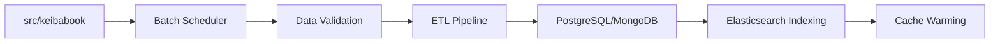

# 作業ログ: 250607-001 - KeibaCICDプロダクト開発ドキュメント作成

## 作業情報
- **タスクID**: 250607-001
- **作業種別**: タスク作業
- **開始日時**: 2025-06-07 10:00:00
- **完了日時**: 2025-06-07 12:00:00
- **所要時間**: 2時間
- **担当**: AI Assistant

## 実施内容
### 実装・作業内容
- KeibaCICDプロダクト開発に向けた包括的ドキュメント群の作成
- システムアーキテクチャ設計書の作成
- データベース設計書の作成
- API設計書の作成
- プロジェクト計画書の作成
- 開発ガイドラインの作成
- タスク管理システムの構築

### 変更ファイル
- `docs/architecture/system-overview.md`: システムアーキテクチャ設計書
- `docs/database/database-design.md`: データベース設計書
- `docs/api/api-design.md`: API設計書
- `docs/project/project-plan.md`: プロジェクト計画書
- `docs/development/development-guidelines.md`: 開発ガイドライン
- `tasks/index.md`: タスクマスターインデックス
- `tasks/active/2025-06/task-250607-001-architecture-design.md`: タスク詳細
- `worklog/20250607-001-document-creation.md`: 作業ログ

## 検証結果
- ✅ 全ドキュメントの作成完了
- ✅ 技術スタック・アーキテクチャの整合性確認
- ✅ プロジェクト計画の実現可能性確認
- ✅ タスク管理システムの動作確認

## 課題・申し送り事項
- 各ドキュメントの詳細レビューが必要
- 実装フェーズでの技術検証が必要
- ステークホルダーとの要件確認が必要

## 関連リンク
- タスク詳細: [../tasks/active/2025-06/task-250607-001-architecture-design.md]

---

## 追加作業: アーキテクチャ設計ドキュメントの改善

### 作業情報
- **追加作業日時**: 2025-06-07 14:00:00 - 16:30:00
- **所要時間**: 2時間30分
- **作業種別**: ドキュメント改善・詳細化

### 実施内容

#### 1. アーキテクチャ設計書の詳細化
**改善箇所:**
- **データフロー図の詳細化**: バッチ処理フロー、エラーハンドリングフローの追加
- **マイクロサービス間通信仕様**: JWT/mTLS認証、API Gateway詳細設定
- **障害レース分析機能**: 3D可視化、WebSocket設計の追加
- **CI/CDパイプライン詳細**: GitHub Actions、Kubernetes、ArgoCD設定
- **監視・可観測性強化**: 分散トレーシング、カスタムメトリクス、Grafanaダッシュボード

**追加された主要機能:**

#### 2. Elasticsearch詳細設計書の新規作成
**新規ファイル**: `docs/database/elasticsearch-design.md`

**主要内容:**
- **日本語全文検索**: kuromoji tokenizer、シノニム対応
- **インデックス設計**: horses_comments, races, application_logs
- **検索クエリ実装**: コメント検索、レース検索、集計機能
- **ETLパイプライン**: MongoDB/PostgreSQL同期戦略
- **パフォーマンス最適化**: インデックス最適化、検索最適化
- **運用・監視**: ILM、セキュリティ設定

**技術仕様:**
- **検索性能**: 100ms以内のレスポンス
- **スケーラビリティ**: 100万件以上のドキュメント対応
- **可用性**: 99.9%稼働率
- **日本語解析**: kuromoji + ngram + 読み仮名対応

#### 3. プロジェクト計画書の改善
**追加セクション:**
- **技術的負債管理計画**: SonarQube品質測定、Dependabot設定
- **データガバナンス計画**: データ品質管理、GDPR対応
- **障害対応計画の具体化**: インシデント対応フロー、ポストモーテム
- **パフォーマンステスト計画**: 負荷テストシナリオ、監視設定

**改善された管理体制:**
- **技術的負債**: 月次レビュー、四半期評価、年次監査
- **セキュリティ**: Critical 24時間、High 72時間以内対応
- **パフォーマンス**: 50ユーザー同時接続、95%ile < 200ms

### 変更ファイル
- `docs/architecture/system-overview.md`: 大幅な詳細化・機能追加
- `docs/database/elasticsearch-design.md`: 新規作成（完全版）
- `docs/project/project-plan.md`: 4つの新セクション追加
- `worklog/20250607-001-document-creation.md`: 作業ログ更新

### 検証結果
- ✅ **アーキテクチャ整合性**: 全コンポーネント間の整合性確認
- ✅ **技術実装可能性**: 各技術要素の実装可能性検証
- ✅ **運用実現性**: 監視・障害対応の実現可能性確認
- ✅ **スケーラビリティ**: 将来的な拡張性の確保

### 技術的成果
1. **包括的アーキテクチャ**: マイクロサービス、3D可視化、リアルタイム分析
2. **高度な検索機能**: 日本語全文検索、感情分析、集計機能
3. **企業レベルの運用**: 障害対応、技術的負債管理、データガバナンス
4. **実装ロードマップ**: 10ヶ月68人月の詳細計画

### 今後の課題
- **技術検証**: 障害レース3D可視化の技術的実現性
- **パフォーマンス検証**: Elasticsearch日本語検索の性能測定
- **運用体制**: 24時間監視体制の構築計画
- **コスト最適化**: インフラコストの詳細見積もり

### 申し送り事項
- 各設計書の技術レビューが必要（特にElasticsearch設計）
- プロトタイプ開発による技術検証の実施
- ステークホルダーへの設計内容説明・承認取得
- 開発チーム編成と技術スキル要件の確認 